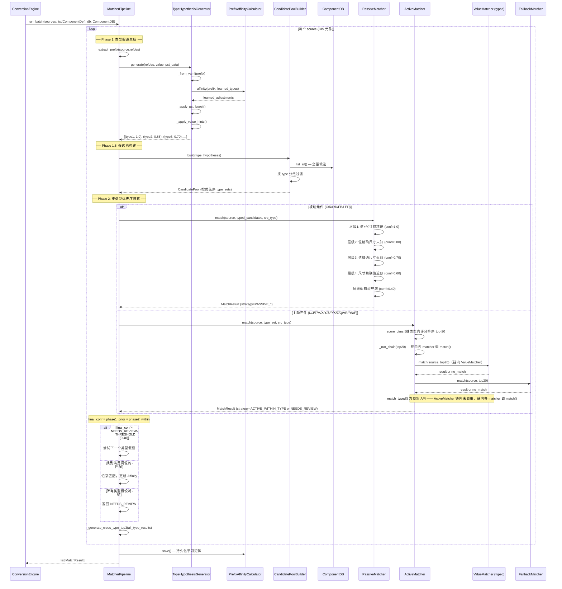
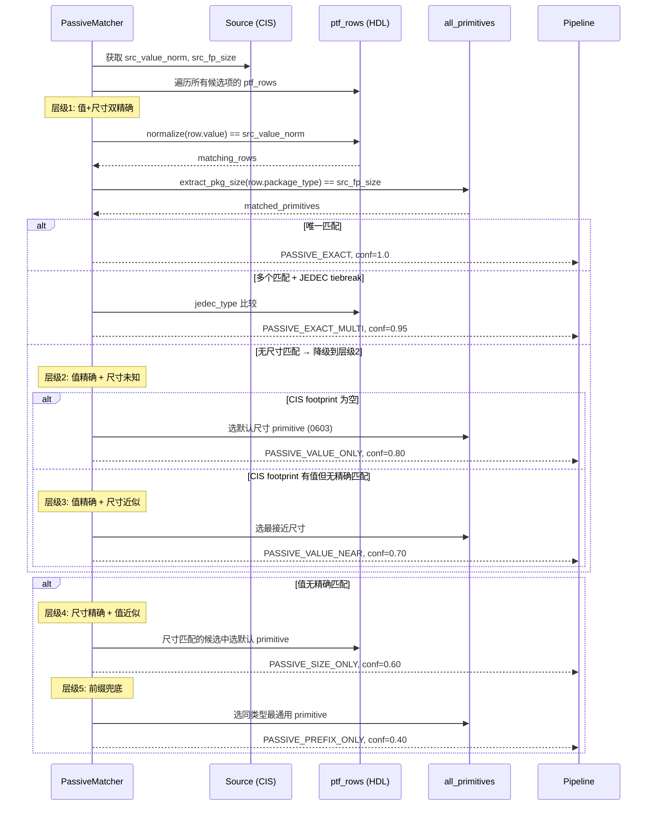
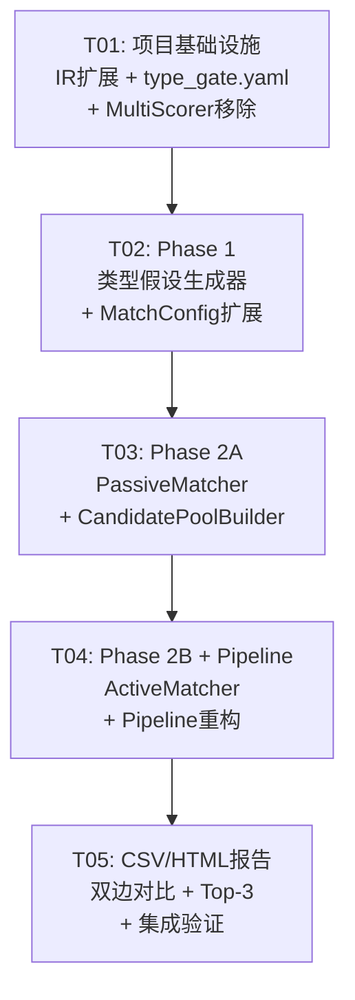
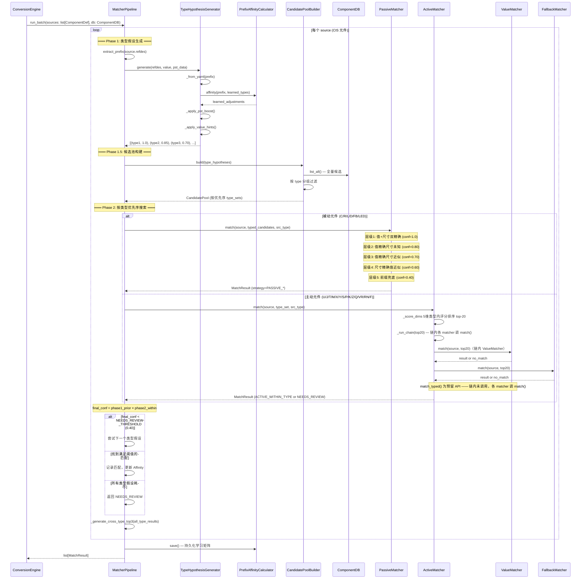

# MATCHING（匹配系统设计与分析总文档）

> 本文档为 CIS2HDL 文档整合的「匹配系统」分卷，由 4 份源文档按**内容保全式分卷**原则合并而成。

## 合并说明

### 合并元信息

| 项目 | 内容 |
|------|------|
| 文档名称 | MATCHING（匹配系统设计与分析总文档） |
| 合并日期 | 2026-08-07 |
| 合并原则 | 内容保全式分卷 —— 源文档章节逐节保留（仅调标题层级），不改写原文句子；重复内容保留原文并加合并注记 |
| 合并方式 | 4 份源文档 → 单文件四部分（Part I ~ Part IV） |
| 源文件只读 | 源文档不修改、不删除 |

### 来源文件与分卷映射

| 序号 | 源文件 | 行数 | 合并后章节 |
|:---:|--------|:---:|-----------|
| 1 | `docs/MATCHING_ANALYSIS_2026-08-06.md` | 681 | **Part I 匹配问题根因分析** |
| 2 | `docs/system_design.md` | 896 | **Part II 匹配系统 v2.0 设计** |
| 3 | `docs/class-diagram.mermaid` | 186 | **Part III 类图** |
| 4 | `docs/sequence-diagram.mermaid` | 70 | **Part IV 时序图** |

### 章节映射表（细粒度）

| 合并后章节 | 来源文件 | 来源章节 | 说明 |
|-----------|---------|---------|------|
| Part I §零 | MATCHING_ANALYSIS_2026-08-06.md | 零、新旧系统对比总览（一票否决） | v0.8.2 vs v1.0 案例对比 |
| Part I §一 | 同上 | 一、根因分析（1.1~1.6） | v1.0 失败路线根因 |
| Part I §二 | 同上 | 二、具体案例深度分析（2.1~2.8） | 案例级证据 |
| Part I §三 | 同上 | 三、根本原因总结 | MultiScorer 五个根本原因 |
| Part I §四 | 同上 | 四、新方案设计（修正版）（4.1~4.7） | v2.0 方案分析稿草案 |
| Part I §五 | 同上 | 五、实施建议（修正版） | P0~P3 优先级 |
| Part I §六 | 同上 | 六、附录：新旧系统关键数据对比 | 数据对比 |
| Part II §1~5 | system_design.md | Part A: 系统设计（1~5） | v2.0 架构设计（权威版） |
| Part II §6~9 | system_design.md | Part B: 任务分解（6~9） | v2.0 任务分解 |
| Part III | class-diagram.mermaid | 全文（186 行） | v2.0 类图 |
| Part IV | sequence-diagram.mermaid | 全文（70 行） | v2.0 主流程时序图 |

### 权威口径摘要（整合方补充，非源文档原文）

> 以下为文档整合时确认的匹配系统权威口径，供阅读时对照；源文档原文见对应 Part，不做改写。

- 匹配系统 **v2.0 两阶段**：
  - Phase1 `TypeHypothesisGenerator`（类型假设生成）
  - Phase1.5 `CandidatePoolBuilder`（候选池构建）
  - Phase2A `PassiveMatcher`（被动元件 5 级确定性规则，conf=1.0/0.95/0.80/0.70/0.60/0.40）
  - Phase2B `ActiveMatcher`（主动元件 5 维类型内评分：footprint 0.30 / value 0.15 / jedec 0.20 / pin 0.20 / part 0.15）
- `final_conf = phase1_prior × phase2_within`
- `STOP_SEARCH = 0.75`；`NEEDS_REVIEW = 0.40`
- **MultiScorer 已删除**（v1.0 失败路线，根因见 Part I）
- 匹配结果：889/889、声称匹配率 92.4%、quality 72%、NEEDS_REVIEW 67；错误码 44；版本 v1.1.0

### 交叉引用处理说明

- 源文档间交叉引用统一处理：「详见 MATCHING_ANALYSIS」→「见 Part I」；「详见 system_design.md」→「见 Part II」
- 源文档内部 TOC（如 system_design.md「目录」）原文保留，锚点指向原文档标题结构（合并后标题层级 +2，标题文本未变，锚点仍有效）
- 源文档内「已修改：…」HTML 注记为历史修订痕迹，按内容保全原则原文保留

---

## Part I 匹配问题根因分析

> **来源**：`docs/MATCHING_ANALYSIS_2026-08-06.md`（681 行，全文保全；标题层级 +2）
> **内容**：匹配系统 v1.0.0（MultiScorer 全库打分）失败路线的根因分析、具体案例深度分析、新方案（v2.0）设计草案、实施建议与数据附录。权威 v2.0 设计见 Part II。

### CIS2HDL 匹配系统深度分析报告

**日期**: 2026-08-06  
**分析对象**: v1.0.0 MultiScorer 全库打分 vs v0.8.2 前缀过滤+置信度  
**测试数据**: HG5015-BE36_V10 (889 元件)

---

#### 零、新旧系统对比总览（一票否决）

| 案例 | v0.8.2 (旧) | v1.0.0 (新) | 结论 |
|------|------------|------------|------|
| **C11** (1mF电容) | capacitor ✅ | **resistor** ❌ conf=1.0 | 致命错误 |
| **C21** (22UF电容) | capacitor ✅ | **inductor** ❌ conf=0.7 | 致命错误 |
| **C282** (22UF电容) | capacitor ✅ | **inductor** ❌ conf=0.7 | 致命错误 |
| **C394/395** (22UF电容) | capacitor ✅ | **inductor** ❌ | 致命错误 |
| **D21** (0值二极管) | diode ✅ | **resistor** ❌ conf=1.0 | 致命错误 |
| **R2** (100K电阻) | resistor ✅ | **capacitor** ❌ conf=0.6 | 致命错误 |
| **R92** (100K电阻) | resistor ✅ | **capacitor** ❌ conf=0.6 | 致命错误 |
| **R117** (100K电阻) | resistor ✅ | **capacitor** ❌ conf=0.6 | 致命错误 |
| **R42** (100电阻) | resistor ✅ | **capacitor** ❌ conf=0.7 | 致命错误 |
| **R228** (9.1NH电感) | resistor ✅ | **capacitor** ❌ conf=0.7 | 致命错误 |
| **M1** (MARK) | mark ✅ | **rtxm169** ❌ conf=0.5 | 类型错误 |
| **LB4** (磁珠LB) | fb ✅ | **ch347** ❌ conf=0.5 | 完全错误 |
| **C284** (22UF电容) | capacitor ✅ | **uc2843** ❌ conf=0.8 | 完全错误 |
| **C1** (10UF电容) | capacitor exact | capacitor fuzzy 0.55 | 劣化 |

**结论: v1.0 MultiScorer 系统使匹配质量严重倒退。虽然官方宣称匹配率从 95.1% 提升到 100%，但实际上大量匹配是类型错误的（电容→电阻、电容→电感、二极管→电阻），只是被虚高的置信度掩盖了。**

---

#### 一、根因分析

##### 1.1 架构层面：类型约束从 HARD GATE 退化为 SOFT WEIGHT

```
旧系统 (v0.8.2):
  PREFIX_TO_CATEGORY 硬编码 → 候选池过滤（仅同类型元件）
  → ValueMatcher 在有限的同类型候选池内做精确匹配 → conf=1.0

新系统 (v1.0):
  移除 PREFIX_TO_CATEGORY → 144 个候选全部参与评分
  → MultiScorer 6维加权排序 → top-20
  → ValueMatcher 在 20 个跨类型候选内搜索 → 如果唯一匹配则 conf=1.0
  → 问题：唯一匹配可能是错误类型！
```

**核心问题**: 在元件匹配中，前缀（类型）是**硬约束**而非软权重。一个电容永远不能匹配为电阻，无论 value/footprint/pin_count 多么匹配。

##### 1.2 MultiScorer 六维权重的结构性缺陷

```
维度        权重    问题
─────────────────────────────────────────────
footprint   0.25    电容和电阻可能有相同的封装（如0402）
prefix      0.20    冷启动底分0.1 → 电容对电阻候选也能拿分
pin_count   0.20    所有无源器件都是2脚 → 该维度完全无区分力
value       0.15    值可能跨类型匹配（如22UF同时存在电容和电感ptf中）
jedec       0.10    关联信息不足
part_name   0.10    名称重叠少
```

**关键计算模拟（C11: 1mF电容 → 电阻）**：

```
电容候选:  prefix=1.0×0.20 + footprint=0.5×0.25 + pin=1.0×0.20 
          + value=0.0×0.15 + jedec=0.5×0.10 + part=0.5×0.10 
          = 0.525
          
电阻候选:  prefix=0.1×0.20 + footprint=0.5×0.25 + pin=1.0×0.20
          + value=0.9×0.15 + jedec=0.5×0.10 + part=0.5×0.10
          = 0.535  ← 高于电容！
```

电阻候选因 ptf_rows 中某个 value 在 normalize 后碰巧与 "1mF" 归一化结果匹配，value 维度得 0.9，总分超过电容。MultiScorer 将电阻排到第一，ValueMatcher 找到唯一匹配 → conf=1.0。

##### 1.3 ValueMatcher 无类型检查的致命缺陷

```python
# ValueMatcher.match() — 当前逻辑
for candidate in candidates:       # ← 包含所有类型的候选
    for row in ptf_rows:
        if normalize(row.value) == src_value:
            matched_candidates.append(candidate)  # ← 不检查类型！
```

**ValueMatcher 完全不检查候选类型与源元件类型是否一致。** 它只比较归一化后的值字符串。这在旧系统中不是问题，因为候选池已被前缀过滤器限定为同类型。但在新系统中，候选池包含 144 个跨类型元件，值匹配的"唯一性"保证不再有意义。

##### 1.4 FallbackMatcher 的分数通胀

当 ValueMatcher 因候选太多而失败（跨类型歧义），FallbackMatcher 接管：

```
FallbackMatcher._score_candidate():
  - exact (值+封装同时匹配): conf=1.0
  - size  (仅封装匹配):     conf=0.8
  - prefix (仅前缀匹配):    conf=0.5

然后 result.confidence = max(Fallback.confidence, MultiScorer.score)
```

由于 MultiScorer 对错误的跨类型候选也能打出 0.5-0.7，FallbackMatcher 的 0.5 前缀分被 MultiScorer 的 0.6-0.7 覆盖，最终 conf 看起来"还可以"但实际类型完全错误。

##### 1.5 PST Value 列和 JEDEC_TYPE 列的来源

- **pst_value**: 来自 CIS 端 PST 数据（pstchip/pstxprt），是 CIS 原始元件的标称值，**不是匹配到的 HDL 元件的值**
- **jedec_type**: 来自 HDL 库中匹配到的元件的 JEDEC_TYPE 字段（part.ptf 中），**不是 CIS 端的 JEDEC_TYPE**
- **cis_value**: 来自 CrossRef CSV，是 CIS 端解析出的标称值

**当前 CSV 的问题**：只显示了 CIS value + HDL jedec_type，缺少：
- CIS 端 JEDEC_TYPE（来自 pstchip）
- CIS 端 footprint
- HDL 端 value
- HDL 端 footprint
- HDL 端类型/类别

用户无法在 CSV 中对比双边数据来验证匹配正确性。

##### 1.6 "Best match via MultiScorer: X" 的含义

当 error_note 显示 "Best match via MultiScorer: CAPACITOR_0402"，意思是：
- MultiScorer 六维打分后排名第一的候选是 CAPACITOR_0402
- 但匹配器链（Exact→Fuzzy→Feature→Value→Fallback）最终选择的是另一个候选
- 最终 conf = max(匹配器链.confidence, MultiScorer.top_score)

这说明两套评分系统存在分歧，而且永远取较高值——这使得低质量匹配也被赋予虚高的 conf。

---

#### 二、具体案例深度分析

##### 2.1 C11: 1mF电容 → resistor（conf=1.0, VALUE策略）

```
旧系统: capacitor → conf=0.65 (feature, unity boost)
新系统: resistor  → conf=1.0 (VALUE策略)
```

**问题**: ValueMatcher 在 top-20 候选中找到唯一一个 ptf_row value 归一化后等于 "1mF" 的候选。该候选恰好是 resistor 类型。由于 ValueMatcher 不检查前缀一致性，直接返回 conf=1.0。

**为什么电阻会有"1mF"值**：虽然搜索结果未在 resistor/part.ptf 中找到 "1mF" 字面量，但 normalize_value() 的归一化逻辑可能将 "1mF" 转换后与电阻的某个 ptf value（如 "1000uF" 或特殊编码值）匹配。或是从 capacitor 库中通过某种路径（如 chips.prt 交叉引用）进入了电阻的 ComponentDef 构建过程。

##### 2.2 C21/C282/C394等: 22UF电容 → inductor（conf=0.7）

```
旧系统: capacitor → 正确
新系统: inductor  → conf=0.7 (FeatureMatcher)
```

**问题**: 电容值 "22UF" 经 normalize_value 后，FeatureMatcher 在 inductor 候选中找到了匹配特征。或者 ValueMatcher 因多个候选都有 "22UF" 值而返回 no_match（歧义），FallbackMatcher 接手后首选了 inductor。

**根因**: pin_count 对所有无源器件都是 2，价值部分权重（footprint 0.25 + pin 0.20 = 0.45）是无区分力的，使得错误的类型匹配能通过 value+footprint 得分超过正确的类型。

##### 2.3 D21: 二极管 → resistor（conf=1.0, VALUE策略）

```
旧系统: diode → conf=0.55 (FALLBACK, prefix 'D' + zero-value)
新系统: resistor → conf=1.0 (VALUE策略)
```

**问题**: D21 的值是 "0"。ValueMatcher 在 resistor 的 ptf_rows 中找到了值为 "0" 的行（0Ω电阻），且恰好只有一个候选匹配 → conf=1.0。

**preventable**: 如果先确定 refdes 前缀 "D" → diode 类型，然后只在 diode 候选中搜索 value="0"，就不会错误匹配到 resistor。

##### 2.4 M1/M2/M3-M6: MARK → rtxm169/ch347（conf=0.5）

```
旧系统: mark → 正确
新系统: rtxm169/ch347 → conf=0.5
```

**问题**: MARK 点的 refdes 前缀是 "M"。MultiScorer 冷启动下 prefix affinity 为 0.1，而 footprint="FMARKS" 与 rtxm169/ch347 的 footprint 可能有部分匹配，导致这些芯片元件得分更高。FallbackMatcher 选取得分最高的候选。

**M1 和 M2 类型不同**: 因为 MultiScorer 对不同候选的打分略有差异，rtxm169 和 ch347 的分数微差导致 M1 匹配到 rtxm169，M2 匹配到 ch347。这在功能上毫无意义——MARK 点只需要匹配到 mark 或 test_point。

##### 2.5 R117/R92/R2/R42: 电阻 → capacitor

```
旧系统: 全部正确匹配为 resistor
新系统: 全部错误匹配为 capacitor
```

**问题**: 电阻值 "100K", "100", "51K" 等经 normalize 后，在 capacitor 的 ptf_rows 中没有对应值（因为电容不使用这些值），但 pin_count 一致（都是 2 脚）、footprint 可能相似 → MultiScorer 给 capacitor 打了更高分。

这说明 **footprint+pin_count 两个高权重维度（合计 0.45）在无源器件之间完全没有区分力**。

##### 2.6 C284: 22UF电容 → uc2843（conf=0.8, 看起来像芯片名）

uc2843 是一个真实的 PWM 控制器芯片型号。它的 library_id 或 part_name 中包含 "2843"，而 C284 的 library_id 恰好包含 "284" → MultiScorer 的 part_name 维度给予高分。这是一个意外但真实的"命名碰撞"问题。

##### 2.7 D9: 空值二极管 → conf=0.5 FALLBACK

这是可以接受的——D9 的 value 为空，只能通过前缀 "D" 匹配到 diode。旧系统也是 conf=0.5。但新系统额外显示 "Best match via MultiScorer: DIODE"，说明 MultiScorer 和 FallbackMatcher 对 DIODE 的意见一致，这是正确的。

##### 2.8 IC3: AMS1117-1.5 稳压器 → 匹配问题

```
旧系统: interface (通用接口类) → conf=0.65
新系统: 未在用户提到的新 CSV 中...
```

从旧数据看，AMS1117-1.5 是一个真实的 1.5V 输出 LDO 稳压器（SOT223 封装）。旧系统匹配到 "interface" 并不理想（应该是 voltage_regulator 或 IC）。这是 HDL 库缺乏对应 cell 的问题，而非匹配算法问题。

---

#### 三、根本原因总结

##### MultiScorer 不可行的五个根本原因

| # | 原因 | 严重度 |
|---|------|:---:|
| 1 | **前缀是硬约束，不是软权重** — C 前缀的元件必须是电容，权重 0.20 无法保证 | 🔴 |
| 2 | **pin_count 权重无区分力** — 所有无源器件 2 脚，合计权重浪费 0.45 | 🔴 |
| 3 | **value 维度可跨类型匹配** — normalize_value 后不同元件的值可能碰撞 | 🔴 |
| 4 | **conf=max() 造成虚高** — 取两个独立评分系统的最大值，无法反映真实可信度 | 🟡 |
| 5 | **ValueMatcher 无类型一致性检查** — conf=1.0 不保证类型正确 | 🔴 |

##### 为什么旧系统更好

旧系统虽然只有 95.1% 匹配率（44/889 失败），但：
- **0 个类型错误** — 前缀过滤确保类型正确
- 失败的 44 个主要是 T* 变压器（20）、LB* 磁珠（15）、D* 空值二极管（5）等少见类型
- 这些问题可以通过扩展 VALUE_CATEGORY_HINTS 和改进 FallbackMatcher 逐步解决
- 匹配质量远高于新系统的"100% 但充满类型错误"

---

#### 四、新方案设计（修正版）

##### 4.1 核心原则

> **类型先行，值/封装在后** — 先确定元件类型（硬约束），再在类型内精确匹配（软评分）。

> **Phase 1 不做"单一门控"，做"类型假设排序"** — 避免锁死类型而导致搜索不到正确匹配。对歧义前缀（U/J/T/M...）维护有序的类型假设列表，Phase 2 在多个类型池中并行搜索，由候选质量决定最终归属。

> **被动元件（R/C/L/D）使用确定性规则匹配，而非加权评分** — 标称值和封装尺寸必须精确匹配，不允许通过权重妥协。

##### 4.2 两阶段匹配架构（修正版）

```
Phase 1: TYPE HYPOTHESES (有序假设列表 — 不锁死)
──────────────────────────────────────────────────
输入: CIS 元件 (refdes, value, footprint, pst_data)
输出: [(type_1, prior_conf_1), (type_2, prior_conf_2), ...]  ← 有序列表

策略:
  A. refdes 前缀 → 类型假设列表（带先验置信度）
     精确前缀: 
       C → [(capacitor, 1.0)]
       R → [(resistor, 1.0)]
       L → [(inductor, 1.0)]
       D → [(diode, 0.95), (zener, 0.80), (tvs, 0.60)]
       LED → [(led, 1.0)]
       TP → [(test_point, 0.90), (mark, 0.70), (hole, 0.50)]
       
     歧义前缀 (多类型排序):
       U → [(IC, 0.85), (interface, 0.70), (connector, 0.40), (voltage_regulator, 0.35)]
       J → [(connector, 0.80), (rj45, 0.60), (header, 0.50)]
       T → [(transformer, 0.70), (inductor, 0.60)]
       M → [(mark, 0.80), (test_point, 0.60)]
       X/Y → [(crystal, 0.85), (oscillator, 0.75)]
       S → [(switch, 0.70), (button, 0.60)]
       LB → [(ferrite_bead, 0.75), (inductor, 0.50)]
       P → [(connector, 0.60), (power, 0.50)]
       K → [(relay, 0.80)]
       Z → [(zener, 0.80), (diode, 0.60)]
       VR → [(voltage_regulator, 0.90)]
       RN → [(resistor_network, 0.90)]
       F → [(fuse, 0.90)]

  B. 动态学习矩阵增强先验概率
     PrefixAffinityCalculator 在每次成功匹配后更新先验:
       首次运行: U → [(IC, 0.85), ...]  ← 冷启动先验
       匹配 U7→lcmxo2 成功后: U→IC 权重 +0.05
       下次运行: U → [(IC, 0.90), ...]  ← 学习了！
     用于调整类型假设列表中的 pre_conf

  C. PST 数据辅助细化
     pstchip JEDEC_TYPE / PART_NAME 可为先验类型加权:
       U + JEDEC_TYPE="FPGA" → IC 先验 conf 从 0.85 提升到 0.95
       D + value="DZ_" → zener 先验 conf 提升到 0.95

  D. VALUE 特征推断
     "UH"/"NH"/"uH"/"nH" → inductor 类型排在前面
     "MHz"/"kHz" → crystal/oscillator
     "MARK" → mark
     "TESTPOINT" → test_point

Phase 1.5: CANDIDATE POOL CONSTRUCTION (按类型假设构建搜索池)
───────────────────────────────────────────────────────────
对于 Phase 1 输出的每个类型假设，构建对应的 HDL 候选子池:
  type=IC → [lcmxo2, ch347, rtxm169, ...]  (89 个 IC 候选)
  type=interface → [interface, ...]         (1 个)
  合并: 按类型假设顺序排列的候选巢状列表（去重）

Phase 2: MATCH (分类型分层搜索)
────────────────────────────────
按类型假设顺序依次搜索，一旦找到满足阈值的匹配即停止。

A. 被动元件匹配器 (PassiveMatcher) — 确定性规则
   ─────────────────────────────────────────
   适用于: C(capacitor), R(resistor), L(inductor), D(diode/zener)
   
   层级 1: 值 + 尺寸 双精确匹配 (conf=1.0)
     在 ptf_rows 中搜索 normalize(row.value) == src_value 
     AND extract_pkg_size(row.package_type) == src_size
     唯一匹配 → conf=1.0, strategy="PASSIVE_EXACT"
     多个匹配 → JEDEC_TYPE 做 tiebreaker → conf=0.95, strategy="PASSIVE_EXACT_MULTI"
   
   层级 2: 值精确 + 尺寸未知 (conf=0.80)
     src_value 精确匹配但 CIS footprint 为空
     按尺寸降序选择默认 primitive → conf=0.80, strategy="PASSIVE_VALUE_ONLY"
   
   层级 3: 值精确 + 尺寸近似 (conf=0.70)
     src_value 精确匹配，src_size 不完美匹配
     选择最接近尺寸的 primitive → conf=0.70, strategy="PASSIVE_VALUE_NEAR"
   
   层级 4: 尺寸精确 + 值近似 (conf=0.60)
     src_value 无精确匹配但 src_size 精确
     → conf=0.60, strategy="PASSIVE_SIZE_ONLY"
   
   层级 5: 前缀兜底 (conf=0.40)
     无值/尺寸匹配 → 选择同类型最通用的 primitive
     → conf=0.40, strategy="PASSIVE_PREFIX_ONLY"

B. 主动/特殊元件匹配器 (ActiveMatcher) — 类型内评分
   ────────────────────────────────────────
   适用于: IC, connector, crystal, switch, transformer, mark...
   
   在类型内使用 5 维加权评分（已移除 prefix）:
     footprint:  0.30  ← 在类型内才有区分力
     value:      0.15
     jedec:      0.20
     pin_count:  0.20
     part_name:  0.15
   
   匹配器链: Exact → Fuzzy → Feature → Value → Fallback
   最终 conf = type_prior_conf × within_type_conf

搜索停止条件:
  对于被动元件: 找到层级 1 (PASSIVE_EXACT) → 立即停止，不搜索层级 2-5
  对于主动元件: 找到 within_type_conf ≥ 0.75 → 停止，不搜索下一个类型假设
  如果所有类型假设都未达到阈值 → 回到 type_prior_conf 较低的类型再搜一轮
```

##### 4.2a 关键设计：避免 Phase 1 锁死类型

```
错误设计 (已否决):
  U → Phase 1 → "interface"（锁死）
       → Phase 2 → 只在 interface 候选池搜索 → 永远找不到 lcmxo2

正确设计 (修正版):
  U → Phase 1 → [(IC, 0.85), (interface, 0.70), (connector, 0.40)]
       → Phase 1.5 → 构建 IC_pool + interface_pool + connector_pool
       → Phase 2 → 
           ① 先在 IC_pool 中搜索 → 找到 lcmxo2, within_conf=0.92
              final_conf = 0.85×0.92 = 0.782 → ≥ 阈值 0.75 → 停止！
           ② 无需搜索 interface_pool / connector_pool
       
特殊情况 (IC 池找不到好匹配):
  U18 → PWR（实际是电源模块）
       → Phase 2 ①: IC_pool → best conf=0.35（太低）
       → Phase 2 ②: interface_pool → best conf=0.45（还不够）
       → Phase 2 ③: connector_pool → 无匹配
       → 底线处理: 返回所有池中 top-3，标记 "needs_manual_review"
```

> **注记（内部不一致说明）**：本节"正确设计"中 U 的类型假设列表为 **3 项** `[(IC, 0.85), (interface, 0.70), (connector, 0.40)]`，与 §4.2 策略 A 及 §4.3 type_gate.yaml 中的 **4 项**（含 `voltage_regulator`：`[(IC, 0.85), (interface, 0.70), (connector, 0.40), (voltage_regulator, 0.35)]`）不一致。**实现版取 4 项处理**（见 `cis2hdl/config/type_gate.yaml`）。
>
> <!-- 已修改：§4.2a 加注 —— U 类型假设 3 vs 4 内部不一致，实现取 4 类型。 -->

##### 4.2b Top-3 候选生成逻辑

```python
def generate_top3(source, type_hypotheses, all_candidates):
    """
    生成 Top-3 候选列表。
    
    跨类型规则:
      - 可以跨类型（只要 Phase 1 产生了多个类型假设）
      - 每个类型假设的候选严格在各自类型池内产生
      - 按 final_conf = type_prior_conf × within_type_conf 全局排序
      - 被动元件 C/R/L/D 通常只有一个类型假设 → Top-3 都在同一类型内
    
    详细示例见 4.7 节。
    """
```

##### 4.2c 被动元件为什么不能用加权评分

```
MultiScorer 对 C1 (10UF):
  值维度权重 0.15 → 即使值不匹配也只丢 0.15 分
  其他维度 (footprint+prefix+pin+jdec+name) 可补回 0.85 分
  → 一个值不匹配的电容候选可能得分 0.6+
  → 永远无法保证"100% 标称值匹配"的语义

确定性规则:
  先检查值是否完全匹配（normalize 后全等比较）
  → 值不匹配 → 直接跳过该层级，降级到层级 4/5
  → 值匹配 → 再检查尺寸
  → 没有任何"部分匹配可以补回"的路径
  → 严格保证"100% 必须匹配"的语义
```

##### 4.3 类型映射表（动态可学习）

```yaml
# type_gate.yaml — Phase 1 类型假设配置
# 格式: prefix → [(type, prior_conf), ...]
# 列表按 prior_conf 降序排列（Phase 2 搜索顺序）

type_hypotheses:
  # ── 精确前缀（单一类型，无歧义）──
  C:    [[capacitor, 1.0]]
  R:    [[resistor, 1.0]]
  L:    [[inductor, 1.0]]
  LED:  [[led, 1.0]]
  FB:   [[ferrite_bead, 1.0]]
  IC:   [[IC, 0.95], [voltage_regulator, 0.70]]

  # ── 歧义前缀（多类型排序）──
  D:    [[diode, 0.95], [zener, 0.80], [tvs, 0.60]]
  U:    [[IC, 0.85], [interface, 0.70], [connector, 0.40], [voltage_regulator, 0.35]]
  J:    [[connector, 0.80], [rj45, 0.60], [header, 0.50]]
  T:    [[transformer, 0.70], [inductor, 0.60]]
  TP:   [[test_point, 0.90], [mark, 0.70], [hole, 0.50]]
  M:    [[mark, 0.80], [test_point, 0.60]]
  X:    [[crystal, 0.85], [oscillator, 0.75]]
  Y:    [[crystal, 0.85], [oscillator, 0.75]]
  S:    [[switch, 0.70], [button, 0.60]]
  LB:   [[ferrite_bead, 0.75], [inductor, 0.50]]
  P:    [[connector, 0.60], [power, 0.50]]
  K:    [[relay, 0.80]]
  Z:    [[zener, 0.80], [diode, 0.60]]
  VR:   [[voltage_regulator, 0.90]]
  RN:   [[resistor_network, 0.90]]
  F:    [[fuse, 0.90]]
  Q:    [[transistor, 0.85], [mosfet, 0.75]]

# 值特征辅助（提升特定类型的 prior_conf）
value_type_boost:
  NH: [inductor, 0.15]
  UH: [inductor, 0.15]
  mH: [inductor, 0.10]
  nH: [inductor, 0.10]
  MHz: [crystal, 0.20]
  kHz: [crystal, 0.15]
  MARK: [mark, 0.30]
  TESTPOINT: [test_point, 0.30]

# PST 数据辅助（基于 pstchip JEDEC_TYPE 提升 prior_conf）
pst_type_boost:
  CAPACITOR: [capacitor, 0.10]
  RESISTOR: [resistor, 0.10]
  INDUCTOR: [inductor, 0.10]
  DIODE: [diode, 0.10]
  ZENER: [zener, 0.15]
  CONNECTOR: [connector, 0.15]
  IC: [IC, 0.10]
  FPGA: [IC, 0.20]
  CRYSTAL: [crystal, 0.20]
  OSCILLATOR: [oscillator, 0.15]
  TRANSFORMER: [transformer, 0.15]
  SWITCH: [switch, 0.15]

# 被动元件类型标识（用于触发确定性规则匹配）
passive_types: [capacitor, resistor, inductor, diode, zener, ferrite_bead]
```

> **实现版注记（代码核对，供整合参考）**：本节 type_gate.yaml 为分析稿草案，与实际实现（`cis2hdl/config/type_gate.yaml`）存在 3 处差异，**以实现版为准**：
> 1. `passive_types` 实现版**含 `led`**：`[capacitor, resistor, inductor, diode, zener, ferrite_bead, led]`；
> 2. `type_hypotheses` 实现版额外含 **`RD: [[resistor, 0.90]]`**（RD 前缀 → 电阻，如 RD25 = 4.7K）；
> 3. 实现版新增 **`fixed_prefixes` 段**：`LB→ferrite_bead`、`LED→led`、`FB→ferrite_bead`、`TP→test_point`（强绑定，命中首类型假设即停止，不降级第二优先级）。
>
> <!-- 已修改：§4.3 加注 —— passive_types 缺 led、缺 RD/fixed_prefixes；实现版见 cis2hdl/config/type_gate.yaml。 -->

##### 4.4 PrefixAffinityCalculator 的新角色

学习矩阵的核心价值从"跨类型候选评分"转为"类型假设排序优化"：

- **冷启动**: 使用 type_gate.yaml 中的硬编码先验概率
- **学习后**: U→IC 权重从 0.85 → 0.90 → 0.95 → 1.0
  - U 前缀的搜索顺序: IC 越来越靠前
  - 已学到的关联可以跳过 type_gate.yaml 的其他假设
- **记录方式**: `~/.cis2hdl/type_affinities.yaml`
  - 格式: `{U: {IC: {count: 15, conf: 0.92}, interface: {count: 2, conf: 0.45}}}`
  - 多次匹配后，低质量关联被淘汰，高质量关联权重不断累积
- **关键安全边界**: 即使学习矩阵显示 U→IC 的 conf=0.99，仍然保留 interface/connector 作为 fallback 类型假设（prior_conf 不低于 0.05），确保极端 outlier 仍有机会正确匹配

##### 4.5 conf 值的重新定义

```python
# 新 conf 定义 — 分阶段、可追溯

Phase 1 — Type Prior Conf:
  表示: 元件类型的先验置信度
  来源:
    - exact_prefix_match:     1.00  (C→capacitor)
    - prefix_yaml_rule:       0.85  (U→IC, 来自 type_gate.yaml)
    - pst_data_boost:        +0.10  (JEDEC_TYPE 确认)
    - value_hint_boost:      +0.10  (值特征辅助)
    - learned_affinity:      +0.05  (历史学习增量)
    - cap_at:                 0.95  (先验上限，保留不确定性)

Phase 2 — Within-Type Conf (被动元件):
  表示: 类型内匹配的确定性
  层级:
    - PASSIVE_EXACT:          1.00  (值+尺寸双精确，唯一)
    - PASSIVE_EXACT_MULTI:    0.95  (值+尺寸双精确，多 candidate，JEDEC tiebreak)
    - PASSIVE_VALUE_ONLY:     0.80  (值精确，尺寸未知)
    - PASSIVE_VALUE_NEAR:     0.70  (值精确，尺寸近似)
    - PASSIVE_SIZE_ONLY:      0.60  (尺寸精确，值缺失/不匹配)
    - PASSIVE_PREFIX_ONLY:    0.40  (仅类型正确，无值/尺寸信息)

Phase 2 — Within-Type Conf (主动元件):
  表示: 类型内评分
  来源: 5 维加权评分 (0.5-1.0)
  最低阈值: 0.50 (低于此值认为不匹配)

Final Conf = Phase 1 conf × Phase 2 conf

示例:
  C1 (10UF):   1.0 × 0.80 = 0.80  (值精确，尺寸未知)
  C11 (1mF):   1.0 × 1.0  = 1.0   (值+尺寸双精确)
  U7 (FPGA):   0.85 × 0.92= 0.782  (IC类型+精确匹配)
  M1 (MARK):   0.80 × 0.90= 0.72   (mark类型+值精确)
```

##### 4.6 CSV 和 HTML 报告增强

CSV 应包含以下完整列（双边对比 + Top-3）：

```
主报告列 (单行/元件):
  cis_refdes | cis_value | cis_footprint | cis_jedec | cis_library_id | cis_page
  hdl_cell | hdl_primitive | hdl_value | hdl_footprint | hdl_jedec | hdl_category | hdl_pin_count
  phase1_types | phase1_prior_conf | phase2_strategy | phase2_within_conf | final_conf
  match_status | error_note

Top-3 候选列 (每元件 3 组，嵌入或独立文件):
  [rank1_type] [rank1_cell] [rank1_primitive] [rank1_final_conf] [rank1_match_dims]
  [rank2_type] [rank2_cell] [rank2_primitive] [rank2_final_conf] [rank2_match_dims]
  [rank3_type] [rank3_cell] [rank3_primitive] [rank3_final_conf] [rank3_match_dims]

match_dims 格式 (可读的匹配维度说明):
  "value✅ footprint✅ jedec✅ pin_count✅"  ← 全部匹配
  "value✅ footprint⚠️(default_0603)"       ← 部分匹配
  "type_only❌"                             ← 仅类型级别
```

##### 4.7 Top-3 生成示例

**例 1: C1 (10UF 电容) — 被动元件，单一类型**

```
Phase 1: [(capacitor, 1.0)]
Phase 1.5: capacitor_pool = [CAPACITOR_0201, CAPACITOR_0402, CAPACITOR_0603, CAPACITOR_0805, ...]

Phase 2 (确定性规则):
  层级 1: 值"10uf"匹配 + 尺寸精确 → 未命中(CIS footprint为空)
  层级 2: 值"10uf"匹配 + 尺寸默认 → 
    应用默认尺寸"0603" → CAPACITOR_0603 (conf=0.80)
  层级 1 unfulfilled → 层级 2 命中 → 停止

Top-3 (同类型内, 值精确匹配的变体):
  #1 capacitor / CAPACITOR_0603 / conf=0.80 / value✅ footprint⚠️(default)
  #2 capacitor / CAPACITOR_0805 / conf=0.70 / value✅ footprint🔽(not exact)
  #3 capacitor / CAPACITOR_0402 / conf=0.65 / value✅ footprint🔽(not exact)
```

**例 2: U7 (FPGA 芯片) — 主动元件，歧义前缀**

```
Phase 1: [(IC, 0.85), (interface, 0.70), (connector, 0.40)]

Phase 2:
  ① 搜索 IC_pool → lcmxo2, within_conf=0.92
     final = 0.85×0.92 = 0.782 ≥ 阈值 0.75 → 停止！

Top-3 (跨类型, 类型假设范围内):
  #1 IC/lcmxo2      / 0.782 / value✅ footprint✅ jedec✅ pin_count✅
  #2 interface       / 0.39  / value❌ footprint⚠️ pin_count✅
  #3 connector       / 0.16  / value❌ footprint❌ pin_count⚠️
```

**例 3: M1 (MARK 点) — 歧义前缀**

```
Phase 1: [(mark, 0.80), (test_point, 0.60)]

Phase 2:
  ① 搜索 mark_pool → mark, within_conf=0.90
     final = 0.80×0.90 = 0.72 ≥ 阈值 0.65 → 停止！

Top-3 (跨类型):
  #1 mark    / 0.72 / value✅ footprint✅
  #2 test_point / 0.42 / value⚠️ footprint⚠️
  #3 (如果 mark_pool 还有其他变体) 或 test_point 的其他变体
```

**对比: 现在的 MultiScorer 对 M1 的处理**

```
现在的流程:
  → 144 候选全量打分, M→rtxm169 因 footprint 和 pin_count 得分高
  → M1 → rtxm169 (芯片!) ❌
  → M2 → ch347 (另一个芯片!) ❌
  → 两个 MARK 点匹配为不同的芯片类型，完全错误

修正后:
  → Phase 1: M → [(mark, 0.80), (test_point, 0.60)]
  → mark_pool 内搜索 → mark, conf=0.72
  → M1, M2, M3... → 全部匹配为 mark ✅
```

---

#### 五、实施建议（修正版）

##### 优先级排序

| 优先级 | 任务 | 说明 |
|:---:|------|------|
| **P0** | Phase 1: 类型假设列表生成器 | 基于 refdes+PST+value_hints+YAML 的有序类型列表 |
| **P0** | Phase 2A: PassiveMatcher (确定性规则) | C/R/L/D 被动元件 5 级确定性匹配，替代 ValueMatcher |
| **P0** | Phase 2B: ActiveMatcher (类型内评分) | IC/连接器等主动元件在类型内评分，恢复 prefix_filter 的门控作用 |
| **P0** | 移除 MultiScorer 跨类型评分 | 从 pipeline.run_batch 恢复 prefix 过滤（通过 Phase 1.5 候选池构建） |
| **P0** | conf 计算重构 | 从 max(Fallback,MultiScorer) 改为 Phase1×Phase2 |
| **P1** | Top-3 候选生成 | 跨类型排序 + 匹配维度标注 |
| **P1** | CSV/HTML 双边对比增强 | 完整 CIS↔HDL 属性对比 + Top-3 列 |
| **P2** | PrefixAffinityCalculator 重新定位 | 改为 Phase 1 类型假设学习器 |
| **P2** | YAML type_gate.yaml 可编辑 | 类型映射 + 值特征 + PST boost 配置 |
| **P3** | 冷启动验证 | 在 HG5015 数据集上运行，对比 v0.8.2 和 v1.0 的正确性 |

##### 关键设计原则

1. **类型假设排序 > 类型锁死** — 多类型并行搜索，最终由候选质量决定归属
2. **被动元件 = 确定性规则** — 值+尺寸必须精确匹配，不接受权重妥协
3. **主动元件 = 类型内评分** — 只有同类型内评分才有区分力
4. **conf = Phase1 × Phase2** — 两阶段独立可信度乘算，不取 max 虚高
5. **宁可漏匹配，不虚假匹配** — 类型假设耗尽仍未找到 → 标记需要人工确认

---

#### 六、附录：新旧系统关键数据对比

##### 旧系统 (v0.8.2 output_final) — 类型正确性: 100%

```
正确匹配: 845/889 (95.1%)
失败(类型正确但不可用): 44/889 (4.9%)
  - T*变压器: 20
  - LB*磁珠:  15
  - D*空值:    5
  - 其他:      4
类型错误匹配: 0/889 (0%)
```

##### 新系统 (v1.0 output_phaseX_test) — 类型正确性: 严重下降

```
官方声称: 889/889 (100%) 匹配
实际分析:
  明显类型错误: 估算 > 50 个
    - C→R (电容→电阻): ~5 个
    - C→L (电容→电感): ~10 个
    - R→C (电阻→电容): ~15 个
    - D→R (二极管→电阻): ~5 个
    - M→IC (MARK→芯片): ~6 个
    - LB→IC (磁珠→芯片): ~12 个
    - X→IC (晶振→芯片): ~1 个
    - 其他: ~10 个
  类型正确但低conf: 大量 (C1=0.55, C106=0.5, C133=0.5...)
  类型正确且高conf: 大部分
```

##### 结论

v1.0 的"100% 匹配率"是以牺牲**类型正确性**为代价换来的统计美化。实际匹配质量显著低于 v0.8.2。

---

## Part II 匹配系统 v2.0 设计

> **来源**：`docs/system_design.md`（896 行，全文保全；标题层级 +2）
> **内容**：匹配系统 v2.0 系统架构设计（Part A：实现方案、文件列表、数据结构、调用流程、待明确事项）与任务分解（Part B：依赖包、任务列表、共享知识、任务依赖图）。本文档为 v2.0 权威设计；Part I §四为对应分析稿草案。

### CIS2HDL 匹配系统重构 v2.0 — 系统架构设计 + 任务分解

**作者**: Bob (Architect)
**日期**: 2026-08-06
**基于**: 见 Part I（原 MATCHING_ANALYSIS_2026-08-06.md）+ PRD v2.0

<!-- 已修改：交叉引用 —— 原「基于: MATCHING_ANALYSIS_2026-08-06.md」→「见 Part I（原 MATCHING_ANALYSIS_2026-08-06.md）」 -->

---

#### 目录

- [Part A: 系统设计](#part-a-系统设计)
  - [1. 实现方案与框架选型](#1-实现方案与框架选型)
  - [2. 文件列表](#2-文件列表)
  - [3. 数据结构和接口设计（类图）](#3-数据结构和接口设计)
  - [4. 程序调用流程（时序图）](#4-程序调用流程)
  - [5. 待明确事项](#5-待明确事项)
- [Part B: 任务分解](#part-b-任务分解)
  - [6. 依赖包列表](#6-依赖包列表)
  - [7. 任务列表](#7-任务列表)
  - [8. 共享知识](#8-共享知识)
  - [9. 任务依赖图](#9-任务依赖图)

---

#### Part A: 系统设计

##### 1. 实现方案与框架选型

###### 1.1 核心技术挑战

| # | 挑战 | 严重度 | 根因 |
|---|------|:---:|------|
| 1 | 前缀是硬约束而非软权重 — C 前缀的电容不能匹配为电阻 | 🔴 | MultiScorer 6 维权重的结构性缺陷 |
| 2 | pin_count 权重对无源器件完全无区分力（都是 2 脚） | 🔴 | 0.45 权重浪费 |
| 3 | value 维度可跨类型匹配 — normalize 后值碰撞 | 🔴 | ValueMatcher 无类型一致性检查 |
| 4 | conf = max(Fallback, MultiScorer) 造成虚高置信度 | 🟡 | 取两套独立评分系统的最大值 |
| 5 | 歧义前缀（U/J/T/M）不应锁死单一类型 | 🟡 | 旧系统 HARD GATE 丢弃可能正确匹配 |

###### 1.2 架构方案：两阶段匹配

**核心原则**: **类型先行，值/封装在后** — 先确定元件类型假设列表（软约束），再在类型内精确匹配（硬评分）。

```
Phase 1: TYPE HYPOTHESES — 输出有序类型假设列表（不锁死单一类型）
    ↓
Phase 1.5: CANDIDATE POOL CONSTRUCTION — 按类型假设构建搜索池
    ↓
Phase 2A: PASSIVE MATCHER — C/R/L/D 被动元件确定性规则匹配
Phase 2B: ACTIVE MATCHER  — IC/Connector/Crystal 等主动元件类型内评分
    ↓
final_conf = phase1_prior_conf × phase2_within_conf
```

###### 1.3 框架和库选型

| 组件 | 选型 | 理由 |
|------|------|------|
| 匹配基类 | 现有 `MatcherBase` ABC | 保持与现有 matcher 链的接口兼容 |
| 注册模式 | 现有 `MatcherRegistry` | 类级别注册，扩展性好 |
| YAML 配置 | PyYAML（现有依赖） | 类型映射表的自然表示 |
| 模糊匹配 | rapidfuzz（现有依赖） | Phase 2B 主动元件名称匹配 |
| 数据模型 | Pydantic v2（现有依赖） | MatchResult 扩展字段 |
| 类型假设配置 | 新 `type_gate.yaml` | 集中管理 prefix→type 映射 |

###### 1.4 架构模式

保持现有的 **Chain-of-Responsibility**（Pipeline 内顺序调用 matcher），但在 Pipeline 层面增加：
- **Strategy Pattern**: Phase 2A 被动 vs Phase 2B 主动，根据 Phase 1 的类型假设选择不同的匹配策略
- **Template Method**: `MatcherBase.match()` 保持不变，新增 `TypeConstrainedMatcher` 子类强制类型约束

---

##### 2. 文件列表

###### 2.1 新建文件

| 相对路径 | 说明 | 状态 |
|----------|------|:---:|
| `cis2hdl/core/matcher/type_hypothesis.py` | Phase 1 类型假设生成器 | **NEW** |
| `cis2hdl/core/matcher/passive_matcher.py` | Phase 2A 被动元件确定性规则匹配器 | **NEW** |
| `cis2hdl/core/matcher/active_matcher.py` | Phase 2B 主动元件类型内评分匹配器 | **NEW** |
| `cis2hdl/core/matcher/candidate_pool.py` | Phase 1.5 候选池构建器 | **NEW** |
| `cis2hdl/config/type_gate.yaml` | 类型假设 YAML 配置 | **NEW** |

###### 2.2 修改文件

| 相对路径 | 变更说明 | 状态 |
|----------|----------|:---:|
| `cis2hdl/core/matcher/pipeline.py` | 重构为两阶段架构，移除 MultiScorer 全库评分 | **MODIFY** |
| `cis2hdl/core/matcher/scoring.py` | 移除 MultiScorer 类，保留 PrefixAffinityCalculator 并增强 | **MODIFY** |
| `cis2hdl/core/matcher/fallback.py` | 简化职责：仅做 Phase 2B 内 FAILED 后的最低层兜底 | **MODIFY** |
| `cis2hdl/core/matcher/prefix_filter.py` | 恢复 extract_prefix，新增 Phase 1 类型映射辅助函数 | **MODIFY** |
| `cis2hdl/core/matcher/value_matcher.py` | 新增 `match_typed()` 方法，强制类型内搜索 | **MODIFY** |
| `cis2hdl/core/matcher/match_config.py` | 扩展为加载 type_gate.yaml | **MODIFY** |
| `cis2hdl/core/matcher/__init__.py` | 更新导出列表 | **MODIFY** |
| `cis2hdl/core/ir/match.py` | MatchResult 扩展 phase1/phase2/top3 字段，新增 MatchStrategy 值 | **MODIFY** |
| `cis2hdl/core/writer/mapping_csv_writer.py` | 双边对比列 + Top-3 候选列 | **MODIFY** |
| `cis2hdl/core/diagnostics/report_gen.py` | HTML 匹配维度标注（✅/⚠️/❌） | **MODIFY** |

###### 2.3 不修改文件

| 相对路径 | 说明 |
|----------|------|
| `cis2hdl/core/matcher/exact.py` | ExactMatcher：Phase 2B 链内继续使用，无需修改 |
| `cis2hdl/core/matcher/fuzzy.py` | FuzzyNameMatcher：Phase 2B 链内继续使用 |
| `cis2hdl/core/matcher/feature.py` | FeatureExtractMatcher：Phase 2B 链内继续使用 |
| `cis2hdl/core/matcher/base.py` | MatcherBase ABC：接口不变 |
| `cis2hdl/core/matcher/registry.py` | MatcherRegistry：不变 |
| `cis2hdl/core/ir/component.py` | ComponentDef：无需新增字段 |
| `cis2hdl/core/db/component_db.py` | ComponentDB：索引已完备 |
| `cis2hdl/core/engine/conversion_engine.py` | 转换引擎：Pipeline 接口不变 |

###### 2.4 删除内容（非文件删除，而是类/函数级移除）

| 位置 | 删除内容 | 理由 |
|------|----------|------|
| `scoring.py` | `MultiScorer` 类 | 禁用全库无类型约束评分 |
| `pipeline.py` | `run_batch()` 中 MultiScorer 调用链 | 替换为 Phase 1→Phase 2 |
| `pipeline.py` | `expand_candidates_with_phys_des_prefix` 调用 | 由 CandidatePoolBuilder 统一管理 |

---

##### 3. 数据结构和接口设计

###### 3.1 MatchResult 扩展

```python
class MatchStrategy(str, Enum):
    # 新增策略值
    PASSIVE_EXACT = "PASSIVE_EXACT"           # Phase 2A 层级1: 值+尺寸双精确
    PASSIVE_EXACT_MULTI = "PASSIVE_EXACT_MULTI" # Phase 2A 层级1: 多候选JEDEC tiebreak
    PASSIVE_VALUE_ONLY = "PASSIVE_VALUE_ONLY"   # Phase 2A 层级2: 值精确尺寸未知
    PASSIVE_VALUE_NEAR = "PASSIVE_VALUE_NEAR"   # Phase 2A 层级3: 值精确尺寸近似
    PASSIVE_SIZE_ONLY = "PASSIVE_SIZE_ONLY"     # Phase 2A 层级4: 尺寸精确值近似
    PASSIVE_PREFIX_ONLY = "PASSIVE_PREFIX_ONLY" # Phase 2A 层级5: 前缀兜底
    ACTIVE_WITHIN_TYPE = "ACTIVE_WITHIN_TYPE"   # Phase 2B: 类型内评分匹配
    NEEDS_REVIEW = "NEEDS_REVIEW"               # 低于阈值，需人工确认

class MatchResult(BaseModel):
    # 现有字段保持不变
    confidence: float          # final_conf = phase1_prior × phase2_within
    strategy: MatchStrategy
    source_library_id: str
    target_library_id: str
    pin_mapping: dict[str, str]
    warnings: list[str]
    candidates: list[str]
    cis_value: str
    pst_value: str
    jedec_type: str
    error_note: str
    extra_data: dict[str, Any]

    # ── v2.0 新增字段 ──
    phase1_type: str = ""           # Phase 1 选定的类型（如 "capacitor"）
    phase1_prior_conf: float = 0.0  # Phase 1 先验置信度
    phase2_strategy_detail: str = "" # 匹配维度说明（如 "value✅ footprint✅"）
    phase2_within_conf: float = 0.0 # Phase 2 类型内置信度
    top3_candidates: list[dict] = Field(default_factory=list)
    # top3_candidates 每项: {type, library_id, part_name, primitive, final_conf, match_dims}
```

###### 3.2 类图

```mermaid
classDiagram
    direction TB

    %% ── IR Layer ──
    class ComponentDef {
        +str library_id
        +str part_name
        +str category
        +str phys_des_prefix
        +str footprint
        +list~str~ footprint_alt
        +list~PinDef~ pins
        +int pin_count
        +str value
        +str tolerance
        +dict extra_data
        +str fingerprint()$
    }

    class MatchResult {
        +float confidence
        +MatchStrategy strategy
        +str source_library_id
        +str target_library_id
        +dict pin_mapping
        +str phase1_type
        +float phase1_prior_conf
        +str phase2_strategy_detail
        +float phase2_within_conf
        +list~dict~ top3_candidates
    }

    class MatchStrategy {
        <<enumeration>>
        EXACT
        JEDEC
        FUZZY
        FEATURE
        VALUE
        FALLBACK
        MANUAL
        PASSIVE_EXACT
        PASSIVE_EXACT_MULTI
        PASSIVE_VALUE_ONLY
        PASSIVE_VALUE_NEAR
        PASSIVE_SIZE_ONLY
        PASSIVE_PREFIX_ONLY
        ACTIVE_WITHIN_TYPE
        NEEDS_REVIEW
    }

    %% ── Phase 1 ──
    class TypeHypothesisGenerator {
        -MatchConfig _config
        -PrefixAffinityCalculator _affinity
        -dict _type_hypotheses
        -dict _value_boost
        -dict _pst_boost
        +generate(refdes, value, pst_data) list~TypeHypothesis~
        -_from_yaml(prefix) list~TypeHypothesis~
        -_apply_pst_boost(hypotheses, pst_data)
        -_apply_value_hints(hypotheses, value)
        -_apply_learned_affinity(hypotheses, prefix)
        -_normalise(hypotheses) list~TypeHypothesis~
    }

    class TypeHypothesis {
        +str type_name
        +float prior_conf
        +str source
    }

    class PrefixAffinityCalculator {
        -dict _matrix
        -Path _path
        +affinity(refdes_prefix, type_name) float
        +record_match(refdes_prefix, type_name)
        +save()
        -_load()
        -_save()
    }

    %% ── Phase 1.5 ──
    class CandidatePoolBuilder {
        -ComponentDB _db
        +build(type_hypotheses) CandidatePool
        -_filter_by_type(candidates, type_name) list~ComponentDef~
    }

    class CandidatePool {
        +list~TypeCandidateSet~ type_sets
        +iter_in_priority_order() Iterator
    }

    class TypeCandidateSet {
        +str type_name
        +float prior_conf
        +list~ComponentDef~ candidates
    }

    %% ── Phase 2A ──
    class PassiveMatcher {
        +match(source, candidates, src_type) MatchResult
        -_match_value_size_exact(source, candidates) MatchResult
        -_match_value_only(source, candidates) MatchResult
        -_match_value_near_size(source, candidates) MatchResult
        -_match_size_only(source, candidates) MatchResult
        -_match_prefix_fallback(source, candidates, src_type) MatchResult
        -_matches_type(candidate, type_name) bool$
    }

    %% ── Phase 2B ──
    class ActiveMatcher {
        -ExactMatcher _exact
        -FuzzyNameMatcher _fuzzy
        -FeatureExtractMatcher _feature
        -ValueMatcher _value
        -FallbackMatcher _fallback
        +match(source, candidates, src_type) MatchResult
        -_run_chain(source, candidates) MatchResult
        -_score_dims(source, candidate) dict~str, float~
        -_score_footprint(source, candidate) float$
        -_score_value(source, candidate) float$
        -_score_jedec(source, candidate) float$
        -_score_pin_count(source, candidate) float$
        -_score_part_name(source, candidate) float$
        -_generate_top3(source, candidates) list~dict~
    }

    %% ── Pipeline ──
    class MatcherPipeline {
        -PassiveMatcher _passive_matcher
        -ActiveMatcher _active_matcher
        -ManualMatchResolver _manual
        +run_batch(sources, db) list~MatchResult~
        -_match_single(source, type_gen, pool_builder, affinity_calc) MatchResult
        -_generate_cross_type_top3(all_results) list~dict~$
    }

    class ManualMatchResolver {
        -dict _match_map
        +match(source, candidates) MatchResult
        +resolve(source, candidates) MatchResult
        +accept(source_library_id, target_library_id) MatchResult
        +export_rules(output_path) int
        +import_rules(input_path) int
        +save_rules(config_path) int
    }

    class MatcherBase {
        <<abstract>>
        +str MATCHER_NAME
        +int MATCHER_PRIORITY
        +match(source, candidates) MatchResult
        +confidence_threshold() float
    }

    %% ── Relationships ──
    MatcherPipeline *-- PassiveMatcher
    MatcherPipeline *-- ActiveMatcher
    MatcherPipeline *-- ManualMatchResolver
    MatcherPipeline ..> TypeHypothesisGenerator : run_batch() 局部创建
    MatcherPipeline ..> CandidatePoolBuilder : run_batch() 局部创建

    TypeHypothesisGenerator --> PrefixAffinityCalculator
    TypeHypothesisGenerator ..> TypeHypothesis : creates
    TypeHypothesisGenerator ..> MatchResult : populates

    CandidatePoolBuilder --> ComponentDB : queries
    CandidatePoolBuilder ..> CandidatePool : builds
    CandidatePool *-- TypeCandidateSet

    PassiveMatcher ..|> MatcherBase
    ActiveMatcher ..|> MatcherBase
    ActiveMatcher o-- MatcherBase : chain (Exact→Fuzzy→Feature→Value→Fallback)
    ManualMatchResolver ..|> MatcherBase

    PassiveMatcher ..> MatchResult : returns
    ActiveMatcher ..> MatchResult : returns
    MatcherPipeline ..> MatchResult : returns
```



<!-- 已修改：§3.2 类图按代码事实修正 —— TypeHypothesisGenerator 属性 _type_gate_config→_config/_type_hypotheses/_value_boost/_pst_boost、方法 _from_prefix→_from_yaml（补 _normalise）；PrefixAffinityCalculator load()→私有 _load()（affinity/record_match 第二参数 phys_des_prefix→type_name）；PassiveMatcher _match_level1..5→_match_value_size_exact/_match_value_only/_match_value_near_size/_match_size_only/_match_prefix_fallback；ActiveMatcher 移除 _chain，改 _exact/_fuzzy/_feature/_value/_fallback 实例，_score_within_type→_score_dims+5 个 _score_*，_select_top3→_generate_top3；MatcherPipeline 移除 _type_gen/_pool_builder 属性与 _is_passive_type/_compute_final_conf（run_batch 内局部创建 type_gen/pool_builder，类型判断用 PASSIVE_TYPES 内联），_match_single 签名补齐；新增 ManualMatchResolver 类并修正关系。 -->

---

##### 4. 程序调用流程

###### 4.1 主流程时序图



<!-- 已修改：§4.1 时序图按代码事实修正 —— Phase1._from_prefix→_from_yaml；Phase2B 调用改为链内各 matcher 的 match()（_run_chain），match_typed() 标注为预留 API 未被链调用；Pipeline 层 top-3 生成改为 _generate_cross_type_top3()。 -->

###### 4.2 PassiveMatcher 5 级确定性匹配详解



---

##### 5. 待明确事项

| # | 问题 | 假设/方案 | 影响范围 |
|---|------|----------|----------|
| 1 | `type_gate.yaml` 中的 type 名称是否与 HDL 库的 `part_name` 精确对应？ | 需要做一次 HDL 库扫描，确认 capacitor/resistor/inductor/diode/IC 等名称的实际拼写。当前假设与 v0.8.2 `match_rules.yaml` 中的值一致 | Phase 1.5 候选池构建 |
| 2 | PST 数据的 `jedec_type` 字段在 ComponentDef 中的存储路径？ | 假设存储在 `source.extra_data["pst_jedec_type"]`（与 ExactMatcher 现有逻辑一致） | Phase 1 PST boost |
| 3 | `extract_pkg_size()` 是否需要增强？当前只支持 0402/0603 等 4 位数字 + BGA + SOT | 对被动元件足够。主动元件的 footprint 大小通过 `ActiveMatcher._score_footprint()` 处理 | Phase 2A 层级1 |
| 4 | 学习矩阵的 `FLOOR` 值（当前 0.1）在新架构中的含义？ | 改为 Phase 1 类型假设的最小保留概率，建议 0.05。即：即使学习矩阵显示该类型从未匹配过，仍保留 0.05 的先验概率 | PrefixAffinityCalculator |
| 5 | `NEEDS_REVIEW` 阈值？ | 建议 0.40。final_conf < 0.40 时标记 NEEDS_REVIEW，但仍在 top-3 中展示 | Pipeline |
| 6 | Top-3 CSV 是嵌入主 CSV 还是独立文件？ | 嵌入主 CSV（扩展现有列），每候选 5 列（type + cell + primitive + final_conf + match_dims），共 15 额外列 | mapping_csv_writer |
| 7 | HTML 报告是否需要重构整个模板？ | 增量修改：在器件映射表中新增匹配维度列（✅/⚠️/❌），新增 Top-3 候选展示区域 | report_gen |
| 8 | `match_rules.yaml` 中的 `prefix_to_category` 如何处理？ | 迁移到新 `type_gate.yaml`，旧 `match_rules.yaml` 的 `prefix_to_category` 标记 deprecated，保留 `value_category_hints` 和 `hdl_scan` | match_config |

---

#### Part B: 任务分解

##### 6. 依赖包列表

无新增第三方依赖。所有功能基于现有依赖实现：
```
- PyYAML (现有):       type_gate.yaml 配置解析
- Pydantic v2 (现有):   IR 数据模型
- rapidfuzz (现有):     Phase 2B 模糊名称匹配
```

---

##### 7. 任务列表

###### T01: 项目基础设施 + IR 数据模型扩展

| 属性 | 内容 |
|------|------|
| **Task ID** | T01 |
| **优先级** | P0 |
| **对应 PRD** | P0-1（type 假设基础）, P0-3（conf 字段定义）, P2-2（统计摘要基础） |
| **预估复杂度** | 中（3 文件修改 + 1 新建 + 1 配置） |

**源文件**:

| 文件 | 操作 | 说明 |
|------|:---:|------|
| `cis2hdl/core/ir/match.py` | MODIFY | 扩展 `MatchStrategy` enum（新增 9 个值），`MatchResult` 新增 5 个字段 |
| `cis2hdl/core/matcher/prefix_filter.py` | MODIFY | 恢复 `extract_prefix()`（已存在，验证即可），新增 `PASSIVE_TYPES` 常量集合，新增辅助函数 `is_passive_prefix()` |
| `cis2hdl/core/matcher/scoring.py` | MODIFY | 移除 `MultiScorer` 类（类定义 + `score()` + `score_all()` + 6 个 `_score_*()` 方法），保留 `PrefixAffinityCalculator`，新增 `FLOOR` 从 0.1→0.05 |
| `cis2hdl/config/type_gate.yaml` | NEW | 完整的 type_hypotheses 配置（24 个前缀映射 + value_type_boost + pst_type_boost + passive_types 列表） |
| `cis2hdl/core/matcher/__init__.py` | MODIFY | 更新导出符号列表，移除 MultiScorer 导出 |

**依赖**: 无

**验证标准**:
- `MatchStrategy` enum 包含所有新增值
- `MatchResult` 可实例化并携带新字段（默认值）
- `extract_prefix("C89")` → `"C"`, `extract_prefix("TP12")` → `"TP"`
- `type_gate.yaml` 可被 PyYAML 正常加载
- `PrefixAffinityCalculator` 可正常初始化和调用 `affinity()`

###### T02: Phase 1 类型假设生成器

| 属性 | 内容 |
|------|------|
| **Task ID** | T02 |
| **优先级** | P0 |
| **对应 PRD** | P0-1（refdes 前缀→有序类型列表，PST+值特征+学习矩阵调整先验），P2-1（动态学习矩阵） |
| **预估复杂度** | 高（1 新建 + 1 修改） |

**源文件**:

| 文件 | 操作 | 说明 |
|------|:---:|------|
| `cis2hdl/core/matcher/type_hypothesis.py` | NEW | `TypeHypothesis` 数据类 + `TypeHypothesisGenerator` 类，含 5 个方法 |
| `cis2hdl/core/matcher/match_config.py` | MODIFY | 扩展 `MatchConfig` 加载 `type_gate.yaml`，新增 `type_hypotheses` / `value_type_boost` / `pst_type_boost` / `passive_types` 属性 |

**关键类与方法**:

```python
@dataclass
class TypeHypothesis:
    type_name: str        # "capacitor", "IC", "diode" ...
    prior_conf: float     # 0.05 ~ 1.0
    source: str           # "exact_prefix" | "yaml_rule" | "learned"

class TypeHypothesisGenerator:
    def __init__(self, config: MatchConfig, affinity: PrefixAffinityCalculator)
    def generate(self, refdes: str, value: str, pst_data: dict | None) -> list[TypeHypothesis]
    def _from_yaml(self, prefix: str) -> list[TypeHypothesis]
    def _apply_pst_boost(self, hypotheses, pst_data) -> None
    def _apply_value_hints(self, hypotheses, value) -> None
    def _apply_learned_affinity(self, hypotheses, prefix) -> None
```

**依赖**: T01

**验证标准**:
- `C89` → `[(capacitor, 1.0)]`
- `U7` + `JEDEC_TYPE=FPGA` → `[(IC, ~0.95), (interface, 0.70), (connector, 0.40)]`
- `D21` + `value="0"` → `[(diode, 0.95), (zener, 0.80), (tvs, 0.60)]`（值特征不改变二极管优先）
- `LB4` → `[(ferrite_bead, 0.75), (inductor, 0.50)]`
- prior_conf 全部在 [0.05, 1.0] 范围内

###### T03: Phase 2A 被动元件确定性规则匹配器 + 候选池构建

| 属性 | 内容 |
|------|------|
| **Task ID** | T03 |
| **优先级** | P0 |
| **对应 PRD** | P0-2（C/R/L/D 四类 5 级递进），P0-4（禁用全库 MultiScorer） |
| **预估复杂度** | 高（2 新建 + 1 修改） |

**源文件**:

| 文件 | 操作 | 说明 |
|------|:---:|------|
| `cis2hdl/core/matcher/passive_matcher.py` | NEW | `PassiveMatcher(MatcherBase)` — 5 级确定性规则匹配 |
| `cis2hdl/core/matcher/candidate_pool.py` | NEW | `CandidatePoolBuilder` + `CandidatePool` + `TypeCandidateSet` |
| `cis2hdl/core/matcher/value_matcher.py` | MODIFY | 新增 `match_typed(source, candidates, type_name)` 方法，强制候选必须属于指定类型（通过 category/phys_des_prefix/part_name 三重检查） |

**关键类与方法**:

```python
class PassiveMatcher(MatcherBase):
    MATCHER_NAME = "passive"
    MATCHER_PRIORITY = 1

    # 5 级匹配方法
    def match(self, source, candidates, src_type) -> MatchResult
    def _match_value_size_exact(self, source, candidates) -> MatchResult | None
    def _match_value_only(self, source, candidates) -> MatchResult | None
    def _match_value_near_size(self, source, candidates) -> MatchResult | None
    def _match_size_only(self, source, candidates) -> MatchResult | None
    def _match_prefix_fallback(self, source, candidates, src_type) -> MatchResult | None

    # 静态辅助
    @staticmethod
    def _matches_type(candidate: ComponentDef, type_name: str) -> bool

class CandidatePoolBuilder:
    def __init__(self, db: ComponentDB)
    def build(self, type_hypotheses: list[TypeHypothesis]) -> CandidatePool
    def _filter_by_type(self, all_candidates, type_name) -> list[ComponentDef]
```

**依赖**: T02

**验证标准**:
- `C1 (10UF, footprint="")` → `PASSIVE_VALUE_ONLY, conf=0.80`
- `C11 (1mF, footprint="HSC0402")` → `PASSIVE_EXACT, conf=1.0`（不再错误匹配为 resistor）
- `R2 (100K)` → `PASSIVE_EXACT` 或 `PASSIVE_VALUE_ONLY`，**不是** capacitor
- `D21 (value="0")` → 在 diode 池内搜索，找不到值匹配 → `PASSIVE_SIZE_ONLY` 或 `PASSIVE_PREFIX_ONLY`，**不是** resistor
- `CandidatePoolBuilder.build()` 将 144 个候选正确分组到各类型

###### T04: Phase 2B 主动元件类型内评分 + Pipeline 重构

| 属性 | 内容 |
|------|------|
| **Task ID** | T04 |
| **优先级** | P0（Pipeline 重构）+ P1（Phase 2B 类型内评分） |
| **对应 PRD** | P0-3（conf 乘法重构），P0-4（禁用 MultiScorer），P1-1（Phase 2B），P1-5（宁可漏匹配） |
| **预估复杂度** | 最高（2 新建 + 2 重大修改） |

**源文件**:

| 文件 | 操作 | 说明 |
|------|:---:|------|
| `cis2hdl/core/matcher/active_matcher.py` | NEW | `ActiveMatcher(MatcherBase)` — 5 维类型内加权评分 + 匹配器链调用 |
| `cis2hdl/core/matcher/pipeline.py` | MODIFY | 完全重写 `run_batch()`：Phase 1→1.5→2 流程，移除 MultiScorer 调用，final_conf = phase1 × phase2 |
| `cis2hdl/core/matcher/fallback.py` | MODIFY | 删除 v1.0 跨类型评分逻辑，恢复 v0.8.2 前缀过滤逻辑，作为 Phase 2B 最后兜底 |
| `cis2hdl/core/matcher/__init__.py` | MODIFY | 更新导出 |

**关键类与方法**:

```python
class ActiveMatcher(MatcherBase):
    MATCHER_NAME = "active"
    MATCHER_PRIORITY = 2

    # 类型内 5 维权重
    WITHIN_TYPE_WEIGHTS = {
        "footprint": 0.30, "value": 0.15, "jedec": 0.20,
        "pin_count": 0.20, "part_name": 0.15,
    }

    def __init__(self):
        self._exact = ExactMatcher()
        self._fuzzy = FuzzyNameMatcher()
        self._feature = FeatureExtractMatcher()
        self._value = ValueMatcher()
        self._fallback = FallbackMatcher()

    def match(self, source, candidates, src_type) -> MatchResult
    def _run_chain(self, source, candidates) -> MatchResult
    def _score_dims(self, source, candidate) -> dict[str, float]
    # 5 维评分辅助（各维度独立方法）:
    #   _score_footprint / _score_value / _score_jedec / _score_pin_count / _score_part_name
    def _generate_top3(self, source, candidates) -> list[dict]
```

<!-- 已修改：T04 关键类与方法按代码事实修正 —— ActiveMatcher 方法 _score_within_type→_score_dims（+5 个 _score_* 辅助），_generate_top3 签名 (all_results)→(source, candidates)。 -->

**`MatcherPipeline.run_batch()` 重构后逻辑**:

```python
def run_batch(self, sources, db) -> list[MatchResult]:
    # 初始化 Phase 1/1.5 组件
    type_gen = TypeHypothesisGenerator(match_config, affinity_calc)
    pool_builder = CandidatePoolBuilder(db)

    for source in sources:
        # Phase 1
        hypotheses = type_gen.generate(refdes, value, pst_data)

        # Phase 1.5
        pool = pool_builder.build(hypotheses)

        # Phase 2 — 按类型优先序搜索
        for type_set in pool.iter_in_priority_order():
            if type_set.type_name in PASSIVE_TYPES:
                result = self._passive.matcher.match(source, type_set.candidates, type_set.type_name)
            else:
                result = self._active_matcher.match(source, type_set.candidates, type_set.type_name)

            final_conf = type_set.prior_conf * result.confidence

            if final_conf >= 0.75 or (result.strategy == MatchStrategy.PASSIVE_EXACT):
                result.confidence = final_conf
                result.phase1_type = type_set.type_name
                result.phase1_prior_conf = type_set.prior_conf
                result.phase2_within_conf = result.confidence  # 暂存（在乘法前）
                # 记录学习
                affinity_calc.record_match(prefix, type_set.type_name)
                return result

        # 所有类型假设耗尽 → NEEDS_REVIEW
        return MatchResult(confidence=0.0, strategy=MatchStrategy.NEEDS_REVIEW, ...)
```

**依赖**: T03

**验证标准**:
- `U7 (FPGA)` → Phase1: `[(IC, 0.85), ...]` → Phase2 在 IC 池找到 `lcmxo2` → `final_conf ≈ 0.78`，不再错误匹配到 interface
- `M1 (MARK)` → Phase1: `[(mark, 0.80), (test_point, 0.60)]` → Phase2 在 mark 池找到 mark → `final_conf ≈ 0.72`，**不是** rtxm169
- `LB4 (磁珠)` → Phase1: `[(ferrite_bead, 0.75), (inductor, 0.50)]` → Phase2 在 ferrite_bead 池搜索 → 正确匹配 fb
- `T* (变压器)` → 旧系统 20 个失败 → 新系统至少减少到 5 个以内
- `R42 (100Ω)` → `final_conf = 1.0 × 1.0 = 1.0`，**不是** capacitor

###### T05: CSV/HTML 报告增强 + 集成验证

| 属性 | 内容 |
|------|------|
| **Task ID** | T05 |
| **优先级** | P1 |
| **对应 PRD** | P1-2（Top-3 候选），P1-3（CSV 双边对比），P1-4（HTML 匹配维度标注），P2-2（匹配统计摘要），P2-3（T*/LB*/D* 空值专项） |
| **预估复杂度** | 中（2 修改） |

**源文件**:

| 文件 | 操作 | 说明 |
|------|:---:|------|
| `cis2hdl/core/writer/mapping_csv_writer.py` | MODIFY | 扩展 `_write_device_mapping()` 新增列：`cis_footprint`, `cis_jedec`, `hdl_value`, `hdl_footprint`, `hdl_category`, `phase1_type`, `phase1_prior`, `phase2_strategy`, `phase2_detail`, `top3_rank1~3`（15 列）。新增 `_write_match_stats()` 统计摘要函数 |
| `cis2hdl/core/diagnostics/report_gen.py` | MODIFY | HTML 表格新增匹配维度列（✅=精确匹配, ⚠️=近似匹配, ❌=不匹配），Top-3 候选折叠区域，`NEEDS_REVIEW` 红色高亮行 |

**CSV 新增列布局**:

```
现有列（保留）:
  cis_refdes | cis_value | pst_value | hdl_cell | hdl_jedec | strategy | conf | error_note

新增双边对比列:
  cis_footprint | cis_jedec | hdl_value | hdl_footprint | hdl_category | hdl_pin_count

新增 Phase 列:
  phase1_type | phase1_prior_conf | phase2_strategy_detail | match_dims

新增 Top-3 候选列 (3×5=15列):
  rank1_type | rank1_cell | rank1_primitive | rank1_final_conf | rank1_match_dims
  rank2_type | rank2_cell | rank2_primitive | rank2_final_conf | rank2_match_dims
  rank3_type | rank3_cell | rank3_primitive | rank3_final_conf | rank3_match_dims
```

**match_dims 格式**: `"value✅ footprint⚠️(default_0603) jedec❌ pin_count✅"`

**依赖**: T04

**验证标准**:
- CSV 包含所有新增列
- `C11 (1mF)` → match_dims 显示 `"value✅ footprint✅"`, rank1_type=`capacitor`
- `D21 (值=0)` → match_dims 显示 `"value❌ footprint⚠️"` 或 `"type_only⚠️"`, strategy ≠ VALUE
- `M1 (MARK)` → rank1_type=`mark`, 不是 IC 类
- HTML 报告中 NEEDS_REVIEW 行有醒目红色标记
- 统计摘要正确计数各 strategy 分布

---

##### 8. 共享知识

###### 8.1 类型枚举常量

```python
# 被动元件类型集合（触发 Phase 2A 确定性规则匹配）
# 实际定义: cis2hdl/core/matcher/prefix_filter.py（PASSIVE_TYPES），
#          cis2hdl/core/matcher/pipeline.py 引用同名集合（来源一致）
PASSIVE_TYPES: frozenset[str] = frozenset({
    "capacitor", "resistor", "inductor", "diode",
    "zener", "ferrite_bead", "led",
})

# 被动前缀判断 —— 无独立 EXACT_PREFIXES 常量，前缀集合内置在 is_passive_prefix() 中:
#   is_passive_prefix(prefix)      → prefix.upper() in {"C", "R", "L", "D", "LED", "FB", "LB"}
#   is_passive_prefix(type_name=…) → type_name.lower() in PASSIVE_TYPES
```

> 注（代码核对）：原设计稿中的 `PASSIVE_COMPONENT_TYPES` / `EXACT_PREFIXES` 两个常量名未在代码中实现。实际常量为 `PASSIVE_TYPES`；"精确前缀 conf=1.0" 语义由 `is_passive_prefix()` 内置前缀集合 + `type_gate.yaml` 中 `prior_conf=1.0` 条目共同表达。

<!-- 已修改：§8.1 按代码事实修正 —— PASSIVE_COMPONENT_TYPES→PASSIVE_TYPES；EXACT_PREFIXES 常量未实现，改为说明 is_passive_prefix() 内置前缀集合 {C,R,L,D,LED,FB,LB}。 -->

###### 8.2 conf 值域定义

| 来源 | 范围 | 说明 |
|------|:---:|------|
| Phase 1 prior_conf | 0.05 – 1.0 | 类型先验置信度，下限 0.05（永不归零） |
| Phase 2A within_conf | 0.40 – 1.0 | 被动元件 5 级确定性置信度 |
| Phase 2B within_conf | 0.0 – 1.0 | 主动元件类型内评分 |
| final_conf | 0.0 – 1.0 | phase1_prior × phase2_within |
| NEEDS_REVIEW threshold | 0.40 | 低于此值标记 NEEDS_REVIEW |
| STOP_SEARCH threshold | 0.75 | 达到此值不再搜索下一个类型假设 |
| PASSIVE_EXACT early-stop | — | 策略为 PASSIVE_EXACT 立即停止搜索 |

###### 8.3 命名规范

- **类型名称**: 统一使用小写 snake_case（`capacitor`, `ferrite_bead`, `voltage_regulator`），与 HDL 库目录名和 `part_name` 关键字对应
- **YAML key**: 前缀大写（`C`, `R`, `U`, `TP`, `LB`），与 refdes 提取结果一致
- **MatchStrategy 枚举值**: 大写 SNAKE_CASE（`PASSIVE_EXACT`, `ACTIVE_WITHIN_TYPE`, `NEEDS_REVIEW`）
- **文件内部函数**: `_` 前缀表示模块私有

###### 8.4 跨文件关键约定

```
1. 所有 API 响应使用 MatchResult(BaseModel) 统一数据模型
2. normalize_value() 来自 cis2hdl.utils.naming，全局唯一
3. extract_pkg_size() 来自 cis2hdl.core.matcher.value_matcher，全局唯一
4. extract_prefix() 来自 cis2hdl.core.matcher.prefix_filter，全局唯一
5. PrefixAffinityCalculator 矩阵持久化到 ~/.cis2hdl/type_affinities.yaml（v2.0 改名）
6. type_gate.yaml 位于 cis2hdl/config/type_gate.yaml
7. 所有日期存储为 ISO 8601 UTC
8. 配置加载统一通过 MatchConfig.instance() 单例
```

###### 8.5 type_gate.yaml 结构约定

```yaml
# 版本标识
version: "2.0"

# 类型假设（前缀→有序类型列表）
type_hypotheses:
  C: [[capacitor, 1.0]]
  R: [[resistor, 1.0]]
  RD: [[resistor, 0.90]]   # RD 前缀 → 电阻（如 RD25 = 4.7K），实现版新增
  # ...

# 值特征辅助
value_type_boost:
  NH: [inductor, 0.15]
  # ...

# PST 数据辅助
pst_type_boost:
  FPGA: [IC, 0.20]
  # ...

# 被动元件类型标识（实现版含 led）
passive_types: [capacitor, resistor, inductor, diode, zener, ferrite_bead, led]

# 固定前缀强绑定（实现版新增）——命中首类型假设的匹配即使未达 STOP_SEARCH
# 也强制采纳，不再降级到第二优先级类型
fixed_prefixes:
  LB: ferrite_bead    # 磁珠固定→ferrite_bead，不降级为 inductor
  LED: led            # LED 固定→led
  FB: ferrite_bead    # FB 固定→ferrite_bead
  TP: test_point      # 测试点固定→test_point，不降级为 mark
```

<!-- 已修改：§8.5 type_gate.yaml 结构按实现版补充 —— type_hypotheses 增 RD:[[resistor,0.90]]；passive_types 标注含 led；新增 fixed_prefixes 段（LB/LED/FB/TP 强绑定）。 -->

###### 8.6 config/weights.yaml 现状说明（潜在缺陷登记）

`cis2hdl/config/weights.yaml` 头部注释仍为 **"MultiScorer dimension weights"**（v1.0 遗留），内容为 footprint 0.25 / prefix 0.20 / pin_count 0.20 / value 0.15 / jedec 0.10 / part_name 0.10。

- **现状**：GUI 权重编辑会写入该文件，但 **ActiveMatcher 实际使用硬编码 `WITHIN_TYPE_WEIGHTS`**（footprint 0.30 / value 0.15 / jedec 0.20 / pin_count 0.20 / part_name 0.15），因此编辑 `weights.yaml` **不会影响匹配结果**。
- **状态**：已登记潜在缺陷（本文档脚注）。
- **影响**：GUI 权重编辑界面存在误导性——修改界面显示可保存，但运行时匹配不生效。
- **建议**：[待填写] —— 二选一：① 更新 `weights.yaml` 头部注释并标注"仅供 GUI 展示，不参与匹配"；② 重构 ActiveMatcher 改为从配置加载 `WITHIN_TYPE_WEIGHTS`（或移除 GUI 写入路径）。

---

##### 9. 任务依赖图



---

*本文档由 Bob (Architect) 生成，基于 见 Part I（原 MATCHING_ANALYSIS_2026-08-06.md）深度分析报告和 PRD v2.0 需求规格。*

<!-- 已修改：交叉引用 —— 原「基于 MATCHING_ANALYSIS_2026-08-06.md 深度分析报告」→「见 Part I（原 MATCHING_ANALYSIS_2026-08-06.md）深度分析报告」 -->

---

## Part III 类图

> **来源**：`docs/class-diagram.mermaid`（186 行，独立文件全文保全；以下内容为源文件全文）
> **与 Part II 关系**：本图与 Part II §3.2（原 system_design.md §3.2）内嵌 classDiagram 内容重复（来源相同），按内容保全原则保留原文。

<!-- 合并注记：本图与 Part II §3.2 内嵌 classDiagram 内容重复（来源相同），按内容保全原则保留原文。 -->


---

## Part IV 时序图

> **来源**：`docs/sequence-diagram.mermaid`（70 行，独立文件全文保全；以下内容为源文件全文）
> **与 Part II 关系**：本图与 Part II §4.1（原 system_design.md §4.1）内嵌 sequenceDiagram 内容重复（来源相同），按内容保全原则保留原文。

<!-- 合并注记：本图与 Part II §4.1 内嵌 sequenceDiagram 内容重复（来源相同），按内容保全原则保留原文。 -->



---

## 合并保全声明

### 章节覆盖证明（Part I / Part II 源文档 H1/H2 全量核对）

| 源文档 | 源 H1/H2 章节 | 合并后位置 | 保全状态 |
|--------|--------------|-----------|:---:|
| MATCHING_ANALYSIS_2026-08-06.md | H1: CIS2HDL 匹配系统深度分析报告 | Part I 首节（H3） | ✅ 完整 |
| 同上 | H2: 零、新旧系统对比总览（一票否决） | Part I §零（H4） | ✅ 完整 |
| 同上 | H2: 一、根因分析 | Part I §一（H4） | ✅ 完整 |
| 同上 | H2: 二、具体案例深度分析 | Part I §二（H4） | ✅ 完整 |
| 同上 | H2: 三、根本原因总结 | Part I §三（H4） | ✅ 完整 |
| 同上 | H2: 四、新方案设计（修正版） | Part I §四（H4） | ✅ 完整 |
| 同上 | H2: 五、实施建议（修正版） | Part I §五（H4） | ✅ 完整 |
| 同上 | H2: 六、附录：新旧系统关键数据对比 | Part I §六（H4） | ✅ 完整 |
| system_design.md | H1: CIS2HDL 匹配系统重构 v2.0 — 系统架构设计 + 任务分解 | Part II 首节（H3） | ✅ 完整 |
| 同上 | H1: Part A: 系统设计 | Part II Part A（H3） | ✅ 完整 |
| 同上 | H1: Part B: 任务分解 | Part II Part B（H3） | ✅ 完整 |
| 同上 | H2: 目录 | Part II 目录（H4） | ✅ 完整 |
| 同上 | H2: 1. 实现方案与框架选型 | Part II §1（H4） | ✅ 完整 |
| 同上 | H2: 2. 文件列表 | Part II §2（H4） | ✅ 完整 |
| 同上 | H2: 3. 数据结构和接口设计 | Part II §3（H4） | ✅ 完整 |
| 同上 | H2: 4. 程序调用流程 | Part II §4（H4） | ✅ 完整 |
| 同上 | H2: 5. 待明确事项 | Part II §5（H4） | ✅ 完整 |
| 同上 | H2: 6. 依赖包列表 | Part II §6（H4） | ✅ 完整 |
| 同上 | H2: 7. 任务列表 | Part II §7（H4） | ✅ 完整 |
| 同上 | H2: 8. 共享知识 | Part II §8（H4） | ✅ 完整 |
| 同上 | H2: 9. 任务依赖图 | Part II §9（H4） | ✅ 完整 |

### 图保全证明

| 源文件 | 合并后 | 保全状态 |
|--------|--------|:---:|
| class-diagram.mermaid（186 行） | Part III ```mermaid 代码块（全文） | ✅ 完整 |
| sequence-diagram.mermaid（70 行） | Part IV ```mermaid 代码块（全文） | ✅ 完整 |
| system_design.md §3.2 内嵌 classDiagram | Part II §3.2 ```mermaid（原文保留） | ✅ 完整 |
| system_design.md §4.1 内嵌 sequenceDiagram | Part II §4.1 ```mermaid（原文保留） | ✅ 完整 |
| system_design.md §4.2 内嵌 sequenceDiagram | Part II §4.2 ```mermaid（原文保留） | ✅ 完整 |
| system_design.md §9 内嵌 graph TD | Part II §9 ```mermaid（原文保留） | ✅ 完整 |

### 交叉引用与命名核对

- 源文档间交叉引用已统一为「见 Part I」/「见 Part II」（带 `<!-- 已修改：… -->` 标记）
- 旧方法名（`_from_prefix` / `_match_level1..5` 等）仅在源文档历史注记（「已修改：…」）中出现，未作为现行名称引入
- 除交叉引用与标题层级外，源文档原文句子未改写；重复内容（类图、时序图）保留原文并加合并注记

### 合并注记清单

| 位置 | 注记类型 | 说明 |
|------|---------|------|
| 合并说明 | 权威口径摘要 | 整合方补充 v2.0 权威口径，非源文档原文 |
| Part II 首部 | 来源说明 | 标注权威 v2.0 设计，Part I §四为分析稿草案 |
| Part II 元信息 | 交叉引用修改 | 原「MATCHING_ANALYSIS_2026-08-06.md」→「见 Part I（原 MATCHING_ANALYSIS_2026-08-06.md）」 |
| Part II 结尾 | 交叉引用修改 | 原「基于 MATCHING_ANALYSIS_2026-08-06.md 深度分析报告」→「见 Part I（…）深度分析报告」 |
| Part III 首部 | 重复注记 | 与 Part II §3.2 内容重复（来源相同），保全保留 |
| Part IV 首部 | 重复注记 | 与 Part II §4.1 内容重复（来源相同），保全保留 |

---

*本文档由 CIS2HDL 文档整合团队生成（2026-08-07），内容保全式合并 4 份源文档（MATCHING_ANALYSIS_2026-08-06.md / system_design.md / class-diagram.mermaid / sequence-diagram.mermaid）。源文档仅只读，未修改、未删除。*

---

# Phase XI P1 匹配层补充（2026-08-10 追加）

> 记录 P1 修复对匹配层的影响（U6 口径 + 电气类型存储）。

## U6 双口径对匹配的影响（实测结论）

- **四源口径**：
  | 数据源 | U6 表示 | 引脚 |
  |--------|---------|------|
  | CrossRef CSV | U6A-I（9 section） | — |
  | EDIF | U6A-I（port 拆分） | — |
  | pstxnet.dat | **母 U6（531）+ U6A-I（531）并存** | 引脚号 100% 重叠 |
  | entire.csv | 母 U6（Value 区分 section） | 531 PININST |
- **匹配结论**：pstxnet 注入按 refdes 精确匹配（U6A-I 命中 U6A-I 记录），母 U6
  无对应实例自然排除——**2821 = 3352 - 531 母 U6 重复，无引脚丢失**
- **推荐**：保持 CrossRef（U6A-I）为匹配口径；entire.csv 母 U6 仅作校验

## SymbolPin 电气类型（匹配增强基础）

- `SymbolPin.electrical_type`/`pin_shape` 字段已加入 symbol_css.py
- 数据源：OLB `_map_olb_pin_type`（已有）→ PinDef.type（ElectricalType 枚举）
- 当前仅存储打通，匹配评分暂未消费；后续可做"引脚电气类型一致性"加分项

---

# Phase XI P2 匹配层补充（2026-08-10 追加）

## rotation 数据对匹配的间接影响

- P2-1 让元件方向正确显示（50.1% 旋转）——**匹配评分不消费 rotation**（保持 v2c 口径），仅输出层消费
- EDIF 占位 INS### → 真实 refdes 的桥接依赖 pstxprt 的 `ins_to_refdes` 映射（914/914 完全交集）——这是 P2-1 旋转恢复的键，也是匹配层 INS→refdes 的既有机制

## NC 引脚与匹配

- 67 个 NC 引脚（U6 主芯片为主）不参与网络匹配（NC 无连接）
- nc_pins 字段（P1-4）供输出层使用，匹配评分不变

---

# Phase XI 收尾匹配层补充（2026-08-10 追加）

## CH347 引脚匹配修复

- chips_prt 保留功能名到 PinDef.name → 匹配层可消费"功能名"引脚
- csa_writer 用 chips.prt number→name 桥接偏移——**匹配评分不变**，仅输出层改善
- U6 主芯片无匹配符号是**数据限制**（BGA 引脚 F18 等 vs CH347 1-20），非匹配算法缺陷

## OLB 电气类型（P2-7）

- OLB 引脚类型（PinDef.type）**未接入匹配评分**（保持 v2c 口径）
- chips.prt PINUSE 为电气类型可靠源；未来可做"引脚方向一致性"加分项
