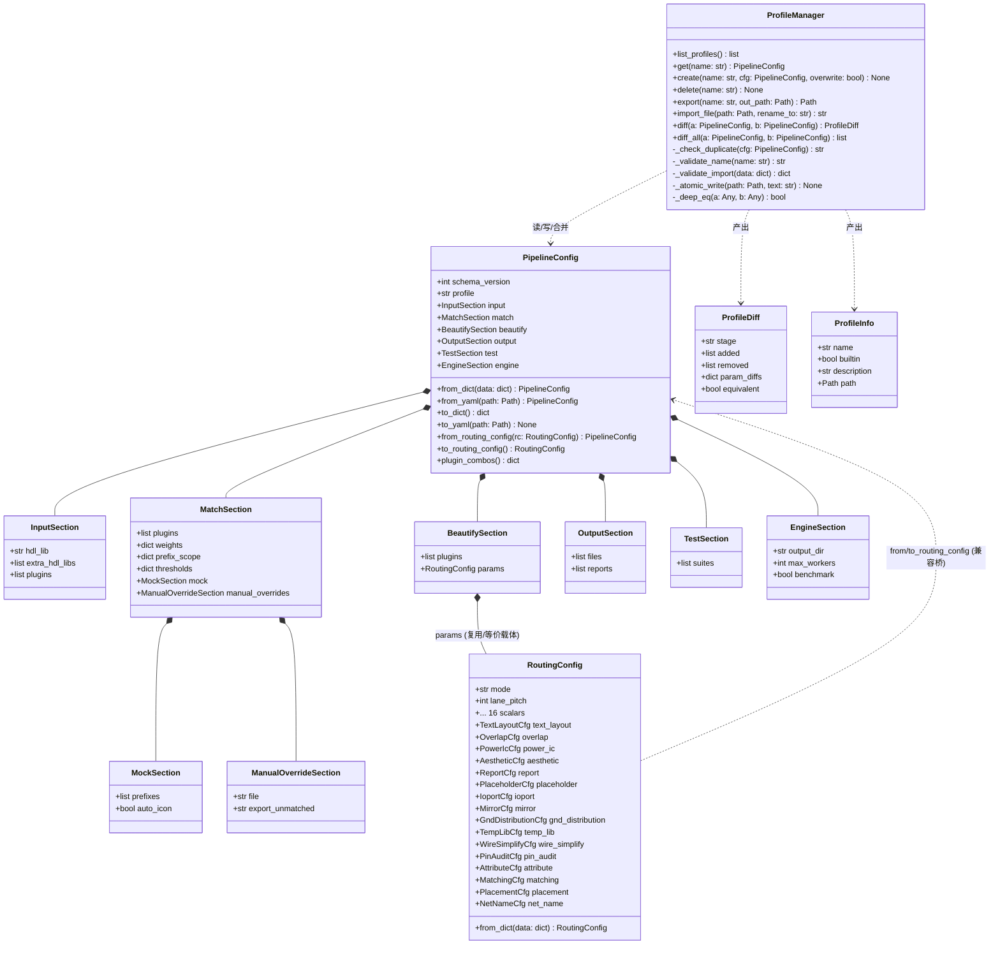
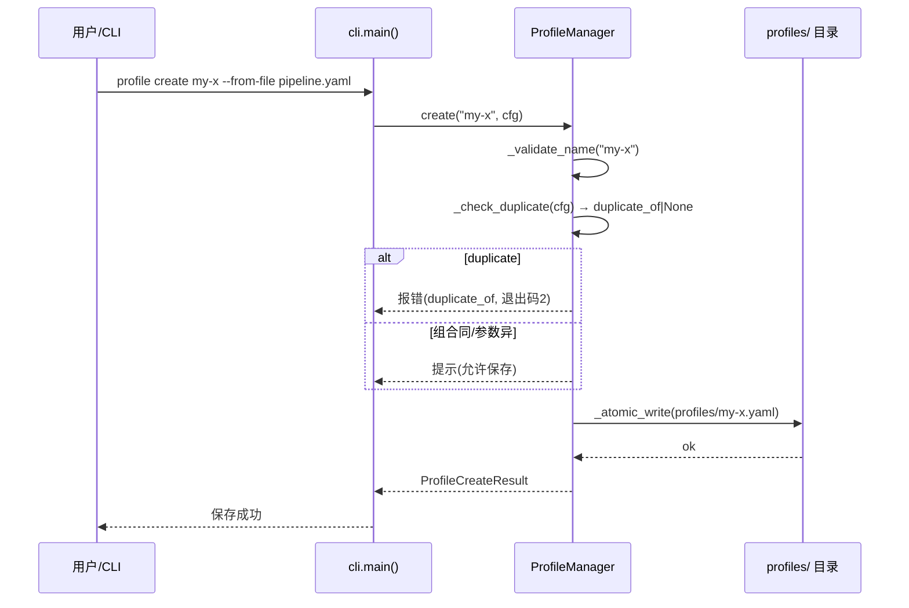
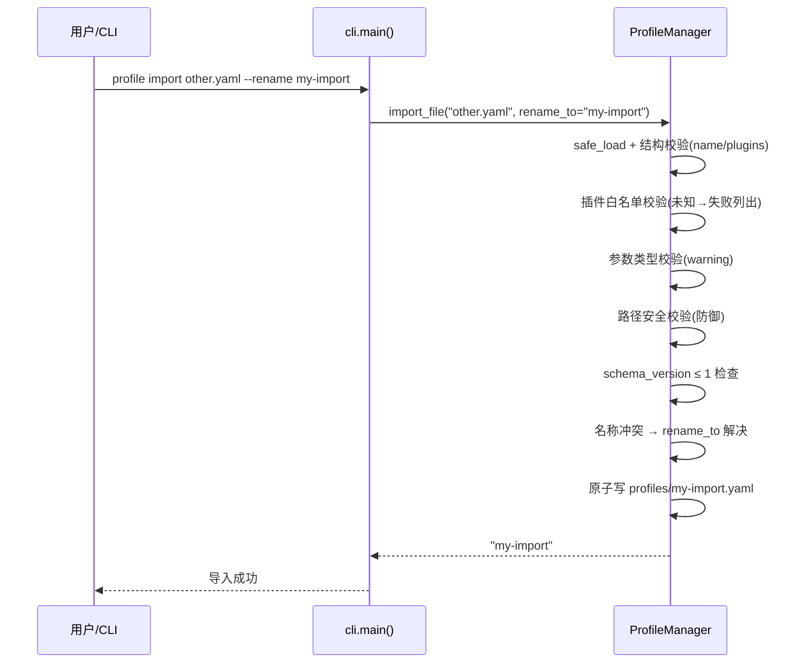
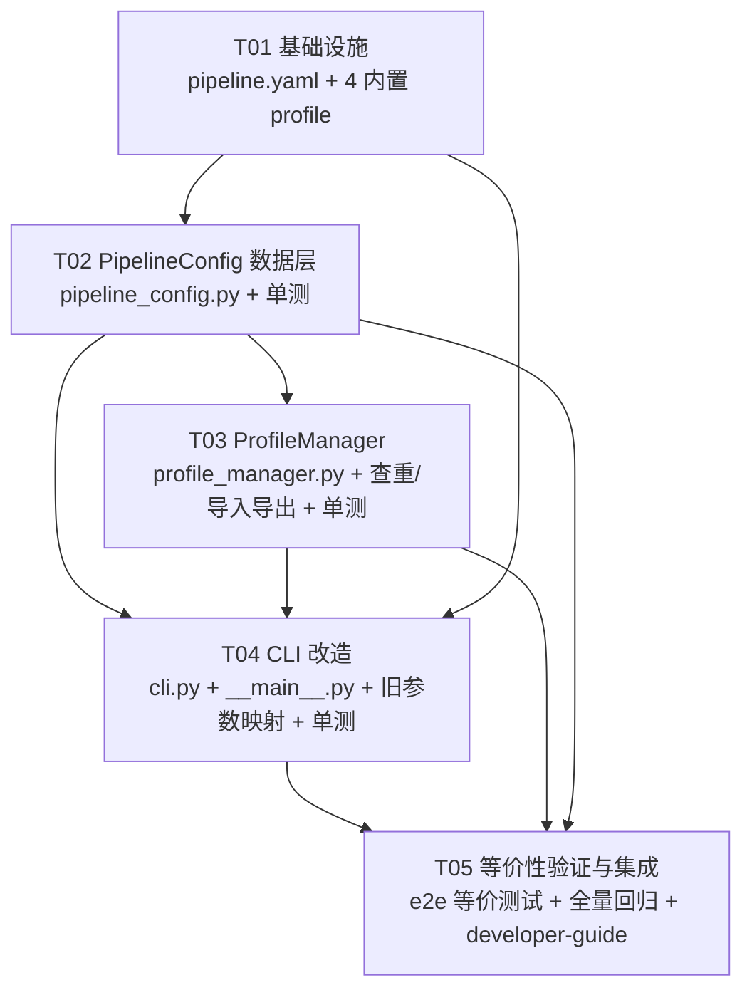

# S1 配置层设计 — pipeline.yaml + PipelineConfig + ProfileManager + CLI 迁移

> 作者：高见远（软件架构师）｜日期：2026-08-14｜基线：cis2hdl b0dd63d / Phase XXIII（929 passed）
> 上游依据：`docs/archive/temp files/phase23-plugin-architecture.md`（v2，§3.6/§3.7/§3.8/§7）
> 范围：**S1 配置层**（设计文档，不改代码）；S2+ 插件基座/插件化不在本文
> 铁律：**默认 profile 行为与现有完全等价**（929 测试不回归，FR9）

---

## 0. 现状调研摘要（只读结论）

### 0.1 现有配置体系（cis2hdl/core/config.py + cis2hdl/config/routing.yaml）

全局单例 `Config`（`config.py:801`）聚合 9 个子配置：`page / hdl / net / edif / gui / app / hdl_lib / matching / output / routing`。
其中 **RoutingConfig**（`config.py:690`）是本次迁移的主体——它承载 Phase XIV~XXIII 全部布线/美化/报告开关，默认值即"现有默认行为"。

**RoutingConfig 顶层标量（16 个）**：

| 字段 | 类型 | 默认值 | 说明 / 对应 CLI |
|------|------|--------|-----------------|
| `mode` | str | `"p0"` | 布线器模式 p0\|detour\|edif_reuse（`--routing`） |
| `lane_pitch` | int | `50` | P0 车道间距 |
| `grid` | int | `25` | 网格 |
| `detour_stubs` | bool | `True` | 正交绕障（detour 模式） |
| `use_edif_wires` | bool | `False` | EDIF 折线复用（edif_reuse 模式） |
| `cross_page_opt` | bool | `False` | 跨页网视觉优化（`--cross-page-opt`） |
| `fallback_to_p0` | bool | `True` | 新功能异常回退 P0 |
| `nonuniform_tracks` | bool | `False` | 非均匀轨道（`--nonuniform-tracks`） |
| `net_order` | str | `"long_first"` | 布线顺序（`--net-order`） |
| `stub_lead` | int | `100` | stub 外引距离 |
| `lead_differentiate` | bool | `True` | 引出段错开 |
| `lead_diff_min_gap` | int | `75` | 差异化最小引脚间距 |
| `max_detour` | int | `50` | 绕障余量 |
| `edge_clearance` | int | `100` | 页面边缘冗余区 |
| `three_stage_stub` | bool | `True` | 三段式 stub |
| `manual_matches` | str | `""` | manual_matches.yaml 路径（`--manual-matches`） |
| `export_unmatched` | str | `""` | 未匹配导出路径（`--export-unmatched`） |
| `chip_config` | str | `""` | chip_config.yaml 路径（`--chip-config`） |

**RoutingConfig 子节（17 个 dataclass 字段）**：

| 子节 | 字段（类型=默认值） |
|------|---------------------|
| `text_layout` | enabled:bool=False, align_net_names=True, align_ports=True, diff_pair_pn=True, char_width_factor:float=0.65, line_height_factor:float=1.2, padding:int=12, min_text_w:int=75 |
| `overlap` | check=False, min_area:int=625, auto_placement=False, resolve=True, avoid_margin:int=50, edge_clearance:int=100, pin_avoid_radius:int=50 |
| `power_ic` | enabled=False, config_file:str="cis2hdl/config/power_ic.yaml" |
| `aesthetic` | enabled=False, report=True |
| `report` | always_write=True, aesthetic=True, ioport_audit=True |
| `placeholder` | enabled=True |
| `ioport` | edge_layout=False, edge_x:int=-600, edge_step:int=100, edge_margin:int=300, audit=False, skip_orphan=False, manual_names:dict={}, use_net_name=False, net_label_on_end=True, un_name_policy:str="rename" |
| `mirror` | normalize=True, report=True |
| `gnd_distribution` | enabled=False, distribute_density=False, near_chip_offset:int=100, distance_threshold:int=2000, max_per_chip:int=1, dense_area_threshold:int=8, cluster_radius:int=2000, parallel_short=True, parallel_short_dist:int=500, gnd_power_lastpin_offset:list=[0,50] |
| `temp_lib` | enabled=True, lib_name:str="temp_lib", annotate=True, mock_text:str="MOCK/模拟图标", pin_font_size:int=16, pin_text_size:int=16, pin_line_len:int=50, mock_text_cmd:str="T", mock_all=True, syntax_check=True, structure_check=True |
| `wire_simplify` | enabled=False, dot_merge:int=50, max_wire_len:int=5000, break_long=False, self_intersect_check=True, parallel_short=True, parallel_short_dist:int=500 |
| `pin_audit` | enabled=True, report_hanging=True |
| `attribute` | inject_crossref=True, rewrite_origin=True |
| `matching` | hdl_lib_only=True, connector_pin_check=True |
| `placement` | max_passive_move:int=200, rotate_passives=False |
| `net_name` | un_auto_rename=True |

另有非 routing 配置与本设计相关：`AppConfig.max_workers=4 / benchmark=False / default_output_dir="output"`；`ComponentMatchingConfig.exact_threshold=0.95 / fuzzy_threshold=0.75 / feature_threshold=0.60 / fallback_threshold=0.50`（S4 接入，S1 承载）。

### 0.2 CLI 参数清单（cis2hdl/__main__.py convert 分支，23 个）

| CLI 参数 | 现有行为（写回位置） |
|----------|----------------------|
| `--output <dir>` | `output_dir` → ConversionEngine 参数 |
| `--hdl-lib <dir>` | `hdl_lib` → ConversionEngine 参数 |
| `--extra-hdl-lib <dir>`（可多次） | `extra_hdl_libs` → ConversionEngine 参数 |
| `--benchmark` | `cfg.app.benchmark=True` |
| `--max-workers <n>` | `cfg.app.max_workers=int` |
| `--routing p0\|detour\|edif_reuse` | `cfg.routing.mode` |
| `--nonuniform-tracks` | `cfg.routing.nonuniform_tracks=True` |
| `--net-order short_first\|long_first` | `cfg.routing.net_order` |
| `--wire-simplify` | `cfg.routing.wire_simplify.enabled=True` |
| `--manual-matches <file>` | `cfg.routing.manual_matches` |
| `--chip-config <file>` | `cfg.routing.chip_config`（v2.0 覆盖 v1.0） |
| `--export-unmatched <out>` | `cfg.routing.export_unmatched` |
| `--text-layout` | `cfg.routing.text_layout.enabled=True` |
| `--power-ic` | `cfg.routing.power_ic.enabled=True` |
| `--aesthetic` | **复合**：aesthetic.enabled + text_layout.enabled + overlap.check + power_ic.enabled +（未显式 `--routing` 且 mode==p0 时）mode=detour + ioport.edge_layout + gnd_distribution.enabled + ioport.audit |
| `--gnd-distribute` | gnd_distribution.enabled + **distribute_density=True** |
| `--rotate-passives` | placement.rotate_passives=True |
| `--ioport-edge` | ioport.edge_layout=True |
| `--ioport-audit` | ioport.audit=True |
| `--use-net-name` | ioport.use_net_name=True |
| `--no-mirror-normalize` | mirror.normalize=False |
| `--no-report` | report.always_write=False |
| `--cross-page-opt` | routing.cross_page_opt=True |

### 0.3 与方案 §3.6 / §7 的差异点（调研发现）

| # | 方案 v2 表述 | 现状实情 | S1 处理 |
|---|-------------|---------|---------|
| D1 | §3.6 `beautify.params` 用插件名作 key（`gnd:`、`parallel:`） | 现有参数节名是 `gnd_distribution`、`wire_simplify` 等 | **params key 用现有子节名**（迁移零成本、等价可验证） |
| D2 | §7 `--aesthetic` → `profile: max-beauty` | `--aesthetic` 实际是 8 个字段的复合置位，与 max-beauty（会额外开 wire_simplify 等）**不等价** | **逐字段展开映射**（保 FR9 严格等价） |
| D3 | §7 `--gnd-distribute` → `beautify.plugins: [..., gnd_cluster]` | 实际还会开 `distribute_density` | 映射含 distribute_density |
| D4 | §7 `--use-net-name` → `output.reports: [..., net_name]` | 实际是 `ioport.use_net_name` 参数 | 映射到 `beautify.params.ioport.use_net_name` |
| D5 | §3.6 无 `engine` 节 | `--max-workers/--benchmark/--output` 无处安放 | **新增 `engine` 节**（主理人确认顶层结构含 engine） |
| D6 | §3.6 match 无 thresholds | `ComponentMatchingConfig` 4 阈值真实存在 | 新增 `match.thresholds`（S4 接入） |
| D7 | §3.8.3 自定义 profile 文件有 `created` 字段 | — | 保留 `created`（生成时写入 ISO 日期） |

---

# Part A：系统设计

## 1. 实现方法（技术选型）

**核心难点**：
1. **等价性**：新 yaml 结构必须能无损表达现有 RoutingConfig 全部字段，且默认值逐字段一致 → 解决方案：`BeautifySection.params` **直接复用 RoutingConfig**（含其成熟的 `from_dict` 子节合并逻辑），迁移 = 机械搬移，映射 = `RoutingConfig.from_dict`。
2. **双视图**：yaml 外层是"插件组合视图"（方案 §3.6：plugins 列表 + 参数），内层是"引擎消费视图"（RoutingConfig）→ 通过 `PipelineConfig.from_routing_config() / to_routing_config()` 双向桥接，**ConversionEngine 零改动**（S1 不动引擎）。
3. **查重/导入安全**：插件组合 set 比较 + 参数深度比较 + 原子写 + 白名单校验。

**技术选型**：
- `PyYAML`（已有依赖，`yaml.safe_load` 读写）
- `dataclasses`（标准库，现有风格一致）
- `os.replace` 原子写（跨平台）
- **不引入新第三方依赖**（pluggy 属 S2，S1 无需）

**架构模式**：分层 + 单例兼容——`PipelineConfig`（数据层）→ `ProfileManager`（配置服务层）→ `cli.py`（表现层）。全局 `Config` 单例保留不动，作为引擎侧"写回目标"。

## 2. 文件清单（S1 新增/修改，均在 cis2hdl_plugin_ver 内）

```
cis2hdl_plugin_ver/
├── pipeline.yaml                          # [新增] 权威配置（default 等价版，带注释）
├── profiles/
│   ├── default.yaml                       # [新增] 内置只读预设
│   ├── max-beauty.yaml                    # [新增] 内置只读预设
│   ├── fast.yaml                          # [新增] 内置只读预设
│   ├── match-only.yaml                    # [新增] 内置只读预设
│   └── <user>.yaml                        # [运行时生成] 用户自定义
├── cis2hdl/
│   ├── __main__.py                        # [修改] 改造为 cli.main() 转发（保留 GUI 入口）
│   ├── cli.py                             # [新增] 新 CLI：convert 读 yaml + profile 子命令 + 旧参数映射
│   ├── core/
│   │   ├── config.py                      # [微改] 仅新增 from_pipeline 兼容入口（可选，见 T02）
│   │   ├── pipeline_config.py             # [新增] PipelineConfig + 各节 dataclass + 序列化 + 兼容映射
│   │   └── profile_manager.py             # [新增] ProfileManager + ProfileDiff + 校验/查重/原子写
│   └── config/
│       └── routing.yaml                   # [保留不动] S1 仍可被旧逻辑读取；标记 deprecated（S10 移）
└── tests/
    ├── unit/test_pipeline_config.py       # [新增] 映射等价性/序列化往返
    ├── unit/test_profile_manager.py       # [新增] 查重/导入导出/内置只读/原子写
    ├── unit/test_cli_legacy_mapping.py    # [新增] 旧 CLI → yaml 映射 + deprecation
    └── e2e/test_default_profile_equivalence.py  # [新增] 默认 profile 等价性（新旧两路径输出 diff）
```

## 3. PipelineConfig dataclass 完整设计（交付要求 a）

### 3.1 顶层结构

```python
# cis2hdl/core/pipeline_config.py
from __future__ import annotations
import copy
from dataclasses import dataclass, field, asdict
from pathlib import Path
from typing import Any
from .config import RoutingConfig

@dataclass
class PipelineConfig:
    """插件化转换配置（权威）。顶层七节：profile/input/match/beautify/output/test/engine。

    - 结构即 yaml 结构（snake_case 1:1）
    - beautify.params 复用 RoutingConfig：默认值 = 现有行为（FR9）
    - 兼容桥：from_routing_config() / to_routing_config()（ConversionEngine 零改动）
    """
    schema_version: int = 1
    profile: str = "default"                  # --profile 或 pipeline.yaml profile:
    input: InputSection = field(default_factory=InputSection)
    match: MatchSection = field(default_factory=MatchSection)
    beautify: BeautifySection = field(default_factory=BeautifySection)
    output: OutputSection = field(default_factory=OutputSection)
    test: TestSection = field(default_factory=TestSection)
    engine: EngineSection = field(default_factory=EngineSection)

    # ── 序列化 ──────────────────────────────────────────────
    @classmethod
    def from_dict(cls, data: dict) -> "PipelineConfig": ...
    @classmethod
    def from_yaml(cls, path: Path) -> "PipelineConfig": ...   # safe_load + from_dict
    def to_dict(self) -> dict: ...                            # 嵌套 asdict（params 经 RoutingConfig 序列化）
    def to_yaml(self, path: Path) -> None: ...                # 原子写（复用 ProfileManager._atomic_write）

    # ── 兼容桥（FR9 核心） ───────────────────────────────────
    @classmethod
    def from_routing_config(cls, rc: RoutingConfig) -> "PipelineConfig":
        """从现有 RoutingConfig 构造（等价映射）：
        beautify.params = deepcopy(rc)；match.manual_overrides.file =
        rc.chip_config or rc.manual_matches。"""
    def to_routing_config(self) -> RoutingConfig:
        """导出为 RoutingConfig（引擎消费入口）：
        ① copy beautify.params
        ② match.manual_overrides.file → chip_config & manual_matches
        ③ engine.max_workers/benchmark → AppConfig 侧（由 CLI 写 cfg.app）
        ④ 返回 RoutingConfig（默认 profile 时与现有逐字段相等）"""

    # ── 查重/差异辅助 ───────────────────────────────────────
    def plugin_combos(self) -> dict[str, frozenset[str]]:
        """{stage: frozenset(plugins)}——查重 set 比较用（顺序无关）。"""
```

### 3.2 各节 dataclass 字段清单

```python
@dataclass
class InputSection:
    """输入段：库路径 + 输入插件组合（插件实际加载 S3，S1 承载+校验）。"""
    hdl_lib: str = ""                        # 主 HDL 库（--hdl-lib）
    extra_hdl_libs: list[str] = field(default_factory=list)   # 附加库（--extra-hdl-lib，可多次）
    plugins: list[str] = field(default_factory=lambda: ["edif", "pstxnet", "pstchip"])

@dataclass
class MockSection:
    prefixes: list[str] = field(default_factory=lambda: ["J", "T"])   # FR3 强制 mock 的 prefix
    auto_icon: bool = True                   # J/T/U/IC 用模拟图标

@dataclass
class ManualOverrideSection:
    """FR3 手动匹配（--chip-config / --manual-matches / --export-unmatched）。"""
    file: str = ""                           # chip_config.yaml 路径（v2.0 主入口；manual_matches 别名）
    export_unmatched: str = ""               # 未匹配导出路径

@dataclass
class MatchSection:
    """匹配段：插件组合 + 权重 + prefix 范围 + 阈值 + mock + 手动干预。
    权重/prefix_scope 由 matcher 消费（S4 接入）；S1 承载 + 查重。"""
    plugins: list[str] = field(default_factory=lambda: ["exact", "fuzzy", "passive", "fallback"])
    weights: dict[str, float] = field(default_factory=lambda: {
        "part_name": 0.5, "footprint": 0.3, "value": 0.2, "jedec_type": 0.1,
    })
    prefix_scope: dict[str, list[str]] = field(default_factory=lambda: {
        "R": ["0603", "0402", "0805"],
        "C": ["0603", "0402", "0805"],
        "U": ["sot223", "qfp", "bga"],
        "J": ["connector"],
        "IC": ["any"],
    })
    thresholds: dict[str, float] = field(default_factory=lambda: {
        "exact": 0.95, "fuzzy": 0.75, "feature": 0.60, "fallback": 0.50,
    })   # = ComponentMatchingConfig（S4 接入）
    mock: MockSection = field(default_factory=MockSection)
    manual_overrides: ManualOverrideSection = field(default_factory=ManualOverrideSection)

@dataclass
class BeautifySection:
    """美化段：插件组合（S2 驱动）+ params（RoutingConfig 原样承载，S1 即生效）。

    设计决策：params 复用 RoutingConfig（字段/默认值/from_dict 全部继承），
    等价迁移零成本。plugins 与 params 解耦——plugins 表达"组合"（查重 set 比较），
    params 表达"参数"（引擎消费）；S2 插件据 params 取参。"""
    plugins: list[str] = field(default_factory=lambda: [
        "overlap_resolve", "gnd_cluster", "parallel_short",
    ])
    params: RoutingConfig = field(default_factory=RoutingConfig)

@dataclass
class OutputSection:
    """输出段：文件/报告选择（S6 驱动；S1 承载 + 校验 + 查重）。"""
    files: list[str] = field(default_factory=lambda: ["csa", "con", "xcon", "csv", "cpc", "cpm", "cds_lib"])
    reports: list[str] = field(default_factory=lambda: ["aesthetic", "ioport", "mapping", "error"])

@dataclass
class TestSection:
    suites: list[str] = field(default_factory=lambda: ["unit", "e2e", "qa_package"])

@dataclass
class EngineSection:
    """运行段（--output/--max-workers/--benchmark 落点）。"""
    output_dir: str = "output"
    max_workers: int = 4
    benchmark: bool = False
```

### 3.3 与 RoutingConfig 的映射关系

| PipelineConfig 位置 | RoutingConfig 字段 | 方向 | 说明 |
|--------------------|--------------------|------|------|
| `beautify.params`（整体） | 整个 RoutingConfig | 双向复制 | **等价载体**：默认值即现有行为 |
| `beautify.params.routing.*` | 16 个顶层标量 | 双向 | mode/lane_pitch/grid/... |
| `beautify.params.<子节>` ×17 | 17 个子节 | 双向 | text_layout/overlap/power_ic/aesthetic/report/placeholder/ioport/mirror/gnd_distribution/temp_lib/wire_simplify/pin_audit/attribute/matching/placement/net_name |
| `match.manual_overrides.file` | `chip_config`（v2.0 主） / `manual_matches`（别名） | to: 写两个；from: `chip_config or manual_matches` | 迁移落点（§7 D2 细化） |
| `match.manual_overrides.export_unmatched` | `export_unmatched` | 双向 | 未匹配导出 |
| `engine.max_workers` | `AppConfig.max_workers` | to: CLI 写 cfg.app | §7 映射 |
| `engine.benchmark` | `AppConfig.benchmark` | to: CLI 写 cfg.app | §7 映射 |
| `engine.output_dir` | `AppConfig.default_output_dir` / CLI `output_dir` | to: CLI 使用 | 新增落点 |
| `input.hdl_lib / extra_hdl_libs` | ConversionEngine `hdl_lib_path` / `extra_lib_paths` 参数 | to: CLI 传参 | §7 映射 |

**新增字段（现有无对应）**：`schema_version`、`profile`、`input.plugins`、`match.plugins/weights/prefix_scope/thresholds/mock`、`beautify.plugins`、`output.files/reports`、`test.suites`、`engine.*`。
**S1 语义**：plugins 类字段 = 组合声明 + 查重数据（S2+ 才驱动加载）；权重/阈值类 = 承载 + 校验（S4 才被 matcher 消费）。**S1 真正被引擎消费的是 beautify.params + manual_overrides + input 库路径 + engine 运行参数**。

### 3.4 向后兼容

- **旧入口不变**：`Config.load_from_file(routing.yaml)`、`RoutingConfig.from_dict`、`cfg.routing.*` 全部保留（929 测试依赖），S1 只新增，不改删。
- **桥接**：CLI 新逻辑 = `pipeline.yaml → PipelineConfig → to_routing_config() → 写回全局 cfg.routing / cfg.app → ConversionEngine.convert(...)`（引擎无感知）。
- **往返恒等**：`PipelineConfig.from_routing_config(rc).to_routing_config() == rc`（字段级，T02 单测断言）。
- **旧 CLI 兼容**：全部旧参数保留至 S10，S1 起映射等价 yaml 并打印 deprecation 警告（见 §5）。

## 4. pipeline.yaml 完整示例（交付要求 b）

以下即 `cis2hdl_plugin_ver/pipeline.yaml` 内容（default profile 等价版，含注释）：

```yaml
# =============================================================================
# pipeline.yaml — CIS2HDL 转换配置（权威）
# 设计依据：docs/archive/temp files/phase23-plugin-architecture.md §3.6/§3.7
# 铁律：default profile 与当前基线（Phase XXIII, 929 passed）行为完全等价
# 加载顺序：pipeline.yaml（权威）→ --profile 覆盖 → 旧 CLI 参数覆盖（S10 前，含 deprecation 警告）
# =============================================================================
schema_version: 1          # 配置结构版本（导入校验用；低版本缺失字段用默认值）

profile: default           # 当前生效 profile：default | fast | max-beauty | match-only | <自定义>
                           # 自定义 profile 存 profiles/<name>.yaml（ProfileManager 管理）

# ── 输入段：库路径 + 输入插件组合 ───────────────────────────────────────────
input:
  hdl_lib: ""              # 主 HDL 元件库路径（--hdl-lib；相对路径按当前工作目录解析，与旧 CLI 一致）
  extra_hdl_libs: []       # 附加 HDL 库（--extra-hdl-lib，可多个）
  plugins:                 # FR1 输入插件组合（S3 实际加载；S1 承载/校验/查重）
    - edif                 # EDIF 解析（默认）
    - pstxnet              # pstxnet 网络注入（默认）
    - pstchip              # pstchip 引脚名恢复（默认）
    # - dsn                # DSN 解析（可选，S3 接入）
    # - cross_ref          # CrossRef CSV（可选，S3 接入）

# ── 匹配段：插件组合 + 权重 + prefix 范围 + 阈值 + mock + 手动干预 ─────────
match:
  plugins: [exact, fuzzy, passive, fallback]   # FR2 匹配插件链（S4 驱动）
  weights:                 # 匹配权重（NFR5 去硬编码；S4 接入 matcher）
    part_name: 0.5
    footprint: 0.3
    value: 0.2
    jedec_type: 0.1
  prefix_scope:            # 各 prefix 搜索范围（S4 接入）
    R:  [0603, 0402, 0805]
    C:  [0603, 0402, 0805]
    U:  [sot223, qfp, bga]
    J:  [connector]
    IC: [any]
  thresholds:              # = ComponentMatchingConfig 四阈值（S4 接入）
    exact: 0.95
    fuzzy: 0.75
    feature: 0.60
    fallback: 0.50
  mock:                    # FR3 强制 mock
    prefixes: [J, T]
    auto_icon: true        # J/T/U/IC 用模拟图标（temp_lib.mock_all 后端兜底）
  manual_overrides:        # FR3 手动匹配（--chip-config 主入口 / --manual-matches 别名）
    file: ""               # chip_config.yaml 路径（空 = 不启用）
    export_unmatched: ""   # 未匹配导出路径（--export-unmatched；空 = 不导出）

# ── 美化段：插件组合（S2 驱动）+ 参数（RoutingConfig 原样承载，S1 即生效）──
beautify:
  plugins:                 # FR4 美化插件组合（顺序 = 执行顺序；S5 驱动；查重 set 比较）
    - overlap_resolve      # 防重叠（默认）
    - gnd_cluster          # GND 聚类（默认）
    - parallel_short       # 并联优化（默认）
    # - wire_simplify      # 电线化简（默认关，--wire-simplify 时代）
  params:                  # ★ 与旧 routing.yaml 同构（字段 = RoutingConfig 全量）
    routing:               # 布线器参数（旧 routing: 节）
      mode: p0             # p0 | detour | edif_reuse（--routing）
      lane_pitch: 50
      grid: 25
      detour_stubs: true
      use_edif_wires: false
      cross_page_opt: false
      fallback_to_p0: true
      nonuniform_tracks: false   # --nonuniform-tracks
      net_order: "long_first"    # long_first | short_first（--net-order）
      stub_lead: 100
      lead_differentiate: true
      lead_diff_min_gap: 75
      max_detour: 50
      edge_clearance: 100
      three_stage_stub: true
    text_layout:           # D1 文本/标签去冲突（--text-layout 置 enabled）
      enabled: false
      align_net_names: true
      align_ports: true
      diff_pair_pn: true
      char_width_factor: 0.65
      line_height_factor: 1.2
      padding: 12
      min_text_w: 75
    overlap:               # D2 元件重叠检测 + R5 避让（--aesthetic 置 check）
      check: false
      min_area: 625
      auto_placement: false
      resolve: true
      avoid_margin: 50
      edge_clearance: 100
      pin_avoid_radius: 50
    power_ic:              # D4 电源芯片匹配（--power-ic / --aesthetic）
      enabled: false
      config_file: "cis2hdl/config/power_ic.yaml"
    aesthetic:             # 总开关（--aesthetic；启用时联动多处，见 §5 映射）
      enabled: false
      report: true
    report:                # 诊断报告输出（--no-report 置 always_write=false）
      always_write: true
      aesthetic: true
      ioport_audit: true
    placeholder:           # P0-F 占位符号（默认 true 是用户要求的例外）
      enabled: true
    ioport:                # P1-C 跨页 IOPORT + M5 网络名（--ioport-edge/--ioport-audit/--use-net-name）
      edge_layout: false
      edge_x: -600
      edge_step: 100
      edge_margin: 300
      audit: false
      skip_orphan: false
      manual_names: {}
      use_net_name: false
      net_label_on_end: true
      un_name_policy: "rename"   # keep | rename | omit
    mirror:                # T1 镜像归一化（--no-mirror-normalize 置 normalize=false）
      normalize: true
      report: true
    gnd_distribution:      # P1-D GND 符号分布（--gnd-distribute 置 enabled+distribute_density）
      enabled: false
      distribute_density: false
      near_chip_offset: 100
      distance_threshold: 2000
      max_per_chip: 1
      dense_area_threshold: 8
      cluster_radius: 2000
      parallel_short: true
      parallel_short_dist: 500
      gnd_power_lastpin_offset: [0, 50]
    temp_lib:              # M1 模拟图标（默认 true；false 回退 placeholder）
      enabled: true
      lib_name: temp_lib
      annotate: true
      mock_text: "MOCK/模拟图标"
      pin_font_size: 16
      pin_text_size: 16
      pin_line_len: 50
      mock_text_cmd: "T"
      mock_all: true
      syntax_check: true
      structure_check: true
    wire_simplify:         # M4 电线化简（默认关；--wire-simplify）
      enabled: false
      dot_merge: 50
      max_wire_len: 5000
      break_long: false
      self_intersect_check: true
      parallel_short: true
      parallel_short_dist: 500
    pin_audit:             # M6 引脚连接审计（只读诊断）
      enabled: true
      report_hanging: true
    attribute:             # R4 属性注入
      inject_crossref: true
      rewrite_origin: true
    matching:              # R4/Q1 + R10 匹配源过滤
      hdl_lib_only: true
      connector_pin_check: true
    placement:             # R11/Q12 元件微调（--rotate-passives）
      max_passive_move: 200
      rotate_passives: false
    net_name:              # R3⑤ UN$ 稳定化
      un_auto_rename: true

# ── 输出段：文件/报告选择（S6 驱动；S1 承载/校验/查重）────────────────────
output:
  files: [csa, con, xcon, csv, cpc, cpm, cds_lib]     # FR5 输出文件（S6 驱动）
  reports: [aesthetic, ioport, mapping, error]        # 报告（report 开关见 beautify.params.report）

# ── 测试段：测试套件选择（S8 驱动）────────────────────────────────────────
test:
  suites: [unit, e2e, qa_package]                     # FR6 测试插件（S8 驱动）

# ── 运行段：引擎运行参数（--output/--max-workers/--benchmark 落点）────────
engine:
  output_dir: "output"     # 输出目录（--output）
  max_workers: 4           # 并行度（--max-workers）
  benchmark: false         # 性能基准报告（--benchmark）
```

> 说明：`beautify.params` 中 **不出现** manual_matches/chip_config/export_unmatched（已迁移到 `match.manual_overrides`）；`to_routing_config()` 负责回填，保证引擎侧等价。

## 5. ProfileManager 接口设计（交付要求 c，§3.8 落实）

### 5.1 目录布局

```
cis2hdl_plugin_ver/
├── pipeline.yaml                    # 主配置（权威；profile: 记录当前生效名）
└── profiles/                        # ProfileManager 工作目录（默认 <pkg_root>/profiles）
    ├── default.yaml                 # 内置只读（builtin: true，禁止覆盖/删除）
    ├── max-beauty.yaml              # 内置只读
    ├── fast.yaml                    # 内置只读
    ├── match-only.yaml              # 内置只读
    └── my-power-design.yaml         # 用户自定义（GUI/CLI 保存生成，原子写）
```

内置与自定义**同目录**，用 `profile.builtin: true` 标志区分（贴近方案 §3.8.3 布局，避免双目录查找逻辑）。

### 5.2 Profile 文件格式（profiles/<name>.yaml）

```yaml
# profiles/my-power-design.yaml（用户自定义；与 pipeline.yaml 的 profile 段同构）
schema_version: 1
profile:
  name: my-power-design
  description: "电源板专属：全美化 + 网络名标签"
  created: 2026-08-14            # 生成时写入（ISO 日期）
  builtin: false                 # true = 内置只读（用户文件恒 false）
  plugins:                       # 完整插件组合快照（不引用其他 profile）
    input:    [edif, pstxnet, pstchip]
    match:    [exact, fuzzy, passive, fallback, power_ic]
    beautify: [overlap_resolve, gnd_cluster, parallel_short, wire_simplify, text_layout]
    output:   [csa, con, xcon, csv, cpc, cpm, cds_lib]
    test:     [unit, e2e]
  params:                        # 仅存与默认值不同的参数（增量；深合并到 default 之上）
    gnd_distribution: { cluster_radius: 700 }
    wire_simplify:   { enabled: true }
    text_layout:     { enabled: true }
```

### 5.3 ProfileManager 完整签名

```python
# cis2hdl/core/profile_manager.py
from __future__ import annotations
from dataclasses import dataclass, field
from pathlib import Path
from typing import Any
from .pipeline_config import PipelineConfig

STAGES = ("input", "match", "beautify", "output", "test")   # 插件组合比较的 5 个阶段

@dataclass
class ProfileInfo:
    """list_profiles 返回项。"""
    name: str
    builtin: bool            # True = 内置只读
    description: str
    path: Path

@dataclass
class ProfileDiff:
    """两 profile 的差异（查重核心，§3.8.2）。

    diff() 返回**首个差异阶段**的差异；equivalent=True 表示全部阶段插件组合+参数全等。
    完整逐阶段差异用 diff_all()（GUI 展示用）。
    """
    stage: str                       # 差异所在阶段（beautify 等）；equivalent=True 时为 ""
    added: list[str]                 # 新组合多出的插件
    removed: list[str]               # 新组合缺少的插件
    param_diffs: dict[str, dict]     # {plugin: {key: (旧值, 新值)}}；仅含差异参数
    equivalent: bool                 # True = 插件组合+参数全等（判重）

class ProfileManager:
    """自定义 profile 的增删改查 + 查重 + 导入导出（§3.8 落实）。"""

    def __init__(
        self,
        profiles_dir: Path | None = None,       # 默认 <包根>/profiles
        builtin_names: tuple[str, ...] = ("default", "max-beauty", "fast", "match-only"),
    ) -> None:
        """profiles_dir 不存在时创建（幂等）。"""

    # ── 查询 ──────────────────────────────────────────────
    def list_profiles(self) -> list[ProfileInfo]:
        """扫描 profiles/*.yaml，按 builtin 优先 + 名称排序；解析失败条目标 warning 跳过。"""

    def get(self, name: str) -> PipelineConfig:
        """解析为完整配置（合并内置 default）：
        ① 校验名称存在
        ② 取内置 default 的 PipelineConfig（或显式 base）
        ③ 用 profile 文件 plugins 替换各阶段插件列表（5 阶段）
        ④ 用 profile 文件 params 深合并（增量覆盖）
        ⑤ 返回完整 PipelineConfig（profile 字段置 name）
        """

    # ── 写操作 ────────────────────────────────────────────
    def create(self, name: str, cfg: PipelineConfig, overwrite: bool = False) -> None:
        """① 名称校验：trim + 非空 + 长度 ≤64 + 正则 ^[A-Za-z0-9][A-Za-z0-9._-]*$
           ② 查重：插件组合+参数 与已有 profile 比对（_check_duplicate）
              - duplicate（组合+参数全等）→ 报错拒绝（提示 duplicate_of）
              - 组合同、参数异 → 允许保存，返回提示"插件组合与 XX 相同但参数不同"
           ③ 名称冲突（同 trim/小写）→ 非 overwrite 则拒绝（不静默覆盖）
           ④ 写 profiles/<name>.yaml（原子写：临时文件+os.replace）
           ⑤ 内置名（builtin_names）→ 拒绝覆盖/创建（只读）"""

    def delete(self, name: str) -> None:
        """删除自定义 profile；内置（builtin: true）→ 报错拒绝；不存在 → FileNotFoundError。"""

    def export(self, name: str, out_path: Path | None = None) -> Path:
        """导出为可分发的 .yaml（builtin: true 条目转 false，去掉 created）；
        out_path 缺省 = profiles/export_<name>_<ts>.yaml。返回写出路径（原子写）。"""

    def import_file(self, path: Path, rename_to: str | None = None) -> str:
        """① 读取 yaml 校验结构（必填 profile.name 字符串 + profile.plugins dict，
              至少 1 阶段非空；未知字段忽略）
           ② 插件白名单：引用的插件名 ∈ 已知插件名集合（S1 用内置常量表
              BUILTIN_PLUGIN_NAMES；S2 起接 PluginManager.list_plugins()）
              —— 未知插件 → 导入失败并列出
           ③ 参数类型校验：params 值与 PipelineConfig 默认字段类型比对
              （int/bool/str/float/list/dict）——类型错误 warning（不阻断）
           ④ 路径安全：params 中禁止路径/命令类字段（防御性，见 5.4）
           ⑤ schema_version ≤ 当前支持版本（1）→ 缺失字段用默认值
           ⑥ 名称冲突：同名存在 → rename_to 指定则改名，否则报错拒绝
           ⑦ 写入 profiles/<name>.yaml（原子写）。返回实际写入的 profile 名。"""

    # ── 差异/查重 ─────────────────────────────────────────
    def diff(self, a: PipelineConfig, b: PipelineConfig) -> ProfileDiff:
        """查重核心（§3.8.2）：
        ① 逐阶段 set 比较 plugins（顺序无关）——首现差异即返回该阶段
        ② 全部相同 → 参数深度比较（_deep_eq）：
           - 全等 → equivalent=True
           - 不等 → param_diffs 列出 {plugin: {key: (旧, 新)}}"""

    def diff_all(self, a: PipelineConfig, b: PipelineConfig) -> list[ProfileDiff]:
        """完整逐阶段差异（GUI 差异视图用）；equivalent 汇总。"""

    # ── 内部 ──────────────────────────────────────────────
    def _check_duplicate(self, cfg: PipelineConfig) -> str | None:
        """返回 duplicate_of 名（组合+参数全等）或 None（不判重）。"""
    def _validate_name(self, name: str) -> str:
        """trim/lower 规范 + 非法字符校验，返回规范名（冲突检测用 lower）。"""
    def _validate_import(self, data: dict) -> dict:
        """结构/白名单/类型/路径安全/schema_version 校验，返回清洗后 dict。"""
    def _atomic_write(self, path: Path, text: str) -> None:
        """临时文件 + os.replace（原子写；权限 0644）。"""
    def _resolve_profile_path(self, name: str) -> Path:
        """按规范名找 profiles/<name>.yaml（不区分大小写扫描）。"""
    def _load_profile_file(self, path: Path) -> dict:
        """safe_load + 结构检查 + builtin 标志。"""
    def _deep_eq(self, a: Any, b: Any) -> bool:
        """参数深度比较：dataclass→asdict；dict 递归；list 顺序敏感
        （gnd_power_lastpin_offset 等有序参数保持顺序）；基本类型 ==。"""
```

### 5.4 查重规则实现要点（§3.8.2 落实）

| 维度 | 实现 |
|------|------|
| 插件组合等价 | `set(a.plugins) == set(b.plugins)` 逐阶段（input/match/beautify/output/test）；**顺序无关**（GUI 拖拽顺序差异不判重，S9 可另存为顺序差异） |
| 参数等价 | `_deep_eq`：dataclass 先 asdict 再递归；list **顺序敏感**（几何偏移有序）；float 直接 `==`（S1 用精确比较，若产生误报再改 tolerance） |
| 组合同、参数异 | 允许保存，`create()` 返回 `ProfileCreateResult(ok=True, note="插件组合与 <X> 相同但参数不同")` |
| 名称冲突 | trim + `casefold()` 比较；同名 → 非 overwrite 拒绝 |
| 大小写 | 名称比较忽略大小写；插件名/参数 key 严格区分大小写 |

### 5.5 导入校验与安全（§3.8.4 落实）

| 项 | 规则 |
|----|------|
| 结构 | 必填 `profile.name`（str）+ `profile.plugins`（dict，≥1 阶段非空）；未知字段忽略 |
| 白名单 | S1 常量表 `BUILTIN_PLUGIN_NAMES = {input: {edif,dsn,cross_ref,pstxnet,pstchip}, match: {exact,fuzzy,passive,fallback,power_ic}, beautify: {overlap_resolve,gnd_cluster,parallel_short,wire_simplify,three_stage_stub,text_layout}, output: {csa,con,xcon,csv,cpc,cpm,cds_lib,aesthetic,ioport,mapping,error,benchmark,net_name}, test: {unit,e2e,qa_package}}`；S2 起改由 PluginManager 提供 |
| 参数类型 | 与 PipelineConfig 默认值类型比对；错误 → warning（不阻断，S9 GUI 高亮） |
| 路径安全 | params 中禁止出现 `file/path/dir/command/exec` 类 key 且值为路径形态（防御性；导入仅读取不执行） |
| schema_version | `>1` → 拒绝（提示升级）；缺失/≤1 → 读取，缺失字段用默认值 |

### 5.6 内置 profile 预设（§3.7 落实，S1 落地 4 个）

| profile | 插件组合（beautify 差异） | params 增量 |
|---------|--------------------------|-------------|
| `default` | [overlap_resolve, gnd_cluster, parallel_short] | {}（= pipeline.yaml 默认） |
| `fast` | 同上 | `report: {always_write: false}`（少报告）；test 空 |
| `max-beauty` | + wire_simplify + three_stage_stub + text_layout | `routing: {mode: detour}`, `wire_simplify: {enabled: true}`, `text_layout: {enabled: true}` |
| `match-only` | beautify 空 / output 仅 mapping | output.reports=[mapping]；test 空 |

## 6. CLI 迁移方案（交付要求 d）

### 6.1 新 CLI 结构（cis2hdl/cli.py）

```
cis2hdl                              # 无参数 → GUI（保留）
cis2hdl gui                          # GUI（保留）
cis2hdl convert <input> [options]    # 新解析：读 pipeline.yaml + --profile + 旧参数映射
cis2hdl profile list|show|create|delete|export|import   # profile 子命令（新）
cis2hdl --version                    # 版本
```

`__main__.py` 改造为：`from cis2hdl.cli import main; main()`（保留 GUI 分支转发；convert 分支逻辑整体迁入 cli.py）。

### 6.2 convert 解析流程

```
1. 定位 pipeline.yaml：--pipeline <path>（显式）→ ./pipeline.yaml → <pkg>/config/pipeline.yaml
   → 都不存在则用 PipelineConfig()（纯默认）
2. cfg = PipelineConfig.from_yaml(path)
3. 若 --profile <name> 给出：cfg = ProfileManager.get(name)
   （内置/自定义统一查 ProfileManager；未知名 → 报错退出，列出可用）
4. 旧 CLI 参数逐个映射覆盖 cfg（§6.3 表）+ 打印 deprecation 警告（每个参数仅一次）
   —— 显式旧参数优先级高于 yaml/profile（与现有"CLI 覆盖 yaml"语义一致）
5. 校验：--profile 与旧参数同用时，旧参数覆盖 profile 中对应字段
6. rc = cfg.to_routing_config()
   cfg_obj = Config.get(); cfg_obj.routing = rc
   cfg_obj.app.max_workers = cfg.engine.max_workers
   cfg_obj.app.benchmark = cfg.engine.benchmark
7. engine = ConversionEngine()
   engine.convert(input_path, Path(cfg.engine.output_dir),
                  hdl_lib_path=Path(cfg.input.hdl_lib) if cfg.input.hdl_lib else None,
                  extra_lib_paths=[Path(p) for p in cfg.input.extra_hdl_libs])
8. benchmark 报告（同现有）
```

### 6.3 旧 CLI 参数 → yaml 字段迁移对照表（全量，§7 展开）

| 旧 CLI | 新 yaml 位置 | 映射动作 | deprecation 提示目标 |
|--------|--------------|----------|----------------------|
| `--output <dir>` | `engine.output_dir` | 赋值 | engine.output_dir |
| `--hdl-lib <dir>` | `input.hdl_lib` | 赋值 | input.hdl_lib |
| `--extra-hdl-lib <dir>`（可多次） | `input.extra_hdl_libs` | append | input.extra_hdl_libs |
| `--benchmark` | `engine.benchmark` | True | engine.benchmark |
| `--max-workers <n>` | `engine.max_workers` | int | engine.max_workers |
| `--routing <m>` | `beautify.params.routing.mode` | 校验 p0\|detour\|edif_reuse | beautify.params.routing.mode |
| `--nonuniform-tracks` | `beautify.params.routing.nonuniform_tracks` | True | 同上 |
| `--net-order <v>` | `beautify.params.routing.net_order` | 校验 short_first\|long_first | 同上 |
| `--wire-simplify` | `beautify.params.wire_simplify.enabled` | True | beautify.params.wire_simplify.enabled |
| `--manual-matches <f>` | `match.manual_overrides.file` | 赋值（别名；若 --chip-config 同时给出，chip_config 覆盖） | match.manual_overrides.file |
| `--chip-config <f>` | `match.manual_overrides.file` | 赋值（v2.0 主入口） | match.manual_overrides.file |
| `--export-unmatched <o>` | `match.manual_overrides.export_unmatched` | 赋值 | 同上 |
| `--text-layout` | `beautify.params.text_layout.enabled` | True | beautify.params.text_layout.enabled |
| `--power-ic` | `beautify.params.power_ic.enabled` | True | beautify.params.power_ic.enabled |
| `--aesthetic` | **8 字段展开**（见下） | 复合置位 | beautify.params.aesthetic.enabled 等 |
| `--gnd-distribute` | `beautify.params.gnd_distribution.enabled` + `.distribute_density` | 双 True | beautify.params.gnd_distribution.enabled |
| `--rotate-passives` | `beautify.params.placement.rotate_passives` | True | beautify.params.placement.rotate_passives |
| `--ioport-edge` | `beautify.params.ioport.edge_layout` | True | beautify.params.ioport.edge_layout |
| `--ioport-audit` | `beautify.params.ioport.audit` | True | beautify.params.ioport.audit |
| `--use-net-name` | `beautify.params.ioport.use_net_name` | True | beautify.params.ioport.use_net_name |
| `--no-mirror-normalize` | `beautify.params.mirror.normalize` | False | beautify.params.mirror.normalize |
| `--no-report` | `beautify.params.report.always_write` | False | beautify.params.report.always_write |
| `--cross-page-opt` | `beautify.params.routing.cross_page_opt` | True | beautify.params.routing.cross_page_opt |

**`--aesthetic` 复合展开（保 FR9 严格等价，与现有 __main__.py:101-117 逐行一致）**：
```
beautify.params.aesthetic.enabled = True
beautify.params.text_layout.enabled = True
beautify.params.overlap.check = True
beautify.params.power_ic.enabled = True
若 未显式 --routing 且 routing.mode == "p0":  routing.mode = "detour"
beautify.params.ioport.edge_layout = True
beautify.params.gnd_distribution.enabled = True
beautify.params.ioport.audit = True
```
> 偏差说明：方案 §7 写 `--aesthetic → profile: max-beauty`，但 max-beauty 会额外开启 wire_simplify/text_layout 等，与现有 `--aesthetic` 行为**不等价**。S1 采用逐字段展开（严格等价）；`--profile max-beauty` 仍是用户表达"极致美化"的新通道。

**deprecation 警告格式（打印到 stderr，每个参数仅一次，set 去重）**：
```
[deprecation] --routing 已废弃，将在 S10 移除；请改用 pipeline.yaml: beautify.params.routing.mode（见 docs/S1-config-design.md §6.3 迁移表）
[deprecation] --aesthetic 已废弃，将在 S10 移除；请改用 pipeline.yaml: beautify.params.* 对应字段（--profile max-beauty 可近似，见 docs/S1-config-design.md §6.3）
```
规则：`cli.py` 中 `_deprecation_warned: set[str]`；每条形如 `[deprecation] <参数> 已废弃，将在 S10 移除；请改用 pipeline.yaml: <yaml路径>（见迁移表 §6.3）`；S10 删除映射逻辑时同步删除警告。

### 6.4 profile 子命令设计

```bash
python -m cis2hdl profile list
  # 输出（表格）：
  #   NAME            BUILTIN  DESCRIPTION
  #   default         yes      与当前基线行为完全等价（FR9）
  #   max-beauty      yes      极致美化：default + wire_simplify + three_stage_stub + text_layout
  #   fast            yes      快速转换（少报告）
  #   match-only      yes      只做匹配导出
  #   my-power-design no       电源板专属：全美化 + 网络名标签

python -m cis2hdl profile show <name>
  # 解析并 yaml.dump 完整 PipelineConfig（含合并后的 params），stdout 输出

python -m cis2hdl profile create <name> [--from-file <pipeline.yaml>] [--overwrite]
  # 默认取当前 pipeline.yaml（或内置 default）；查重（§5.4）；
  # 成功打印 ProfileCreateResult；duplicate → 退出码 2 + 提示 duplicate_of

python -m cis2hdl profile delete <name>
  # 内置 → 退出码 3（拒绝）；成功打印删除路径

python -m cis2hdl profile export <name> -o <out.yaml>
  # 导出；缺省 out 为 profiles/export_<name>_<ts>.yaml

python -m cis2hdl profile import <path> [--rename <NAME>]
  # 校验（§5.5）；冲突 → --rename 或报错；成功打印写入路径

python -m cis2hdl convert --profile <name> <input> [--output <dir>]
  # 用自定义 profile 转换（新通道；旧参数仍可叠加覆盖）
```

退出码约定：0 成功；1 转换/运行错误；2 profile 查重/校验失败；3 内置只读/禁止操作。

## 7. 数据类图（classDiagram）



## 8. 程序调用时序图（sequenceDiagram）

### 8.1 convert：pipeline.yaml + --profile + 旧参数 → 引擎

```mermaid
sequenceDiagram
    participant U as 用户/CLI
    participant CLI as cli.main()
    participant PM as ProfileManager
    participant PC as PipelineConfig
    participant RC as RoutingConfig
    participant CFG as Config 单例
    participant ENG as ConversionEngine

    U->>CLI: python -m cis2hdl convert in.dsn --profile max-beauty --wire-simplify
    CLI->>CLI: 定位 pipeline.yaml
    CLI->>PC: from_yaml(path)
    PC-->>CLI: cfg (default)
    CLI->>PM: get("max-beauty")
    PM->>PM: 合并 default + profile 增量
    PM-->>CLI: cfg (max-beauty)
    CLI->>CLI: 旧参数 --wire-simplify 映射 + [deprecation] 警告(stderr, 去重)
    CLI->>PC: to_routing_config()
    PC-->>CLI: rc
    CLI->>CFG: cfg_obj.routing = rc; app.max_workers/benchmark
    CLI->>ENG: convert(input, output_dir, hdl_lib_path, extra_lib_paths)
    ENG-->>CLI: ConversionReport
    CLI-->>U: 报告 + benchmark(可选)
```

### 8.2 profile create：查重 + 原子写



### 8.3 profile import：校验链



## 9. Anything UNCLEAR（假设与待确认）

1. **pipeline.yaml 位置**：方案 §1.4 树显示放 `cis2hdl_plugin_ver/` 根；现有 routing.yaml 在包内 `cis2hdl/config/`。S1 采用"根目录优先 + 包内 fallback"，需主理人确认根位置为权威。
2. **路径解析基准**：`input.hdl_lib` 等路径 S1 保持"相对 CWD"（与旧 CLI 一致，零风险）；是否改为"相对 pipeline.yaml 所在目录"待定（更可移植但需回归验证）。
3. **plugins 列表与 params 的关系**：S1 阶段 plugins 仅承载/查重，引擎只消费 params。若主理人希望 S1 就校验"plugins 与 params 是否矛盾"（如 plugins 含 wire_simplify 但 params 未开），可加 warning——默认不阻断。
4. **内置 profile 数量**：S1 落地 default/max-beauty/fast/match-only 4 个；`debug`（全插件全报告）是否也建待确认（涉及 S3-S6 插件才有的组合）。
5. **float 参数比较精度**：查重 `_deep_eq` 用精确 `==`；若真实场景出现浮点误报，是否接受 tolerance（如 1e-9）待定。

---

# Part B：任务分解（S1 实施）

## 10. 依赖包

```
# 无新增第三方依赖（S1）
- PyYAML>=6.0     # 已有；yaml.safe_load / dump（pipeline.yaml 读写）
- 标准库: dataclasses / pathlib / os / copy / re / datetime / logging
```
> pluggy 属 S2，不在 S1 引入。

## 11. 任务列表（5 个，按依赖排序）

### T01 — S1 项目基础设施：配置载体与内置 profile（P0）
- **Source Files**：`cis2hdl_plugin_ver/pipeline.yaml`、`profiles/default.yaml`、`profiles/max-beauty.yaml`、`profiles/fast.yaml`、`profiles/match-only.yaml`（+ 本设计文档 `docs/S1-config-design.md` 已由架构师交付，工程师不需重写）
- **Dependencies**：无（仅依赖 S0 目录就绪）
- **内容**：
  1. `pipeline.yaml`：按 §4 完整示例落地（default 等价，全量字段，含注释）
  2. `profiles/*.yaml`：4 个内置 profile（§5.6），`builtin: true`
  3. 校验脚本/断言：yaml 可 `safe_load`；`beautify.params` 的 key 集合 == RoutingConfig 字段全集（标量+子节），逐字段默认值 == config.py 默认值
- **验收标准**：
  1. `python -c "import yaml; yaml.safe_load(open('pipeline.yaml'))"` 通过
  2. 字段比对脚本输出 "0 差异"（与 RoutingConfig 默认值逐字段相等）
  3. 4 个 profile 文件均可解析且 `builtin: true`

### T02 — PipelineConfig 数据层（P0）
- **Source Files**：`cis2hdl/core/pipeline_config.py`（新增）、`cis2hdl/core/config.py`（微改：仅加 `Config.load_pipeline()` 便捷入口，可选）、`tests/unit/test_pipeline_config.py`（新增）
- **Dependencies**：T01
- **内容**：
  1. 实现 §3.1/§3.2 全部 dataclass（PipelineConfig + 7 节 + Mock/ManualOverride）
  2. `from_dict/from_yaml/to_dict/to_yaml`（`beautify.params` 经 `RoutingConfig.from_dict` 复用）
  3. `from_routing_config/to_routing_config`（兼容桥；manual_overrides 双向映射）
  4. `plugin_combos()`（查重辅助）
  5. 单测：往返恒等 `from_routing_config(rc).to_routing_config() == rc`；from_yaml 加载 T01 的 pipeline.yaml 后 to_routing_config 与 `Config().load_from_file(routing.yaml)` 的 routing 字段全等；未知字段忽略
- **验收标准**：`pytest tests/unit/test_pipeline_config.py` 全绿；默认 profile 等价断言通过（FR9 字段级）

### T03 — ProfileManager 配置服务（P0）
- **Source Files**：`cis2hdl/core/profile_manager.py`（新增）、`profiles/`（读取内置）、`tests/unit/test_profile_manager.py`（新增）
- **Dependencies**：T02
- **内容**：
  1. `ProfileManager` 全接口（§5.3）+ `ProfileDiff/ProfileInfo`
  2. 查重（set 组合 + `_deep_eq` 参数深度比较）
  3. 原子写 `_atomic_write`（临时文件 + os.replace）
  4. 导入校验链（结构/白名单常量表/参数类型/路径安全/schema_version）
  5. 内置只读保护（create/delete/overwrite 拒绝）
  6. 单测：create 判重（duplicate/组合同参数异/名称冲突）、delete 内置拒绝、export/import 往返、原子写无残留 .tmp、get() 合并逻辑（default 增量覆盖）
- **验收标准**：`pytest tests/unit/test_profile_manager.py` 全绿；覆盖 §3.8.2 全部查重分支

### T04 — CLI 改造与旧参数迁移（P0）
- **Source Files**：`cis2hdl/cli.py`（新增）、`cis2hdl/__main__.py`（改造转发）、`tests/unit/test_cli_legacy_mapping.py`（新增）
- **Dependencies**：T02、T03
- **内容**：
  1. `cli.py`：`main()` 分发（convert/gui/profile/version）；convert 新解析流程（§6.2）
  2. 旧参数 → yaml 映射表实现（§6.3 全量 23 个，含 `--aesthetic` 8 字段复合展开）
  3. deprecation 警告（stderr、每个参数一次、`[deprecation]` 格式）
  4. profile 子命令 6 个（list/show/create/delete/export/import，退出码 0/1/2/3）
  5. 单测：每个旧参数映射到正确 yaml 字段；`--aesthetic` 展开断言（与旧 __main__ 行为逐一对比）；警告只打印一次；`--profile` 与旧参数叠加时旧参数优先；profile 子命令成功/失败路径
- **验收标准**：`pytest tests/unit/test_cli_legacy_mapping.py` 全绿；手工 `python -m cis2hdl profile list` / `show default` 可用；旧参数行为与 b0dd63d 一致（无回归）

### T05 — 等价性验证与集成收尾（P0）
- **Source Files**：`tests/e2e/test_default_profile_equivalence.py`（新增）、`docs/developer-guide.md`（新增 S1 片段，NFR7）、`tests/` 全量回归
- **Dependencies**：T01-T04
- **内容**：
  1. 等价性 e2e：同一输入（如 tests/fixtures 样例）分别走旧路径（直接 RoutingConfig + 旧 __main__ 逻辑）与新路径（pipeline.yaml + 新 CLI）→ 输出目录逐文件 diff（字节级）
  2. `--profile default` 与 `--routing detour` 等旧参数组合的等价断言
  3. developer-guide.md 写 S1 配置层章节（pipeline.yaml 结构/ProfileManager 用法/迁移表引用）
  4. 全量回归 929 测试
- **验收标准**：等价性 e2e 绿（字节级 diff 空）；全量 `pytest` ≥929 passed / 0 failed；developer-guide S1 章节评审通过

## 12. 共享知识（跨任务约定）

- **权威链**：`pipeline.yaml` 是唯一权威；`--profile` 切换组合；旧 CLI 只是覆盖层（S10 移除）
- **等价铁律**：默认 profile 行为与 b0dd63d 完全等价；任何"新字段/新默认值"都需先比对 RoutingConfig 默认值
- **yaml 读写**：一律 `yaml.safe_load`；写一律原子（临时文件 + `os.replace`）；UTF-8
- **命名**：yaml key / dataclass 字段 / 函数参数统一 snake_case；节名与现有子节名一致（`gnd_distribution` 不缩写为 `gnd`）
- **deprecation 格式**：`[deprecation] <参数> 已废弃，将在 S10 移除；请改用 pipeline.yaml: <yaml路径>（见 docs/S1-config-design.md §6.3 迁移表）`，stderr、每参数一次
- **ConversionEngine 不动**：引擎只消费 RoutingConfig/Config 单例；S1 全部桥接在 cli.py 完成
- **测试**：所有新单测放 `tests/unit/`，等价性放 `tests/e2e/`；每任务结束跑全量

## 13. 任务依赖图



---

## 14. 关键设计决策与理由

| # | 决策 | 理由 |
|---|------|------|
| K1 | `beautify.params` **复用 RoutingConfig**（而非新写同构字段集） | 默认值/from_dict/子节合并逻辑全部继承，迁移零成本；等价性可逐字段断言；引擎侧 `to_routing_config()` 直接可用 |
| K2 | yaml 外层"插件组合视图" + 内层"参数视图"双轨 | 满足方案 §3.6 插件理念（plugins 列表）同时保住 FR9（params 承载）；查重两条腿（set 组合 + 参数深度）都有数据源 |
| K3 | params key 用现有子节名（gnd_distribution/wire_simplify…）而非 §3.6 草案缩写（gnd/parallel） | 与旧 routing.yaml 同构 → 迁移机械、等价可验证；避免缩写歧义 |
| K4 | `--aesthetic` 逐字段展开而非切 max-beauty profile | FR9 严格等价优先；max-beauty 是新的"更强"通道，两者不混 |
| K5 | S1 只让 beautify.params/manual_overrides/库路径/engine 参数真正被引擎消费；plugins/weights/prefix_scope/thresholds 仅承载+校验+查重 | S1 范围可控、零引擎改动；S4/S5 接插件时这些字段才生效，避免一次性大爆炸 |
| K6 | 新增 `engine` 节 | `--max-workers/--benchmark/--output` 有明确落点（方案 §3.6 草案遗漏） |
| K7 | 内置与自定义 profile 同目录 + builtin 标志 | 贴方案 §3.8.3 布局；单目录查找逻辑简单 |
| K8 | `ProfileManager.diff()` 返回首个差异阶段，另提供 `diff_all()` | 保持方案 §3.8 ProfileDiff 字段签名不变，同时满足 GUI 多阶段差异展示 |
| K9 | CLI 逻辑集中到 `cli.py`，`__main__.py` 薄转发 | 主逻辑可单测（不依赖进程级 sys.argv）；`__main__` 保留 GUI 分支不变 |
| K10 | 旧 routing.yaml 保留不动、S1 不删 | 929 测试直接/间接引用；S10 再清理 |

## 15. 与方案 v2 的偏差说明

| 偏差 | 方案 v2 | S1 设计 | 影响 |
|------|---------|---------|------|
| B1 | §3.6 `beautify.params` key 为插件缩写（gnd/parallel） | key 为现有子节名（gnd_distribution/wire_simplify…） | 更好；方案草案本就是示意 |
| B2 | §7 `--aesthetic → profile: max-beauty` | 逐字段展开（8 字段） | 严格等价（FR9）；max-beauty 另设 |
| B3 | §7 `--gnd-distribute → beautify.plugins [gnd_cluster]` | 映射 params.gnd_distribution.enabled + distribute_density | 保现有语义 |
| B4 | §7 `--use-net-name → output.reports [net_name]` | 映射 params.ioport.use_net_name | 保现有语义 |
| B5 | §3.6 无 engine 节 | 新增 engine（output_dir/max_workers/benchmark） | 补全 §7 落点 |
| B6 | §3.8 ProfileDiff 单阶段语义 | diff() 保持单阶段 + 新增 diff_all() | 兼容扩展 |
| B7 | 交付物表 `pipeline.example.yaml` | S1 只出 `pipeline.yaml`（自带注释）；示例即实际文件 | 避免双份维护（如需可分发的无注释版可 export 生成） |

## 16. 待主理人确认的问题

1. **pipeline.yaml 权威位置**：`cis2hdl_plugin_ver/` 根（方案 §1.4）→ S1 按此，确认？
2. **路径解析基准**：input.hdl_lib 等保持"相对 CWD"（与旧一致）还是改"相对 pipeline.yaml 目录"？
3. **`--aesthetic` 映射**：接受"逐字段展开"（严格等价）而非方案 §7 的"切 max-beauty"？（推荐前者）
4. **`beautify.params` 复用 RoutingConfig**：接受该等价策略（K1）？
5. **内置 profile 数量**：default/max-beauty/fast/match-only 4 个够否？debug 是否 S1 建？
6. **S1 是否校验 plugins 与 params 一致性**（如 plugins 缺 wire_simplify 但 params 已开）→ 默认仅 warning？
7. **旧 routing.yaml 的去留**：S1 保留（推荐）；S10 再删？
