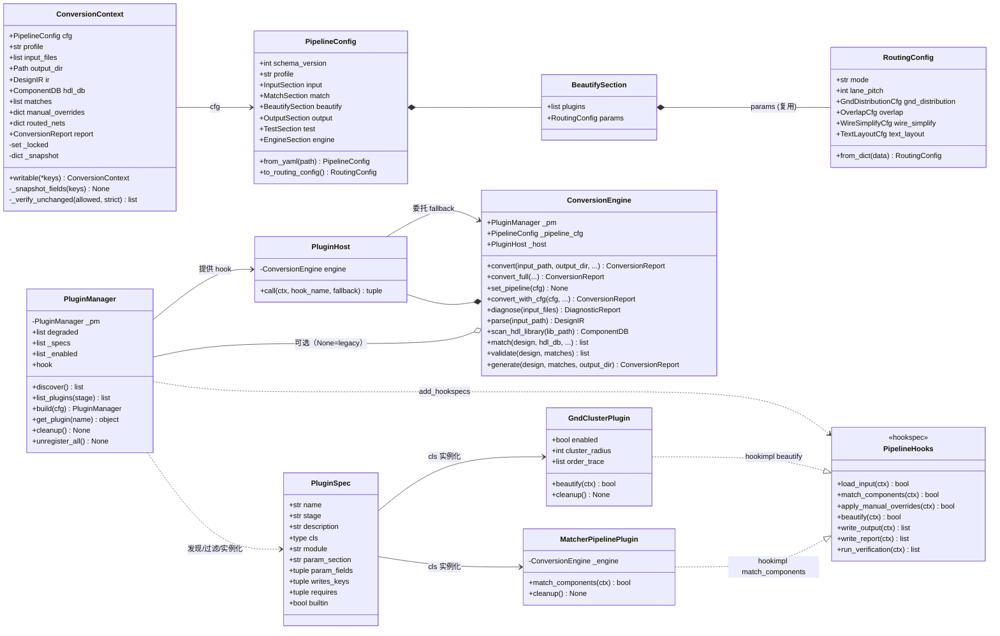
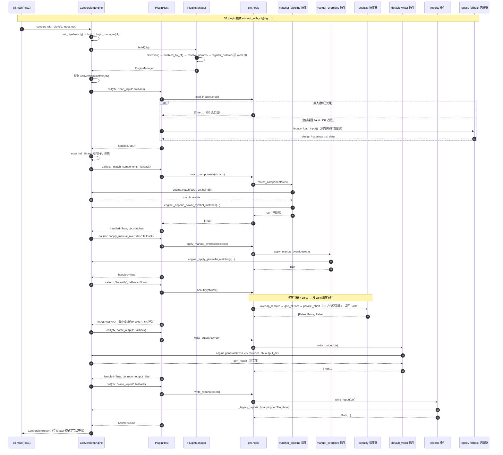
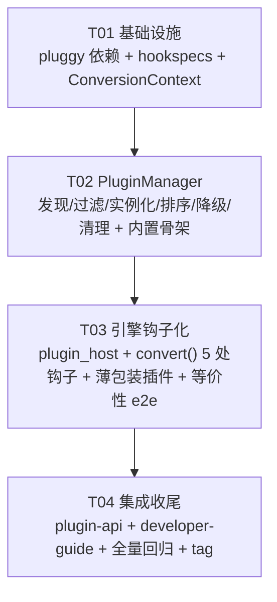

# S2 插件基座设计 — pluggy + hookspecs + PluginManager + ConversionContext + ConversionEngine 钩子化

> 作者：高见远（软件架构师）｜日期：2026-08-14｜基线：cis2hdl_plugin_ver（git b28cd27 / tag refactor-s0-baseline，929 passed）
> 上游依据：`docs/archive/temp files/phase23-plugin-architecture.md`（v2，§3.2/§3.3/§3.4/§3.5/§5 S2）
> 前置设计：`docs/S1-config-design.md`（§3 PipelineConfig / §3.2 BeautifySection.params 复用 RoutingConfig）
> 调研资料：`docs/archive/temp files/phase24-pluggy-research.md`
> 范围：**S2 插件基座**（设计文档，不改代码）；S3-S6 阶段插件化不在本文
> 铁律：**默认 profile 行为与 b28cd27 完全等价**（929 测试不回归，FR9）

---

## 0. 调研摘要（只读结论）

### 0.1 现有引擎/注册表结构 → 方案 §3.3 的映射

**ConversionEngine（cis2hdl/core/engine/conversion_engine.py，约 2500 行）**：

| 现有结构 | 位置 | 现状 | 对应方案 §3.3 hook |
|----------|------|------|--------------------|
| `convert()` 主流程 | L1535 | 单体内联 6 阶段 + 大量中段增强（catalog 重建 / PST 注入 / pin 注入） | 改造为 5 处钩子调用点（见 §4） |
| `diagnose()` / `_stage_diagnose` | L325/L782 | 诊断管线 | **非钩子**（§3.3 无对应），引擎内部保持 |
| `parse()` / `_stage_parse` | L343/L832 | ParserRegistry 按扩展名选解析器 | load_input（S3 拆分） |
| 内联 parse 增强块 | L1604-2043 | EDIF 优先、ComponentCatalog 重建、PST 加载、实例注入 | load_input（S3 拆分） |
| `scan_hdl_library()` / `_stage_scan` | L372/L864 | HDLLibScanner → ComponentDB（含 extra 库合并） | **非钩子**（§3.3 无对应），引擎内部保持 |
| `match()` / `_stage_match` | L421/L946 | MatcherPipeline.run_batch + catalog 优先 | match_components（S4 拆分） |
| `_apply_phase14_matching` | L1358 | D4 电源自动匹配 + D3 手动匹配 + export_unmatched | apply_manual_overrides |
| `_append_power_symbol_matches` | L1069 | 电源符号 MatchResult | match_components（S4） |
| `validate()` / `_stage_validate` | L473/L1192 | ValidatorRegistry.run_all_batch | **非钩子**（§3.3 无对应），引擎内部保持 |
| 内联 pin 注入块 | L2152-2297 | EDIF/PSTXNET/PSTCHIP 三源注入 | load_input（S3 拆分） |
| `generate()` / `_stage_generate` | L512/L1274 | OutputManager + con/xcon/csv/cpc/csa + .scr + 质量/HTML | write_output + write_report（S6 拆分） |
| 内联报告块 | L2330-2373 | MappingCSV / Top3 / 错误日志 | write_report（S6 拆分） |
| `convert_full()` | L2401 | 兼容别名 | 保持 |

**Registry 现状（全部类级全局注册，模块级 bootstrap 硬编码）**：
- `ParserRegistry`（core/parser/base.py L62）：`_parsers: dict[str, ParserBase]`，`register/unregister/get_for_file/get_by_format/list_formats/clear`。`_bootstrap_parsers()`（conversion_engine.py L239）模块导入时注册 EDIF/DSN/OLB。
- `WriterRegistry`（core/writer/base.py L77）：`_writers: dict[str, WriterBase]`，`register/get/list_writers`。`_bootstrap_writers()`（L247）注册 CPM/CDSLib/SCH/CSA/Xcon。
- `ValidatorRegistry`、`MatcherRegistry`（matcher/registry.py，`get_by_priority()` 按 MATCHER_PRIORITY 升序）同模式。

**结论**：现有"硬编码 import 全量注册 + convert() 单体内联"正是方案 §1.1 要消除的耦合点。S2 不拆逻辑，只加"钩子壳"；S3-S6 逐个把内联块迁入插件。

### 0.2 与 S1 PipelineConfig 的衔接

- `PipelineConfig.beautify.params` 类型为 **RoutingConfig**（S1 K1 决策）→ 美化插件参数源 = `cfg.beautify.params.<子节>`（如 `gnd_distribution`、`overlap`、`text_layout`、`wire_simplify`）。
- `input.plugins` / `match.plugins` / `beautify.plugins` / `output.files` / `output.reports` = 各阶段插件组合声明，S2 起由 `PluginManager` 消费（S1 阶段仅承载/查重）。
- S1 §5.5 `BUILTIN_PLUGIN_NAMES` 白名单在 S2 起替换为 `PluginManager.list_plugins()`（S1 已预留接口）。
- **S2 不改 S1 的 CLI/ProfileManager**：S1 CLI 仍走 `to_routing_config()` → 引擎 legacy 模式；plugin 模式经 `engine.set_pipeline(cfg)` / `convert_with_cfg()` 显式激活（S3+ CLI 才切）。

### 0.3 pluggy 调研要点（phase24-pluggy-research.md）

- hookspec/hookimpl 标记器 + PluginManager（add_hookspecs/register/hook 调用/签名校验/check_pending）。
- 签名校验：hookimpl 可少参数不可多参数；self 忽略；optionalhook/specname。
- tryfirst/trylast 控制首尾；firstresult 取首个非 None；wrapper 模式（yield 环绕）。
- **默认 LIFO 逆序执行** → 美化钩子链按 yaml 顺序的解决方案见 §3.3（关键决策 D1）。
- entry points（load_setuptools_entrypoints）vs 目录扫描：内置=目录扫描、外部=entry points（§3.1 决策 D6）。

---

# Part A：系统设计

## 1. 实现方法（技术选型）

**核心难点**：

1. **顺序控制**：pluggy 默认 LIFO 与"yaml 顺序执行"矛盾 → 逆序注册反转（决策 D1）。
2. **等价性**：convert() 单体内联块 → 钩子化后默认行为必须逐字节不变 → 双模式引擎 + legacy fallback（决策 D3）。
3. **上下文契约**：插件间共享状态去隐式全局 → ConversionContext + 只读守卫（决策 D4）。
4. **加载降级**：单个插件加载失败不阻塞整体（NFR3）→ try/except + warning + degraded 清单。

**技术选型**：
- `pluggy>=1.5`（pytest 同款，零传递依赖；环境 lock 已有 1.6.0，需从 dev 传递依赖提升为 runtime 显式依赖）。
- `dataclasses` / `importlib` / `pkgutil` / `importlib.metadata`（标准库）。
- 架构模式：**hook 管道 + 双模式引擎**——hookspec 定义契约，PluginManager 组装，ConversionEngine 编排调用；legacy 路径保留为 fallback。

## 2. 文件清单（S2 新增/修改，均在 cis2hdl_plugin_ver 内）

```
cis2hdl_plugin_ver/
├── requirements.txt                          # [修改] runtime 段加 pluggy>=1.5
├── pyproject.toml                            # [修改] dependencies 加 pluggy>=1.5
├── cis2hdl/
│   ├── plugins/                              # [新增] 插件基座包（S2）
│   │   ├── __init__.py                       # 导出 PROJECT_NAME / PipelineHooks / ConversionContext / build_plugin_manager
│   │   ├── hookspecs.py                      # PipelineHooks（7 个 hook，完整签名+docstring）
│   │   ├── context.py                        # ConversionContext + 只读守卫辅助（locked/writable 上下文管理器）
│   │   ├── spec.py                           # PluginSpec（名称/阶段/参数源/可写键/依赖）
│   │   ├── manager.py                        # PluginManager + build_plugin_manager + 扫描/过滤/实例化/排序/降级/清理
│   │   ├── discover.py                       # scan_builtin_plugins / load_entrypoint_plugins
│   │   ├── params.py                         # resolve_params（从 PipelineConfig 构造插件构造参数）
│   │   ├── ordering.py                       # register_ordered（逆序注册 + 顺序断言工具）
│   │   ├── input/                            # [新增] S3 实现；S2 提供占位 stub（返回 False 回退 legacy）
│   │   │   ├── __init__.py                   # 注册表：_SPECS = [...]
│   │   │   ├── edif.py  dsn.py  cross_ref.py  pstxnet.py  pstchip.py
│   │   ├── match/                            # [新增] S4 实现；S2 提供薄包装
│   │   │   ├── __init__.py
│   │   │   ├── matcher_pipeline.py           # 真委托 engine.match()（S2 即生效）
│   │   │   └── manual_overrides.py           # 真委托 engine._apply_phase14_matching()
│   │   ├── beautify/                         # [新增] S5 实现；S2 提供顺序占位（enabled 感知）
│   │   │   ├── __init__.py
│   │   │   ├── overlap_resolve.py  gnd_cluster.py  parallel_short.py
│   │   │   ├── wire_simplify.py  three_stage_stub.py  text_layout.py
│   │   ├── output/                           # [新增] S6 实现；S2 提供粗粒度薄包装
│   │   │   ├── __init__.py
│   │   │   ├── default_writer.py             # 真委托 engine.generate()（全文件）
│   │   │   └── reports.py                    # 真委托报告块（mapping/top3/log/html）
│   │   └── test/                             # [新增] S8 实现；S2 仅 __init__（白名单占位）
│   │       └── __init__.py                   # unit/e2e/qa_package 占位 spec（不注册 hookimpl）
│   ├── core/
│   │   └── engine/
│   │       ├── conversion_engine.py          # [修改] __init__ 接受 plugin_manager；convert() 增加 5 处钩子调用 + fallback
│   │       └── plugin_host.py                # [新增] PluginHost：_call_stage_hook(ctx, hook, fallback) 统一包装
└── tests/
    ├── unit/
    │   ├── test_hookspecs.py                 # [新增] 签名校验（非法 impl 被拒）、check_pending、7 hook 存在性
    │   ├── test_context.py                   # [新增] ctx 字段/只读守卫（strict 与 warn 两种模式）
    │   ├── test_plugin_manager.py            # [新增] 发现/过滤/实例化/降级/清理/list_plugins
    │   ├── test_plugin_order.py              # [新增] 逆序注册 → yaml 顺序执行断言
    │   └── test_params.py                    # [新增] resolve_params 各 stage 参数注入
    ├── plugins/
    │   └── test_builtin_stubs.py             # [新增] 内置 stub 加载/委托/占位行为
    ├── integration/
    │   └── test_engine_hooks.py              # [新增] convert() 钩子调用点触发/fallback 行为
    └── e2e/
        └── test_plugin_mode_equivalence.py   # [新增] legacy vs plugin 模式逐文件字节级 diff
```

> 说明：`cis2hdl/plugins/` 放**包内**（而非方案 §1.4 树形图里的根级 `plugins/`），与方案 §3.3/§3.4/§3.5 的代码示例一致（`cis2hdl/plugins/hookspecs.py`），保证 import 路径与打包正常（偏差记录见 §9 B1）。

## 3. 关键设计决策

### 3.1 插件发现与注册（决策 D6：内置=目录扫描，外部=entry points）

**内置插件（同仓库，开发零安装）**：
- 目录约定：`cis2hdl/plugins/<stage>/*.py`，**模块名 = 插件名**（与 S1 白名单一致：`gnd_distribution` 节 ≠ 插件名 `gnd_cluster`，注意区分）。
- 每个模块声明 `PLUGIN: PluginSpec` 类变量（或 `plugin_cls: type`），`__init__.py` 汇总 `_SPECS`。
- 扫描实现：`pkgutil.iter_modules(cis2hdl.plugins.<stage>.__path__)`，跳过 `__init__` 与 `_` 前缀模块；逐个 `importlib.import_module`，读取 `PLUGIN`；失败 → warning + 记入 degraded（NFR3）。

**外部插件（pip 安装）**：
- entry points group：`cis2hdl.plugins`，格式 `name = module.path:PLUGIN`。
- `importlib.metadata.entry_points(group="cis2hdl.plugins")` 加载；缺 entry points 包 → 空列表，不报错。
- 外部插件先注册（LIFO 下后执行），内置插件后注册逆序（LIFO 下按 yaml 顺序执行）——保证"外部扩展追加在默认链之后"（§3.3）。

**取舍理由**：内置插件与源码同仓库演进、可直接被 tests/plugins 引用、无需构建分发；外部插件用 entry points 是 pip 生态标准、避免路径 hack。二者统一产出 `PluginSpec`，后续 S3-S6 无感知。

### 3.2 PluginSpec 与插件实例化（决策 D5：参数注入）

```python
# cis2hdl/plugins/spec.py
from dataclasses import dataclass, field

STAGES = ("input", "match", "beautify", "output", "test")

@dataclass(frozen=True)
class PluginSpec:
    name: str                       # 插件名（= 模块名；beautify: "gnd_cluster"）
    stage: str                      # input | match | beautify | output | test
    description: str = ""
    cls: type | None = None         # 插件类（可实例化；None = 占位/未实现）
    module: str = ""                # import path（诊断用）
    param_section: str = ""         # 参数子节名（beautify: "gnd_distribution"；"" = 顶层）
    param_fields: tuple[str, ...] = ()   # 提取并作为构造 kwargs 的字段
    writes_keys: tuple[str, ...] = ()    # 声明的 ctx 可写字段（只读守卫）
    requires: tuple[str, ...] = ()      # 依赖的阶段产物（方案 §1.3；S2 仅声明不强制）
    builtin: bool = True            # 内置（目录扫描）还是外部（entry points）

# 插件模块约定（每个 plugins/<stage>/<name>.py）：
# PLUGIN = PluginSpec(name="gnd_cluster", stage="beautify", cls=GndClusterPlugin,
#                     param_section="gnd_distribution",
#                     param_fields=("enabled", "cluster_radius"),
#                     writes_keys=("routed_nets",))
```

**实例化（cis2hdl/plugins/params.py）**：

```python
def resolve_params(cfg: PipelineConfig, spec: PluginSpec) -> dict:
    """从 PipelineConfig 提取插件构造参数。
    - beautify: base = cfg.beautify.params（RoutingConfig）
    - input:    base = cfg.input
    - match:    base = cfg.match
    - output:   base = cfg.output
    - test:     base = cfg.test
    - spec.param_section 非空 → base = getattr(base, param_section)
    - spec.param_fields → {f: getattr(base, f) for f in param_fields if hasattr(base, f)}
    - 其余 → {}（插件无参构造，运行时自读 ctx.cfg）
    """
```

示例（对齐 S1 §3.2）：
- `gnd_cluster` → `resolve_params` 返回 `{"enabled": False, "cluster_radius": 2000, ...}`（GndDistributionCfg 字段）。
- `parallel_short` → 同 `gnd_distribution` 节，但 `param_fields=("parallel_short", "parallel_short_dist")`。
- `overlap_resolve` → `param_section="overlap"`，字段 `check/resolve/avoid_margin/...`。
- `three_stage_stub` → `param_section=""`（顶层 RoutingConfig），`param_fields=("three_stage_stub",)`。

### 3.3 顺序控制方案（决策 D1：单 hook + 逆序注册 + LIFO 反转）★关键决策

**问题**：pluggy 默认 LIFO（后注册先执行）；美化钩子链必须按 `yaml beautify.plugins` 顺序执行。

**方案对比**：

| 方案 | 做法 | 结论 |
|------|------|------|
| A. tryfirst/trylast | 仅能置首/置尾，无法表达任意全序 | ❌ 不满足 |
| B. 多 hook（每插件一个 hookspec） | 每插件独立 hook 名，engine 显式按序调用 | ❌ hook 数随插件增长，违背"一条主线" |
| C. 单 hook + 逆序注册 | 按 stage 分组后 **reversed(yaml顺序)** 注册；LIFO 执行 = yaml 顺序 | ✅ **采纳** |
| D. orchestrator 插件 | 一个协调插件持插件列表按序直接调方法 | 可用但绕过 pluggy 机制、调试成本高 | 

**采纳方案 C 的完整规则**：
1. 有序 hook（`load_input` / `match_components` / `beautify`）的 hookimpl **全部**用默认 `@hookimpl`（tryfirst/trylast 均 False）——同一 tier 内 LIFO 才成立。
2. `register_ordered(pm, enabled_specs, cfg)`：
   - 先注册外部插件（entry points，任意顺序）→ LIFO 下最后执行；
   - 再按 stage 分组内置插件，每组 **reversed(yaml 顺序)** 注册。
3. 未在 cfg 列表中的插件 **不注册**（过滤即"禁用"），避免"注册了但没启用"的歧义。
4. 顺序断言工具：`ordering.assert_order(pm, stage, expected_names)`——读 `pm.hook.beautify._nonwrappers` 按执行序比对（仅测试用）。
5. 单测 `test_plugin_order.py`：注册 [a,b,c] 断言执行序 [a,b,c]；含 trylast 插件时行为与规则一致（S2 不依赖 trylast）。

**match 链的附加说明**：S4 拆分 exact/fuzzy/passive/fallback 时沿用同一机制（yaml match.plugins 顺序 = 优先级顺序）；S2 阶段 match 只有一个 `matcher_pipeline` 薄包装，顺序规则先被 beautify 链验证。

### 3.4 ConversionContext 与只读守卫（决策 D4）

```python
# cis2hdl/plugins/context.py
from __future__ import annotations
from dataclasses import dataclass, field
from pathlib import Path
from typing import Any

from ..core.config import RoutingConfig          # TYPE_CHECKING 仅类型
from ..core.engine.conversion_engine import ConversionReport
from ..core.ir.design import DesignIR
from ..core.ir.match import MatchResult
from ..core.db.component_db import ComponentDB
from ..core.pipeline_config import PipelineConfig

@dataclass
class ConversionContext:
    """插件间唯一通信通道（仿 Cordis ctx.*；方案 §3.2 落实）。

    只读守卫：字段级保护。插件声明 writes_keys（PluginSpec），manager 在
    调用前后快照非声明字段；被改动 → warning（strict_ctx=True 时 raise）。
    **仅保护字段赋值，不保护可变对象内部原地修改**（如 report.warnings
    append 合法——这是有意的，报告聚合需要）。
    """
    cfg: PipelineConfig                 # S1 PipelineConfig（beautify.params 复用 RoutingConfig）
    profile: str = "default"            # 当前 profile 名
    input_files: list[Path] = field(default_factory=list)
    output_dir: Path | None = None      # engine.output_dir（S1 engine 节）
    ir: DesignIR | None = None          # Stage2 产物（load_input 写入）
    hdl_db: ComponentDB | None = None   # Stage3 产物（scan，引擎内部写）
    matches: list[MatchResult] = field(default_factory=list)   # Stage4 产物
    manual_overrides: dict[str, Any] = field(default_factory=dict)  # FR3
    routed_nets: dict[str, Any] | None = None   # 美化阶段共享（S5）
    report: ConversionReport = field(default_factory=ConversionReport)  # 报告聚合（方案 §3.2 用 AestheticReport，此处用引擎的 ConversionReport 超集）

    # ── 只读守卫内部状态 ─────────────────────────────
    _locked: set[str] = field(default_factory=set, repr=False, compare=False)
    _snapshot: dict[str, Any] = field(default_factory=dict, repr=False, compare=False)

    def writable(self, *keys: str) -> "ConversionContext":
        """上下文管理器：临时声明可写字段（插件内部细粒度控制）。
        with ctx.writable("ir"):  ... 写 ctx.ir ..."""
        ...

    def _snapshot_fields(self, keys: set[str]) -> None: ...
    def _verify_unchanged(self, allowed: set[str], strict: bool) -> list[str]:
        """返回被非法改动的字段名；strict 时 raise ReadOnlyViolation。"""
        ...
```

**守卫执行点**：`PluginHost._call_stage_hook` 在调用每个插件前：
```
snapshot = {k: getattr(ctx, k) for k in ctx_fields - spec.writes_keys}
try: plugin 方法(ctx)
finally: ctx._verify_unchanged(allowed=spec.writes_keys, strict=pm.strict_ctx)
```

### 3.5 PluginManager 完整设计

```python
# cis2hdl/plugins/manager.py
from pluggy import PluginManager as _Pm, HookimplMarker, HookspecMarker

PROJECT_NAME = "cis2hdl"
hookspec = HookspecMarker(PROJECT_NAME)
hookimpl = HookimplMarker(PROJECT_NAME)

class PluginManager:
    """插件生命周期管理：发现 → 过滤 → 实例化 → 校验 → 排序 → 执行 → 清理。"""

    def __init__(self, *, plugins_dir: Path | None = None,
                 strict_ctx: bool = False) -> None:
        self._pm = _Pm(PROJECT_NAME)
        self._pm.add_hookspecs(PipelineHooks)
        self._plugins_dir = plugins_dir or _default_plugins_dir()
        self.strict_ctx = strict_ctx
        self.degraded: list[tuple[str, str]] = []   # [(插件名, 错误信息)]（NFR3）
        self._specs: list[PluginSpec] = []
        self._enabled: list[PluginSpec] = []

    # ── 发现 ────────────────────────────────────────
    def discover(self) -> list[PluginSpec]:
        """scan_builtin_plugins(plugins_dir) + load_entrypoint_plugins()，去重。"""
    def list_plugins(self, stage: str | None = None) -> list[PluginSpec]:
        """已发现（全部）插件；S1 ProfileManager 白名单替换入口。"""

    # ── 组装（build_plugin_manager 核心） ─────────────
    def build(self, cfg: PipelineConfig) -> "PluginManager":
        """完整流程：
        ① discover() 全部 spec
        ② enabled_by_cfg：spec.name ∈ cfg.<stage>.plugins（beautify/output 用
           plugins/files/reports 合并语义，见下）
        ③ instantiate：resolve_params + cls(**params)；失败 → degraded + skip
        ④ register_ordered：外部先、内置逆 yaml 序注册
        ⑤ check_pending() 校验；失败插件 degraded + 继续
        ⑥ 返回 self"""
    @property
    def hook(self): return self._pm.hook
    def get_plugin(self, name: str): return self._pm.get_plugin(name)

    # ── 卸载/清理（Cordis unload 理念） ───────────────
    def cleanup(self) -> None:
        """逆注册顺序调用各插件 cleanup()（存在时），再 unregister 全部；
        幂等；失败仅 warning。"""
    def unregister_all(self) -> None: ...

# 模块级便捷入口
def build_plugin_manager(cfg: PipelineConfig, *, plugins_dir=None,
                         strict_ctx: bool = False) -> PluginManager:
    """主入口（方案 §3.5 同名函数）：PluginManager().build(cfg)。"""
```

**enabled_by_cfg 的 stage 语义**（对齐 S1 §3.2）：
- input：`spec.name ∈ cfg.input.plugins`
- match：`spec.name ∈ cfg.match.plugins`
- beautify：`spec.name ∈ cfg.beautify.plugins`
- output：S6 拆分后 `spec.name ∈ cfg.output.files + cfg.output.reports`；S2 的粗粒度 `default_writer`/`reports` 恒注册（默认 profile 必需）
- test：`spec.name ∈ cfg.test.suites`

**加载失败降级（NFR3）**：每个插件 导入/实例化/注册 各自 try/except；失败 → `logger.warning` + `self.degraded.append((name, str(exc)))` + skip；`build()` 结束若 degraded 非空打印汇总 warning。**绝不因单插件失败中断整体**。

### 3.6 PipelineHooks 完整定义

```python
# cis2hdl/plugins/hookspecs.py
from pluggy import HookspecMarker
hookspec = HookspecMarker("cis2hdl")

class PipelineHooks:
    """CIS2HDL 插件契约（方案 §3.3 落实，7 hook）。

    约定：
    - 所有 hook 均 firstresult=False（多插件链式协作，每个都要执行）。
    - 返回值语义：load_input/match_components/apply_manual_overrides/beautify
      返回 bool|None（True=已处理，None/False=未处理→引擎 legacy fallback）；
      write_output/write_report 返回 list[Path]|None（写出的文件路径）；
      run_verification 返回 list[str]（验证结果）。
    - 有序 hook（load_input/match_components/beautify）由 manager 逆序注册
      保证 yaml 顺序执行（见 §3.3）。
    - 插件通过 ctx 读写数据；写哪些字段由 PluginSpec.writes_keys 声明。
    """

    # ── FR1 输入解析 ──────────────────────────────────
    @hookspec(firstresult=False)
    def load_input(self, ctx: ConversionContext) -> bool | None:
        """载入并解析一种输入格式/数据源（EDIF/DSN/CrossRef/pstxnet/pstchip）。

        S2 语义：返回 True 表示该插件完成了输入装载；全部返回 False/None
        时引擎回退 legacy 内联解析块。S3 逐个替换为真实现。"""

    # ── FR2/FR3 元件匹配 ──────────────────────────────
    @hookspec(firstresult=False)
    def match_components(self, ctx: ConversionContext) -> bool | None:
        """对 ctx.ir 做元件匹配（S4 拆分 exact/fuzzy/passive/fallback）。

        S2 语义：默认 matcher_pipeline 薄包装真委托 engine.match()，
        返回 True。"""

    @hookspec(firstresult=False)
    def apply_manual_overrides(self, ctx: ConversionContext) -> bool | None:
        """应用手动匹配/强制 mock（chip_config 插件化，FR3）。

        S2 语义：默认 manual_overrides 薄包装真委托
        engine._apply_phase14_matching()，返回 True。"""

    # ── FR4 布线美化（每美化功能一个插件）──────────────
    @hookspec(firstresult=False)
    def beautify(self, ctx: ConversionContext) -> bool | None:
        """美化钩子链：overlap_resolve/gnd_cluster/parallel_short/
        three_stage_stub/wire_simplify/text_layout，按 yaml 顺序执行。

        S2 语义：占位插件仅记录顺序并检查 enabled（params 注入），
        返回 False（现有美化逻辑仍在 writer 内部，S5 迁入）。"""

    # ── FR5 输出 ──────────────────────────────────────
    @hookspec(firstresult=False)
    def write_output(self, ctx: ConversionContext) -> list[Path] | None:
        """写一种输出文件（S6 拆分 csa/con/xcon/csv/cpc/cpm/cds_lib）。

        S2 语义：默认 default_writer 薄包装真委托 engine.generate()
        （一次写全部文件），返回路径列表。"""

    @hookspec(firstresult=False)
    def write_report(self, ctx: ConversionContext) -> list[Path] | None:
        """写一种报告（aesthetic/ioport/mapping/error…）。

        S2 语义：默认 reports 薄包装真委托报告块（mapping csv/top3/
        错误日志/html），返回路径列表。"""

    # ── FR6 测试（不在 convert() 内调用；S8 接入）──────
    @hookspec(firstresult=False)
    def run_verification(self, ctx: ConversionContext) -> list[str] | None:
        """执行一类验证/测试（unit/e2e/qa-package）。S2 仅定义。"""
```

## 4. ConversionEngine 钩子化改造方案

### 4.1 双模式引擎（决策 D3：等价性保障）

```python
# cis2hdl/core/engine/conversion_engine.py（修改点）
class ConversionEngine:
    def __init__(self, plugin_manager: PluginManager | None = None,
                 pipeline_cfg: PipelineConfig | None = None):
        # ...现有初始化不变...
        self._pm = plugin_manager          # None = legacy 模式（默认，929 等价）
        self._pipeline_cfg = pipeline_cfg  # 供 build_plugin_manager 惰性构造
        self._host = PluginHost(self)      # 钩子调用器（plugin_host.py）

    def set_pipeline(self, cfg: PipelineConfig) -> None:
        """显式激活 plugin 模式：self._pm = build_plugin_manager(cfg)。"""
    def convert_with_cfg(self, cfg: PipelineConfig, input_path, output_dir, **kw):
        """plugin 模式便捷入口（S3+ CLI 使用）。"""
```

**核心：`PluginHost._call_stage_hook(ctx, hook_name, fallback)`**

```python
# cis2hdl/core/engine/plugin_host.py
class PluginHost:
    def __init__(self, engine: "ConversionEngine") -> None:
        self.engine = engine

    def call(self, ctx: ConversionContext, hook_name: str, fallback: Callable):
        """统一钩子调用：hook 链无人处理 → 执行 legacy fallback。
        返回 (handled: bool, result: Any)。"""
        pm = self.engine._pm
        if pm is None:
            return False, fallback()          # legacy 模式
        try:
            results = getattr(pm.hook, hook_name)(ctx=ctx)
        except Exception as exc:
            logger.warning("hook %s failed: %s — fallback to legacy", hook_name, exc)
            return False, fallback()
        handled = _any_truthy(results)
        if handled:
            return True, results
        return False, fallback()
```

### 4.2 convert() 钩子调用点（哪些保持、哪些改钩子）

| # | 阶段 | 现状方法 | S2 处理 | 钩子调用点 |
|---|------|---------|---------|-----------|
| 1 | Diagnose | `diagnose()`/`_stage_diagnose` | **保持**（§3.3 无对应 hook；引擎内部） | — |
| 2 | Parse+增强 | `parse()` + convert() L1604-2043 内联块 | **改钩子**：`pm.hook.load_input(ctx)`；无处理 → legacy 内联块 | convert() Stage2 前 |
| 3 | Scan | `scan_hdl_library()`/`_stage_scan` | **保持**（§3.3 无对应 hook） | — |
| 4 | Match | `match()`/`_stage_match` + `_append_power_symbol_matches` | **改钩子**：`pm.hook.match_components(ctx)`；无处理 → legacy `_stage_match` | convert() Stage4 处 |
| 4.5 | Manual/PowerIC | `_apply_phase14_matching` | **改钩子**：`pm.hook.apply_manual_overrides(ctx)`；无处理 → legacy 调用 | 原调用点（L2301） |
| 5 | Validate | `validate()`/`_stage_validate` | **保持**（§3.3 无对应 hook） | — |
| 5.5 | Pin 注入 | convert() L2152-2297 内联块 | **保持**（含在 load_input legacy 块；S3 迁入 load_input 插件） | — |
| 6a | Generate 文件 | `generate()`/`_stage_generate` | **改钩子**：`pm.hook.write_output(ctx)`；无处理 → legacy `_stage_generate` | convert() Stage6 处 |
| 6b | 报告 | convert() L2330-2373 内联 | **改钩子**：`pm.hook.write_report(ctx)`；无处理 → legacy 报告块 | Stage6 后 |
| — | 测试 | — | `run_verification` 仅定义（S8 接入，不进 convert()） | — |

**S2 实际改动形态**（convert() 内部 5 处插入，其余代码保持）：

```python
# convert() 示意（详细行号以工程师实现为准）
ctx = ConversionContext(cfg=self._pipeline_cfg or PipelineConfig(),
                        profile=..., input_files=[input_path],
                        output_dir=output_dir)
# 1) Stage 1 诊断保持；Stage 2 parse 钩子化
design = None
handled, _ = self._host.call(ctx, "load_input", fallback=lambda: self._legacy_load_input(...))
if not handled:
    design = ...   # legacy 内联块（原 L1604-2043）
# 2) scan/validate 保持；match 钩子化
handled, _ = self._host.call(ctx, "match_components", fallback=lambda: self._stage_match(...))
# 3) manual 钩子化
self._host.call(ctx, "apply_manual_overrides", fallback=lambda: self._apply_phase14_matching(...))
# 4) beautify 钩子化（S2 占位；S5 填实）
self._host.call(ctx, "beautify", fallback=lambda: None)
# 5) generate 文件 + 报告钩子化
handled, _ = self._host.call(ctx, "write_output", fallback=lambda: self._stage_generate(...))
self._host.call(ctx, "write_report", fallback=lambda: self._legacy_reports(...))
```

**等价性三重保障**：
1. `ConversionEngine()` 默认 `_pm=None` → legacy 模式，convert() 行为与 b28cd27 逐字节一致（929 测试不回归）。
2. plugin 模式下每个 hook 都有 legacy fallback：内置 stub 返回 False 时走原逻辑。
3. e2e 断言：同一输入分别 legacy / plugin 模式 → 输出目录逐文件字节级 diff 为空。

**兼容策略（929 测试引用内部 API）**：
- `convert/convert_full/diagnose/parse/scan_hdl_library/match/validate/generate` 全部保留原签名（薄包装插件正是委托它们）。
- `ParserRegistry/WriterRegistry/ValidatorRegistry/MatcherRegistry` 与 `_bootstrap_all()` 不动（S3-S6 才逐步让插件接管，Registry 保留为兼容层）。
- 新增 API 全部为**增量**（`set_pipeline/convert_with_cfg/PluginManager`），不删不改旧入口。

### 4.3 内置插件薄包装示例（决策 D2）

```python
# cis2hdl/plugins/beautify/gnd_cluster.py（S2 占位；S5 真实现）
from pluggy import HookimplMarker
from cis2hdl.plugins.hookspecs import hookimpl, ConversionContext
from cis2hdl.plugins.spec import PluginSpec

class GndClusterPlugin:
    """GND 聚类（Phase XVII R3 迁移）。S2 占位：enabled 感知 + 顺序记录。
    S5 真实现 = gnd_cluster_planner 模块薄包装：
        ctx.routed_nets = plan_cluster(ctx.routed_nets, params.cluster_radius)"""

    def __init__(self, enabled: bool = False, cluster_radius: int = 2000, **kw):
        self.enabled = enabled
        self.cluster_radius = cluster_radius
        self.order_trace: list[str] = []

    @hookimpl
    def beautify(self, ctx: ConversionContext) -> bool | None:
        self.order_trace.append("gnd_cluster")
        if not self.enabled:
            return False
        return False   # S2 占位：不迁移逻辑；S5 改为 True + 真实调用

    def cleanup(self) -> None:
        self.enabled = False

PLUGIN = PluginSpec(name="gnd_cluster", stage="beautify",
                    cls=GndClusterPlugin, module=__name__,
                    param_section="gnd_distribution",
                    param_fields=("enabled", "cluster_radius"),
                    writes_keys=("routed_nets",),
                    requires=("ir", "matches"))
```

```python
# cis2hdl/plugins/match/matcher_pipeline.py（S2 即真委托，证明薄包装模式）
class MatcherPipelinePlugin:
    """现有 MatcherPipeline 的插件壳：委托 engine.match()，行为不变。
    S4 拆分 exact/fuzzy/passive/fallback 前是 match 阶段唯一内置插件。"""
    def __init__(self, engine: "ConversionEngine") -> None:
        self._engine = engine
    @hookimpl
    def match_components(self, ctx: ConversionContext) -> bool | None:
        if ctx.ir is None or ctx.hdl_db is None:
            return False
        ctx.matches = self._engine.match(ctx.ir, ctx.hdl_db)
        self._engine._append_power_symbol_matches(ctx.ir, ctx.matches)
        return True
    def cleanup(self) -> None: ...

PLUGIN = PluginSpec(name="matcher_pipeline", stage="match",
                    cls=MatcherPipelinePlugin, module=__name__,
                    writes_keys=("matches",))
```

> 注：`matcher_pipeline` 插件需要 engine 引用——S2 由 `PluginHost` 在 plugin 模式时把 `self.engine` 注入构造参数（`resolve_params` 支持 `engine` 特殊键；或插件从 `ctx` 反向无法取 engine，故采用注入）。实现细节：`resolve_params(cfg, spec, engine=None)`，若 `spec.name == "matcher_pipeline"` 或 `spec.cls` 构造签名含 `engine`，则传入 `engine`。此规则写入 Shared Knowledge。

## 5. 数据类图（classDiagram）

完整副本另存 `docs/class-diagram.mermaid`，此处内联：



## 6. 程序调用时序图（sequenceDiagram）

完整副本另存 `docs/sequence-diagram.mermaid`，此处内联（plugin 模式转换主链路）：



## 7. Anything UNCLEAR（假设与待确认）

1. **plugins/ 目录位置**：本设计放 `cis2hdl/plugins/`（包内，importable）；方案 §1.4 树形图根级 `plugins/` 有出入（§9 B1）。需主理人确认包内方案。
2. **S2 内置插件实现深度**：input/beautify 插件 S2 阶段为"占位返回 False"，match/output 为"真委托"。若主理人希望 S2 就把 input/beautify 也真迁移（即提前做 S3/S5 部分工作），等价性验证成本更高，需单独确认。
3. **ConversionContext.report 类型**：方案 §3.2 写 AestheticReport，本设计用引擎现成的 ConversionReport（超集）。确认接受。
4. **entry points group 名**：`cis2hdl.plugins`（与 PROJECT_NAME 区分）。第三方插件命名约定待 S8.5 文档统一。
5. **只读守卫严格度**：默认 warn（strict_ctx=False）；是否在 S2 就全量 strict（CI 门禁）待确认（推荐 S3+ 引入插件真实现后再开 strict）。
6. **`enabled_by_cfg` 对 output 的语义**：S2 粗粒度 default_writer/reports 恒注册，与 S6 按 files/reports 精确过滤不同。确认 S2 阶段接受粗粒度（S6 细化）。
7. **convert_with_cfg 是否进入 S1 CLI**：S1 CLI 仍走 legacy（零风险）；plugin 模式 CLI 切换建议 S3 或 S4 完成，需主理人拍板节奏。

---

# Part B：任务分解（S2 实施）

## 8. 依赖包

```
# 新增 runtime 依赖（S2）
- pluggy>=1.5      # hook 框架；环境 lock 已有 1.6.0（pytest 传递依赖），提升为显式 runtime 依赖
- 标准库: dataclasses / importlib / importlib.metadata / pkgutil / pathlib / logging / copy
```

## 9. 任务列表（4 个，按依赖排序；每任务 ≥3 文件）

### T01 — S2 项目基础设施：pluggy 依赖 + PipelineHooks + ConversionContext（P0）

- **Source Files**：
  - `cis2hdl_plugin_ver/requirements.txt`（[修改] runtime 段加 `pluggy>=1.5`）
  - `cis2hdl_plugin_ver/pyproject.toml`（[修改] dependencies 加 `pluggy>=1.5`）
  - `cis2hdl/plugins/__init__.py`（[新增] 导出 PROJECT_NAME/PipelineHooks/ConversionContext/build_plugin_manager）
  - `cis2hdl/plugins/hookspecs.py`（[新增] §3.6 完整 7 hook）
  - `cis2hdl/plugins/context.py`（[新增] §3.4 ConversionContext + writable/快照/校验）
  - `tests/unit/test_hookspecs.py`（[新增]）
  - `tests/unit/test_context.py`（[新增]）
- **Dependencies**：无（依赖 S0 目录 + S1 设计文档已就绪）
- **内容**：
  1. 依赖声明（requirements + pyproject）
  2. PipelineHooks 7 hook（签名/docstring/firstresult=False）
  3. ConversionContext dataclass + 只读守卫（snapshot/verify/writable 上下文管理器 + ReadOnlyViolation）
- **验证方式**：`pytest tests/unit/test_hookspecs.py tests/unit/test_context.py`
- **验收标准**：
  1. 非法 hookimpl（多参数/未知 hook）注册被 pluggy 拒绝（签名校验生效）
  2. 7 个 hook 均可被 hookimpl 匹配；`check_pending()` 对合法插件通过
  3. ctx 守卫：writes_keys 之外字段被改 → warn（strict 时 raise）；writable() 临时声明生效
  4. `pip check` 通过（pluggy 显式声明无冲突）

### T02 — PluginManager：发现/过滤/实例化/排序/降级/清理 + 内置插件骨架（P0）

- **Source Files**：
  - `cis2hdl/plugins/spec.py`（[新增] PluginSpec）
  - `cis2hdl/plugins/discover.py`（[新增] scan_builtin_plugins / load_entrypoint_plugins）
  - `cis2hdl/plugins/params.py`（[新增] resolve_params）
  - `cis2hdl/plugins/ordering.py`（[新增] register_ordered / assert_order）
  - `cis2hdl/plugins/manager.py`（[新增] PluginManager + build_plugin_manager）
  - `cis2hdl/plugins/input/__init__.py` + `edif.py dsn.py cross_ref.py pstxnet.py pstchip.py`（[新增] 占位 stub）
  - `cis2hdl/plugins/beautify/__init__.py` + `overlap_resolve.py gnd_cluster.py parallel_short.py wire_simplify.py three_stage_stub.py text_layout.py`（[新增] 顺序占位）
  - `cis2hdl/plugins/output/__init__.py`（[新增] 白名单 spec；default_writer/reports 在 T03）
  - `cis2hdl/plugins/test/__init__.py`（[新增] 白名单 spec）
  - `tests/unit/test_plugin_manager.py`、`tests/unit/test_plugin_order.py`、`tests/unit/test_params.py`（[新增]）
- **Dependencies**：T01
- **内容**：
  1. PluginSpec + 目录扫描（模块名=插件名，PLUGIN 类变量，跳过 _ 前缀）
  2. enabled_by_cfg 过滤（input/match/beautify/output/test 五阶段语义）
  3. resolve_params 参数注入（beautify→cfg.beautify.params.<子节> 等）
  4. register_ordered（外部先、内置逆 yaml 序；LIFO 反转）
  5. 降级（try/except → degraded 清单 + warning，NFR3）+ cleanup/unregister_all
  6. 内置插件骨架（input/beautify 占位、output/test 白名单 spec）
- **验证方式**：`pytest tests/unit/test_plugin_manager.py tests/unit/test_plugin_order.py tests/unit/test_params.py`
- **验收标准**：
  1. `build_plugin_manager(PipelineConfig())` 成功；`list_plugins()` 返回全量（含 S1 白名单同名）
  2. 顺序断言：beautify 链按 yaml 顺序执行（[overlap_resolve, gnd_cluster, parallel_short]）
  3. 破坏性测试：造一个 import 失败的插件 → 被 skip + degraded 记录，其余插件正常注册
  4. resolve_params：gnd_cluster 从 params.gnd_distribution 提取 enabled/cluster_radius
  5. cleanup() 幂等：重复调用无异常；cleanup 后 pm.hook.beautify 无残留

### T03 — ConversionEngine 钩子化改造 + 默认等价性保障（P0）

- **Source Files**：
  - `cis2hdl/core/engine/plugin_host.py`（[新增] PluginHost._call_stage_hook）
  - `cis2hdl/core/engine/conversion_engine.py`（[修改] __init__ 接受 pm/pipeline_cfg；convert() 5 处钩子调用 + legacy fallback；新增 set_pipeline/convert_with_cfg；新增 `_legacy_load_input`/`_legacy_reports` 封装现有内联块）
  - `cis2hdl/plugins/match/__init__.py` + `matcher_pipeline.py` + `manual_overrides.py`（[新增] 真委托薄包装）
  - `cis2hdl/plugins/output/default_writer.py` + `reports.py`（[新增] 真委托）
  - `tests/plugins/test_builtin_stubs.py`（[新增]）
  - `tests/integration/test_engine_hooks.py`（[新增]）
  - `tests/e2e/test_plugin_mode_equivalence.py`（[新增]）
- **Dependencies**：T02
- **内容**：
  1. PluginHost 统一钩子调用（hook 链无处理 → legacy fallback）
  2. convert() 5 处钩子调用点（load_input / match_components / apply_manual_overrides / beautify / write_output+write_report）
  3. 薄包装插件：matcher_pipeline/manual_overrides 委托 engine 方法；default_writer/reports 委托 generate/报告块
  4. legacy 封装：把 convert() 现有内联 parse 增强块与报告块包成 `_legacy_load_input`/`_legacy_reports`（纯代码搬移，不改逻辑）
- **验证方式**：`pytest tests/plugins tests/integration tests/e2e/test_plugin_mode_equivalence.py` + 全量回归
- **验收标准**：
  1. legacy 模式（默认 `ConversionEngine()`）929 全量测试不回归
  2. plugin 模式等价性 e2e：同一输入 legacy vs plugin 输出目录逐文件字节级 diff 为空（默认 profile）
  3. 钩子触发断言：plugin 模式跑一次转换，mock hook 记录 5 个调用点全部触发
  4. 薄包装插件行为与直接调用 engine.match() 等价（match 结果一致）

### T04 — 集成收尾：插件 API 文档 + developer-guide + 全量回归（P0）

- **Source Files**：
  - `docs/plugin-api.md`（[新增] 插件接口文档：hookspec 契约/PluginSpec/顺序规则/ctx 守卫/示例，NFR7 交付物表）
  - `docs/developer-guide.md`（[新增] S2 章节：插件目录约定/如何写插件/如何调试顺序）
  - `docs/REFACTORING_BACKLOG.md`（[修改] 登记 S2 遗留：input/beautify 占位 → S3/S5 替换、output 粗粒度 → S6 细化）
  - `tests/e2e/test_default_profile_equivalence.py`（[修改] 扩展：默认 profile plugin 模式与 b28cd27 输出 diff）
  - `cis2hdl/plugins/__init__.py`（[修改] 完善公开 API 导出与 `__all__`）
- **Dependencies**：T03
- **内容**：
  1. plugin-api.md（S2 范围完整契约 + 顺序规则图解 + 只读守卫说明）
  2. developer-guide.md S2 章节（内置插件骨架清单 + 薄包装模式示例）
  3. 等价性 e2e 扩展（默认 profile 全插件组合）
  4. 全量回归 929 + 新增单测
- **验证方式**：`pytest`（全量）+ 文档评审
- **验收标准**：
  1. 全量 `pytest` ≥929 passed（含新增 ~30） / 0 failed
  2. plugin-api.md 可独立指导第三方插件开发（含完整示例代码）
  3. developer-guide S2 章节评审通过（NFR7）
  4. git tag `refactor-s2-base` 打上

## 10. 共享知识（跨任务约定）

- **PROJECT_NAME**：`"cis2hdl"`；hookspec/hookimpl/PluginManager 三者必须一致（pluggy 校验）。
- **有序 hook**：`load_input`/`match_components`/`beautify` 的 hookimpl **禁止** tryfirst/trylast；顺序由 manager 逆序注册保证（yaml 顺序 = 执行顺序）。
- **返回语义**：阶段 hook 返回 `bool|None`（True=处理）；write_* 返回 `list[Path]|None`；run_verification 返回 `list[str]|None`。
- **只读守卫**：PluginSpec.writes_keys 声明可写字段；守卫只保护字段赋值、不保护可变对象原地修改；`report` 字段内部 append 恒合法。
- **ctx.report 类型**：`ConversionReport`（引擎现成超集），非方案草案的 AestheticReport。
- **参数源**：美化插件参数 = `cfg.beautify.params.<子节>`（RoutingConfig 复用，S1 K1）；`param_section`/`param_fields` 在 PluginSpec 声明。
- **engine 注入**：`matcher_pipeline`/`default_writer`/`reports`/`manual_overrides` 等需 engine 引用的插件，由 `resolve_params(..., engine=...)` 特殊注入（构造签名含 `engine` 参数）。
- **降级**：任何插件 导入/实例化/注册 失败 → `logger.warning` + `manager.degraded` + skip，绝不中断（NFR3）。
- **等价铁律**：默认 `ConversionEngine()` 不带 pm = legacy，与 b28cd27 逐字节等价；任何 plugin 模式改动以 e2e 字节 diff 守门。
- **命名**：插件名（模块名）与 S1 `BUILTIN_PLUGIN_NAMES` 对齐；yaml params key 用现有子节名（`gnd_distribution` 不缩写）。
- **测试**：新单测放 `tests/unit/`、插件测试 `tests/plugins/`、等价性 `tests/e2e/`；每任务结束跑全量。

## 11. 任务依赖图



## 12. 关键设计决策与理由

| # | 决策 | 理由 |
|---|------|------|
| K1 | 有序 hook 用「单 hook + 逆序注册 + LIFO 反转」（D1） | pluggy 原生机制、零额外间接层；tryfirst/trylast 无法表达全序；orchestrator 绕过 pluggy 且难调试 |
| K2 | 双模式引擎 + legacy fallback（D3） | 929 等价性零风险：默认模式行为逐字节不变；plugin 模式每个 hook 都有 legacy 兜底 |
| K3 | 内置插件 = 现有模块薄包装（D2） | 不重写逻辑（方案 §9 风险应对）；S2 先验证"match 真委托 + beautify 顺序占位"，S3-S6 渐进迁移 |
| K4 | ConversionContext + writes_keys 只读守卫（D4） | 插件间显式契约、防互踩（方案 §1.2/§3.2 防线 3）；守卫只护字段赋值，实用成本可控 |
| K5 | 参数注入走 PluginSpec.param_section/param_fields（D5） | 与 S1 `beautify.params` 复用 RoutingConfig 对齐；插件声明式取参，无全局状态 |
| K6 | 内置=目录扫描、外部=entry points（D6） | 内置同仓库零安装、外部 pip 标准；统一 PluginSpec 出口 |
| K7 | plugins/ 放包内 `cis2hdl/plugins/` | 与方案 §3.3-3.5 代码示例一致、importable、打包正常（偏差 B1） |
| K8 | 只改 convert() 5 处调用点，diagnose/scan/validate 保持 | §3.3 hook 集不含这三者；最小改动面、最大等价性 |
| K9 | S2 不拆 S3-S6 逻辑，占位 stub 返回 False | 阶段边界清晰；S3-S6 逐个替换 stub 时等价性可独立验证 |
| K10 | ctx.report 用 ConversionReport | 引擎现成超集，避免 AestheticReport 二次包装 |

## 13. 与方案 v2 / S1 设计的衔接点

| 衔接点 | 方案 v2 / S1 | S2 落实 |
|--------|-------------|---------|
| hookspec 定义 | §3.3 PipelineHooks 7 hook | §3.6 完整签名 + docstring + 返回语义 |
| ctx 上下文 | §3.2 ConversionContext + _locked | §3.4 字段级只读守卫 + writable() 上下文管理器 |
| build_plugin_manager | §3.5 流程 ①-④ | §3.5 完整实现 + 降级 + cleanup |
| 插件实现规范 | §3.4 GndClusterPlugin 示例 | §4.3 薄包装示例（S2 占位/S5 真实现） |
| PipelineConfig | S1 §3.2 BeautifySection.params=RoutingConfig | K5 参数注入源 + ctx.cfg 类型 |
| 插件白名单 | S1 §5.5 BUILTIN_PLUGIN_NAMES 常量表 | T02 `PluginManager.list_plugins()` 替换（S1 已预留） |
| 默认等价 | FR9 | K2 双模式 + e2e 字节 diff 守门 |
| CLI | S1 §6 仍 legacy | S2 不改 CLI；plugin 模式经 set_pipeline/convert_with_cfg（S3+ 切） |
| 测试策略 | 方案 §8 | tests/unit + tests/plugins + tests/integration + tests/e2e 四层 |

## 14. 与方案 v2 的偏差说明

| 偏差 | 方案 v2 | S2 设计 | 影响 |
|------|---------|---------|------|
| B1 | §1.4 树形图根级 `plugins/` | 包内 `cis2hdl/plugins/` | 与 §3.3-3.5 代码示例一致；打包/import 正确 |
| B2 | §3.2 `report: AestheticReport` | `report: ConversionReport` | 引擎现成超集，避免二次包装 |
| B3 | §3.5 convert() 直接 `pm.hook.*` 链 | convert() 5 处钩子 + PluginHost fallback | 保 legacy 等价（FR9）；S3-S6 渐进替换 |
| B4 | §3.5 注册 = 简单 register | 逆序注册 + enabled 过滤 + 外部先内置后 | 解决 pluggy LIFO 与 yaml 顺序矛盾（D1） |

## 15. 待主理人确认的问题

1. **plugins/ 目录位置**：接受包内 `cis2hdl/plugins/`（B1）？
2. **S2 内置插件深度**：input/beautify 为占位（返回 False 回退 legacy），match/output 为真委托——接受该深度？还是 S2 就要把 input/beautify 也真迁移（提前 S3/S5 工作）？
3. **ctx.report 类型**：接受 ConversionReport（B2）？
4. **只读守卫严格度**：默认 warn；strict（CI 门禁）是否 S3+ 再开？
5. **output 粗粒度**：S2 的 default_writer/reports 恒注册；S6 再按 files/reports 精确过滤——接受？
6. **CLI 切换节奏**：plugin 模式 CLI（convert_with_cfg）建议 S3 或 S4 接入，S2 只留 API——接受？
