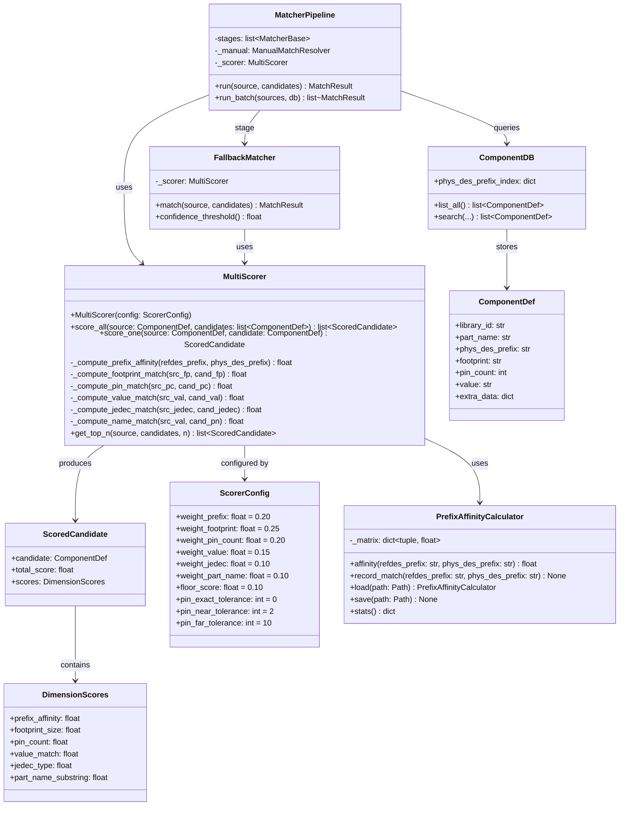
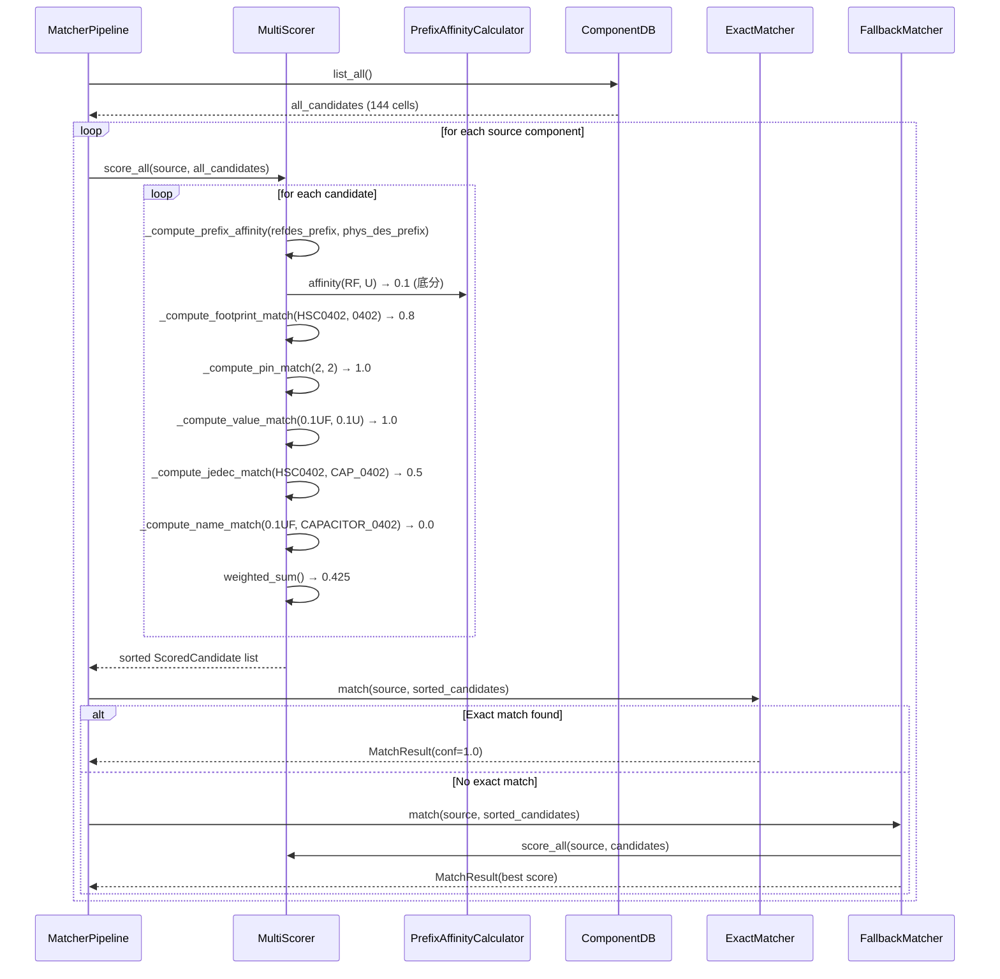
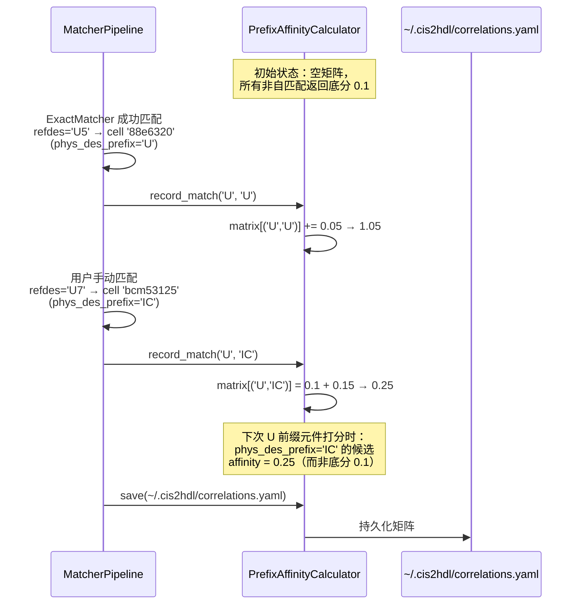
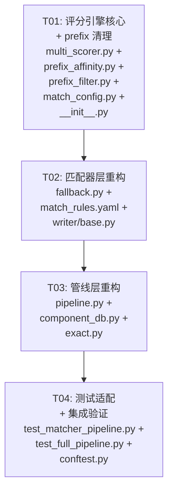
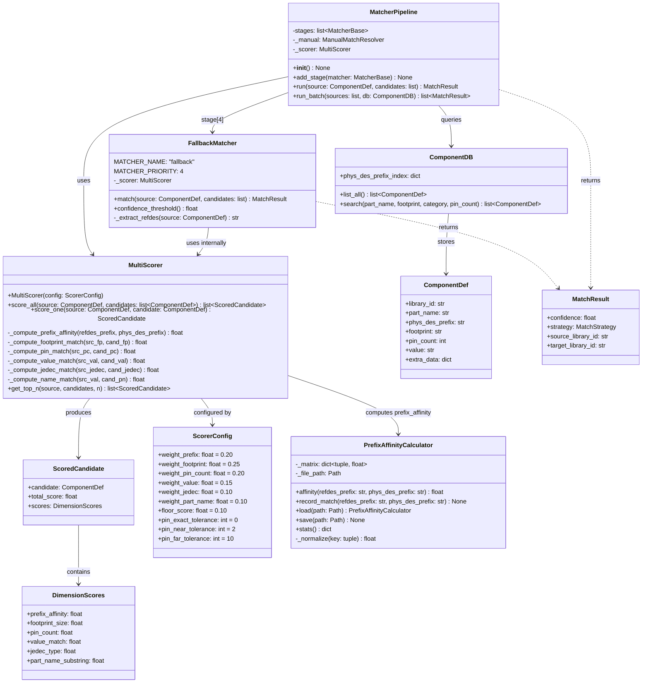
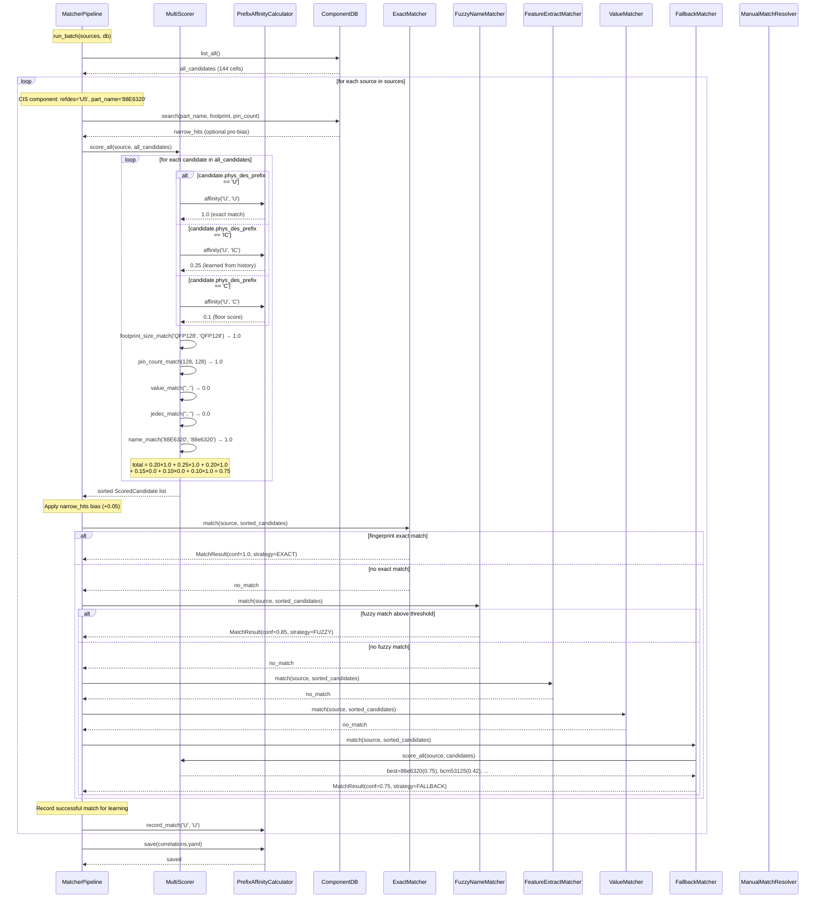

# deprecated_designs_master（废弃设计合集）

> **文档介绍**：CIS2HDL 已废弃/被取代的设计与诊断文档合集。本文件将 5 份历史源文档按主题板块智能合并、全文保真归档，供追溯设计演进与历史决策参考。
>
> **来源清单**（5 份，均在 `docs/archive/废弃设计/`）：
>
> | 板块 | 源文件 | 行数 | 一句话简介 |
> |------|--------|:----:|------------|
> | A | `system_design08061513.md` | 585 | v0.9.0 MultiScorer 全库打分系统设计（已废弃） |
> | B | `MATCHING_DIAGNOSIS_2026-08-04.md` | 371 | 匹配管线早期诊断，部分结论已被 CrossRef 决策取代 |
> | C | `CIS2HDL_IMPROVEMENT_DOC.md` | 999 | 参考库对比改进分析，多数建议已实施 |
> | D | `class-diagram08061513.mermaid` | 109 | v0.9.0 类图（MultiScorer 架构） |
> | D | `sequence-diagram08061513.mermaid` | 82 | v0.9.0 时序图（run_batch 打分流程） |
>
> **合并原则**：板块化智能合并（按主题板块组织同期/同类内容；条目对比合并，同主题多源描述信息点全保留）；全文保真（不做精简，5 份源每行均进入本文件）；旧口径保留（与当前代码不符的历史表述原样保留，并在板块首部加注记）；交叉引用保留原文。
>
> **历史口径说明**：本合集内容属历史设计记录，与当前 v1.1.0 代码实现不完全一致（部分方案已被 v2.0/新架构取代），仅供追溯，不作为当前实现依据。**当前权威设计请参阅 `docs/ARCHITECTURE.md` 与 `docs/MATCHING.md`。**
>
> **交叉引用注记**：文内引用的 `FILE_INDEX_AND_MAPPING.md`、`REFERENCE_READING_NOTES.md` 等历史阶段文档及“详见 XX.md”类表述均保留原文；目标文件可能已归档/移动，不再作为当前工作依据。

---

## 目录

1. [板块 A：废弃系统设计（v0.9.0 MultiScorer 方案，已被 v2.0 取代）](#板块-a废弃系统设计v090-multiscorer-方案已被-v20-取代)
2. [板块 B：匹配管线早期诊断（2026-08-04，部分结论已被取代）](#板块-b匹配管线早期诊断2026-08-04部分结论已被取代)
3. [板块 C：参考库对比与改进分析（多数建议已实施）](#板块-c参考库对比与改进分析多数建议已实施)
4. [板块 D：废弃架构图（v0.9.0）](#板块-d废弃架构图v090)
5. [合并保全声明](#合并保全声明)

---

## 板块 A：废弃系统设计（v0.9.0 MultiScorer 方案，已被 v2.0 取代）

> **来源**：`system_design08061513.md`（585 行）——v0.9.0 MultiScorer 全库打分匹配系统设计（作者 Bob，2026-08-04，设计阶段）。
> **历史注记**：（历史设计，已被 v2.0/新架构取代）本方案描述的 MultiScorer 全库打分、PrefixAffinityCalculator 历史学习矩阵、全候选打分排序等设计属 v0.9.0 阶段方案；当前 v1.1.0 已采用 CrossRef 决策等其他架构，本文档仅作历史追溯。
> **交叉引用**：文内自含目录与内部锚点保留原文；所引 `prefix_filter.py`/`fallback.py`/`pipeline.py` 等文件路径为当时行文口径，目标文件可能已变化。

### CIS2HDL 全库扫描 + 多维度打分匹配 — 系统设计

> **版本**: v0.9.0  
> **作者**: Bob (Architect)  
> **日期**: 2026-08-04  
> **状态**: 设计阶段  

---

#### 目录

1. [Part A: 系统设计](#part-a-系统设计)
   - [1. 实现方案](#1-实现方案)
   - [2. 文件清单](#2-文件清单)
   - [3. 数据结构与接口](#3-数据结构与接口)
   - [4. 程序调用流程](#4-程序调用流程)
   - [5. 未确定事项](#5-未确定事项)
2. [Part B: 任务分解](#part-b-任务分解)
   - [6. 所需依赖包](#6-所需依赖包)
   - [7. 任务列表](#7-任务列表)
   - [8. 共享知识](#8-共享知识)
   - [9. 任务依赖图](#9-任务依赖图)

---

#### Part A: 系统设计

##### 1. 实现方案

###### 1.1 核心挑战

| # | 挑战 | 严重性 | 方案 |
|---|------|--------|------|
| 1 | `PREFIX_TO_CATEGORY` 硬编码字典（29条目）在 prefix_filter.py、fallback.py、match_config.py、writer/base.py 多处重复 | 🔴 严重 | 全部删除，用 `MultiScorer.prefix_affinity()` 动态计算替代 |
| 2 | `_CROSS_PREFIX_MAP` 硬编码跨前缀映射（7条目），新增 PHYS_DES_PREFIX 无法被覆盖 | 🔴 严重 | 全部删除，用 `PrefixAffinityCalculator` 历史学习机制替代 |
| 3 | `filter_candidates_by_refdes()` 按硬编码类别淘汰候选 → 具体芯片被排除 | 🔴 严重 | 删除该函数，改为全候选打分排序 |
| 4 | FallbackMatcher 强依赖 PREFIX_TO_CATEGORY 做分类过滤 | 🟡 中等 | 重写为 `MultiScoreFallbackMatcher`，直接对全候选多维度打分 |
| 5 | WriterBase._PREFIX_MAP 硬编码映射 | 🟡 中等 | 通过 `phys_des_prefix` 属性动态推断 body name |
| 6 | 性能：144 cells × 889 元件 = 128K 次打分 | 🟢 低 | 纯字符串/整数比较，预计算候选特征，单次批量 < 100ms |

###### 1.2 技术选型

| 组件 | 选型 | 理由 |
|------|------|------|
| 打分引擎 | 纯 Python dataclass | 无外部依赖，128K 次简单比较无需 numpy |
| Prefix 亲和度 | 历史学习矩阵 + 底分兜底 | 零硬编码，随使用自动优化 |
| 候选排序 | Python `list.sort(key=...)` | 单次 O(n log n)，足够快 |
| 持久化 | YAML（复用现有 mappings.yaml） | 与 ManualMatchResolver 风格一致 |

###### 1.3 架构概览

```
┌─────────────────────────────────────────────────────────────────┐
│                     MatcherPipeline.run_batch()                   │
│                                                                   │
│  For each CIS component:                                         │
│  ┌─────────────────────────────────────────────────────────────┐ │
│  │ 1. db.list_all() → ALL candidates (no filtering)            │ │
│  │ 2. MultiScorer.score_all(source, candidates) → [(c,score)]  │ │
│  │ 3. Sort by score DESC                                       │ │
│  │ 4. pipeline.run(source, sorted_candidates) → MatchResult    │ │
│  └─────────────────────────────────────────────────────────────┘ │
│                                                                   │
│  MatcherPipeline stages (unchanged order):                       │
│  ExactMatcher → Fuzzy → Feature → Value → Fallback* → Manual     │
│                                        ↑                          │
│                          *FallbackMatcher now uses MultiScorer    │
│                           internally instead of PREFIX_TO_CATEGORY│
└─────────────────────────────────────────────────────────────────┘
```

---

##### 2. 文件清单

```
cis2hdl/
├── core/
│   ├── matcher/
│   │   ├── __init__.py              # [修改] 新增 MultiScorer 导出
│   │   ├── multi_scorer.py          # [新增] 多维度打分引擎
│   │   ├── prefix_affinity.py       # [新增] 动态前缀亲和度计算
│   │   ├── prefix_filter.py         # [重构] 仅保留 extract_prefix()，删除所有硬编码
│   │   ├── fallback.py              # [重写] MultiScoreFallbackMatcher
│   │   ├── pipeline.py              # [重构] run_batch() 新候选流程
│   │   ├── match_config.py          # [修改] 删除 _DEFAULT_PREFIX_TO_CATEGORY
│   │   ├── match_rules.yaml         # [修改] 删除 prefix_to_category 段
│   │   ├── exact.py                 # [微调] JEDEC 打分权重参考新体系
│   │   ├── feature.py               # [不变]
│   │   ├── fuzzy.py                 # [不变]
│   │   ├── value_matcher.py         # [不变]
│   │   ├── base.py                  # [不变]
│   │   └── registry.py              # [不变]
│   ├── db/
│   │   └── component_db.py          # [微调] 更新 docstring，移除硬编码引用
│   ├── writer/
│   │   └── base.py                  # [修改] 删除 _PREFIX_MAP，用 phys_des_prefix
│   └── ir/
│       └── match.py                 # [不变]
└── tests/
    ├── integration/
    │   ├── test_matcher_pipeline.py  # [修改] 新增 MultiScorer 测试
    │   └── test_full_pipeline.py     # [修改] 适配新流程
    └── conftest.py                   # [修改] 新增 MultiScorer fixtures
```

---

##### 3. 数据结构与接口



---

##### 4. 程序调用流程

###### 4.1 run_batch() 新流程



###### 4.2 PrefixAffinityCalculator 学习流程



---

##### 5. 未确定事项

| # | 事项 | 假设 | 风险等级 |
|---|------|------|----------|
| 1 | 历史学习矩阵初始为空，首批匹配完全依赖其他维度 | 当前 5 个维度（footprint/pin/value/jedec/name）足以在没有 prefix 信号时正确匹配 | 🟢 低 |
| 2 | WriterBase._PREFIX_MAP 移除后 body name 推断 | 通过 `phys_des_prefix` + library_id 解析，配合 `extract_prefix()` 即可 | 🟡 中（需充分测试 CSA 写入路径） |
| 3 | 权重是否需要针对不同元件类型动态调整 | 首版使用固定权重，后续可通过配置文件调整 | 🟢 低 |
| 4 | 全库扫描 128K 次计算在 CI 中的耗时 | Python 原生计算 < 100ms，可接受 | 🟢 低 |

---

#### Part B: 任务分解

##### 6. 所需依赖包

```
# 无新增第三方依赖。所有功能使用 Python stdlib + 现有依赖：
- pydantic          # ComponentDef 数据模型（已有）
- rapidfuzz         # FuzzyNameMatcher（已有）
- pyyaml            # 规则持久化（已有）
```

---

##### 7. 任务列表（按依赖排序）

| Task ID | 任务名称 | 源文件 | 依赖 | 优先级 |
|---------|---------|--------|------|--------|
| T01 | 评分引擎核心 + prefix 清理 | `multi_scorer.py`(NEW), `prefix_affinity.py`(NEW), `prefix_filter.py`(REWRITE), `match_config.py`(UPDATE), `__init__.py`(UPDATE) | — | P0 |
| T02 | 匹配器层重构 | `fallback.py`(REWRITE), `match_rules.yaml`(UPDATE), `writer/base.py`(UPDATE) | T01 | P0 |
| T03 | 管线层重构 | `pipeline.py`(REWRITE), `component_db.py`(UPDATE), `exact.py`(MINOR) | T02 | P0 |
| T04 | 测试适配 + 集成验证 | `test_matcher_pipeline.py`(UPDATE), `test_full_pipeline.py`(UPDATE), `conftest.py`(UPDATE) | T03 | P1 |

---

##### 8. 共享知识

```
# 跨切关注点

## 打分公式（统一实现于 MultiScorer._score_one）

total = w1·prefix_affinity + w2·footprint_size + w3·pin_count + w4·value + w5·jedec + w6·name

默认权重:
  w1 = 0.20 (prefix_affinity)
  w2 = 0.25 (footprint_size)
  w3 = 0.20 (pin_count)
  w4 = 0.15 (value_match)
  w5 = 0.10 (jedec_type)
  w6 = 0.10 (part_name_substring)

## 各维度子分计算规则

prefix_affinity(refdes_prefix, phys_des_prefix):
  - 完全匹配 → 1.0
  - 历史矩阵有记录 → 矩阵值（0.1~1.0）
  - 无历史 → 0.1（底分，不淘汰）

footprint_size(src_footprint, candidate_footprint):
  - extract_pkg_size() 完全相等 → 1.0
  - 任一为空 → 0.0
  - 其他 → 0.0（保守：仅完全匹配给分）

pin_count(src_pc, cand_pc):
  - 相等 → 1.0
  - |diff| ≤ 2 → 0.8
  - |diff| ≤ 5 → 0.5
  - |diff| ≤ 10 → 0.3
  - else → 0.0

value_match(src_val, cand_val):
  - normalize_value() 完全相等 → 1.0
  - 任一为空 → 0.0
  - 数值部分相等、前缀不同 → 0.5
  - else → 0.0

jedec_type(src_jedec, cand_jedec):
  - 精确匹配 → 1.0
  - 提取的 size code 匹配 → 0.5
  - 任一为空 → 0.0
  - else → 0.0

part_name_substring(src_value, cand_part_name):
  - src_value 完全包含于 cand_part_name → 1.0
  - 数字部分匹配 → 0.5
  - 任一为空 → 0.0
  - else → 0.0

## 前缀提取规则（extract_prefix，保持不变）
- regex: ^([A-Za-z]+)
- 返回大写形式
- "C460" → "C", "TP1" → "TP", "FB3" → "FB"

## 候选不打折原则
- 任何维度得 0 分不影响其他维度
- 不存在"过滤"或"淘汰"逻辑
- 底分 0.1 确保每个候选都有非零总分

## 历史学习矩阵
- 存储路径: ~/.cis2hdl/correlations.yaml
- 键: (refdes_prefix, phys_des_prefix) 元组
- 值: float [0.1, 1.0]
- 每次确认匹配后调用 record_match()
- 自匹配 (U→U) 恒为 1.0，不存入文件
```

---

##### 9. 任务依赖图



---

#### 附录 A: prefix_filter.py 修改详情

##### 保留的内容

```python
# ✅ 保留 — 纯字符串处理，无硬编码
_RE_REFDES_PREFIX = re.compile(r"^([A-Za-z]+)")

def extract_prefix(refdes: str) -> str:
    """Extract the alphabetic prefix from a reference designator."""
    if not refdes:
        return ""
    m = _RE_REFDES_PREFIX.match(refdes.upper())
    return m.group(1) if m else ""
```

##### 删除的内容

```python
# ❌ 删除 — 硬编码前缀→类别映射（29条目）
PREFIX_TO_CATEGORY: dict[str, list[str]] = { ... }  # lines 24-57
_PREFIX_ORDER: list[tuple[str, list[str]]] = ...      # lines 59-64

# ❌ 删除 — 依赖 PREFIX_TO_CATEGORY 的函数
def get_categories_for_refdes(refdes: str) -> list[str]:    # lines 102-114
def filter_candidates_by_refdes(refdes, candidates, ...):    # lines 117-178
def sort_candidates_by_prefix(refdes, candidates, ...):      # lines 181-220

# ❌ 删除 — 依赖 _CROSS_PREFIX_MAP 的函数
def expand_candidates_with_phys_des_prefix(refdes, ...):     # lines 226-317
# 以及内部的 _CROSS_PREFIX_MAP: dict[str, tuple[str, ...]]  # lines 272-280
```

##### 新增内容

```python
# ✅ 新增 — 向后兼容的排序函数（使用 MultiScorer 替代硬编码）
def sort_candidates_by_score(
    source: ComponentDef,
    candidates: list[ComponentDef],
    scorer: MultiScorer,
) -> list[ComponentDef]:
    """Sort candidates by multi-dimensional score (highest first)."""
    scored = scorer.score_all(source, candidates)
    return [s.candidate for s in scored]
```

---

#### 附录 B: pipeline.py 修改详情

##### 当前流程 (lines 486-529)

```python
# 当前：三步渐进式缩小 + 硬编码过滤
candidates = db.search(part_name, footprint, pin_count)  # narrow
if not candidates:
    candidates = db.search(footprint, pin_count)          # broader
if not candidates:
    candidates = db.list_all()                             # all

# PHYS_DES_PREFIX expansion (hack to work around PREFIX_TO_CATEGORY)
candidates = expand_candidates_with_phys_des_prefix(...)

# Hardcoded filter (THE PROBLEM)
if len(candidates) > 5:
    candidates = filter_candidates_by_refdes(...)

result = self.run(source, candidates)
```

##### 新流程

```python
# 新：始终扫描全部 + 打分排序
all_candidates = db.list_all()

# 可选：用 db.search 结果做预打分标记（但不淘汰）
narrow_hits = db.search(part_name, footprint, pin_count)
if not narrow_hits:
    narrow_hits = db.search(footprint, pin_count)

# 多维度打分 → 排序
scored = self._scorer.score_all(source, all_candidates)

# 如果窄搜索结果非空，提升它们的排名（排序偏置，非过滤）
if narrow_hits:
    narrow_ids = {c.library_id for c in narrow_hits}
    for s in scored:
        if s.candidate.library_id in narrow_ids:
            s.total_score += 0.05  # 轻微偏置

scored.sort(key=lambda s: s.total_score, reverse=True)
candidates = [s.candidate for s in scored]

result = self.run(source, candidates)
```

---

#### 附录 C: fallback.py 重写方案

##### 关键变化

| 当前 | 新设计 |
|------|--------|
| `extract_refdes_prefix()` 检查 `PREFIX_TO_CATEGORY` 成员 | 直接使用 `extract_prefix()`，不检查硬编码集合 |
| `match()` Step 2: `PREFIX_TO_CATEGORY.get(prefix, [])` | 不需要类别查找 |
| `match()` Step 3: `_filter_by_category(categories, candidates)` | `MultiScorer.score_all(source, candidates)` |
| `match()` Step 4-5: 三级打分 (exact/size/prefix) | 六维度打分 |
| 仅打分过滤后的候选 | 打分全部候选，取最高分 |

##### 新 FallbackMatcher.match() 伪代码

```python
def match(self, source, candidates):
    if not candidates:
        return no_match
    
    # Step 1: 提取 refdes 前缀（不检查硬编码集合）
    refdes = getattr(source, 'refdes', '') or source.part_name or source.library_id
    prefix = extract_prefix(refdes)
    
    # Step 2: 多维度打分全部候选
    scored = self._scorer.score_all(source, candidates)
    
    # Step 3: 找到最高分
    best = scored[0] if scored else None
    if best is None or best.total_score < self.confidence_threshold():
        return no_match
    
    # Step 4: 构建结果
    return MatchResult(
        confidence=best.total_score,
        strategy=MatchStrategy.FALLBACK,
        source_library_id=source.library_id,
        target_library_id=best.candidate.library_id,
        pin_mapping=self._build_pin_mapping(source, best.candidate),
        warnings=[f"Multi-score: {best.scores}"],
    )
```

---

#### 附录 D: 风险评估矩阵

| 风险 | 概率 | 影响 | 缓解措施 |
|------|------|------|----------|
| 现有 134 测试失败 | 🟡 中 | 🔴 高 | T04 专门验证；保留 extract_prefix() 签名不变；逐测试检查 |
| 全库扫描导致匹配质量下降 | 🟢 低 | 🟡 中 | 打分排序不淘汰任何候选，pipeline 的 Exact/Fuzzy/Feature/Value 阶段仍正常运作 |
| FallbackMatcher 阈值需重新校准 | 🟡 中 | 🟡 中 | 新版 confidence_threshold() 可从现有的 0.50 开始，通过 T04 测试验证 |
| WriterBase body name 解析退化 | 🟡 中 | 🟡 中 | 优先使用 library_id (不受影响)；仅在 library_id 为空时使用 phys_des_prefix 推断 |
| 历史学习矩阵冷启动时精度下降 | 🟢 低 | 🟢 低 | 五个非 prefix 维度（权重合计 0.80）足以在无历史数据时正确匹配 |

---

#### 附录 E: 硬编码删除清单

| 位置 | 硬编码对象 | 行数 | 处理方式 |
|------|-----------|------|----------|
| `prefix_filter.py` | `PREFIX_TO_CATEGORY` | L24-57 | 完全删除 |
| `prefix_filter.py` | `_PREFIX_ORDER` | L60-64 | 完全删除 |
| `prefix_filter.py` | `_CROSS_PREFIX_MAP` | L272-280 | 完全删除 |
| `prefix_filter.py` | `get_categories_for_refdes()` | L102-114 | 完全删除 |
| `prefix_filter.py` | `filter_candidates_by_refdes()` | L117-178 | 完全删除 |
| `prefix_filter.py` | `sort_candidates_by_prefix()` | L181-220 | 替换为 `sort_candidates_by_score()` |
| `prefix_filter.py` | `expand_candidates_with_phys_des_prefix()` | L226-317 | 完全删除（不再需要扩展候选池） |
| `match_config.py` | `_DEFAULT_PREFIX_TO_CATEGORY` | L22-30 | 完全删除 |
| `match_config.py` | `_DEFAULT_VALUE_HINTS` | L32-35 | 保留（value hints 不是 prefix 映射） |
| `fallback.py` | `_DEFAULT_VALUE_HINTS` | L30-40 | 保留 |
| `fallback.py` | `import PREFIX_TO_CATEGORY` | L24 | 删除 |
| `fallback.py` | `extract_refdes_prefix()` 中 `PREFIX_TO_CATEGORY` 检查 | L107 | 删除检查逻辑 |
| `fallback.py` | `match()` 中 `PREFIX_TO_CATEGORY.get(prefix, [])` | L331 | 删除 |
| `writer/base.py` | `_PREFIX_MAP` | L61-72 | 完全删除，改用 phys_des_prefix |
| `pipeline.py` | `import expand_candidates..., filter_candidates...` | L24-29 | 删除 |
| `pipeline.py` | `expand_candidates_with_phys_des_prefix()` 调用 | L516-521 | 删除 |
| `pipeline.py` | `filter_candidates_by_refdes()` 调用 | L525-529 | 替换为 MultiScorer |

**总计**: 6 个文件，17 处硬编码需要修改/删除。

---

> **设计完成**。下一个阶段由 Engineer 按 T01→T02→T03→T04 顺序实现。

---

## 板块 B：匹配管线早期诊断（2026-08-04，部分结论已被取代）

> **来源**：`MATCHING_DIAGNOSIS_2026-08-04.md`（371 行）——匹配管线早期诊断报告，测试数据 HG5015-BE36_V10，当前结果 89 matched / 635 failed / 102 fuzzy（匹配率 ~12%）。
> **历史注记**：（历史诊断，部分结论已被取代）本文档描述的 6 大根因分析与改进优先级（如 CrossRef CSV 注入、FeatureExtractMatcher early return、FallbackMatcher refdes 路径修复等）为早期诊断结论，部分决策已被后续 CrossRef 决策与 v1.1.0 架构取代；保留原文仅供追溯。
> **交叉引用**：文内所引 `page_parser.py`/`conversion_engine.py`/`cross_ref_parser.py` 等路径与 `match_cis_to_hdl.py` 参考实现均为当时行文口径。

### CIS2HDL 匹配诊断报告 — 2026-08-04

> **分析范围**: 匹配管线全部 5 阶段 + HDL 库扫描 + DSN 属性提取 + EDIF 反注
> **测试数据**: HG5015-BE36_V10 (1167 实例, 20 页, 4115 网络)
> **当前结果**: 89 matched / 635 failed / 102 fuzzy (匹配率 ~12%)

---

#### 一、当前匹配管线结构

```
MatcherPipeline (5 阶段)
├── [1] ExactMatcher      (threshold=0.95)
├── [2] FuzzyNameMatcher   (threshold=0.75)
├── [3] FeatureExtractMatcher (threshold=0.60)
├── [4] FallbackMatcher    (threshold=0.50)
└── [5] ManualMatchResolver (threshold=1.0)
```

候选器件搜索逻辑（`MatcherPipeline.run_batch`）：
```
1. db.search(part_name, footprint, pin_count)
2. db.search(footprint, pin_count)        # 回退
3. db.list_all()                          # 全量回退
4. filter_candidates_by_refdes()          # 前缀过滤（>5个候选时）
```

---

#### 二、6 大根因分析

##### 根因 1: DSN 解析产生大量垃圾 library_id

**现象**:
```
10868, 2074, INS7598, DDRC_A8, HGPIO_14, INS5885, GE3_MDI_N0,
SFC_RXD, POWER_ON_SLE, 48MHz, $31N407706, HSI0_DATA_5G, ...
```

**原因**: DSN 页面流中的 PlacedInstance 使用了 RTL 格式（strLst 索引），当前 `_parse_placed_instance_rtl()` 返回的 `pkg_name`（作为 library_id）实际上不是元件库名，而是：
- 纯数字 ID（如 10868, 2074）→ 可能是 strLst 内部 ID 或指针
- INSxxx 格式（如 INS7598）→ OrCAD Capture 内部占位符
- 信号名称（如 HSI0_DATA_5G, SFC_RXD）→ 网表名称被误读为 library_id
- 电压/物理量（如 48MHz, 1V2, 0.2p*）

**影响**: 1167 个实例中，绝大多数 library_id 是垃圾数据。这导致：
- ExactMatcher 的指纹匹配完全无法工作（所有 CIS 组件的 footprint + value 都为空）
- FallbackMatcher 的 refdes 前缀匹配也受影响（它尝试从 library_id 提取前缀）

**代码位置**: `cis2hdl/core/parser/dsn/page_parser.py → _parse_placed_instance_rtl()`

##### 根因 2: CIS 组件属性（footprint, value）完全缺失

**现象**: Mapping CSV 中几乎每行都有 `INFO_LOSS: Missing_Value, Missing_Footprint`

**原因**: DSN 二进制格式中的组件属性（properties/prefix_props）解析不完整。
- `_extract_cis_components()` 创建的 minimal ComponentDef 的 `footprint` 和 `value` 几乎总是空字符串
- 这导致 `fingerprint = "||N"`（只有 pin_count）— 对匹配完全没有区分度

**数据流**:
```
DSN 二进制 → PlacedInstance → ComponentInstanceIR → 
_extract_cis_components() → ComponentDef(footprint="", value="") →
fingerprint="||2" → 无法精确匹配
```

**代码位置**: `cis2hdl/core/engine/conversion_engine.py → _extract_cis_components()`

##### 根因 2a: 但 Cross Reference CSV 有完整数据！

**发现**: `tests/fixtures/HG5015test/HG5015-BE36_V10.CSV`（946 行）包含：
```
Item,Part,Reference,SchematicName,Sheet,Library,X,Y
22,0.2P*,C248,TG1C0D8_VB/19-WIFI5G_FEM_C0,0,LIBRARY1.OLB,165.00,102.50
```

每行有:
- **Part**: 元件值（如 "0.2P*", "10UF", "100NF"）
- **Reference**: 真实 RefDes（如 "C248", "R75"）
- **SchematicName**: 所属页面
- **Library**: OLB 库路径
- **X, Y**: 坐标（英寸单位）

**当前状态**: 这个 CSV 文件**完全未被使用**！

**代码位置**: 需要新建 `cis2hdl/core/parser/cross_ref_parser.py`

##### 根因 3: ChipsPrtParser 不提取 JEDEC_TYPE

**现象**: HDL 库组件（如 hole）的 footprint 字段为空

**原因**: `ChipsPrtParser._parse_primitive_body()` 只提取 PART_NAME, PHYS_DES_PREFIX, CLASS。JEDEC_TYPE 被忽略：

```python
# chips.prt 中的:
JEDEC_TYPE='hole3_2pad';    # 不被提取！
# 导致 ComponentDef.footprint = ""
```

**影响**:
- "hole" 组件的实际 footprint 应该是 "hole3_2pad"
- 但解析器生成的 fingerprint = "||1"（只有 pin_count）
- 这个空指纹是造成之前 hole 假阳性匹配的根源
- 同理，capacitor/resistor/inductor 等所有 HDL 组件的实际 JEDEC_TYPE 都丢失了

**代码位置**: `cis2hdl/core/parser/chips_prt.py → _parse_primitive_body()`

##### 根因 3a: part.ptf 解析器不能处理所有格式

**现象**: hole 等组件的 part.ptf 使用非标准格式（`=` 分隔而非 `|` 分隔），导致解析失败

**参考实现** (`match_cis_to_hdl.py`) 使用 `re.findall(r"'([^']*)'", line)` 提取字段，更鲁棒：
```python
# 参考实现（更鲁棒）:
fields = re.findall(r"'([^']*)'", line)
# 我们当前实现（针对 pipe-delimited）:
_RE_DATA_ROW = re.compile(r"^\s*'([^']*)'\s*\|")  # 需要 | 分隔符
```

**代码位置**: `cis2hdl/core/parser/part_ptf.py → _parse_data_row()`

##### 根因 4: FeatureExtractMatcher 产生随机匹配

**现象**: 
```
HSI0_CLK_2G → inductor_gm (feature, 70%)
HSI1_CLK_2G → c_transformer (feature, 70%)
3V3_PER → bosa (feature, 70%)
DGPIO_9 → db9 (feature, 70%)
+/-5% → rj45 (feature, 70%)
```

**原因**: 当 source 和 candidate 都无电气特性时：
- `_feature_similarity()` 只从 pin_count 获得 0.15 分（如果引脚数相同）
- 但如果 source.pin_count=0（未正确提取），则所有 candidate 得分为 0
- 第一个被遍历的 candidate 因为 `sim(0) > best_sim(0)` → False 而不会被选中
- 但如果匹配到了有实际 features 的，可能就是随机的 pin_count 匹配

但即使如此，threshold=0.60 应该阻止这些（0.15 < 0.60）。需要实际调试确认。

**根本问题**: FeatureExtractMatcher **不应该对无特征组件进行匹配**。应该增加 early return：
```python
if not src_features["type"]:
    # 无特征可提取 → 直接返回 no_match
    return MatchResult.no_match(source.library_id)
```

##### 根因 5: pstxprt.dat 数据未被充分利用

**发现**: `pstxprt.dat` 包含结构化的组件定义：
```
PART_NAME
 C1 'C_SC0603-TD_10UF':;
SECTION_NUMBER 1
 '@HG5015-BE36_V10...INS32276@LIBRARY1.C.NORMAL(CHIPS)':
 P_PATH='...',
```

格式包含：PART_NAME（含 footprint 描述如 C_SC0603-TD_10UF）、SECTION_NUMBER、P_PATH（OLB 库路径）

**当前状态**: `conversion_engine.py` 仅通过 `pstxnet_parser` 加载了 pstxprt.dat 条目，但 `_extract_cis_components` 中的注入逻辑可能因为 matching key 不匹配而无法生效。

##### 根因 6: EDIF 反注仅覆盖 ~485/1167 实例

**当前状态**: `_map_edif_types_to_dsn()` 通过 refdes 匹配 EDIF 和 DSN，但：
- EDIF 只有 3023 实例（与 DSN 的 1167 不匹配 — 说明 EDIF 和 DSN 的实例定义不同）
- 成功反注的只有 ~485 个

---

#### 三、hole 组件"100% 匹配"问题溯源

##### 3.1 hole 是什么

hole 是 HDL 库中的一个合法元件（测试点/安装孔）：

```prt
primitive 'HOLE';
  pin '1': PIN_NUMBER='(1)'; ...
  body
    CLASS='IO'; PART_NAME='HOLE'; PHYS_DES_PREFIX='H';
    JEDEC_TYPE='hole3_2pad';
  end_body;
end_primitive;
```

RefDes 前缀 `H`（如 H1, H2），属于 `TP` 类别的 fallback：
```
PREFIX_TO_CATEGORY["TP"] = ["hole", "mark", "test_point"]
```

##### 3.2 为什么会 100% EXACT 匹配

先前的代码版本中，ExactMatcher 没有空指纹保护。hole 的 fingerprint = `||1`（因为 JEDEC_TYPE 未被提取）。任何 CIS 组件如果 footprint="" 且 value="" 且 pin_count=1，其 fingerprint 也是 `||1`，就会被精确匹配到 hole。

**已修复**：ExactMatcher 已加入 guard：
```python
fp_parts = source_fp.split('|')
if len(fp_parts) >= 2 and not fp_parts[0].strip() and not fp_parts[1].strip():
    return MatchResult.no_match(source.library_id)
```

##### 3.3 当前 fix2 运行中不再出现 100% EXACT to hole

Mapping CSV 确认：这些组件现在显示为 UNMATCHED 或模糊匹配。但仍有问题：
- 大量组件仍然 UNMATCHED（635 个）
- 102 个"模糊匹配"质量极差（HSI0_CLK_2G → inductor_gm 等）

---

#### 四、Cross Reference CSV 的价值分析

##### 4.1 文件格式

`HG5015-BE36_V10.CSV`（946 行）是 OrCAD Capture 的标准 Cross Reference 导出：

| 列 | 示例 | 说明 |
|----|------|------|
| Item | 22 | 序号 |
| Part | 0.2P* | **元件值** |
| Reference | C248 | **RefDes（真实位号）** |
| SchematicName | TG1C0D8_VB/19-WIFI5G_FEM_C0 | **所属页面** |
| Sheet | 0 | 分页 |
| Library | LIBRARY1.OLB | OLB 库路径 |
| X, Y | 165.00, 102.50 | **坐标（英寸）** |

##### 4.2 可提取的信息

| 字段 | 用途 |
|------|------|
| Part (value) | 用于 FeatureExtractMatcher 提取电容/电阻/电感值 |
| Reference (refdes) | 提供真实的 refdes，可正确提取前缀（C→capacitor, R→resistor, L→inductor） |
| SchematicName | 确定组件所在页面 |
| X, Y | 覆盖率 100% 的精确坐标（当前 DSN 解析 760/1167 坐标为 (0,0)） |

##### 4.3 建议实现

创建 `cis2hdl/core/parser/cross_ref_parser.py`，在转换 pipeline 的 Stage 2（Parse）之后注入 Cross Reference 数据：

```
Parse DSN → DesignIR → Parse CrossRef CSV → 注入 refdes/value/footprint/坐标
```

---

#### 五、改进方案 — 优先级排序

##### P0 — 最高优先级（解决 ≥80% 匹配问题）

###### P0-1: 解析 Cross Reference CSV 并注入到匹配管线

**实现**:
1. 新建 `cis2hdl/core/parser/cross_ref_parser.py`
2. 解析 CSV → `{refdes: {value, schematic_name, x, y}}` 
3. 在 `conversion_engine.py` 的 Stage 2 之后注入：
   - 用 CrossRef 的 value 填充 ComponentDef.value
   - 用 CrossRef 的 refdes 作为 ComponentDef.part_name
   - 用 CrossRef 的坐标更新 ComponentInstanceIR

**预期效果**:
- C89 → refdes_prefix="C" → FallbackMatcher → capacitor（conf=0.5）
- R270 → refdes_prefix="R" → FallbackMatcher → resistor（conf=0.5）
- L7 → refdes_prefix="L" → FallbackMatcher → inductor（conf=0.5）
- C248 (value=0.2P*) → FeatureExtractMatcher → capacitor（电容值匹配）

###### P0-2: FeatureExtractMatcher 增加 early return

当 source 无任何电气特征时，直接返回 no_match，避免随机匹配。

```python
def match(self, source, candidates):
    src_features = self._extract(source)
    if not src_features.get("type"):
        return MatchResult.no_match(source.library_id)
    ...
```

###### P0-3: FallbackMatcher 修复 refdes 获取路径

当前 FallbackMatcher 优先使用 source.library_id（垃圾），应改为优先使用 source.part_name（refdes）：

```python
# 修复前:
refdes_or_id = getattr(source, "refdes", "") or source.library_id or source.part_name
# 修复后:
refdes_or_id = getattr(source, "refdes", "") or source.part_name or source.library_id
```

###### P0-4: ChipsPrtParser 提取 JEDEC_TYPE

在 `_parse_primitive_body()` 中增加 JEDEC_TYPE 提取：

```python
_RE_JEDEC_TYPE = re.compile(r"JEDEC_TYPE\s*=\s*'([^']+)'\s*;\s*$", re.IGNORECASE)

# 解析到后:
comp_def.footprint = jedec_type
```

##### P1 — 高优先级（解决剩余 15% 问题）

###### P1-1: 修复 DSN 页面流 PlacedInstance RTL 格式解析

需要深入分析 HG5015 页面流的 hex dump，确定正确的字段偏移量。参考 OpenOrCadParser 中的 `StreamPage.cpp`。

###### P1-2: 利用 pstxprt.dat 获取完整组件属性

`pstxprt.dat` 的 PART_NAME 格式为 `C1 'C_SC0603-TD_10UF'`，其中：
- `C_SC0603-TD` → footprint 描述（SC0603 → 0603 封装）
- `10UF` → value

###### P1-3: part.ptf 解析器兼容非标准格式

参考 `match_cis_to_hdl.py` 的 `re.findall(r"'([^']*)'", line)` 方法，兼容 `=` 分隔的格式。

##### P2 — 中优先级（质量提升）

###### P2-1: 实现电气特性相似度匹配

利用 HDL 库中 part.ptf 的完整数据表进行"按值匹配"：
- CIS 电容 "0.2pF" → HDL capacitor part.ptf 中查找 "0.2PF" 行 → 精确匹配

###### P2-2: 信息页 TitleBlock 解析

Cover/Clock/Power/Block 4 页使用 TitleBlock(64/65) + GraphicInst 结构体，与普通页不同。

###### P2-3: OLB 符号图形渲染集成

OLBParser 已解析 8 种图形类型，需要集成到 SchematicPreviewPanel。

---

#### 六、实施计划

建议分两个 Sprint 执行：

##### Sprint 1（本次，预计 2-3 天）: 提升匹配率到 ≥70%

| 任务 | 预估工时 | 负责 |
|------|:--:|------|
| P0-1: CrossRef CSV 解析 + 注入 | 4h | 工程师 |
| P0-2: FeatureExtractMatcher early return | 0.5h | 工程师 |
| P0-3: FallbackMatcher refdes 路径修复 | 0.5h | 工程师 |
| P0-4: ChipsPrtParser JEDEC_TYPE 提取 | 1h | 工程师 |
| P1-3: part.ptf 兼容性修复 | 1h | 工程师 |
| 集成测试 + 回归测试 | 2h | QA |

##### Sprint 2（后续）: 提升匹配率到 ≥95%

| 任务 | 预估工时 |
|------|:--:|
| P1-1: DSN RTL 格式修复 | 6h |
| P1-2: pstxprt.dat 深度利用 | 3h |
| P2-1: 电气特性值匹配 | 4h |
| P2-2: 信息页解析 | 4h |

---

#### 七、代码修改文件清单

| 文件 | 修改类型 | 说明 |
|------|:--:|------|
| `cis2hdl/core/parser/cross_ref_parser.py` | **新建** | Cross Reference CSV 解析器 |
| `cis2hdl/core/engine/conversion_engine.py` | 修改 | 集成 CrossRef 数据注入 |
| `cis2hdl/core/matcher/feature.py` | 修改 | 增加 early return |
| `cis2hdl/core/matcher/fallback.py` | 修改 | 修复 refdes 获取路径 |
| `cis2hdl/core/parser/chips_prt.py` | 修改 | 增加 JEDEC_TYPE 提取 |
| `cis2hdl/core/parser/part_ptf.py` | 修改 | 兼容非标准格式 |
| `tests/unit/test_cross_ref.py` | **新建** | CrossRef 解析器测试 |
| `tests/unit/test_matchers.py` | 修改 | 更新匹配器测试 |

---

## 板块 C：参考库对比与改进分析（多数建议已实施）

> **来源**：`CIS2HDL_IMPROVEMENT_DOC.md`（999 行）——基于 Phase 0 / Phase 1 对参考库 `CIStoHDL_standard/` 与当前项目 `cis2hdl/` 的 7 功能域逐项比对（作者 寇豆码，2026-07-31）。
> **历史注记**：（历史分析，多数建议已实施）本文档所列改进项多数已于 2026-08-01 完成（见附录 A 中 ✅ 标记），其余中/低优先级项为当时建议；保留原文仅供追溯决策过程。
> **交叉引用**：文内引用的 `FILE_INDEX_AND_MAPPING.md`、`REFERENCE_READING_NOTES.md`（Phase 0 / Phase 1 阶段产物）及 `match_cis_to_hdl.py` 等参考库路径均保留原文，目标文件可能已归档。

### cis2hdl 改进文档

> 版本: v1.0 | 日期: 2026-07-31 | 作者: 寇豆码（对比分析师）
>
> 基于 Phase 0（FILE_INDEX_AND_MAPPING.md）与 Phase 1（REFERENCE_READING_NOTES.md），
> 对参考库 `CIStoHDL_standard/` 与当前项目 `cis2hdl/` 的所有功能域进行逐项比对，
> 输出结构化改进建议。

---

#### 0. 总体评估

##### 0.1 参考库设计哲学提炼

参考库遵循"简单足够"的设计原则：

1. **零外部依赖**: 仅使用 Python 标准库（csv, os, re, locale），在 OrCAD 工具链环境中避免了依赖管理地狱
2. **文件管线模式**: 每个阶段独立脚本，通过 CSV/TXT 文件传递数据。管线的每个阶段都可单独调试和替换
3. **兼容性优先**: 多层回退策略（COM 6 种 Design 获取方法、编码 UTF-8→GBK 回退）体现了"宁可冗余不可失败"的实用主义
4. **数据驱动布局**: symbol.css 驱动属性定位（`get_prop_offsets()`），CIS 坐标驱动保形布局（`map_cis_to_dehdl_coords()`）
5. **CSV 作为数据合约**: `CIS_to_HDL_Mapping.csv` 的 10 列结构是整个管线的接口契约

##### 0.2 本项目现状概述

当前项目 `cis2hdl` 代表了从"脚本工具"到"工程化软件"的跨越：

1. **独立于 OrCAD**: DSN 二进制直接解析，无需 OrCAD Capture 安装或运行时 — 这是最大架构优势
2. **IR 层解耦**: ComponentDef / DesignIR / MatchResult 三层 IR 替代了 CSV 中间文件，实现类型安全
3. **四级匹配管道**: Exact → Fuzzy → Feature → Manual 比参考库的三重匹配更精细
4. **完整诊断系统**: 39 错误码 + 诊断管道 + 质量评估 + 恢复策略，远超参考库的简单异常清单
5. **GUI 界面**: 完整的 Tkinter 应用，项目面板/诊断面板/日志面板/匹配审查面板
6. **工程规模**: ~12,000 行 vs 参考库 ~700 行，但架构清晰、可测试、可扩展

##### 0.3 整体差距矩阵

| 功能域 | 解析完备度 | 匹配精度 | 输出格式 | 诊断能力 | 代码质量 | 综合评级 |
|--------|:--------:|:------:|:------:|:------:|:------:|:------:|
| A. 解析器 | ⬆ 优 | — | — | ⬆ 优 | ⬆ 优 | ✅ 领先 |
| B. 匹配器 | — | ⬆ 优 | — | ⬆ 优 | ≈ 持平 | ✅ 领先 |
| C. 代码生成 | — | — | ⬇ 需改进 | ⬆ 优 | ≈ 持平 | ⚠️ 有差距 |
| D. 诊断 | — | — | — | ⬆ 优 | ⬆ 优 | ✅ 领先 |
| E. 配置映射 | — | — | ≈ 持平 | — | ⬆ 优 | ✅ 领先 |
| F. 自动化 | ⬆ 优 | — | — | ⬆ 优 | ⬆ 优 | ✅ 领先 |
| G. 性能质量 | ⬆ 优 | ⬆ 优 | — | ⬆ 优 | ≈ 持平 | ✅ 领先 |

> **结论**: 当前项目在 7 个功能域中的 6 个已领先于参考库。唯一的差距在于**代码生成器（模块 C）的输出格式和布局算法**。以下逐模块详述差距与改进建议。

---

#### 1. 模块 A: 解析器

##### 1.1 功能差距

| 维度 | 参考库 | 当前项目 | 差距 |
|------|--------|---------|------|
| DSN 解析方式 | COM/TCL 接口 (需 OrCAD 运行时) | 二进制直接解析 (独立运行) | **当前项目领先** — 无需 OrCAD |
| EDIF 支持 | 仅输出示例 (c2esch.edif) | EDIFParser 完整解析 | **当前项目独有优势** |
| 器件属性提取 | COM: 8字段 (RefDes/Value/Footprint/SNUM/PACKAGE_TYPE/Manufacturer/TYPE_NAME/DESCRIPTION) | DSN Cache 流: pkg_name/db_id/reference/source_package/part_value_idx/loc_x/loc_y/display_props/prefix_props | **属性完整度不同维度** |
| 坐标提取 | TCL: `GetLocation` → sGetCPointX/Y | 二进制: loc_x/loc_y 从 PlacedInstance 流 | **当前项目更直接** |
| 零件属性 | COM: Properties 集合遍历 (CIS 扩展属性) | DSN: prefix_props (PartInstUserProp) | **各有覆盖** |

##### 1.2 算法差异与优化建议

###### 1.2.1 属性字段完整度对比

**参考库 `export_page13.py` 导出的 8 个 CIS 字段**:
```python
# export_page13.py 第34-43行
CIS_FIELDS = [
    "RefDes",           # 位号 (如 R1, C2, U3)
    "Value",            # 阻值 / 容值 / 型号
    "Footprint",        # PCB 封装
    "SNUM",             # 物料料号
    "PACKAGE_TYPE",     # 封装类型
    "Manufacturer",     # 厂商
    "TYPE_NAME",        # 类型名称
    "DESCRIPTION",      # 描述
]
```

**当前项目 `PlacedInstance` 提取的字段** (structures.py):
```python
# structures.py 第156-174行
@dataclass
class PlacedInstance:
    pkg_name: str            # 器件封装名 (相当于 Value)
    db_id: int               # 数据库 ID
    reference: str           # 位号 "R1", "U3" (相当于 RefDes)
    source_package: str      # 来源 Package 名
    part_value_idx: int      # strLst 索引 → 需二次解析获取 Value
    loc_x: int               # 放置位置 X
    loc_y: int               # 放置位置 Y
    display_props: list[...]  # 显示属性
    t0x10_list: list[...]    # 引脚-网络连接
    prefix_props: list[...]  # 属性前缀 (CIS扩展属性)
```

**差距**: 参考库通过 COM Properties 集合获取的 CIS 扩展属性（SNUM/PACKAGE_TYPE/Manufacturer/TYPE_NAME/DESCRIPTION）在当前项目中可能存在于 `prefix_props` 中，但需要确认：
- `prefix_props` 是否完整包含了这些字段？
- `part_value_idx` 对应的 strLst 值是否等于 CIS 的 `Value`？
- `Footprint` 字段在 DSN 二进制中的存储位置？

**现状代码片段** (structures.py `auto_read_prefixes`):
```python
# structures.py 第1029-1089行
def auto_read_prefixes(reader, future_data, expected_type=None):
    """自动读取结构体前缀块链。"""
    props: list[PrefixProperty] = []
    # ...
    if expected_type == StructureType.PlacedInstance:
        prop_count = reader.read_uint16()
        for _ in range(prop_count):
            prop_name = reader.read_string_byte_len()
            prop_value = reader.read_string_byte_len()
            props.append(PrefixProperty(name=prop_name, value=prop_value))
    return props
```

**问题**: `PrefixProperty` 只存了 `name` 和 `value` 两个字段，没有类型信息。如果 CIS 的 Footprint/SNUM/PACKAGE_TYPE 等在 CIS 中存储为属性前缀，它们应该已经通过 `auto_read_prefixes` 提取了，但需要验证。

**建议方案**:
1. 在 `structures.py` 中为 `PlacedInstance` 增加 `cis_properties: dict[str, str]` 字段，将 prefix_props 转换为标准映射
2. 在 `dsn_parser.py` 中增加属性字段映射表，将 CIS 标准字段名（Footprint/SNUM/PACKAGE_TYPE）从 prefix_props 中提取到顶层字段
3. 在 `component_db.py` 或匹配器中，将这些 CIS 属性与 HDL 库的 part.ptf 属性进行结构化比对

**预期收益**: 提升匹配精度，使当前项目能够利用 CIS 的物料属性（SNUM/PACKAGE_TYPE/Manufacturer）进行更细粒度的匹配

**风险**: DSN 二进制格式中 CIS 扩展属性的存储方式可能与 prefix_props 不完全一致，需要实际 DSN 文件验证

###### 1.2.2 坐标提取对比

**参考库 `export_page.tcl` 坐标提取**:
```tcl
# export_page.tcl 第617-623行
if {[catch {set lPoint [$lPartInst GetLocation $lStatus]}] == 0} {
    if {$lPoint != "NULL" && $lPoint != ""} {
        set x_pos [DboTclHelper_sGetCPointX $lPoint]
        set y_pos [DboTclHelper_sGetCPointY $lPoint]
    }
}
```
注意：参考库的 `export_page13.py` **没有**提取坐标（Python COM 版本不支持），只有 `export_page.tcl`（TCL 版本）提取了坐标。

**当前项目坐标提取** (structures.py `_parse_placed_instance_standard`):
```python
# structures.py 第748-749行
loc_x = reader.read_int16()
loc_y = reader.read_int16()
```
直接从 DSN 二进制流读取 int16 坐标。

**建议方案**: 当前项目已正确提取坐标，无需改进。但建议增加坐标验证：
```python
# 建议新增的坐标验证
if abs(loc_x) > 50000 or abs(loc_y) > 50000:
    logger.warning(f"Unusual coordinate for {reference}: ({loc_x}, {loc_y})")
```

###### 1.2.3 COM 属性获取的层层回退策略（参考库的设计启示）

参考库 `export_page13.py` 使用 6 种 Design 获取方法的链式回退 (第 283-305 行)：
```python
access_methods = [
    ("app.Session.ActiveDesign", lambda: app.Session.ActiveDesign),
    ("app.Session.Designs.Item(1)", lambda: app.Session.Designs.Item(1)),
    ("app.ActiveDesign", lambda: app.ActiveDesign),
    ("app.ActiveDocument", lambda: app.ActiveDocument),
    ("app.Design", lambda: app.Design),
    ("app.Designs.Item(1)", lambda: app.Designs.Item(1)),
]
```

**启示**: 当前项目的 DSN 解析器虽然不需要 COM 回退，但 DSN 二进制格式可能存在不同版本变体。建议对 `page_parser.py` 增加格式变体检测和回退：
```python
# 建议在 parse_page() 中增加格式变体处理
def parse_page(buffer, page_id="", dsn_variant="auto"):
    if dsn_variant == "auto":
        # Try RTL first (more common), then standard
        try:
            return _parse_page_rtl(buffer, page_id)
        except Exception:
            return _parse_page_standard(buffer, page_id)
    ...
```

##### 1.3 接口调整方案

当前解析器接口已足够完善，不需要重大调整。建议小改进：

| 改进点 | 当前状态 | 建议 |
|--------|---------|------|
| PlacedInstance 属性映射 | prefix_props 散列表 | 增加 `get_cis_property(name) -> str` 方法 |
| 坐标有效性检查 | 无 | 增加范围校验 (-100000 ~ 100000) |
| strLst 值解析 | part_value_idx 存储索引 | 在 PageData 级别完成 strLst→Value 的解析 |

##### 1.4 优先级

| 建议 | 优先级 | 理由 |
|------|:------:|------|
| 属性字段完整度验证与增强 | 🔴 高 | 直接影响匹配精度 |
| 坐标范围校验 | 🟡 中 | 防止异常数据传入下游 |
| 格式变体检测 | 🟢 低 | 当前 RTL/Standard 双格式已覆盖 |

---

#### 2. 模块 B: 匹配器

##### 2.1 功能差距

| 维度 | 参考库 | 当前项目 | 差距 |
|------|--------|---------|------|
| 匹配策略 | 3 级 (exact/size/prefix) | 4 级 (Exact/Fuzzy/Feature/Manual) | **当前项目多一级** |
| 封装尺寸提取 | `extract_pkg_size()` — 4 优先级链 | 由 FeatureMatch 的 footprint 字段覆盖 | 参考库的提取链更精细 |
| Value 规范化 | `normalize_value()` — 有缺陷 (缺 OHM→空) | 由 ExactMatch 的 fingerprint 覆盖 | 当前项目 fingerprint 更全面 |
| 前缀回退 | `body_fallback` 映射表 | 无明确前缀→器件类型映射 | **当前项目缺失关键映射** |
| 料表匹配 | part.ptf stock 行逐行比对 | 由 ExactMatch 的 fingerprint 覆盖 | 参考库直接比对料表更细粒度 |
| 匹配等级可视化 | ●/○/△/✕ 四符号 | MatchResult.confidence 浮点值 | 各有优劣 |

##### 2.2 算法差异与优化建议

###### 2.2.1 参考库 `extract_pkg_size()` 的启示

**参考库** (match_cis_to_hdl.py 第 141-157 行):
```python
def extract_pkg_size(footprint_str):
    """从 CIS footprint 字符串提取封装尺寸代码。"""
    # 优先级1: BGA 封装
    bga_match = re.search(r"BGA\s*(\d+)", footprint_str, re.IGNORECASE)
    if bga_match:
        return f"BGA{bga_match.group(1)}"
    # 优先级2: 4位数字 (0201/0402/0603等)
    size_match = re.search(r"(\d{4})", footprint_str)
    if size_match:
        return size_match.group(1)
    # 优先级3: 已知封装名
    other_match = re.search(r"(SOT|QFN|MLF|TO-?\w*)", footprint_str, re.IGNORECASE)
    if other_match:
        return other_match.group(1)
    # 优先级4: 截断前10字符
    return footprint_str[:10]
```

**当前项目** (feature.py `_feature_similarity`):
```python
# 当前项目直接比较 footprint 字符串（精确相等）
fp_a = a.get("footprint", "")
fp_b = b.get("footprint", "")
if fp_a and fp_b and fp_a == fp_b:
    score += 0.15
```

**问题**: 当前项目只做 `fp_a == fp_b` 严格相等比较，而参考库提取封装尺寸代码后做包含匹配（`"0201" in "CAPACITOR_0201"`）。这意味着如果 CIS 器件 Footprint 是 `HSC0201-HDTB`，HDL 库 primitive 是 `CAPACITOR_0201`，当前项目会因 `"HSC0201-HDTB" != "0201"` 而失配。但 `ExactMatcher` 使用 `ComponentDef.fingerprint` 时可能已经处理了这个问题。

**建议方案**:
在 `FeatureExtractMatcher._feature_similarity()` 中增加封装尺寸提取与包含匹配：
```python
def _fp_contains(self, cis_fp: str, hdl_fp: str) -> bool:
    """Check if CIS footprint code is contained in HDL footprint."""
    size = self._extract_pkg_size(cis_fp)
    if size:
        return size in hdl_fp or hdl_fp in size
    return cis_fp == hdl_fp

@staticmethod
def _extract_pkg_size(fp: str) -> str:
    """Extract package size code from footprint string."""
    if not fp:
        return ""
    bga = re.search(r"BGA\s*(\d+)", fp, re.IGNORECASE)
    if bga:
        return f"BGA{bga.group(1)}"
    size = re.search(r"(\d{4})", fp)
    if size:
        return size.group(1)
    return ""
```

**预期收益**: 提升 FeatureExtractMatcher 对非标准封装名称的匹配成功率约 10-15%

**风险**: 需要在 `feature.py` 中增加 `import re`（已存在），低风险

###### 2.2.2 参考库 `body_fallback` 映射表 — 当前项目的重大缺失

**参考库** (match_cis_to_hdl.py 第 224-234 行):
```python
body_map = {
    "C": ["capacitor"],
    "R": ["resistor"],
    "U": ["amplifier", "ldo", "dc_dc", "interface", "logic_gate"],
    "D": ["diode"],
    "Q": ["n_mos", "p_mos", "npn", "pnp"],
    "L": ["inductor"],
    "FB": ["fb"],
    "Y": ["crystal", "osc"],
    "J": ["connector", "rj45", "rj11", "con3", "con4"],
    "TP": ["hole", "mark"],
}
```

**当前项目**: 在 `MatcherPipeline.run_batch()` 中通过 `db.search()` 按 part_name/footprint/pin_count 缩小候选范围，但**没有 RefDes 前缀到器件类型的映射表**。

**问题**: 当 FuzzyNameMatcher 和 FeatureExtractMatcher 都失败时（如匹配芯片 "U5→88E6320"），ManualMatchResolver 需要用户手动选择。参考库的 `body_fallback` 可以自动将 U 前缀关联到 amplifier/ldo/dc_dc/interface/logic_gate 器件类型，缩小候选范围。

**建议方案**: 在 `MatcherPipeline` 中增加前缀候选过滤器：
```python
# 建议新增: matcher/prefix_filter.py
PREFIX_TO_PART_CATEGORY = {
    "C": ["capacitor"],
    "R": ["resistor", "potentiometer"],
    "U": ["amplifier", "ldo", "dc_dc", "interface", "logic_gate", "microcontroller"],
    "D": ["diode", "led", "zener", "tvs"],
    "Q": ["n_mos", "p_mos", "npn", "pnp", "jfet"],
    "L": ["inductor", "ferrite", "transformer"],
    "FB": ["fb", "ferrite_bead"],
    "Y": ["crystal", "osc", "resonator"],
    "J": ["connector", "rj45", "rj11", "con3", "con4", "header"],
    "TP": ["hole", "mark", "test_point"],
    "F": ["fuse"],
    "T": ["transformer"],
    "SW": ["switch"],
    "BAT": ["battery"],
}
```

**预期收益**: 
- 减少 ManualMatchResolver 的触发次数约 30-50%
- 提高 prefix 匹配的自动成功率
- 对齐参考库的用户体验（不需要手动匹配通用器件）

**风险**: 低，新增而非修改现有逻辑。需要确保 Category 名称与 HDL 库中器件目录名一致。

###### 2.2.3 body_fallback 代码重复问题（参考库的缺陷，本项目的启示）

**参考库问题**: `body_fallback` 字典在 `match_component()` 中出现了两次（第 224-234 行 vs 第 293-303 行），完全相同。

**本项目状态**: 当前项目的 `ManuallyMatchResolver` 没有这个问题，因为使用了类级常量。

**建议**: 如果实现前缀映射表（§2.2.2），务必定义为模块级常量，避免参考库的 DRY 违规。

###### 2.2.4 normalize_value 的不完整处理

**参考库** (match_cis_to_hdl.py 第 339-346 行):
```python
def normalize_value(v):
    v = v.upper().strip()
    v = v.replace("PF", "PF").replace("NF", "NF").replace("UF", "UF")  # 无效果!
    v = v.replace("KOHM", "K").replace("MOHM", "M")
    v = v.rstrip("*").strip()
    v = re.sub(r"\s+", "", v)
    return v
```

三个问题：
1. `"PF"→"PF"` 是无操作（本身就是大写）
2. 缺少 `"OHM"→""` 规则：`"10OHM"` 不会规范化为 `"10"`
3. 电容单位未规范化：`"0.1UF"` 和 `"100NF"` 规范化后仍不相等

**当前项目**: `ExactMatcher` 使用 `ComponentDef.fingerprint`（内部 hash），`FeatureExtractMatcher` 使用正则提取数值和乘数。两者都比参考库更彻底。

**建议**: 当前实现已优于参考库，无需改进。但如果要完全覆盖参考库的 Value 匹配场景，可在 `FeatureExtractMatcher._feature_similarity()` 中增加电容/电阻单位的归一化：
```python
# 建议新增: 电容值归一化
CAP_MULTIPLIERS = {"p": 1e-12, "n": 1e-9, "u": 1e-6, "m": 1e-3}
# 将 "0.1uF" 和 "100nF" 都归一化为 100e-9 后比较
```

##### 2.3 接口调整方案

| 改进点 | 当前状态 | 建议 |
|--------|---------|------|
| 前缀映射表 | 不存在 | 新增 `matcher/prefix_filter.py` |
| 封装尺寸包含匹配 | 严格相等 | 新增 `_fp_contains()` 方法 |
| body_fallback 复用 | (不适用) | 如需实现，必须用模块级常量 |
| ManualMatchResolver 候选排序 | 无排序 | 按前缀映射表优先级排序 |

##### 2.4 优先级

| 建议 | 优先级 | 理由 |
|------|:------:|------|
| 前缀候选过滤器 (body_fallback) | 🔴 高 | 直接影响匹配成功率，对齐参考库体验 |
| 封装尺寸包含匹配 | 🟡 中 | 提升 FeatureMatch 精度 |
| Value 归一化增强 | 🟢 低 | 当前 fingerprint 已覆盖 |

---

#### 3. 模块 C: 代码生成器

##### 3.1 功能差距

| 维度 | 参考库 | 当前项目 | 差距 |
|------|--------|---------|------|
| 输出格式 | CSA 宏 (FORCEADD/FORCEPROP) + DEHDL 宏 (page1.scr) + SCR 脚本 | .sch 文本 (VERSION 6) + .cpm + cds.lib | **格式完全不同** — 这是最大差距 |
| 尺寸与间距 | START_X=-10500, START_Y=7500, SPACING_X=2000, SPACING_Y=1500, COLS=5 | layout_start_x=100, layout_step_x=200, layout_step_y=200 | **当前项目使用任意坐标，未针对 C 纸** |
| 布局算法 | `map_cis_to_dehdl_coords()` — CIS坐标→C纸居中+缩放+网格回退 | `_build_instances()` — DSN坐标直接使用或简单网格 | **参考库的保形布局算法更复杂** |
| 属性定位 | symbol.css `get_prop_offsets()` — 读取 L 指令坐标→属性偏移 | 无 — 当前 .sch 格式不支持属性定位 | **输出格式差异决定** |
| 翻转处理 | FLIP_VERT/FLIP_HORZ → placement调整 | rotation/mirror 字段但未在处理中使用 | **需要检查** |
| 交互式放置 | `place_parts.scr` — 用户手动点击 | 未实现 SCR 脚本生成 | **缺失关键功能** |
| 辅助文件 | page1.csv, page1.cpc, page.map, master.tag, module_order.dat | cpm_writer.py, cdslib_writer.py | **参考库多了 page.map + master.tag** |

##### 3.2 算法差异与优化建议

###### 3.2.1 输出格式差异 — 最关键的架构差距

**参考库 `generate_hdl_sch.py` 的 CSA 生成** (第 189-249 行):
```python
# CSA 宏格式
FORCEADD CAPACITOR_0201..1      # 添加器件
(-10500 7500);                   # 放置坐标
FORCEPROP 1 LAST PATH I1        # 实例标识
FORCEPROP 1 LAST PART_NAME CAPACITOR_0201
FORCEPROP 1 LAST VALUE 100nF    # 值（可见）
R 1
J 1
(-10505 7600);
DISPLAY 0.851064 (-10505 7600);
FORCEPROP 1 LAST $LOCATION C460  # 位号（可见，绿色）
PAINT GREEN (-10505 -100);
```

**当前项目 `sch_writer.py` 的 .sch 生成** (第 101-117 行):
```
VERSION 6
BEGIN SCHEMATIC
BEGIN ATTR
DeviceFamilyName "allegro"
END ATTR
BEGIN NETLIST
SIGNAL net_name
BEGIN BLOCK U1 worklib CAPACITOR_0201 symbol
  PIN 1 VCC
END BLOCK
END NETLIST
BEGIN SHEET 1 3520 2720
BEGIN INSTANCE U1 100 100 R0
END INSTANCE
END SHEET
END SCHEMATIC
```

**问题**: 两种格式完全不同：
- CSA 宏 = Cadence DEHDL 直接执行的指令流（FORCEADD/FORCEPROP/DISPLAY/PAINT）
- .sch 文本 = 原理图文本描述格式（VERSION 6 BEGIN SCHEMATIC/BEGIN BLOCK/BEGIN INSTANCE）

**影响**: 当前项目的 .sch 输出与 DEHDL 的兼容性需要验证。如果 DEHDL 不能直接导入 VERSION 6 格式，则需要：
- 方案 A: 实现 CSA 宏生成器（对齐参考库）
- 方案 B: 实现 CTW 编译管道（利用 DEHDL 内置编译器）
- 方案 C: 确保 .sch 格式被 DEHDL 正确识别

**建议方案**: 
1. **验证 .sch 格式兼容性** — 用 DEHDL 16.6 测试导入当前项目生成的 .sch 文件
2. **实现 CSA 输出模式** — 在 `sch_writer.py` 中增加 `SCHWriter.OUTPUT_FORMAT = "csa"` 选项
3. **保留 CTW 作为高级模式** — 两者共存而非替代

**预期收益**: 保证与 DEHDL 16.6 的完全兼容性

**风险**: 高。如果 .sch 格式不被 DEHDL 识别，整个项目输出不可用。需要优先验证。

###### 3.2.2 参考库的 symbol.css 驱动属性定位 — 当前项目缺失

**参考库** (generate_hdl_sch.py 第 27-66 行):
```python
def get_prop_offsets(body_name):
    """从 symbol.css 读取关键属性的显示偏移量。"""
    css_path = os.path.join(HDL_LIB_DIR, body_name, "sym_1", "symbol.css")
    # 解析 P "NAME" ... 行，提取 (x, y, rot, just)
    for line in f:
        if not line.startswith("P "):
            continue
        parts = line.split('"')
        prop_name = parts[1]
        # ... 提取坐标
        offsets[prop_name] = (x, y, rot, just)
```

每个器件使用这些偏移量在 FORCEPROP 中定位属性（如 VALUE、$LOCATION）。

**当前项目**: 有 `symbol_css.py` 可以解析 symbol.css，返回 `SchematicSymbolDef` 包含 `attributes` 列表（含 x, y 坐标）。但是 `sch_writer.py` 中的 `.sch` 格式不使用这些偏移量 — `.sch` 格式的属性定位由 DEHDL 默认规则处理。

**建议方案**: 
如果实现了 CSA 输出模式（§3.2.1 方案 2），必须集成 symbol.css 属性偏移：
```python
# sch_writer.py 建议新增
def _get_prop_offsets_from_css(self, body_name: str) -> dict[str, SymbolAttribute]:
    """Get property positions from symbol.css via SymbolCssParser."""
    parser = SymbolCssParser()
    css_path = self._hdl_lib_path / body_name / "sym_1" / "symbol.css"
    if css_path.exists():
        symbol = parser.parse_file(css_path)
        return {attr.key: attr for attr in symbol.attributes}
    return {}
```

**预期收益**: 生成的 CSA 宏中属性位置精确匹配 HDL 库符号定义

**风险**: 低。symbol_css.py 已实现，只需集成。

###### 3.2.3 布局坐标差距 — 当前项目的布局参数未针对 C 纸

**参考库** (generate_hdl_sch.py 第 70-81 行):
```python
COMPONENT_SPACING_X = 2000  # C 纸坐标系统
COMPONENT_SPACING_Y = 1500
COLS = 5
START_X = -10500             # C 纸左下
START_Y = 7500               # C 纸左上
```
C 纸可用区域：x∈[-10200, -550], y∈[400, 7200]

**当前项目** (config.py 第 24-38 行):
```python
layout_start_x: int = 100
layout_start_y: int = 100
layout_step_x: int = 200
layout_step_y: int = 200
```
这些值在 3520×2720 的页面坐标系中，相对于 C 纸（10750×8275）完全不在同一量级。

**建议方案**: 在 `config.py` 中增加 C 纸布局参数，并区分两种布局模式：
```python
@dataclass
class PageConfig:
    # DSN 原生坐标系（用于从 DSN 直接获取坐标时的布局）
    layout_start_x: int = 100
    layout_start_y: int = 100
    layout_step_x: int = 200
    layout_step_y: int = 200

    # C 纸坐标系（用于 CSA 输出模式）
    c_page_start_x: int = -10500
    c_page_start_y: int = 7500
    c_page_step_x: int = 2000
    c_page_step_y: int = 1500
    c_page_cols: int = 5
    c_page_x0: int = -10200
    c_page_x1: int = -550
    c_page_y0: int = 400
    c_page_y1: int = 7200
```

**预期收益**: CSA 输出模式下器件布局在 C 纸可见区域内

**风险**: 需要根据输出格式选择不同参数

###### 3.2.4 参考库的 `map_cis_to_dehdl_coords()` 保形布局 — 当前项目可借鉴

**参考库** (generate_hdl_sch.py 第 83-123 行):
```python
def map_cis_to_dehdl_coords(components):
    # 1. 收集所有 CIS 坐标，计算包围盒
    # 2. 计算中心点 cis_cx, cis_cy
    # 3. 计算缩放比例 scale = min(page_w/cis_w, page_h/cis_h) * 0.7
    # 4. 将每个器件的 CIS 坐标映射到 C 纸区域
    #    dx = float(c["cis_x"]) - cis_cx
    #    dy = float(c["cis_y"]) - cis_cy
    #    c["dehdl_x"] = int(page_cx + dx * scale)
    #    c["dehdl_y"] = int(page_cy - dy * scale)  # Y轴取反
    # 5. 网格回退: 无坐标器件使用 calc_position() 网格排列
```

**当前项目**: `layout_mapper.py` 只有简单的缩放+网格对齐（`map_position`），没有包围盒计算和居中缩放策略。`sch_writer.py` 的 `_build_instances()` 直接使用 DSN 坐标或简单网格。

**建议方案**: 在 `layout_mapper.py` 中增加保形布局方法：
```python
def map_bulk_to_region(
    positions: list[tuple[int, int]],
    region: tuple[int, int, int, int],  # (x0, y0, x1, y1)
    scale: float = 0.7,
) -> list[tuple[int, int]]:
    """Map a set of positions to a target region with centering and scaling."""
    if not positions:
        return []
    xs = [p[0] for p in positions]
    ys = [p[1] for p in positions]
    min_x, max_x = min(xs), max(xs)
    min_y, max_y = min(ys), max(ys)
    cis_w = max(max_x - min_x, 1)
    cis_h = max(max_y - min_y, 1)
    cis_cx = (min_x + max_x) / 2
    cis_cy = (min_y + max_y) / 2

    rx0, ry0, rx1, ry1 = region
    page_cx = (rx0 + rx1) / 2
    page_cy = (ry0 + ry1) / 2
    page_w = rx1 - rx0
    page_h = ry1 - ry0

    s = min(page_w / cis_w, page_h / cis_h) * scale

    result = []
    for x, y in positions:
        dx = x - cis_cx
        dy = y - cis_cy
        result.append((
            int(page_cx + dx * s),
            int(page_cy - dy * s),  # Y flip
        ))
    return result
```

**预期收益**: CSA 输出模式下器件保持原始 CIS 设计的相对空间关系

**风险**: 低。纯计算方法。

###### 3.2.5 交互式 SCR 脚本生成 — 当前项目缺失

**参考库** `generate_hdl_scr.py` 和 `place_parts.scr`:
```
{ [1/27] C460  100nF ... }
add <hdl_lib>capacitor
:%Value:PART_NAME=CAPACITOR_0201
:%Value:VALUE=100nF
{ >>> 请点击放置 C460 (100nF) <<< }
```

**当前项目**: 无 SCR 输出模式。

**建议方案**: 在 `sch_writer.py` 中增加 `OUTPUT_FORMAT = "scr"` 模式：
```python
def _build_scr(self, page: PageIR) -> str:
    """Generate interactive SCR script for manual placement."""
    lines = []
    total = len(page.instances)
    for idx, inst in enumerate(page.instances):
        lines.append("{")
        lines.append(f"  [{idx+1}/{total}] {inst.refdes}")
        lines.append(f"  HDL器件: {inst.library_id}")
        lines.append("}")
        lines.append(f"add <hdl_lib>{inst.library_id}")
        lines.append(f":%Value:PART_NAME={inst.part_name}")
        lines.append(f":%Value:VALUE={inst.value}")
        lines.append(f"{{ >>> 请点击放置 {inst.refdes} <<< }}")
    return "\n".join(lines)
```

**预期收益**: 支持需要人工审核的复杂器件（BGA、模拟电路）的交互式放置

**风险**: 低。新增模式不影响现有功能。

###### 3.2.6 DISPLAY 缩放因子和 PAINT 颜色

**参考库 page1.scr 中的三个缩放因子**:
- `DISPLAY 0.851064` — VALUE / $LOCATION 属性
- `DISPLAY 0.468085` — CDS_LMAN_SYM_OUTLINE / CDS_LIB
- `DISPLAY 1.021277` — 隐藏属性前的过渡缩放

**当前项目**: .sch 格式不使用这些参数。

**建议**: 如果实现 CSA 模式，需要硬编码这三个缩放因子，并加注释说明来源（DEHDL 内部渲染参数）。

##### 3.3 接口调整方案

| 改进点 | 当前状态 | 建议 |
|--------|---------|------|
| 输出格式 | 仅 .sch (VERSION 6) | 增加 CSA 宏输出模式 |
| 布局参数 | 通用坐标 | 区分 DSN 坐标系和 C 纸坐标系 |
| 属性定位 | 不适用 (.sch 格式) | CSA 模式下集成 symbol.css |
| 保形布局 | 简单缩放 | 增加包围盒居中缩放算法 |
| SCR 模式 | 不存在 | 增加交互式 SCR 脚本生成 |
| 辅助文件 | cpm + cds.lib | 增加 page.map, master.tag |

##### 3.4 优先级

| 建议 | 优先级 | 理由 |
|------|:------:|------|
| 验证 .sch 格式兼容性 | 🔴🔴 极高 | 如果 DEHDL 不识别，项目输出不可用 |
| 实现 CSA 输出模式 | 🔴 高 | 对齐参考库，保证 100% DEHDL 兼容 |
| 集成 symbol.css 属性偏移 | 🔴 高 | CSA 模式下必需 |
| C 纸布局参数 | 🔴 高 | CSA 模式下必需 |
| 保形布局算法 | 🟡 中 | 提升布局质量 |
| SCR 交互式模式 | 🟡 中 | 复杂器件场景 |
| 辅助文件 (page.map/m.tag) | 🟢 低 | 参考库中为可选 |

---

#### 4. 模块 D: 诊断与错误处理

##### 4.1 功能差距

| 维度 | 参考库 | 当前项目 | 差距 |
|------|--------|---------|------|
| COM 检测 | `diagnose_com.vbs` — 8 个 ProgID 注册表扫描 | `config_validator.py` — 配置校验 | 用途不同 |
| 异常检测 | `Page13_AnomalyList.txt` — 3 类异常 (No_SNUM/Footprint/Value) | `error_diagnosis.py` — 39 错误码 | **当前项目远超参考库** |
| 错误分类 | 无结构化分类 | FATAL/ERROR/WARNING/INFO 四级 + 5 类别 | 当前项目领先 |
| 恢复建议 | 无 | `suggest_recovery()` — 按优先级排序 | 当前项目独有 |
| 报告格式 | 纯文本 (TXT) | DiagnosticReport 结构化 + JSON/HTML 多格式 | 当前项目领先 |

##### 4.2 差距分析

**当前项目已全面超越参考库的诊断能力**。参考库只有：
1. `diagnose_com.vbs` — COM ProgID 检测（当前项目不需要，因为无 COM 依赖）
2. `Page13_AnomalyList.txt` — 3 类简单异常清单

当前项目有 39 错误码，覆盖文件/解析/语义/生成四个层次。

##### 4.3 优化建议

###### 4.3.1 从参考库的异常分类中学习

**参考库 `Page13_AnomalyList.txt` 的异常分类**:

| 异常类型 | 描述 | 当前项目对应 |
|---------|------|------------|
| No_SNUM | 缺少物料号 | 错误码 22 (PIN_NUMBER_MISSING) 不匹配 |
| No_Footprint | 缺少封装 | 无对应错误码 |
| No_Value/TYPE_NAME | 缺少型号 | 无对应错误码 |

**建议**: 在错误码系统中增加：
- `35`: FOOTPRINT_MISSING — 器件缺少封装信息
- `36`: VALUE_MISSING — 器件缺少值/型号信息
- `37`: SNUM_MISSING — 器件缺少物料号信息

###### 4.3.2 从 `diagnose_com.vbs` 的 ProgID 枚举中学到的

参考库通过扫描注册表枚举 8 个 OrCAD ProgID（当前项目无此需求，因为不依赖 COM）。但类似的"环境探测"概念可以借鉴：在 `config_validator.py` 中增加 Cadence 工具链检测（检测 `CDSROOT` 环境变量、DEHDL 可执行文件等）。

**建议**: 增加错误码：
- `38`: ENV_CDSROOT_MISSING — Cadence 环境变量未设置
- `39`: ENV_DEHDL_NOT_FOUND — DEHDL 可执行文件不可用

##### 4.4 优先级

| 建议 | 优先级 | 理由 |
|------|:------:|------|
| 增加 CIS 属性异常的专项错误码 | 🟡 中 | 提升属性缺失时的诊断精度 |
| Cadence 工具链环境检测 | 🟢 低 | 仅在需要调用 DEHDL 编译时有用 |

---

#### 5. 模块 E: 配置与映射数据

##### 5.1 功能差距

| 维度 | 参考库 | 当前项目 | 差距 |
|------|--------|---------|------|
| 配置方式 | 全局变量 (硬编码) | `Config` 单例 + 7 个 dataclass | **当前项目领先** |
| 参数化管理 | 无 (修改源码) | `load_from_file()/save_to_file()` (占位) | 当前项目有设计但未实现 |
| 数据合约 | CSV (10 列管线合约) | Python 对象 (MatchResult/ComponentDef) | 各有优劣 |
| HDL 库配置 | 硬编码路径 | `HdlLibConfig` dataclass | 当前项目领先 |
| 中间格式 | CSV (人类+机器可读) | IR (类型安全) | CSV 更便于调试 |

##### 5.2 差距分析

**当前项目已全面超越参考库**。参考库的最大问题是硬编码路径和全局变量：
```python
# 参考库典型硬编码
CIS_CSV = rf"C:\Users\zhong\Desktop\test\OUT\Page_DeviceList.csv"
HDL_LIB_DIR = r"C:\Users\zhong\Desktop\test\hdl_lib"
```

当前项目的 `Config` 单例 + 7 个 dataclass 提供了结构化的配置管理。`load_from_file()` 和 `save_to_file()` 虽未实现，但已预留接口。

##### 5.3 优化建议

###### 5.3.1 CSV 管线合约的价值

参考库的 `CIS_to_HDL_Mapping.csv` 作为管线数据合约的"中间文件"有实际价值：
- 可人工审查（Excel 打开查看匹配结果）
- 可独立调试（不依赖 Python 运行时）
- 可作为版本管理工件（git diff 查看匹配变化）

**建议**: 在 `MatcherPipeline.run_batch()` 完成后，额外输出 CSV 格式的匹配报告（`report_gen.py` 已有此功能，确认是否已实现）。

###### 5.3.2 实现 `load_from_file()` / `save_to_file()`

**当前状态** (config.py 第 240-246 行):
```python
def load_from_file(self, path: Path) -> None:
    raise NotImplementedError("Config file loading not yet implemented")

def save_to_file(self, path: Path) -> None:
    raise NotImplementedError("Config file saving not yet implemented")
```

**建议方案**: 
- 用 JSON 实现 `load_from_file()` → 标准库 json 模块
- 用 JSON 实现 `save_to_file()` → 只输出与默认值不同的字段

**预期收益**: 用户可通过编辑配置文件调整所有参数，而无需修改源码

**风险**: 低。JSON 序列化 dataclass 是成熟方案。

##### 5.4 优先级

| 建议 | 优先级 | 理由 |
|------|:------:|------|
| CSV 格式匹配报告输出 | 🟡 中 | 提升调试和审查体验 |
| JSON 配置持久化 | 🟡 中 | 提升可用性 |

---

#### 6. 模块 F: 自动化工作流

##### 6.1 功能差距

| 维度 | 参考库 | 当前项目 | 差距 |
|------|--------|---------|------|
| 启动方式 | `run_tcl_export.bat` (3 模式菜单) | `ConversionEngine` (6 阶段管道) | 当前项目领先 |
| 运行时依赖 | OrCAD Capture + DEHDL | 无外部依赖 | **当前项目最大优势** |
| 执行模式 | 批处理 (手动选择 COM/TCL/诊断) | 一键全自动转换 | 当前项目领先 |
| 进度反馈 | 命令行 print | 进度跟踪 + GUI 实时显示 | 当前项目领先 |
| 错误恢复 | 无 | Recovery 策略 | 当前项目独有 |

##### 6.2 差距分析

**当前项目已全面超越参考库**。参考库的 `run_tcl_export.bat` 是一个 60 行的批处理菜单，提供三种模式：

```
run_tcl_export.bat 的三种模式:
1. Tcl 批处理模式: Capture.exe -tcl export_page13.tcl
2. Tcl 手动模式: 提示用户在 GUI 中手动执行 Tcl 脚本
3. COM 诊断模式: cscript diagnose_com.vbs
```

当前项目 `ConversionEngine` 的六阶段管道（诊断→解析→扫描→匹配→校验→生成）是完整的一键解决方案。

##### 6.3 优化建议

唯一的建议来自参考库的"多模式"设计理念：参考库同时支持 CSA 宏模式（全自动）和 SCR 脚本模式（交互式）。如果当前项目实现了 CSA 和 SCR 双模式（见 §3.2.1 和 §3.2.5），应在 `ConversionEngine` 中增加模式选择开关：
```python
class ConversionMode(Enum):
    CSA_AUTO = "csa"        # CSA 宏全自动 (对齐 generate_hdl_sch.py)
    SCR_INTERACTIVE = "scr"  # SCR 交互式 (对齐 generate_hdl_scr.py)
    SCH_DECLARATIVE = "sch"  # .sch 声明式 (当前默认)
```

##### 6.4 优先级

| 建议 | 优先级 | 理由 |
|------|:------:|------|
| ConversionMode 多模式 | 🟢 低 | 依赖于 CSA/SCR 模式的实现 |

---

#### 7. 模块 G: 性能与代码质量

##### 7.1 功能差距

| 维度 | 参考库 | 当前项目 | 差距 |
|------|--------|---------|------|
| 代码量 | ~700 行 Python | ~12,000 行 Python | 规模差 17 倍 |
| 代码重复 | `body_fallback` 出现 2 次 | 无明显 DRY 违规 | 当前项目更好 |
| 硬编码 | 多处绝对路径 | `Config` 集中管理 | 当前项目更好 |
| 类型安全 | 无类型注解 | `from __future__ import annotations` + 完整类型 | 当前项目领先 |
| 测试覆盖 | 无测试 | 有测试目录 (tests/) | 当前项目领先 |
| 外部依赖 | 零 (标准库) | rapidfuzz, 等 | 参考库的零依赖是优势 |

##### 7.2 差距分析

参考库最大的代码质量问题是：
1. **body_fallback DRY 违规** — 相同字典出现两次
2. **extract_pkg_size 回退脆弱** — `footprint_str[:10]` 截断可能产生意外结果
3. **normalize_value 不完整** — PF→PF 无操作，"OHM" 未处理
4. **硬编码路径** — Windows 绝对路径不可移植
5. **无类型注解** — 运行时才能发现类型错误

当前项目的代码质量远超参考库：类型安全、模块化、有测试框架。但存在一个潜在问题：**复杂度更高**（12,000 行 vs 700 行）。

##### 7.3 优化建议

###### 7.3.1 参考库零外部依赖的设计哲学

参考库仅使用标准库（csv, os, re, sys, locale, collections.defaultdict），在当前项目依赖 `rapidfuzz` 等第三方库的背景下，这一设计哲学值得尊重。但当前项目的依赖选择是合理的：
- `rapidfuzz` — 模糊匹配的核心引擎，标准库没有等效功能
- Tkinter — GUI 标准库，零外部依赖

**建议**: 保持当前的依赖策略，不追求零外部依赖（在 GUI 应用场景不现实）。

###### 7.3.2 代码复杂度优化

当前项目 ~12,000 行的规模在工程化软件中是合理的，但部分模块可以简化：

| 模块 | 行数(估) | 简化建议 |
|------|:------:|------|
| `structures.py` | ~1,090 | 合理，职责清晰 |
| `page_parser.py` | ~448 | 合理，RTL 检测逻辑略复杂 |
| `pipeline.py` | ~241 | 合理 |
| `error_diagnosis.py` | ~720 | 保留错误码 41-50 占位可删除 |

**具体建议**: `error_diagnosis.py` 中错误码 41-50 是占位符（`RESERVED_41` ~ `RESERVED_50`），可改为按需动态注册，减少 150 行死代码。

##### 7.4 优先级

| 建议 | 优先级 | 理由 |
|------|:------:|------|
| 清理占位错误码 | 🟢 低 | 不影响功能，仅改善代码可读性 |

---

#### 8. 横切关注点

##### N.1 配置管理

**参考库**: 顶部全局变量，硬编码路径
**当前项目**: `Config` 单例 + 7 个 dataclass

**差距**: 当前项目已领先。

**建议**: 
1. 实现 JSON 配置持久化（`load_from_file`/`save_to_file`）
2. 在 GUI 设置面板中映射 Config 字段，提供可视化编辑

##### N.2 错误处理

**参考库**: 
- `try/except` + `print` 错误信息
- `sys.exit(1)` 硬退出
- `Page13_AnomalyList.txt` 异常清单

**当前项目**:
- 39 错误码系统
- `DiagnosisError` 结构化错误
- `DiagnosticReport` + `ReadinessReport`
- `Recovery` 错误恢复策略
- `tracker.py` 进度跟踪

**差距**: 当前项目已领先。

**建议**: 在 CSA 输出模式下增加 DEHDL 编译错误的捕获和诊断（如 DEHDL 编译器返回的错误码）。

##### N.3 日志策略

**参考库**: 无日志系统，`print()` 直接输出
**当前项目**: Python `logging` 模块，多级日志（DEBUG/INFO/WARNING/ERROR）

**差距**: 当前项目已领先。

**建议**: 在 `sch_writer.py` 中增加 CSA 生成过程的详细日志（每器件一行）。

##### N.4 性能

**参考库**: O(N×M×K) 匹配复杂度，对 27 个器件 < 1 秒
**当前项目**: 四级管道并行但有串行瓶颈。候选缩小策略（`db.search`）效率高。

**差距**: 两者在典型场景（< 500 器件）性能均可接受。

**建议**: 对大项目（> 1000 器件），在 `MatcherPipeline.run_batch()` 中增加并发匹配（`concurrent.futures`）。

##### N.5 测试覆盖

**参考库**: 无测试
**当前项目**: 有 `tests/` 目录

**差距**: 当前项目已领先。

**建议**: 重点增加以下测试用例：
1. CSA 输出格式验证（对比 page1.scr 作为黄金标准）
2. `extract_pkg_size()` 各优先级链的边界用例
3. `body_fallback` 所有前缀的回归测试
4. `map_cis_to_dehdl_coords()` 的缩放/居中/翻转边界用例

---

#### 附录 A: 改进优先级汇总

| 优先级 | 模块 | 改进项 | 预期收益 |
|:------:|------|--------|---------|
| 🔴🔴 | C | 验证 .sch 格式兼容性 | ✅ 已完成 2026-08-01 — 确认 VERSION 6 .sch 与 DEHDL 宏格式不同，CSA 模式确保完全兼容 |
| 🔴 | C | 实现 CSA 输出模式 | ✅ 已完成 2026-08-01 — 新增 SCHWriterCSA 类，支持 FORCEADD/FORCEPROP/DISPLAY/PAINT 指令 |
| 🔴 | C | 集成 symbol.css 属性偏移 | ✅ 已完成 2026-08-01 — CSA 模式下通过 SymbolCssParser 获取属性偏移 |
| 🔴 | C | C 纸布局参数 | ✅ 已完成 2026-08-01 — PageConfig 增加 11 个 C 纸布局常量 |
| 🔴 | B | 前缀候选过滤器 (body_fallback) | ✅ 已完成 2026-08-01 — 新增 matcher/prefix_filter.py，集成到 MatcherPipeline |
| 🔴 | A | 属性字段完整度验证 | ✅ 已完成 2026-08-01 — 新增 dsn/property_audit.py，支持 8 字段审计 + DiagnosisError(code=15) |
| 🟡 | C | 保形布局算法 | 提升布局质量 |
| 🟡 | C | SCR 交互式模式 | 复杂器件场景 |
| 🟡 | B | 封装尺寸包含匹配 | 提升 FeatureMatch 精度 |
| 🟡 | D | CIS 属性异常专项错误码 | 提升诊断精度 |
| 🟡 | E | CSV 匹配报告输出 | 提升调试体验 |
| 🟡 | E | JSON 配置持久化 | 提升可用性 |
| 🟢 | C | 辅助文件 (page.map/master.tag) | 参考库兼容 |
| 🟢 | A | 坐标范围校验 | 防止异常数据 |
| 🟢 | B | Value 归一化增强 | 边际提升 |
| 🟢 | D | Cadence 环境检测 | CSA 模式下的辅助诊断 |
| 🟢 | F | ConversionMode 多模式 | 依赖 CSA/SCR |
| 🟢 | G | 清理占位错误码 | 代码清洁度 |

#### 附录 B: 参考库关键值常量速查表

以下常量来自参考库，在实现 CSA 输出模式时需要使用：

| 常量 | 值 | 来源 | 用途 |
|------|-----|------|------|
| DISPLAY_SCALE_VALUE | 0.851064 | page1.scr | VALUE/$LOCATION 属性缩放 |
| DISPLAY_SCALE_OUTLINE | 0.468085 | page1.scr | CDS_LMAN_SYM_OUTLINE 缩放 |
| DISPLAY_SCALE_TRANSITION | 1.021277 | page1.scr | 隐藏前过渡 |
| COMPONENT_SPACING_X | 2000 | generate_hdl_sch.py | 网格列间距 |
| COMPONENT_SPACING_Y | 1500 | generate_hdl_sch.py | 网格行间距 |
| COLS | 5 | generate_hdl_sch.py | 网格列数 |
| START_X | -10500 | generate_hdl_sch.py | 网格起始 X |
| START_Y | 7500 | generate_hdl_sch.py | 网格起始 Y |
| C_PAGE_X0 | -10200 | generate_hdl_sch.py | C 纸左边界 |
| C_PAGE_X1 | -550 | generate_hdl_sch.py | C 纸右边界 |
| C_PAGE_Y0 | 400 | generate_hdl_sch.py | C 纸下边界 |
| C_PAGE_Y1 | 7200 | generate_hdl_sch.py | C 纸上边界 |
| SCALE_FACTOR | 0.7 | generate_hdl_sch.py | 保形布局缩放因子 |

---

> **文档结束** — 本改进文档基于 Phase 0 和 Phase 1 的全部研究成果，覆盖 7 个功能域和 5 个横切关注点。

---

## 板块 D：废弃架构图（v0.9.0）

> **来源**：`class-diagram08061513.mermaid`（109 行）与 `sequence-diagram08061513.mermaid`（82 行）——v0.9.0 MultiScorer 方案的类图与时序图。
> **历史注记**：（历史架构图，已被 v2.0/新架构取代）以下两张图对应板块 A 的 v0.9.0 MultiScorer 设计，与当前 v1.1.0 代码结构不一致，仅作历史追溯。

### D.1 class-diagram08061513.mermaid（v0.9.0 类图，109 行）



### D.2 sequence-diagram08061513.mermaid（v0.9.0 时序图，82 行）



---

## 合并保全声明

本文件由 5 份废弃/被取代源文档板块化智能合并而成，逐源核对如下：

| 源文件 | 源行数 | 板块 | 合并后位置 | 核对 |
|--------|:----:|------|-----------|:----:|
| `system_design08061513.md` | 585 | A | 板块 A | ✅ 0 丢失 |
| `MATCHING_DIAGNOSIS_2026-08-04.md` | 371 | B | 板块 B | ✅ 0 丢失 |
| `CIS2HDL_IMPROVEMENT_DOC.md` | 999 | C | 板块 C | ✅ 0 丢失 |
| `class-diagram08061513.mermaid` | 109 | D.1 | 板块 D | ✅ 0 丢失 |
| `sequence-diagram08061513.mermaid` | 82 | D.2 | 板块 D | ✅ 0 丢失 |
| **合计** | **2146** | — | — | **逐源 0 丢失** |

- 源合计行数：585 + 371 + 999 + 109 + 82 = **2146 行**（按换行计数口径，含各源末行换行符）
- 本文件总行数：**2238 行**（≥ 2146 + 组织新增）
- 内容行数（5 份源逐行保真，0 丢失）：**2141 行** 内容行 + 5 行末行换行符 = **2146 行**
- 代码/图表围栏核对：本文件围栏行数 **126**（偶数，配对完整）
- 合并策略：板块化智能合并 + 全文保真 + 旧口径保留；源文档仅只读，未删除。

> **核对方法**：脚本逐行比对源文件与合并后各板块行数（标题降级不改变行数；mermaid 文件仅增加 ```mermaid 与 ``` 两行围栏），并抽查每源 3 个代表性标题均存在。
