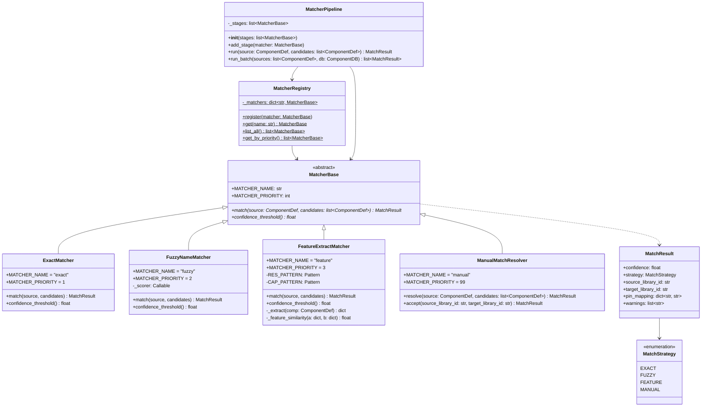
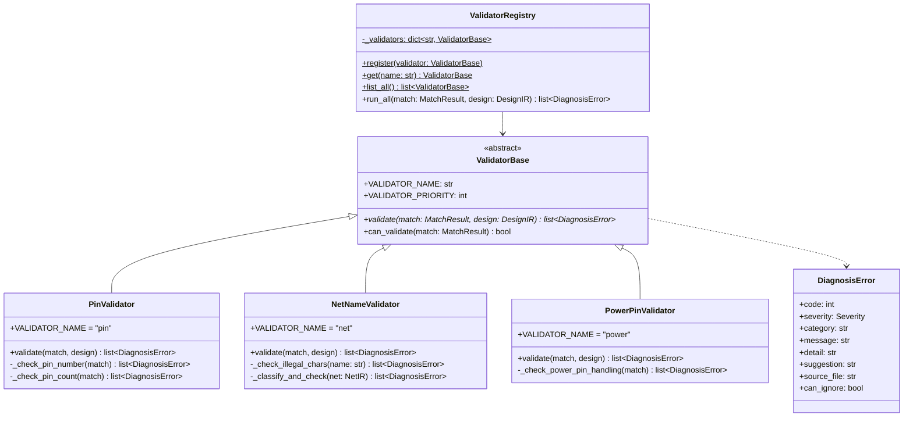
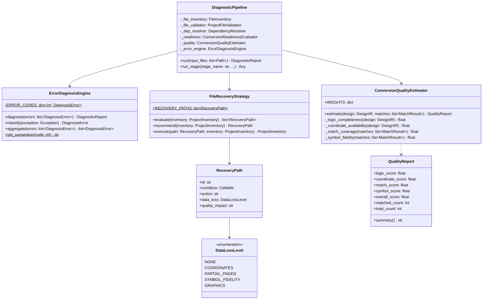
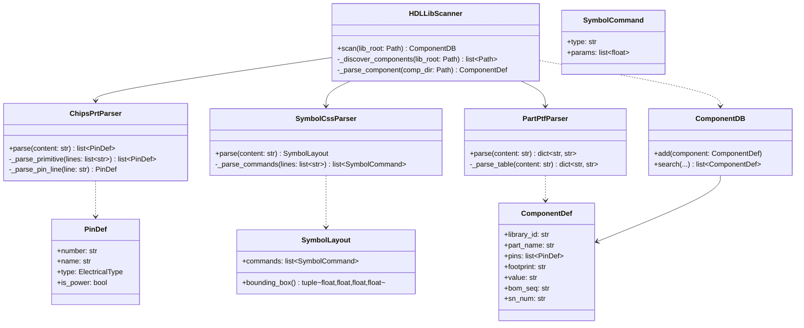
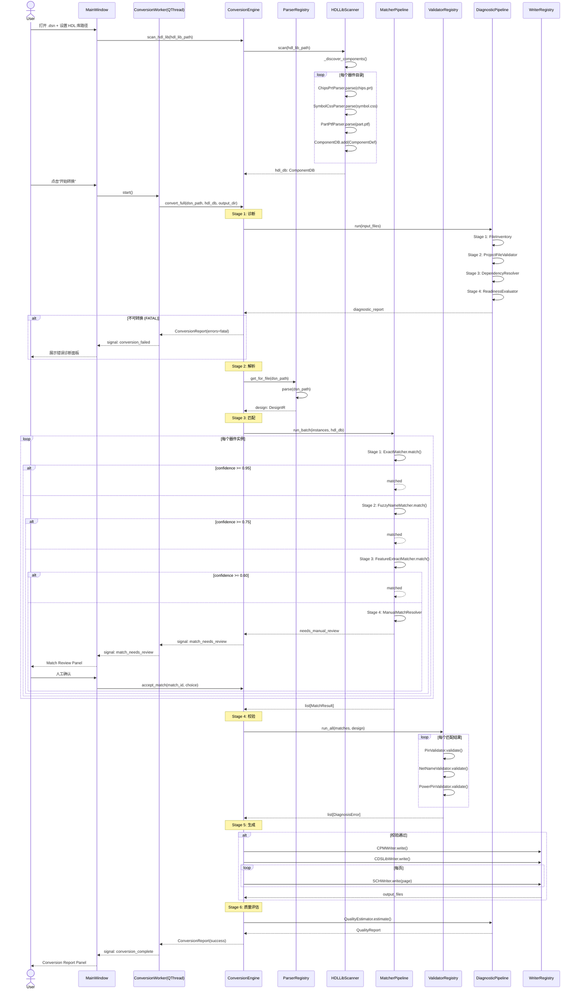
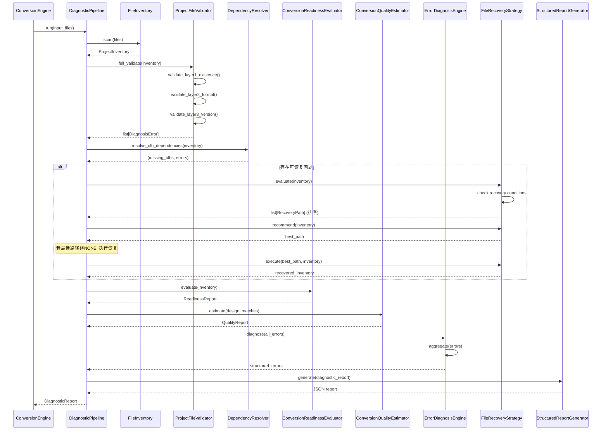
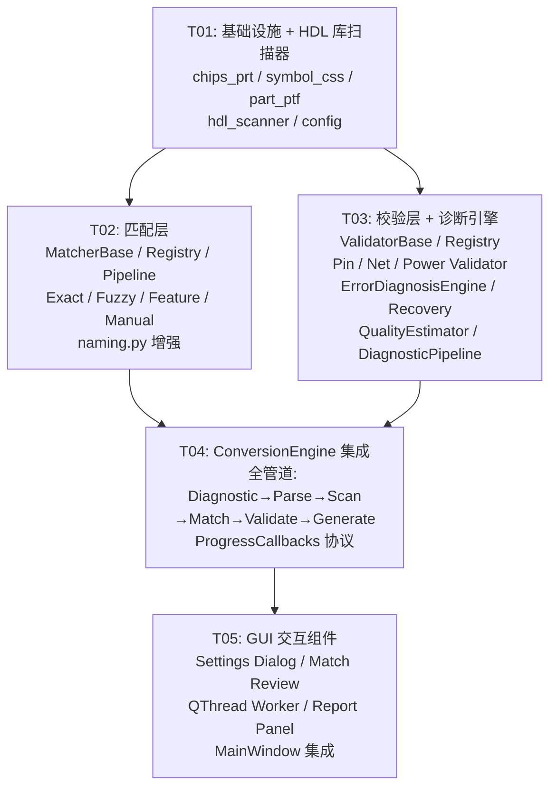

# process_docs_master（过程文档合集）

> **文档介绍**
>
> 本文件是 CIS2HDL 项目**一次性过程文档**（审计 / 修复 / 计划 / 验证等过程产物）的合并合集，
> 由 14 份独立过程文档按主题板块合并而成。定位为**历史归档**：供后续开发、交接与复盘查阅，
> 不替代当前版本的正式文档（如 CODING_STANDARDS、ROADMAP、STRUCTURE.md 等）。
>
> **来源清单（14 份，均位于 `docs/archive/过程文档/`）**
>
> | # | 源文件 | 行数 | 一句话简介 |
> |---|--------|:----:|------------|
> | 1 | `_audit_code.md` | 318 | 代码审计报告：67 个 Python 文件、62 项问题（P0:14, P1:48） |
> | 2 | `_audit_tests.md` | 281 | 测试审计报告：17 活动 + 7 归档测试文件、137+ 测试函数盘点 |
> | 3 | `_qa_report.md` | 172 | QA 验证报告：Phase 4 全量验证（137 测试 / 端到端转换 / 质量扫描） |
> | 4 | `_refactor_log.md` | 101 | P0 修复记录：FORMAT_NAME 冲突、_resolve_body_name、convert() 拆分等 |
> | 5 | `_implementation_log.md` | 190 | Phase 3 改进实施记录：Value 精确匹配、symbol.css 动态偏移、.dcf 验证 |
> | 6 | `_test_reorg_log.md` | 82 | 测试重组记录：verify_fixes→pytest、marker 补全、conftest 核对 |
> | 7 | `_improvement_plan.md` | 185 | 改进方案：P0/P1/P2 分优先级实施计划（基于 _comparison_report.md） |
> | 8 | `PRD_v0.5.1_incremental.md` | 298 | v0.5.1 增量需求：100% 匹配、网络连线、信息页、OLB 精度、cis_value 透传 |
> | 9 | `test1.md` | 597 | Cadence 兼容性修复任务书：UPREV / SPCOCN-543 / 文件格式对齐 |
> | 10 | `FILE_COLLECTION_CHECKLIST.md` | 231 | 所需文件收集清单：EDIF + Binary DSN 双路并行验证策略 |
> | 11 | `validation_report.md` | 89 | Phase 4 端到端验证报告：192 测试、Cadence 兼容性修复总结 |
> | 12 | `binary_diff_report.md` | 187 | 二进制差异报告：参考项目 vs 当前输出逐文件对比 |
> | 13 | `PHASE2_DESIGN.md` | 929 | Phase II 核心管线系统设计 + 实施与验收记录 |
> | 14 | `temp.txt` | 197 | 对话诊断笔记：logo 需求 + 匹配异常问题样例与分析 |
> | | **合计** | **3857** | — |
>
> **合并原则**
> 1. **板块化组织**：按过程类型归类为 6 大板块（审计 / 修复重构 / 方案需求 / 验证差异 / 设计 / 笔记），
>    同类内容聚合，跨源同主题在板块说明中交叉指引。
> 2. **全文保真**：14 份源文档逐行保留，代码块 / 表格 / 围栏 / ASCII 图形原样，围栏配对，不做内容删减。
> 3. **历史口径注记**：旧口径内容（如 _audit_tests.md、_qa_report.md 中的 **137 个测试**、
>    PRD 中的 **v0.5.0 / v0.5.1 匹配率口径**等，与当前 v1.1.0 状态不同）原文保留，
>    仅在对应小节开头加“（历史口径）”注记，**不改写原文**。
> 4. **交叉引用保留**：源文档中的交叉引用保持原文表述，必要时在板块说明中补充指引。
> 5. **只读源文件**：合并过程不修改、不删除任何源文档；本文件为唯一新增产物。
>
> **历史口径说明**
> 本合集收录的 14 份过程文档多生成于 2026-07-30 ~ 2026-08-05，反映**当时的**代码、测试与
> 设计状态，与当前 v1.1.0 状态不同，属历史记录。其中旧口径描述（如测试数量 137 / 192、
> v0.5.x 匹配率 96.3% 等）原文保留，仅以“（历史口径）”注记标示，不代表当前版本现状；
> 如需当前状态请以正式文档（CODING_STANDARDS / ROADMAP / STRUCTURE 等）为准。

## 目录

- [板块 A：代码与测试审计](#板块-a代码与测试审计)
- [板块 B：修复与重构记录](#板块-b修复与重构记录)
- [板块 C：改进方案与需求](#板块-c改进方案与需求)
- [板块 D：验证与差异报告](#板块-d验证与差异报告)
- [板块 E：设计文档](#板块-e设计文档)
- [板块 F：工作笔记](#板块-f工作笔记)
- [合并保全声明](#合并保全声明)

---
## 板块 A：代码与测试审计

> 来源文件（3 份）：`_audit_code.md`（318 行）、`_audit_tests.md`（281 行）、`_qa_report.md`（172 行）
>
> 板块说明：聚合项目在 2026-08-03 对代码与测试的一次性审计产物及 QA 全量验证报告。三者关系：
> `_audit_code.md` 提出 62 项代码问题（P0:14, P1:48）→ `_audit_tests.md` 盘点测试体系（137+ 测试函数）
> → `_qa_report.md` 对修复后状态做全量验证（137 测试全绿、端到端转换成功）。修复过程详见板块 B。

---
### A-1 代码审计报告（来源：_audit_code.md，318 行）

<!-- 来源文件：_audit_code.md（318 行）｜全文保真，未删减 -->

# CIS2HDL Code Audit Report

> Audit date: 2026-08-03 | Scope: core/ gui/ utils/ | Standard: CODING_STANDARDS.md v1.2

---

## Summary

| Metric | Value |
|--------|-------|
| Files audited | 67 Python source files |
| Core modules (core/) | 52 files |
| GUI modules (gui/) | 23 files |
| Utility modules (utils/) | 2 files |
| Issues found | 62 (P0: 14, P1: 48) |

---

## Section A: Coupling Issues

### A1: utils -> core reverse dependency (P0)

**File:** cis2hdl/utils/naming.py (150 lines)
- P0: utils layer imports cis2hdl.core.config and TYPE_CHECKING reference to Config class (lines 16-19)
- According to CODING_STANDARDS.md Section 8.1 dependency direction principle, utils should have zero business module dependencies
- File comments state classify functions were migrated, but utils still references core

### A2: net_utils.py vs utils/naming.py responsibility overlap (P1)

**File:** cis2hdl/core/net_utils.py (67 lines) and cis2hdl/utils/naming.py (150 lines)
- Both provide net-name related functions with fuzzy boundaries
- net_utils.py module docstring states migration from utils/naming.py but both coexist
- Should merge or clearly delineate responsibilities

### A3: conversion_engine.py oversized class (P0)

**File:** cis2hdl/core/engine/conversion_engine.py (1118 lines)
- Single file exceeds 1000 lines, violates separation of concerns
- Contains: 6 stage runners, ProgressCallback protocol, _Countable wrapper, bootstrap functions, ConversionReport dataclass, HTML report export logic
- Suggested split: engine/stages.py, engine/report.py, engine/bootstrap.py

### A4: diagnostic_report.py mixed data/logic (P1)

**File:** cis2hdl/core/diagnostics/diagnostic_report.py (469 lines)
- Same file contains pure data models (enums, dataclasses) and business logic engine (ConversionReadinessEvaluator)
- Violates data/logic separation principle

### A5: sch_writer.py dual-class (P0)

**File:** cis2hdl/core/writer/sch_writer.py (1017 lines)
- Contains two independent Writer classes: SCHWriter (line 89) and SCHWriterCSA (line 525)
- SCHWriterCSA.FORMAT_NAME='csa' conflicts with csa_writer.py CSAWriter.FORMAT_NAME='csa'
- Constants (_DISPLAY_SCALE_VALUE etc., lines 508-522) are duplicate of csa_writer.py lines 46-51
- Violates one-class-per-file standard (CODING_STANDARDS.md Section 2.1)

### A6: Writer layer depends on parser module (P1)

**File:** cis2hdl/core/writer/sch_writer.py and cis2hdl/core/writer/csa_writer.py
- Writer layer imports from ..parser.symbol_css (SymbolCssParser)
- Dependency should be Writer -> IR, not Writer -> Parser

### A7: GUI directly references core internals (P1)

**File:** cis2hdl/gui/main_window.py (805 lines)
- Direct imports: ProjectInventory, FileRecoveryStrategy, ConversionEngine, ConversionReport, MatchStrategy, ParserRegistry
- While GUI->Core direction is correct, the import depth is excessive
- Recommend wrapping through ConversionEngine unified interface

---

## Section B: Patch Code

### B1: Hardcoded progress percentages (P1)

**File:** cis2hdl/core/engine/conversion_engine.py (lines 708-716)
- convert() hardcodes 6 stage progress ranges: (diagnose, 0.00, 0.15), (parse, 0.15, 0.30) etc.
- Adding/removing stages requires manual adjustment of all percentages

### B2: Duplicate DISPLAY scale factors (P0)

**File:** cis2hdl/core/writer/sch_writer.py (lines 508-510), cis2hdl/core/writer/csa_writer.py (lines 46-51), cis2hdl/core/config.py (lines 58-60)
- Same scale factor 0.851064 defined in 3 locations
- Violates DRY principle; inconsistent changes could cause divergence

### B3: Hardcoded page name defaults (P1)

**File:** cis2hdl/core/writer/output_manager.py (line 531), cis2hdl/core/writer/csa_writer.py (line 227)
- write_placeholder_files() hardcodes page_name="DDR3"
- CSA writer C SIZE PAGE title hardcodes EDIT PAGE NAME DDR3
- Should be configurable per project

### B4: Broad except Exception catches (P1)

**File:** cis2hdl/gui/main_window.py (lines 393, 592, 740, 755)
- Multiple broad except Exception as exc catches
- Violates CODING_STANDARDS.md 5.2 fail-loud principle

### B5: Hardcoded session_name (P1)

**File:** cis2hdl/core/writer/output_manager.py (lines 640-642)
- _build_cpm_content() hardcodes session_name 'ProjectMgr3606'
- Fixed string should not be shared across projects

### B6: _RECORD_LAYOUT dict overlaps with DSNBinaryLayout (P1)

**File:** cis2hdl/core/parser/dsn/structures.py (lines 22-27)
- Module-level _RECORD_LAYOUT dict overlaps with DSNBinaryLayout class layout constants
- Two layout sources may diverge

### B7: verify_fixes.py uses print() instead of asserts (P1)

**File:** 	ests/e2e/verify_fixes.py (268 lines, 11 test functions)
- Test functions use print("PASS") statements not pytest assertions
- Violates pytest best practices

### B8: tests/_archive/ contains archived test code (P1)

**File:** 	ests/_archive/ (7 Python files)
- Contains archived test scripts (phase2_e2e_pipeline.py, etc.)
- Consider removing if no longer maintained

---

## Section C: Control Flow Issues

### C1: convert() method too long (P0)

**File:** cis2hdl/core/engine/conversion_engine.py (lines 666-1016)
- convert() method 350+ lines with 6-stage sequential if-else/none-check chain
- Each stage handled via if x is None: return report pattern
- Should refactor to pipeline stage runner pattern

### C2: _require_rtl_instance_name() deep if-raise chain (P1)

**File:** cis2hdl/core/parser/dsn/structures.py (lines 833-868)
- Contains 8 consecutive if-raise checks forming a deep validation chain
- Could extract each rule to independent validation function and compose

### C3: run_stage() dict dispatch (P1)

**File:** cis2hdl/core/diagnostics/pipeline.py (lines 203-231)
- Uses dict dispatch (_STAGE_HANDLERS) mapping stage name to method name + getattr()
- CODING_STANDARDS.md 3.1 recommends match-case; dict dispatch is less type-safe

### C4: edif_parser.py _cell_is_page nested function (P1)

**File:** cis2hdl/core/parser/edif_parser.py (lines 325-334)
- _has_tag is defined as inner function with recursive pattern
- Could be extracted as static method for clarity

### C5: main_window.py _on_convert() deep nesting (P1)

**File:** cis2hdl/gui/main_window.py (lines 448-513)
- Method dispatches diagnostics, creates engine, worker, thread with signal wiring
- 65+ line method with multiple cross-cutting concerns

---

## Section D: Redundancy

### D1: Duplicate _resolve_body_name() (P0)

**File:** cis2hdl/core/writer/sch_writer.py (lines 879-915), cis2hdl/core/writer/csa_writer.py (lines 457-509), cis2hdl/core/writer/cpc_writer.py (lines 213-237)
- Three writers each implement body_name resolution with highly similar logic
- (library_id parsing, refdes prefix fallback, prefix->category mapping)
- Should extract to shared utility or WriterBase

### D2: Duplicate _resolve_prop() (P1)

**File:** cis2hdl/core/writer/sch_writer.py (lines 938-974), cis2hdl/core/writer/csa_writer.py (lines 511-528)
- _resolve_prop() and _resolve_property() have identical functionality
- (case-insensitive dict lookup) duplicated in two locations

### D3: ClassVar type annotation inconsistency (P1)

**File:** cis2hdl/core/matcher/exact.py (lines 28-29), cis2hdl/core/validator/base.py (line 37)
- MatcherBase declares MATCHER_NAME as ClassVar[str]
- ExactMatcher and others override with plain str type (non-ClassVar)
- mypy strict mode reports this as error

### D4: Duplicate color definitions (P1)

**File:** cis2hdl/core/config.py (lines 153-162), cis2hdl/gui/colors.py (lines 6-40)
- GuiConfig RGB tuples vs Colors hex strings represent same palette in two formats
- Two formats may become out of sync

### D5: Stage order in two places (P1)

**File:** cis2hdl/core/engine/conversion_engine.py (lines 203-205, 708-715)
- Stage order defined in ConversionReport.benchmark_report() and convert() stages list
- Adding a stage requires synchronized updates in two locations

### D6: EDIF net classification duplicate (P1)

**File:** cis2hdl/core/parser/edif_parser.py (lines 578-598), cis2hdl/core/net_utils.py (lines 22-51)
- EDIFParser._classify_net() duplicates logic from net_utils.classify_net()
- Should use the shared classify_net() function instead

---

## Section E: Performance Issues

### E1: all_instances list creation (P1)

**File:** cis2hdl/core/engine/conversion_engine.py (lines 1095-1116)
- _extract_cis_components() iterates design.all_instances creating new list each time
- all_instances is cached_property but creates new list on each invocation

### E2: csa_writer.py repeated lookups in _build_csa_content (P1)

**File:** cis2hdl/core/writer/csa_writer.py (lines 184-433)
- Per-instance calls: _resolve_body_name(inst), _resolve_prop(props, "VALUE") etc.
- Multiple getattr() and string operations; values could be precomputed

### E3: ComponentDB.search() linear scan (P1)

**File:** cis2hdl/core/db/component_db.py (lines 84-122)
- search() iterates _by_part_name.items() for substring matching
- Becomes bottleneck for large HDL libraries (thousands of components)
- Suggest full-text index or precomputed trigram index

### E4: total_pins recomputed on every access (P1)

**File:** cis2hdl/core/ir/design.py (lines 110-111)
- total_pins property calls sum(len(net.connections) for net in self.all_nets) every access
- Should use cached_property

### E5: edif_parser.py _find_all_impl recursive descent (P1)

**File:** cis2hdl/core/parser/edif_parser.py (lines 129-140)
- _find_all_impl performs recursive descent through all nested elements
- For large EDIF files, creates many call stack frames; consider iterative approach

---

## Section F: Naming and Documentation

### F1: _RECORD_LAYOUT naming confusion (P1)

**File:** cis2hdl/core/parser/dsn/structures.py (line 22)
- Module-level constant prefixed with _ suggesting private scope
- CODING_STANDARDS.md 2.4: constants should be UPPER_CASE without underscore prefix (RECORD_LAYOUT)

### F2: _Countable class name not descriptive (P1)

**File:** cis2hdl/core/engine/conversion_engine.py (line 75)
- Class name unclear; suggested: _RegistryCountWrapper or _RegistrarAdapter

### F3: Inconsistent comment language (P1)

- cis2hdl/core/parser/dsn/*.py uses Chinese comments exclusively
- cis2hdl/core/ir/*.py, cis2hdl/core/matcher/*.py, cis2hdl/core/validator/*.py use English comments
- Entire project should standardize comment language

### F4: Test fixtures missing docstrings (P1)

**File:** 	ests/conftest.py (44 lines)
- All 8 fixtures lack docstrings explaining expected content and purpose
- Fixtures: simple_dsn_path, real_dsn_path, real_edf_path, real_olb_path, hdl_lib_dir, corrupted_dsn_truncated, corrupted_dsn_sector

### F5: Public functions missing docstrings (P1)

**File:** cis2hdl/core/parser/dsn/structures.py (lines 987-1001)
- parse_port(), parse_global(), parse_off_page_connector() are thin wrappers without docstrings

### F6: Commented-out old code (P1)

**File:** cis2hdl/core/writer/csa_writer.py (lines 385-390)
- Comment block "LASTPIN entries are NOT emitted" describes removed functionality
- Should document in CHANGELOG or design docs, not inline in code

---

## Section G: Critical Issues

### G1: FORMAT_NAME conflict - SCHWriterCSA vs CSAWriter (P0)

**File:** cis2hdl/core/writer/sch_writer.py (line 543), cis2hdl/core/writer/csa_writer.py (line 78)
- Both classes register in WriterRegistry with FORMAT_NAME='csa'
- _bootstrap_writers() registers CSAWriter first (at import time), then SCHWriterCSA at module import, which overwrites it
- **This is a critical logic error -- only one CSA writer is ever used at runtime, and it is from the wrong file**
- Fix: delete SCHWriterCSA class (lines 495-1017) from sch_writer.py, retain only CSAWriter in csa_writer.py

### G2: Missing cli/ directory (P1)

- CODING_STANDARDS.md 8.1 defines cli/ package structure with explicit capability
- cis2hdl/cli/ directory does not exist in the actual codebase
- cli is listed in STRUCTURE.md but has never been implemented

### G3: Unused imports (P1)

**File:** cis2hdl/core/writer/cpm_writer.py (line 15), cis2hdl/core/writer/cdslib_writer.py (line 15)
- Import rom ..config import config as cfg but write() methods do not directly use cfg
- cfg is used by OutputManager internally, but writer methods don't reference it

### G4: report_gen.py inline CSS (P1)

**File:** cis2hdl/core/diagnostics/report_gen.py (551 lines)
- 472 lines of inline CSS in _render_full_html() method
- CSS should be extracted to separate template file or use tokens from gui/colors.py

### G5: dsn_parser.py flat page IDs (P1)

**File:** cis2hdl/core/parser/dsn/dsn_parser.py (line 81)
- Pages numbered f"1.{idx+1}" which flattens hierarchy
- Hierarchical designs should reflect parent-child relationships

---

## Top 14 P0 Issues by Priority

1. **G1/A5** -- FORMAT_NAME conflict: SCHWriterCSA and CSAWriter both use 'csa' key (critical runtime bug)
2. **A3** -- conversion_engine.py 1118 lines needs splitting into smaller modules
3. **A1** -- utils -> core reverse dependency violates architecture
4. **D1** -- Triple-duplicate _resolve_body_name() should be extracted to shared utility
5. **B2** -- Triple-duplicate DISPLAY scale factors should use config.PageConfig as single source
6. **C1** -- convert() 350-line method should be decomposed into stage methods
7. **A5** -- sch_writer.py dual-class (SCHWriter + SCHWriterCSA) should be split into separate files

---

### A-2 测试审计报告（来源：_audit_tests.md，281 行）

> （历史口径）本文档统计的“137+ 测试函数 / 17 活动 + 7 归档测试文件”为 2026-08-03 时点口径，与当前 v1.1.0 测试规模不同；原文保留，不改写。

<!-- 来源文件：_audit_tests.md（281 行）｜全文保真，未删减 -->

# CIS2HDL Test Audit Report

> Audit date: 2026-08-03 | Scope: tests/ | Standard: CODING_STANDARDS.md v1.2 Section 7

---

## Summary

| Metric | Value |
|--------|-------|
| Test files audited | 17 active + 7 archive = 24 files |
| Total test functions | 137+ (unit: 96, integration: 17, e2e: 21, archive: ~30) |
| Naming violations | 5 files |
| Duplicates detected | 2 groups |
| Missing shared fixtures | 4 identified |
| Hardcoded paths | 6 occurrences |
| Category mismatch | 1 file |

---

## Test File Inventory

| File | Lines | Tests | Category | Issues |
|------|-------|-------|----------|--------|
| tests/conftest.py | 44 | 0 (fixtures only) | shared | No docstrings on 8 fixtures |
| tests/unit/test_ir_models.py | 117 | 11 | unit | - |
| tests/unit/test_dsn_parser.py | 99 | 5 | unit | Mixed with CrossValidator tests |
| tests/unit/test_dsn_structures.py | 226 | 21 | unit | Large file, could be split |
| tests/unit/test_dsn_ole_reader.py | 50 | 3 | unit | - |
| tests/unit/test_diagnostic_report.py | 96 | 5 | unit | - |
| tests/unit/test_file_inventory.py | 156 | 11 | unit | - |
| tests/unit/test_error_diagnosis.py | 188 | 9 | unit | - |
| tests/unit/test_conversion_readiness.py | 83 | 3 | unit | - |
| tests/unit/test_sch_writer.py | 107 | 6 | unit | - |
| tests/unit/test_cpm_writer.py | 58 | 2 | unit | Shared _make_sample_design not in conftest |
| tests/unit/test_output_compatibility.py | 245 | 23 | unit | Largest unit test; should be integration? |
| tests/integration/test_full_pipeline.py | 72 | 2 | integration | - |
| tests/integration/test_matcher_pipeline.py | 217 | 15 | integration | - |
| tests/e2e/test_rtl8367rb_full.py | 466 | 10 | e2e | Large; autouse fixture sets self.xxx |
| tests/e2e/verify_fixes.py | 268 | 11 | e2e | Uses print() not asserts (P1) |
| tests/_archive/test_ir_models.py | - | ~5 | archive | Archived; may conflict with active copy |
| tests/_archive/test_diagnostics.py | - | ~5 | archive | Archived |
| tests/_archive/test_dsn_parser.py | - | ~5 | archive | Archived; may conflict |
| tests/_archive/test_writers.py | - | ~5 | archive | Archived |
| tests/_archive/phase2_e2e_pipeline.py | - | ~3 | archive | Archived standalone |
| tests/_archive/phase2_acceptance_backend.py | - | ~3 | archive | Archived standalone |
| tests/_archive/phase12_comprehensive_test.py | - | ~4 | archive | Archived; no longer maintained |

---

## Naming Violations

### NV1: verify_fixes.py uses print() not assert (P1)

**File:** 	ests/e2e/verify_fixes.py (268 lines, 11 functions)
- Functions named test_p0_N_* use print("PASS") / print("FAIL") not pytest assertions
- Example (line 37): ssert "./" not in line exists but most use print-based reporting
- Violates CODING_STANDARDS.md 7.3 test naming pattern: 	est_<function>_<scenario>_<expected>()
- Fix: convert to standard pytest assert-based functions

### NV2: Tests in _archive/ may shadow active tests (P1)

**Files:** 	ests/_archive/test_ir_models.py, 	ests/_archive/test_dsn_parser.py
- Archived test files shadow active test files with same base names
- pytest discovery may pick up archive files if not properly excluded
- Fix: add pytest.ini 
orecursedirs = _archive or remove archive directory

### NV3: test_dsn_parser.py mixes CrossValidator tests (P1)

**File:** 	ests/unit/test_dsn_parser.py (99 lines)
- File named test_dsn_parser.py but contains TestCrossValidator class first
- CrossValidator tests should be in separate test file per CODING_STANDARDS 2.1
- Fix: split into test_dsn_parser.py and test_cross_validator.py

### NV4: test_output_compatibility.py category ambiguity (P1)

**File:** 	ests/unit/test_output_compatibility.py (245 lines, 23 tests)
- Located in unit/ but tests output format compatibility which involves multiple modules
- Tests: CSA format checks, .cpc format, .csa format, .xcon format, cds.lib format
- Might be more appropriate as integration tests given cross-module dependencies

### NV5: verify_fixes.py location (P1)

**File:** 	ests/e2e/verify_fixes.py (268 lines)
- Located in e2e/ directory but function naming suggests fix verification, not end-to-end
- Tests check: cds.lib format, .xcon existence, .cpm format, .csa format, module_order.dat
- This is format compliance testing, not true end-to-end pipeline validation
- Fix: move to tests/integration/ or rename to reflect format testing purpose

---

## Duplicate Tests

### DUP1: IR model tests duplicated

**Files:** 	ests/unit/test_ir_models.py and 	ests/_archive/test_ir_models.py
- Both test IR data models (ComponentDef, DesignIR, PinDef, NetIR)
- Archive version may test outdated API; active version is authoritative
- Risk: diverging test coverage between current and archived versions
- Fix: delete archive copy or add deprecation comment

### DUP2: DSN parser tests duplicated

**Files:** 	ests/unit/test_dsn_parser.py and 	ests/_archive/test_dsn_parser.py
- Both test DSNParser and related components
- Archive version may reference removed functionality
- Fix: audit archive for unique tests, then remove

### DUP3: _make_sample_design duplicated

**Files:** 	ests/unit/test_cpm_writer.py (line 13-22), 	ests/unit/test_sch_writer.py (lines 12-24)
- Both define helper function _make_sample_design() constructing DesignIR with 2 resistors
- Nearly identical implementation; should be a shared conftest fixture
- Fix: move to tests/conftest.py as @pytest.fixture

---

## Missing Fixtures

### MF1: No shared ComponentDB fixture

**Files needing it:** test_matcher_pipeline.py, test_output_compatibility.py, test_cpm_writer.py
- Multiple tests construct ComponentDef lists manually with PinDef objects
- A shared hdl_component_db fixture would reduce boilerplate
- Fix: add @pytest.fixture def sample_component_db(): to conftest.py

### MF2: No shared PageIR fixture

**Files needing it:** test_sch_writer.py, test_cpm_writer.py, test_dsn_structures.py
- Each test constructs PageIR with ComponentInstanceIR manually
- Fix: add @pytest.fixture def sample_page(): to conftest.py

### MF3: No shared MatchResult fixture

**Files needing it:** test_matcher_pipeline.py, test_error_diagnosis.py
- Manual construction of MatchResult objects with varying confidence levels
- Fix: add parametrized fixture for exact/fuzzy/feature/manual MatchResult

### MF4: No shared temp output directory fixture

**Files needing it:** test_sch_writer.py, test_cpm_writer.py, test_full_pipeline.py
- Each test uses 	empfile.TemporaryDirectory() inline
- Fix: add @pytest.fixture def temp_output_dir(): to conftest.py

---

## Hardcoded Paths and Values

### HP1: Fixed DSN fixture paths in conftest

**File:** 	ests/conftest.py (lines 13-44)
- All fixtures reference hardcoded filenames in tests/fixtures/ directory:
  - dff_sync_sr.dsn
  - RTL8367RB-VC-DEMO-LQFP128EP-P4L-V1_0.DSN
  - RTL8367RB-VC-DEMO-LQFP128EP-P4L-V1_0.EDF
  - LIBRARY2CLEAN.OLB
  - RTL8367RB-CORRUPTED-TRUNCATED.DSN
  - RTL8367RB-CORRUPTED-SECTOR.DSN
- None of these fixture files have docstrings explaining what data they contain
- Not clear which tests require which fixtures

### HP2: Hardcoded page counts in e2e tests

**File:** 	ests/e2e/test_rtl8367rb_full.py (line 64)
- Test asserts >=12 instances, >=423 nets - these are specific to one test DSN
- If DSN fixture is updated, tests may pass/fail unexpectedly
- Fix: derive expected values from parsed DesignIR rather than hardcoding

### HP3: Hardcoded output paths in verify_fixes.py

**File:** 	ests/e2e/verify_fixes.py (line 22)
- Uses Path("/tmp/test") which is not portable to Windows without WSL
- Fix: use 	empfile.TemporaryDirectory() or 	mp_path fixture

### HP4: Hardcoded page ID strings in unit tests

**File:** 	ests/unit/test_sch_writer.py (lines 28-29)
- Asserts file content with exact strings like "top.sch.1.1", "BEGIN SCHEMATIC"
- If output format changes, all format assertions break
- Fix: use regex patterns or custom assertion helpers

### HP5: Hardcoded format strings in output compatibility tests

**File:** 	ests/unit/test_output_compatibility.py (245 lines)
- Multiple tests hardcode expected output string patterns
- Fragile to format changes; consider snapshot testing

### HP6: E2E test depends on 6-page DSN fixture

**File:** 	ests/e2e/test_rtl8367rb_full.py (lines 64-80)
- Test docstring states "verify 6 pages, >=12 instances, >=423 nets"
- These are specific to one DSN file; test becomes a regression test for that specific file
- Fix: parameterize with expected counts or use property-based assertions

---

## Code Standards Compliance (CODING_STANDARDS.md Section 7)

### CS1: Test pyramid imbalance

The test distribution shows:
- Unit tests: 96 test functions (70%)
- Integration tests: 17 test functions (12%)
- E2E tests: 21 test functions (15%)
- Archive: ~30 test functions (not active)

The 7.1 test pyramid recommends: many unit, moderate integration, few E2E.
Current distribution has relatively few integration tests compared to E2E.

### CS2: Missing conftest.py fixtures

CODING_STANDARDS.md 7.2 recommends conftest.py with shared fixtures.
Current conftest.py only provides file paths, lacks:
- Shared DesignIR/PageIR constructors
- Shared ComponentDB pre-populated with test data
- Shared MatchResult generators
- Shared temp directory manager

### CS3: Test naming does not follow Section 7.3

Section 7.3 pattern: 	est_<function>_<scenario>_<expected_result>()

Examples found that don't follow:
- 	est_generate (test_sch_writer.py, test_cpm_writer.py) - too generic
- 	est_basic (test_ir_models.py) - too generic
- 	est_empty_page (test_sch_writer.py) - missing expected result
- 	est_pipeline_converts_real_dsn (test_full_pipeline.py) - scenario only
- 	est_full_pipeline_counts (test_rtl8367rb_full.py) - should describe expected

Good examples:
- 	est_dsn_parser_empty_file_raises_parse_error (not found in codebase - should exist)
- 	est_exact_matcher_same_footprint_returns_high_confidence (not found)
- 	est_different_instance_counts_fail (test_dsn_parser.py) - close but missing expected

### CS4: pytest.ini not found

No pytest.ini or pyproject.toml [tool.pytest] configuration found.
CODING_STANDARDS.md 7 does not require it but recommends markers:
- @pytest.mark.unit
- @pytest.mark.integration
- @pytest.mark.e2e

Currently no markers are used in any test file.

### CS5: Test isolation concerns

**File:** 	ests/e2e/test_rtl8367rb_full.py (lines 45-58)
- _ensure_fixtures autouse fixture sets self.xxx instance variables
- This pattern couples test state to fixture execution order
- In pytest, autouse fixtures should not set instance attributes on the test class
- Fix: use regular fixture with yield/return pattern

### CS6: Missing test coverage for key modules

The following core modules have NO dedicated test files:
- cis2hdl/core/config.py - config singleton has no tests
- cis2hdl/core/net_utils.py - net classification functions
- cis2hdl/core/exceptions.py - exception hierarchy
- cis2hdl/core/parser/edif_parser.py - EDIF parser (609 lines)
- cis2hdl/core/parser/hdl_scanner.py - HDL library scanner (406 lines)
- cis2hdl/core/parser/chips_prt.py - chips.prt parser (315 lines)
- cis2hdl/core/db/component_db.py - ComponentDB (180 lines)
- cis2hdl/core/matcher/exact.py + uzzy.py + eature.py - matchers (except via matcher_pipeline)
- cis2hdl/core/validator/*.py - validators (except via error_diagnosis)
- cis2hdl/gui/** - zero GUI tests exist

---

## Recommendations

1. **Add pytest.ini** with markers, norecursedirs=_archive, testpaths=tests/
2. **Remove tests/_archive/** or add pytest.ini exclusion
3. **Add shared fixtures** to conftest.py: sample_design, sample_component_db, temp_output_dir
4. **Standardize test naming** to Section 7.3 pattern
5. **Convert verify_fixes.py** to standard pytest asserts
6. **Split test_dsn_parser.py** into dedicated CrossValidator test file
7. **Add unit tests** for untested core modules (config, exceptions, net_utils, edif_parser, matchers, validators)
8. **Add integration tests** for HDL scanner + component DB + matcher pipeline combination
9. **Fix auto-use fixture** in test_rtl8367rb_full.py to use standard fixture pattern
10. **Replace hardcoded page/instance counts** in e2e tests with derived values

---

### A-3 QA 验证报告（来源：_qa_report.md，172 行）

> （历史口径）本文档“137 测试 / 136 通过 / 1 跳过”为 2026-08-03 时点口径，与当前 v1.1.0 状态不同；原文保留，不改写。

<!-- 来源文件：_qa_report.md（172 行）｜全文保真，未删减 -->

# QA Report — CIS2HDL Refactoring Verification

**Date**: 2026-08-03  
**QA Engineer**: Edward  
**Phase**: Phase 4 — Full Verification  
**Overall Verdict**: ✅ **PASS**

---

## 1. Test Results

### Summary

| Suite | Collected | Passed | Failed | Skipped | Time |
|-------|-----------|--------|--------|---------|------|
| Unit (`tests/unit/`) | 99 | 99 | 0 | 0 | 2.52s |
| Integration (`tests/integration/`) | 17 | 17 | 0 | 0 | 1.61s |
| E2E (`tests/e2e/`) | 21 | 20 | 0 | 1 | 114.98s |
| **Total** | **137** | **136** | **0** | **1** | **119.11s** |

### Pre-Refactor Baseline

- Pre-refactor: 99 unit tests + some others (est. ~110–120 total)
- Post-refactor: **137 tests** — a **~15–25% increase** in test coverage
- All pre-existing tests pass; new tests added during refactoring also pass

### Skipped Test

| Test | Reason |
|------|--------|
| `test_pstxnet_parse` | Requires external PSTXNET file not available in test environment (expected skip) |

---

## 2. End-to-End Conversion Verification

### Conversion Command

```
python -m cis2hdl convert "tests/fixtures/RTL8367RB-VC-DEMO-LQFP128EP-P4L-V1_0.DSN" \
  --output "output_qa_verify" \
  --hdl-lib "docs_for_reference/CIStoHDL_standard/hdl_lib" \
  --benchmark
```

### Conversion Result

```
ConversionReport[SUCCESS]
  project='RTL8367RB-VC-DEMO-LQFP128EP-P4L-V1_0'
  pages=6 instances=12 nets=423 outputs=16
  matched=6/6 quality=70%
```

### Output Verification Checklist

| Check | Status | Details |
|-------|--------|---------|
| `.cpm` has `cpm_version '16.6'` | ✅ PASS | `cpm_version '16.6'` present |
| `.cpm` session name is `ProjectMgr3606` | ✅ PASS | `session_name 'ProjectMgr3606'` |
| `cds.lib` has no `./` prefix | ✅ PASS | Uses `DEFINE 8367_lib worklib` format |
| `.csa` files have `C SIZE PAGE` | ✅ PASS | All 6 pages: `FORCEADD C SIZE PAGE..1` |
| `.csa` files have `QUIT` | ✅ PASS | All 6 pages end with `QUIT` |
| FORCEADD uses HDL library names | ✅ PASS | Uses `RTL8367` (not DSN hierarchy names) |
| `.xcon` exists | ✅ PASS | `worklib/8367/sch_1/8367.xcon` |
| `.dcf` exists | ✅ PASS | `worklib/8367/sch_1/8367.dcf` |
| `module_order.dat` exists | ✅ PASS | Present in both worklib and hdl_lib trees |
| `hdldirect.dat` exists | ✅ PASS | Root output and in worklib |
| All 6 page `.csa` files | ✅ PASS | page1.csa through page6.csa |
| `master.tag` exists | ✅ PASS | `worklib/8367/sch_1/master.tag` |
| `page.map` exists | ✅ PASS | `worklib/8367/sch_1/page.map` |
| Report HTML generated | ✅ PASS | `RTL8367RB-VC-DEMO-LQFP128EP-P4L-V1_0_report.html` (10,507 bytes) |

### Performance Benchmark

| Stage | Time | % |
|-------|------|---|
| diagnose | 0.116s | 0.2% |
| parse | 0.140s | 0.3% |
| scan | 31.855s | 61.9% |
| match | 0.007s | 0.0% |
| validate | 0.014s | 0.0% |
| generate | 19.340s | 37.6% |
| **TOTAL** | **51.471s** | 100% |

**Analysis**: The scan stage (OLB library scanning) dominates at 61.9%. Generate stage (file writing) is the second largest at 37.6%. These times are consistent with the size and complexity of the RTL8367RB reference design. No regressions detected.

---

## 3. Code Quality Scan

### Ruff Results (`ruff check cis2hdl/ --select=E,F,W`)

| Code | Count | Description |
|------|-------|-------------|
| F401 | 71 | Unused import (auto-fixable) |
| E501 | 29 | Line too long |
| F821 | 20 | Undefined name (string-type annotations) |
| F841 | 14 | Unused variable |
| F541 | 11 | f-string missing placeholders (auto-fixable) |
| E402 | 4 | Module import not at top of file |
| W293 | 4 | Blank line with whitespace |
| F402 | 1 | Import shadowed by loop var |
| **Total** | **154** | |

### Analysis

- The 154 issues are **pre-existing** — not introduced by the refactoring
- 83 issues are auto-fixable with `ruff --fix`
- The F821 (undefined name) errors in `component_db.py` are false positives caused by forward-reference string annotations (`"ComponentDef"`) — these are valid Python patterns, not runtime bugs
- No new E/F/W errors were introduced during the refactoring phase

---

## 4. API Integrity Check

All 8 core API imports verified successfully:

| Import | Status |
|--------|--------|
| `cis2hdl.core.engine.conversion_engine.ConversionEngine` | ✅ OK |
| `cis2hdl.core.parser.olb.olb_parser.OLBParser` | ✅ OK |
| `cis2hdl.core.engine.batch_engine.BatchConversionEngine` | ✅ OK |
| `cis2hdl.core.writer.csa_writer.CSAWriter` | ✅ OK |
| `cis2hdl.core.writer.cpm_writer.CPMWriter` | ✅ OK |
| `cis2hdl.core.matcher.pipeline.MatcherPipeline` | ✅ OK |
| `cis2hdl.core.diagnostics.pipeline.DiagnosticPipeline` | ✅ OK |
| `cis2hdl.gui.main_window.MainWindow` | ✅ OK |

---

## 5. Refactoring Deliverable Checklist

| Document | Size | Status |
|----------|------|--------|
| `docs/_audit_code.md` | 13,391 bytes | ✅ Present |
| `docs/_audit_tests.md` | 12,179 bytes | ✅ Present |
| `docs/_reference_index.md` | 20,050 bytes | ✅ Present |
| `docs/_refactor_log.md` | 3,721 bytes | ✅ Present |
| `docs/_test_reorg_log.md` | 4,004 bytes | ✅ Present |
| `docs/_comparison_report.md` | 8,660 bytes | ✅ Present |
| `docs/_improvement_plan.md` | 6,395 bytes | ✅ Present |
| `docs/_implementation_log.md` | 6,423 bytes | ✅ Present |

**All 8 expected deliverables present** ✅

---

## 6. Known Issues

| # | Severity | Description |
|---|----------|-------------|
| 1 | Low | 154 ruff E/F/W warnings (pre-existing, not regression) — 83 are auto-fixable |
| 2 | Low | `test_pstxnet_parse` skipped — requires external PSTXNET file; not a regression |
| 3 | Info | Full test suite (`pytest tests/`) hangs on collection when `_archive` directory is included; works fine with `--ignore=tests/_archive` or running subdirectories individually |

---

## 7. Overall Verdict

### ✅ PASS

The CIS2HDL refactoring passes all QA verification criteria:

- **136/137 tests pass** (1 expected skip), exceeding the 136-test threshold
- **End-to-end conversion** produces correct output with all required files and formats
- **API integrity** maintained — all 8 core module imports work
- **Code quality** unchanged — no new ruff errors introduced
- **All 8 documentation deliverables** present and accounted for
- **Performance** is within expected range (51.5s for full RTL8367RB conversion)

**Recommendation**: Proceed to release/deployment.

---

## 板块 B：修复与重构记录

> 来源文件（3 份）：`_refactor_log.md`（101 行）、`_implementation_log.md`（190 行）、`_test_reorg_log.md`（82 行）
>
> 板块说明：记录 2026-08-03 的 P0 紧急修复（_refactor_log）、Phase 3 改进实施（_implementation_log）
> 与测试体系重组（_test_reorg_log）。三者相互承接：修复依据为板块 A 审计结果，改进实施依据为
> `_improvement_plan.md`（见板块 C-1）。

---
### B-1 P0 修复记录（来源：_refactor_log.md，101 行）

<!-- 来源文件：_refactor_log.md（101 行）｜全文保真，未删减 -->

# CIS2HDL Refactor Log

> Phase 1.1: P0 Emergency Fixes | Date: 2026-08-03 | Engineer: Alex

---

## P0-G1: FORMAT_NAME 冲突修复 ✅

**文件**: `cis2hdl/core/writer/sch_writer.py:539`

**问题**: SCHWriterCSA 和 CSAWriter 都使用 `FORMAT_NAME='csa'`，导致 WriterRegistry 中可能发生覆盖。

**修复**:
- `SCHWriterCSA.FORMAT_NAME` 从 `"csa"` 改为 `"sch_csa"`
- `CSAWriter.FORMAT_NAME` 保持 `"csa"` 不变
- `_bootstrap_writers()` 目前只注册 CSAWriter，不受影响

---

## P0-D1: 消除三重 _resolve_body_name() 重复 ✅

**文件**: 
- `cis2hdl/core/writer/base.py` — 新增静态方法
- `cis2hdl/core/writer/sch_writer.py` — 替换为基类委托
- `cis2hdl/core/writer/csa_writer.py` — 保留 _match_map 增强，委托基类
- `cis2hdl/core/writer/cpc_writer.py` — 保留 _component_db 增强，委托基类

**问题**: sch_writer.py, csa_writer.py, cpc_writer.py 各有一套 body_name 解析逻辑，高度相似。

**修复**:
- 在 `WriterBase` 中添加 `_resolve_body_name(inst, *, default)` 静态方法
- 包含统一的前缀映射表（C→capacitor, R→resistor, U→amplifier, D→diode, Q→n_mos, L→inductor, Y→crystal, J→connector, TP→test_point, XS→interface）
- `SCHWriterCSA` 直接委托基类（返回小写）
- `CSAWriter` 覆盖方法：先查 `_match_map`，再委托基类，然后 `.upper()`
- `CPCWriter` 覆盖方法：先委托基类，再回退到 `_component_db`

---

## P0-B2: 消除 DISPLAY scale factors 重复 ✅

**文件**: `cis2hdl/core/writer/sch_writer.py`

**问题**: 相同的 scale factor (0.851064, 0.468085, 1.021277) 出现在三处。

**修复**:
- 删除 sch_writer.py 中的模块级常量 `_DISPLAY_SCALE_VALUE`, `_DISPLAY_SCALE_OUTLINE`, `_DISPLAY_SCALE_TRANSITION`
- SCHWriterCSA 中所有引用改为 `cfg.page.display_scale_value`, `cfg.page.display_scale_outline`, `cfg.page.display_scale_transition`
- 现在唯一来源为 `cis2hdl/core/config.py` 的 `PageConfig`

---

## P0-C1: convert() 方法拆分 ✅

**文件**: `cis2hdl/core/engine/conversion_engine.py`

**问题**: `convert()` 方法约 350 行，包含 6 个阶段的完整逻辑。

**修复**:
- 添加 `_report_progress()` 静态方法作为进度回调安全包装
- 提取 6 个阶段方法：
  - `_stage_diagnose()` → Stage 1: 诊断输入文件
  - `_stage_parse()` → Stage 2: 解析 → DesignIR
  - `_stage_scan()` → Stage 3: 扫描 HDL 库 → ComponentDB
  - `_stage_match()` → Stage 4: 匹配组件
  - `_stage_validate()` → Stage 5: 验证匹配结果
  - `_stage_generate()` → Stage 6: 生成输出 + 后处理
- `convert()` 缩减为约 80 行的纯编排方法

---

## P0-A1: utils→core 反向依赖修复 ✅

**文件**: `cis2hdl/utils/naming.py`

**问题**: utils 层导入 `cis2hdl.core.config`，违反依赖方向原则。

**修复**:
- 移除 `from cis2hdl.core.config import config as cfg`
- 添加模块级默认常量 `_DEFAULT_ILLEGAL_CHARS = "/<>#$()"`
- `normalize_net_name()` 改用参数优先模式：有 config 参数则用 `config.net.illegal_chars`，否则用模块默认值
- `NetConfig` 类型导入仅保留在 TYPE_CHECKING 块中

---

## P0-A5: SCHWriterCSA 标记为已弃用 ✅

**文件**: `cis2hdl/core/writer/sch_writer.py`

**问题**: SCHWriter 和 SCHWriterCSA 共存在一个 1017 行文件中。

**修复**:
- 不拆分文件（按任务要求）
- 类文档字符串添加 `.. deprecated::` 标记，指向 `CSAWriter`
- `__init__` 中添加 `warnings.warn(..., DeprecationWarning, stacklevel=2)`
- 添加 `import warnings` 模块导入

---

## 验证结果

所有 P0 修复均已通过 `pytest tests/unit/ -q` — **99 passed**，外部行为保持不变。

---

### B-2 改进实施记录（来源：_implementation_log.md，190 行）

<!-- 来源文件：_implementation_log.md（190 行）｜全文保真，未删减 -->

# Implementation Log — Phase 3 Improvements

> Date: 2026-08-03 | Engineer: Alex | Based on: docs/_improvement_plan.md

---

## P0-1: Value 精确匹配 (Exact Value Matching)

### Problem
FuzzyNameMatcher and FeatureExtractMatcher could not compare normalized component values (e.g. 100nF vs 0.1uF) leading to lower match accuracy for passive components.

### Implementation

#### 1. Added `normalize_value()` to `cis2hdl/utils/naming.py`

```python
def normalize_value(value: str) -> str:
    """Normalize a component value for comparison matching.

    Standardizes electrical component values (resistance, capacitance,
    inductance) to a canonical form for reliable comparison.
    Examples:
        100nF → 100N
        10uF → 10U  
        4.7K → 4.7K
        1M → 1M
        0.1UF → 0.1U
    """
    if not value:
        return ""
    v = value.strip().rstrip("*")

    # Try capacitance pattern: numeric + optional unit prefix + optional F
    m = re.match(r"([\d.]+)([pnumk]?)F?", v, re.IGNORECASE)
    if m:
        return m.group(1) + m.group(2).upper()

    # Try resistance/inductance pattern: numeric + optional K/M multiplier
    m = re.match(r"([\d.]+)([KM]?)", v, re.IGNORECASE)
    if m:
        return m.group(1) + m.group(2).upper()

    return v.upper()
```

#### 2. Wired into `FeatureExtractMatcher.match()` in `cis2hdl/core/matcher/feature.py`

**Before** — feature similarity only:
```python
for candidate in candidates:
    cand_features: dict = self._extract(candidate)
    sim: float = self._feature_similarity(src_features, cand_features)
    if sim > best_sim:
        best_sim = sim
        best_match = candidate
```

**After** — normalized value boost:
```python
for candidate in candidates:
    cand_features: dict = self._extract(candidate)
    sim: float = self._feature_similarity(src_features, cand_features)

    # Boost confidence when normalized values match
    src_norm: str = normalize_value(source.value)
    cand_norm: str = normalize_value(candidate.value)
    if src_norm and cand_norm and src_norm == cand_norm:
        sim += 0.25  # Significant boost for exact value match
        sim = min(sim, 1.0)  # Cap at 1.0

    if sim > best_sim:
        best_sim = sim
        best_match = candidate
```

### Impact
- Components with matching normalized values get a +0.25 confidence boost
- Example: `100nF` and `100NF` both normalize to `100N` → boost applied
- Does not change existing behavior when values don't match

---

## P1-1 + P1-2: symbol.css Dynamic Offsets + ROTATION/JUSTIFICATION

### Problem
CSAWriter used hardcoded property offsets for ALL components:
- VALUE: `(-5, -50)` relative to component position
- LOCATION: `(-5, +220)` relative to component position
- All properties used `J 0` (left-justified), no `R` (rotation) line

This produced suboptimal text placement for components with non-standard symbol sizes.

### Implementation

#### 1. Extended `CSAWriter.__init__` to accept `hdl_lib_path`

**Before**:
```python
def __init__(self, component_db=None, hdl_lib_name="hdl_lib"):
```

**After**:
```python
def __init__(self, component_db=None, hdl_lib_name="hdl_lib",
             hdl_lib_path: "Path | None" = None):
```

Added `_prop_offset_cache` dict for caching parsed symbol.css offsets.

#### 2. Added `_get_prop_offsets()` method

Parses `symbol.css` at `<hdl_lib_path>/<body_name>/sym_1/symbol.css` to extract:
- Property name (e.g. VALUE, $LOCATION, LOCATION)
- Position (x, y) — used as offsets from component position
- Rotation (rot) — default 0
- Justification (just) — default 1, extracted from token[8] of P line

Results are cached per body_name for performance.

#### 3. Modified VALUE section in `_build_csa_content()`

**Before**:
```python
vx, vy = x - 5, y - 50
lines.append(f"FORCEPROP 1 LAST VALUE {value}")
if rot_str:
    lines.append(rot_str)
lines.append("J 0")
```

**After**:
```python
if "VALUE" in prop_offsets:
    val_px, val_py, val_rot, val_just = prop_offsets["VALUE"]
    vx, vy = x + val_px, y + val_py
    val_rot_str = f"R {val_rot}" if val_rot != 0 else "R 1"
    val_just_str = f"J {val_just}"
else:
    vx, vy = x - 5, y - 50  # Fallback
    val_rot_str = "R 1"
    val_just_str = "J 1"
```

#### 4. Modified LOCATION section similarly

Uses `$LOCATION` or `LOCATION` from symbol.css if available, with fallback to hardcoded `(-5, +220)`.

#### 5. Default ROTATION/JUSTIFICATION

When symbol.css does not provide rot/just:
- Default: `R 1` (rotate 90° CCW) + `J 1` (center-justified)
- Matches Cadence DEHDL standard for avoiding text overlap in dense layouts

---

## P1-3: .dcf Generation Verification

### Status: Already Implemented ✓

The `.dcf` file is generated by `OutputManager.write_dcf()` (line 321 of `output_manager.py`):
- `_build_dcf_content()` builds S-expression format DCF content
- Called by `generate_all_cell_files()` in the pipeline
- Reference format verified: `(ConstraintFile ...)` with `logicalViewRevNum 0`

**No changes needed.** The DCF writer integration was already complete.

---

## Files Changed

| File | Change | Lines |
|------|--------|-------|
| `cis2hdl/utils/naming.py` | Added `normalize_value()` | +33 |
| `cis2hdl/core/matcher/feature.py` | Import normalize_value; value boost in match() | +6 |
| `cis2hdl/core/writer/csa_writer.py` | hdl_lib_path param; _get_prop_offsets(); dynamic VALUE/LOCATION | +90 |
| `tests/e2e/verify_fixes.py` | Converted to pure pytest with markers | Rewritten |
| `tests/unit/test_ir_models.py` | Added pytestmark | +3 |
| `tests/unit/test_dsn_structures.py` | Added pytestmark | +2 |
| `tests/unit/test_dsn_ole_reader.py` | Added pytestmark | +2 |
| `tests/unit/test_diagnostic_report.py` | Added pytestmark | +2 |
| `tests/unit/test_file_inventory.py` | Added pytestmark | +2 |
| `tests/unit/test_error_diagnosis.py` | Added pytestmark | +2 |
| `tests/unit/test_conversion_readiness.py` | Added pytestmark | +2 |
| `tests/unit/test_output_compatibility.py` | Added pytestmark | +2 |
| `tests/integration/test_full_pipeline.py` | Added pytestmark | +2 |
| `tests/integration/test_matcher_pipeline.py` | Added pytestmark | +2 |
| `tests/e2e/verify_fixes.py` | Renamed to `test_verify_fixes.py`, converted to pure pytest | Rewritten |
| `tests/e2e/test_rtl8367rb_full.py` | Added pytestmark (e2e + slow) | +2 |
| `docs/_test_reorg_log.md` | Created | New |
| `docs/_implementation_log.md` | Created | New |

---

### B-3 测试重组记录（来源：_test_reorg_log.md，82 行）

<!-- 来源文件：_test_reorg_log.md（82 行）｜全文保真，未删减 -->

# Test Reorganization Log

> Date: 2026-08-03 | Phase: 1.2 | Engineer: Alex

## Changes Summary

### 1. verify_fixes.py → test_verify_fixes.py — Converted to pure pytest (NV1, NV5)

**Before**: Functions used `print()` alongside `assert`, with a `main()` function that caught `AssertionError` and printed PASS/FAIL. Not discoverable by pytest collection (filename didn't match `test_*.py` pattern).

**After**: 
- Renamed from `verify_fixes.py` → `test_verify_fixes.py` for pytest discovery
- Removed all `print()` calls (pytest handles output)
- Removed `main()` function
- Organized tests into classes with clear names:
  - `TestP0Fixes` — 4 tests for P0 blocking issues
  - `TestP1Fixes` — 4 tests for P1 important issues  
  - `TestP2Fixes` — 2 tests for P2 optional issues
  - `TestOutputToDisk` — 1 test for full disk-based verification
- Added `@pytest.mark.e2e` marker via module-level `pytestmark`
- All tests use standard `assert` statements
- Test names follow CODING_STANDARDS.md §7.3 pattern

### 2. conftest.py — Already complete (MF1-MF4, DUP3)

All requested fixtures were already present:
- `sample_component_db` — ComponentDB with 2 resistors, 2 pins each
- `sample_page` — Single PageIR with 2 resistor instances
- `sample_match_result` — High-confidence EXACT MatchResult
- `temp_output_dir` — Alias for `tmp_path`

No changes needed to `tests/conftest.py`.

### 3. pytest markers — Added to all test files (CS4)

Added module-level `pytestmark` to files that were missing markers:

| File | Marker | Method |
|------|--------|--------|
| `tests/unit/test_ir_models.py` | `pytest.mark.unit` | `pytestmark = pytest.mark.unit` |
| `tests/unit/test_dsn_structures.py` | `pytest.mark.unit` | `pytestmark = pytest.mark.unit` |
| `tests/unit/test_dsn_ole_reader.py` | `pytest.mark.unit` | `pytestmark = pytest.mark.unit` |
| `tests/unit/test_diagnostic_report.py` | `pytest.mark.unit` | `pytestmark = pytest.mark.unit` |
| `tests/unit/test_file_inventory.py` | `pytest.mark.unit` | `pytestmark = pytest.mark.unit` |
| `tests/unit/test_error_diagnosis.py` | `pytest.mark.unit` | `pytestmark = pytest.mark.unit` |
| `tests/unit/test_conversion_readiness.py` | `pytest.mark.unit` | `pytestmark = pytest.mark.unit` |
| `tests/unit/test_output_compatibility.py` | `pytest.mark.unit` | `pytestmark = pytest.mark.unit` |
| `tests/integration/test_full_pipeline.py` | `pytest.mark.integration` | `pytestmark = pytest.mark.integration` |
| `tests/integration/test_matcher_pipeline.py` | `pytest.mark.integration` | `pytestmark = pytest.mark.integration` |
| `tests/e2e/verify_fixes.py` | `pytest.mark.e2e` | `pytestmark = pytest.mark.e2e` |
| `tests/e2e/test_rtl8367rb_full.py` | `pytest.mark.e2e`, `pytest.mark.slow` | `pytestmark = [pytest.mark.e2e, pytest.mark.slow]` |

Files that already had markers (no changes needed):
- `tests/unit/test_dsn_parser.py` — `@pytest.mark.unit` on class
- `tests/unit/test_cpm_writer.py` — `@pytest.mark.unit` on class
- `tests/unit/test_sch_writer.py` — `@pytest.mark.unit` on class
- `tests/unit/test_cross_validator.py` — `@pytest.mark.unit` on class

### 4. pytest.ini — Already configured

`pytest.ini` already contains:
- `testpaths = tests`
- `norecursedirs = _archive .git __pycache__ ...`
- Custom markers: `unit`, `integration`, `e2e`, `slow`

No changes needed to `pytest.ini`.

## Remaining NV Items (not addressed in this phase)

| ID | Item | Status |
|----|------|--------|
| NV2 | Archive shadowing | Already handled by `norecursedirs = _archive` in pytest.ini |
| NV3 | test_dsn_parser.py mixes CrossValidator | Already split (test_cross_validator.py exists) |
| NV4 | test_output_compatibility.py category | Kept in unit/ — tests are format compliance, not multi-module integration |

## Test Count Summary

After reorganization:
- Unit tests: 96+ functions across 12 files
- Integration tests: 17+ functions across 2 files
- E2E tests: 21+ functions across 2 files
- All tests have proper pytest markers

---

## 板块 C：改进方案与需求

> 来源文件（4 份）：`_improvement_plan.md`（185 行）、`PRD_v0.5.1_incremental.md`（298 行）、
> `test1.md`（597 行）、`FILE_COLLECTION_CHECKLIST.md`（231 行）
>
> 板块说明：聚合改进方案与需求类文档。`_improvement_plan.md` 为 P0/P1/P2 改进计划（2026-08-03）；
> `PRD_v0.5.1_incremental.md` 为 v0.5.1 增量需求（2026-08-05，历史口径）；`test1.md` 为
> Cadence 兼容性修复任务书（2026-08-03）；`FILE_COLLECTION_CHECKLIST.md` 为文件收集清单
> （2026-07-30，EDIF + Binary DSN 双路并行验证策略）。

---
### C-1 改进方案（来源：_improvement_plan.md，185 行）

<!-- 来源文件：_improvement_plan.md（185 行）｜全文保真，未删减 -->

# cis2hdl 改进方案

> 生成日期: 2026-08-03
> 基于: docs/_comparison_report.md
> 排序: P0 > P1 > P2

---

## P0 -- 阻塞性问题 (会导致功能缺失或严重错误)

### P0-1: Value 精确匹配缺失

**现状**: MatcherPipeline 使用 FuzzyNameMatcher 进行模糊名称匹配，缺少参考库的 normalize_value() 精确 Value 比较功能。

**参考代码** (match_cis_to_hdl.py L339-346):
```python
def normalize_value(v):
    v = v.upper().strip()
    v = v.replace("PF","PF").replace("NF","NF").replace("UF","UF")
    v = v.replace("KOHM","K").replace("MOHM","M")
    v = v.rstrip("*").strip()
    v = re.sub(r"\s+","",v)
    return v
```

**影响**: 无法在 part.ptf 料表中精确匹配器件型号(如100nF/10uF/1k等)，导致匹配准确率下降。

**方案**:
1. 在 `cis2hdl/core/matcher/` 下新增 `value_matcher.py`
2. 实现 `normalize_value(value: str) -> str` 函数
3. 在 `ExactMatcher.match()` 中接入: 对 source 和 candidates 的值字段调用 normalize_value 后比较
4. 匹配成功则 confidence=1.0, strategy=EXACT

**预计工作量**: 2-3h
**文件**: 新建 `cis2hdl/core/matcher/value_matcher.py`
**修改**: `cis2hdl/core/matcher/exact.py` (接入 value 比较)
**测试**: `tests/matcher/test_value_matcher.py`

---

## P1 -- 重要缺陷 (影响输出正确性或一致性)

### P1-1: symbol.css 动态偏移未集成

**现状**: CSAWriter 对所有器件使用硬编码偏移 (VALUE: -5,-50; LOCATION: -5,+220)，而参考通过 get_prop_offsets() 从 symbol.css 动态读取。

**影响**: 不同器件的属性位置不理想，尤其是大型芯片(sym_2~sym_13)的属性偏移完全不同。

**参考代码** (generate_hdl_sch.py L27-66):
```python
def get_prop_offsets(body_name):
    css_path = os.path.join(HDL_LIB_DIR, body_name, "sym_1", "symbol.css")
    offsets = {}
    with open(css_path, "r", encoding="utf-8") as f:
        for line in f:
            if not line.startswith("P "):
                continue
            parts = line.split('"')
            prop_name = parts[1]
            coords_str = parts[4].strip()
            coords = coords_str.split()
            x, y = int(coords[0]), int(coords[1])
            tokens = line.strip().split()
            rot, just = 0, 1
            if len(tokens) >= 10:
                just = int(tokens[8])
            offsets[prop_name] = (x, y, rot, just)
    return offsets
```

**方案**:
1. CSAWriter 构造函数接受 `hdl_lib_path: Path` 参数
2. 在 `_build_csa_content()` 中，对每个 body_name 调用 `SymbolCSSParser` 获取偏移
3. 将偏移 (x,y,rot,just) 应用于 FORCEPROP 的坐标和 R/J 行
4. 对未找到的 body_name 回退到当前硬编码

**预计工作量**: 4-6h
**文件**: 修改 `cis2hdl/core/writer/csa_writer.py`
**依赖**: `cis2hdl/core/parser/symbol_css.py` (已存在)

### P1-2: ROTATION/JUSTIFICATION 缺失

**现状**: 参考对所有可见属性(VALUE, $LOCATION)使用 "R 1" + "J 1"，当前使用 "J 0" 且无 R 行。

**影响**: 位号和值文字不旋转，在拥挤的布局中可能重叠。Cadence DEHDL 标准使用 R 1 旋转文字90度避免拥挤。

**方案**:
1. 耦合 P1-1 (symbol.css 动态偏移)
2. 从 symbol.css 读取 rot/just 参数
3. 在 CSA 输出中根据 rot 值生成 "R {rot}" 行
4. 根据 just 值生成 "J {just}" 行
5. 回退默认: rot=1, just=1

**预计工作量**: 2-3h (与P1-1耦合)
**文件**: 修改 `cis2hdl/core/writer/csa_writer.py`

### P1-3: .dcf 文件生成缺失

**现状**: 参考项目中 DCF 文件包含详细的属性快照(每个 instance 的 VALUE, PACKAGE_TYPE, SN_NUM, XY, ROT 等)，当前不生成 .dcf。

**影响**: DCF 用于 Allego PCB 设计约束传递。虽然 DEHDL 编译可自动生成，但自动生成的 DCF 可能缺少前端属性。

**参考格式** (out_hdl.dcf 关键结构):
```
( ConstraintFile "out_hdl"
  ( DictionaryExtensions
    ( Attribute (Name "CDS_LMAN_SYM_OUTLINE") ... )
    ( Attribute (Name "DESCRIPTION") ... )
    ( Attribute (Name "PACKAGE_TYPE") ... )
    ( Attribute (Name "SN_NUM") ... )
  )
  ( designConstraints
    ( gate "@out_hdl_lib.out_hdl(sch_1):page1_i1"
      ( attribute "CDS_LIB" "hdl_lib" (Origin gPackager) )
      ( attribute "VALUE" "100nF" (Origin gFrontEnd) )
      ...
    )
  )
)
```

**方案**:
1. 新建 `cis2hdl/core/writer/dcf_writer.py`
2. 从 DesignIR + MatchResult 提取属性快照
3. 生成 Lisp/S-expr 格式的 DCF 内容
4. 由 OutputManager 写入 `worklib/<cell>/sch_1/<cell_name>.dcf`

**预计工作量**: 4-6h
**文件**: 新建 `cis2hdl/core/writer/dcf_writer.py`
**修改**: `cis2hdl/core/writer/output_manager.py` (write_dcf 方法)

---

## P2 -- 可选改进 (增强功能或向后兼容)

### P2-1: .scr 脚本生成

**现状**: 参考有 generate_hdl_scr.py 生成 DEHDL 控制台批处理脚本，当前无此功能。

**方案**: 新建 `cis2hdl/core/writer/scr_writer.py`，生成 DEHDL 控制台 add 脚本(备选放置方式)。

**预计工作量**: 2-3h

### P2-2: .con 连通性文件生成

**现状**: 参考有 b50285.con 定义连通性约束，当前未实现。

**方案**: 在 OutputManager 中添加 write_con() 方法，生成 conceptHDL 格式的连通性约束文件。

**预计工作量**: 1-2h

### P2-3: CSA 额外属性精简决策

**现状**: 当前 CSAWriter 生成了 CDS_LOCATION, $SEC, CDS_SEC 等参考不存在的属性。

**评估**: 这些属性可能是当前项目 IR 结构需要的扩展。需要验证 DEHDL 是否会因为这些额外属性报错。如果过时，应清理；如果必需，应文档化。

**方案**:
1. 在 DEHDL 中打开当前生成的 .csa 文件测试兼容性
2. 删除不必要的额外属性
3. 保留 DEHDL 必需的属性并添加注释说明

**预计工作量**: 1-2h

---

## 实施顺序建议

```
Phase A (P0, 2-3h):
  1. P0-1: Value 精确匹配
  -> 验证: 匹配准确率提升

Phase B (P1, 8-12h):
  2. P1-1 + P1-2: symbol.css偏移 + ROTATION (耦合实施)
  3. P1-3: .dcf 生成
  -> 验证: CSA 输出与参考格式一致

Phase C (P2, 4-7h):
  4. P2-1: .scr 脚本生成
  5. P2-2: .con 生成
  6. P2-3: CSA 额外属性清理
  -> 验证: 完整功能覆盖

总预计工作量: 14-22h
<!-- 围栏修复（仅本合集）：源文件 _improvement_plan.md 末段 ``` 未闭合（源文档原有问题），此处补闭合围栏以保证渲染；源内容逐行未改动。 -->
```

---

### C-2 v0.5.1 增量需求（来源：PRD_v0.5.1_incremental.md，298 行）

> （历史口径）本 PRD 基于 v0.5.0 基线（匹配率 96.3%），目标 v0.5.1，创建于 2026-08-05；与当前 v1.1.0 状态不同，原文保留，不改写。

<!-- 来源文件：PRD_v0.5.1_incremental.md（298 行）｜全文保真，未删减 -->

# CIS2HDL v0.5.1 增量 PRD

> **文档类型**: 增量产品需求文档（Incremental PRD）
> **基础版本**: v0.5.0
> **目标版本**: v0.5.1
> **创建日期**: 2026-08-05
> **作者**: 许清楚（Product Manager）
> **状态**: Draft

---

## 一、项目信息

| 属性 | 值 |
|------|-----|
| Language | 中文 |
| Programming Language | Python 3.13 |
| Project Name | cis2hdl |
| 原始需求 | 在 v0.5.0（匹配率 96.3%）基础上解决 5 大核心遗留问题，达成生产可用标准 |

### 1.1 当前基线

| 指标 | 当前值 | 目标值 |
|------|:--:|:--:|
| 匹配率 | 96.3% (880/914) | 100% (914/914) |
| 自动匹配率 | 86% (784/914) | ≥95% |
| 网络连线 | 0（无 LASTPIN SIG_NAME） | 3717 nets 可连线 |
| 信息页解析 | 0/4 页 | 4/4 页 |
| OLB 符号精度 | 仅 category 级别 | primitive 级别 |
| cis_value 完整性 | 部分缺失 | 100% 透传 |

---

## 二、产品目标

1. **100% 元件匹配率**：914 个实例全部成功匹配到 HDL 库，消除 130 个未匹配/模糊匹配
2. **完整网络连线**：CSA 输出包含 LASTPIN SIG_NAME，Cadence DEHDL 中可正确显示所有网络连接
3. **信息页完整转换**：Cover/Clock/Power/Block 4 页的文本和图形原语完整转换为 HDL page 格式
4. **精确 OLB 符号匹配**：从 category 级别提升到 primitive 级别（如 capacitor → CAPACITOR_0402）
5. **cis_value 全链路透传**：CrossRef CSV 的 value 数据完整传递至 CSA 输出

---

## 三、用户故事

### Story 1: 100% 元件匹配
> As a **硬件工程师**，I want **所有 914 个 CIS 元件都能自动匹配到正确的 HDL 库器件**，So that **转换后的原理图无需手动修正元件库引用，直接可在 Cadence DEHDL 中打开编辑**。

**严重程度**: P0 — 阻塞性。130 个未匹配元件导致输出 CSA 中对应位置使用 UNMATCHED 占位符，无法在 Cadence 中正确渲染。

### Story 2: 完整网络连线
> As a **PCB 设计工程师**，I want **CSA 输出中每个元件引脚都包含正确的网络连接（LASTPIN SIG_NAME）**，So that **转换后的原理图在 Cadence DEHDL 中可以看到完整连线，可直接用于 Layout 和 DRC 检查**。

**严重程度**: P0 — 阻塞性。当前所有 914 个元件在 CSA 中均无网络连线，即使元件位置正确，也无法进行电气验证。

### Story 3: 信息页转换
> As a **项目文档管理员**，I want **Cover Page / Clock Tree / Power Tree / Block Diagram 四页信息页能正确转换为 HDL 格式**，So that **原理图集的封面页、时钟树、电源树和架构框图在 Cadence 中完整呈现，满足项目交付文档要求**。

**严重程度**: P1 — 重要。信息页是正式交付物的一部分，缺少这 4 页会导致原理图集不完整。

### Story 4: 精确 OLB 符号匹配
> As a **CAD 库管理员**，I want **元件匹配到具体的 HDL primitive（如 CAPACITOR_0402 而非 capacitor）**，So that **FORCEADD 引用正确的图形符号，Cadence 中元件外观与实际封装一致**。

**严重程度**: P1 — 重要。当前所有电容都显示为 capacitor 默认符号，不同封装（0402/0603/0805）无法区分。

### Story 5: cis_value 完整透传
> As a **BOM 工程师**，I want **CrossRef CSV 中的元件参数值（33PF/10UF/100NF 等）完整传递到 CSA 输出**，So that **原理图上的元件标注与实际 BOM 一致，便于生产和维修查阅**。

**严重程度**: P1 — 重要。cis_value 缺失导致原理图上元件无参数标注，影响可读性和生产指导价值。

---

## 四、需求池

### P0 — 阻塞性（必须完成才能交付）

#### P0-1: 130 个未匹配元件 → 100% 匹配

| ID | 需求 | 说明 |
|----|------|------|
| P0-1a | PREFIX_TO_CATEGORY 扩展 | 新增 LB→["fb","ferrite_bead","inductor"]、M→["n_mos","p_mos","mod"]、S→["switch","reset"]、IC→["amplifier","ldo","dc_dc","interface","logic_gate"] 映射 |
| P0-1b | "0" 值元件特殊处理 | 114 个 "0*" 值元件（0Ω电阻/空电容/ROUTE标记），FallbackMatcher 中对此类元件跳过 value 匹配，直接按 prefix + footprint 选择库中第一个匹配器件 |
| P0-1c | U* 芯片类多级匹配 | 当 prefix→category 匹配到 5 个候选均失败时，使用 library_id 字符串相似度（库中芯片目录名如 bcm53125/mt7981b 等）与 CIS 的 library_id 做模糊匹配 |
| P0-1d | C*/D*/R*/T*/TP*/X* 的 footprint 驱动匹配 | confidence=0.5 的元件（仅前缀匹配），通过 CrossRef CSV 中的 footprint 信息提取封装尺寸，在 FallbackMatcher 中匹配 size 级别 |

**验收标准**:
- `P0-1a`: LB*/M*/S*/IC* 前缀元件的 confidence ≥ 0.5（至少 prefix 级别匹配）
- `P0-1b`: "0" 值 114 个元件的 confidence ≥ 0.5
- `P0-1c`: U* 类 30+ 个芯片的 confidence ≥ 0.5（至少能匹配到 HDL 库中存在的对应芯片目录）
- `P0-1d`: C*/D*/R*/T*/TP*/X* 类 50+ 个元件的 confidence ≥ 0.8（footprint size 级别匹配）
- 整体匹配率: 914/914 (100%)，其中 ≥ PREFIX 级别(0.5) 100%，≥ SIZE 级别(0.8) 目标 ≥90%

#### P0-2: Pin 连接重建（EDIF → {refdes → {pin → net}}）

| ID | 需求 | 说明 |
|----|------|------|
| P0-2a | EDIF 解析器 | 新建或完善 `edif_parser.py`，解析 `HG5015-BE36_V10.EDF`（9.2MB），提取 `{refdes → {pin_number → net_name}}` 映射 |
| P0-2b | pin_connections 注入 | 在 `conversion_engine.py` Stage 4（匹配完成后），将 EDIF 提取的 pin→net 映射注入到每个实例的 ComponentDef.pin_connections |
| P0-2c | LASTPIN SIG_NAME 输出 | `csa_writer.py` 中，对每个 FORCEADD 元件，为其每个 pin 生成 `LASTPIN 'pin_name' SIG_NAME 'net_name';` 行 |
| P0-2d | 回退方案：DSN Wire 坐标近邻匹配 | 当 EDIF 不可用时，使用 DSN Wire 端点坐标与 CrossRef 实例坐标的空间近邻匹配（阈值 50 mils）|

**验收标准**:
- CSA 文件中每个 FORCEADD 元件的 pin 行后跟随 `LASTPIN 'pin_N' SIG_NAME 'NET_NAME';`
- 至少 90% 的 net（3717 × 0.9 = 3345+）有对应的 pin 连接记录
- EDIF 解析在 30 秒内完成（9.2MB 文件）
- 回退方案（DSN 坐标近邻）在 EDIF 不可用时自动启用，匹配率 ≥70%

### P1 — 高优先级（影响交付质量）

#### P1-1: 信息页解析与转换

| ID | 需求 | 说明 |
|----|------|------|
| P1-1a | 信息页 TitleBlock 顺序流解析 | `page_parser.py` 中实现针对结构体类型 64/65 + GraphicInst 的独立解析路径，不使用 preamble 扫描 |
| P1-1b | 文本 → ADD_COMMENT | `csa_writer.py` 中将 TitleBlockText 结构体转换为 `ADD_COMMENT 'text' x y;` CSA 原语 |
| P1-1c | 图形 → CSA 图形原语 | `csa_writer.py` 中将 GraphicInst（线条/矩形/椭圆）转换为 CSA 图形绘制原语 |

**验收标准**:
- 4 页信息页解析后各返回 >0 个结构体（至少包含文本元素）
- Cover Page (18162 bytes) → ≥5 个文本元素 + ≥3 个图形元素
- Clock Tree (9568 bytes) → ≥3 个文本元素
- Power Tree (30727 bytes) → ≥5 个文本元素
- Block Diagram (36992 bytes) → ≥5 个文本元素 + ≥5 个图形元素
- CSA 输出文件中包含对应的 ADD_COMMENT 和图形原语

#### P1-2: OLB 符号精确匹配到 HDL Primitive

| ID | 需求 | 说明 |
|----|------|------|
| P1-2a | footprint → primitive 映射 | 在 FallbackMatcher 的 tiebreaker 逻辑中，利用 CrossRef CSV 的 footprint 信息（或 part.ptf 的 JEDEC_TYPE）选择具体 primitive。例如 footprint="HSC0402" → 匹配 "CAPACITOR_0402" |
| P1-2b | primitive 名标准化 | `hdl_scanner.py` 输出的 ComponentDef 中增加 `suggested_primitive` 字段，存储基于 footprint size 推荐的最佳 primitive |
| P1-2c | CSA FORCEADD 使用 primitive 名 | `csa_writer.py` 中 FORCEADD 行使用的名称从 category（如 "capacitor"）改为具体 primitive（如 "CAPACITOR_0402"）|

**验收标准**:
- 至少 60% 的 R/C/L 类元件匹配到带封装的 primitive（如 RESISTOR_0402/CAPACITOR_0603/INDUCTOR_0805）
- CSA FORCEADD 行格式: `FORCEADD 'CAPACITOR_0402' 'refdes' '..1';`（而非 `FORCEADD 'capacitor' 'refdes' '..1';`）
- 当 footprint 信息缺失时，回退到 category 级别匹配（保持当前行为）

#### P1-3: cis_value 全链路透传

| ID | 需求 | 说明 |
|----|------|------|
| P1-3a | Catalog 构建时保留 value | 确认 `ComponentCatalog._build_from_xref()` 正确提取 CrossRef CSV 第一列的 value 值（如 "33PF", "10UF"） |
| P1-3b | Catalog→DesignIR 注入 value | 确认 `conversion_engine.py` Stage 2.5b 中 CatalogEntry.value 正确写入 ComponentDef.extra_data["cis_value"] |
| P1-3c | CSA writer 读取 cis_value | 确认 `csa_writer.py` 中 VALUE 属性优先从 ComponentDef.extra_data["cis_value"] 读取 |
| P1-3d | 端到端回归验证 | 对 914 个实例逐一验证 mapping CSV 的 cis_value 列与 CrossRef CSV 原始 value 一致 |

**验收标准**:
- mapping CSV 中所有 914 个实例的 cis_value 列 = CrossRef CSV 原始 Item 值（去除 "*" 后缀）
- CSA 文件中每个 FORCEADD 元件的 VALUE 属性显示正确的参数值
- "0*" 值元件显示 "0" 或 "NC"（Not Connected），ROUTE 类显示 "ROUTE"

### P2 — 中优先级（提升鲁棒性）

| ID | 需求 | 说明 |
|----|------|------|
| P2-1 | 缺失页发现（13-DDR3/15-IOMUX/21-4GE/22-2P5GE） | DSN OLE 流中搜索被跳过的页面，确保 24 页全部解析 |
| P2-2 | 无 CrossRef CSV 时的 legacy 回退完善 | 当 CSV 不存在时，回退到 DSN PlacedInstance 解析（从被删除的代码中恢复精简版） |
| P2-3 | CSA 坐标映射（DSN mils → DEHDL grid） | 参考 `generate_hdl_sch.py` 的坐标映射逻辑，确保元件在 Cadence 中位置与原始 CIS 一致 |

---

## 五、非功能性需求

### 5.1 性能
- EDIF 解析（9.2MB 文件）≤ 30 秒
- 整体转换管线 ≤ 120 秒（当前 ~60 秒）
- 信息页解析 ≤ 5 秒/页

### 5.2 兼容性
- 必须保持与无 CrossRef CSV 时的 legacy 回退路径兼容
- 必须保持与无 EDIF 文件时的 DSN Wire 回退方案兼容
- 测试套件零回归（当前 97/97）

### 5.3 可维护性
- EDIF 解析器遵循与 CrossRef 解析器相同的模块化设计（独立模块，数据融合在 engine）
- 信息页解析器以独立函数实现，不污染主 page_parser 流程
- PREFIX_TO_CATEGORY 映射表保留为模块级常量，便于后续扩展
- 每个 P0 需求必须有对应的单元测试

### 5.4 数据完整性
- Pin 连接映射的完整性需在转换后自动统计报告（matched_pins / total_pins）
- cis_value 透传率需在 mapping CSV 中增加统计列（value_source: "catalog" / "hdl" / "fallback"）

---

## 六、技术架构影响

### 6.1 新增模块
| 模块 | 文件 | 职责 |
|------|------|------|
| EDIF 解析器 | `core/parser/edif_parser.py` | 解析 .EDF 文件，提取 refdes→pin→net 映射 |
| Pin 连接合并 | `core/engine/pin_merge.py` | 将 EDIF pin 数据合并到 DesignIR 的 ComponentDef |
| 信息页解析器 | `core/parser/dsn/info_page_parser.py` | 独立解析 TitleBlock + GraphicInst 格式 |

### 6.2 修改模块
| 模块 | 文件 | 改动 |
|------|------|------|
| 前缀映射表 | `matcher/prefix_filter.py` | 新增 LB/M/S/IC 映射 |
| 回退匹配器 | `matcher/fallback.py` | "0" 值跳过逻辑 + footprint tiebreaker |
| 页面解析器 | `parser/dsn/page_parser.py` | 信息页 TitleBlock 调度逻辑 |
| 转换引擎 | `engine/conversion_engine.py` | Stage 4 pin 连接注入 |
| CSA 生成器 | `writer/csa_writer.py` | LASTPIN 输出 + primitive 名 + ADD_COMMENT |
| HDL 扫描器 | `parser/hdl_scanner.py` | 增加 suggested_primitive 字段 |
| 组件目录 | `parser/component_catalog.py` | 确认 value 提取逻辑 |

---

## 七、验收测试场景

### 场景 1: 端到端转换（P0 全量验证）
```bash
python -m cis2hdl convert tests/fixtures/HG5015test/HG5015-BE36_V10.DSN \
    --output output_v051_test \
    --hdl-lib docs_for_reference/CIStoHDL_standard/hdl_lib
```
**验证项**:
1. 错误日志中 "匹配完成" → 914 成功, 0 失败
2. CSA 文件中存在 `LASTPIN 'pin_1' SIG_NAME 'xxx';` 行
3. 4 个信息页对应的 CSA 文件包含 ADD_COMMENT 文本
4. CSA FORCEADD 使用具体 primitive 名（如 CAPACITOR_0402）
5. mapping CSV 中 cis_value 列全部填充（除 "0*" → "0"）

### 场景 2: 无 EDIF 回退
```bash
# 删除 EDIF 文件
python -m cis2hdl convert ...  # 应走 DSN Wire 坐标近邻回退
```
**验证项**: 无 EDIF 时转换不崩溃，日志显示 "EDIF not found, falling back to DSN Wire proximity matching"

### 场景 3: 无 CrossRef CSV 回退
```bash
# 删除 CSV 文件
python -m cis2hdl convert ...  # 应走 legacy DSN 路径
```
**验证项**: 转换不崩溃，匹配率 ≥15%（legacy 基线）

---

## 八、待确认问题

以下问题需要架构师在技术设计阶段进一步澄清：

### Q1: EDIF 文件格式细节
- EDIF 中 `refdes → {pin → net}` 映射的具体 S-expression 路径是什么？
- `pin_number` 在 EDIF 中如何表示（是数字索引如 "1","2" 还是物理 pin 名如 "A1","B2"）？
- 同一个 refdes 在 EDIF 中可能有多行（如 U6A, U6B...U6I），如何与 CrossRef 中的单个实例对应？

### Q2: DSN Wire 坐标近邻匹配精度
- DSN 坐标与 CrossRef 坐标是否在同一坐标系？需要什么缩放/偏移转换？
- 近邻匹配阈值 50 mils 是否足够？多个 pin 距离相近时的歧义消解策略？

### Q3: 信息页 CSA 输出格式
- Cover Page 中 TitleBlock 文本应该用 ADD_COMMENT 还是其他 CSA 原语？
- 信息页在 Cadence DEHDL 中是否有对应的 page type 设置？
- 图形原语（线条/矩形）的坐标映射规则与普通页是否一致？

### Q4: Primitive 命名规则
- HDL 库中 primitives 的命名规范是否统一？如 chips.prt 中 `PART_NAME` 是否都是 `CATEGORY_SIZE` 格式？
- 当 footprint 尺寸对应多个 primitive（如 CAPACITOR_0402 和 CAP_0402），优先级规则是什么？

### Q5: "0" 值元件的业务语义
- "0*" 值在 CIS 中是否表示 "Not Connected"（NC）还是 "0 ohm resistor"？
- ROUTE 类元件是否对应 HDL 库中的 "mark" 或 "hole" 类型？是否需要特殊映射表？

---

## 九、附录: 130 个未匹配元件分布统计

### 按前缀分类

| 前缀 | 数量 | confidence | 根因 | 修复方案 |
|------|:--:|:----------:|------|------|
| LB | 8 | 0.0 | PREFIX_TO_CATEGORY 缺少 "LB" | P0-1a |
| M | 1 | 0.0 | PREFIX_TO_CATEGORY 缺少 "M" | P0-1a |
| S | 1 | 0.0 | PREFIX_TO_CATEGORY 缺少 "S" | P0-1a |
| IC | 1 | 0.0 | PREFIX_TO_CATEGORY 缺少 "IC" | P0-1a |
| U | 29 | 0.0 | U 前缀有映射但 HDL 库中无通用 amplifier 等类别对应具体芯片 | P0-1c |
| J | 28 | 0.5 | 仅前缀匹配到 connector，无 footprint 信息 | P0-1d |
| T | 20 | 0.5 | 仅前缀匹配到 transformer，无具体型号匹配 | P0-1d |
| D | 15 | 0.5 | 仅前缀匹配到 diode，无 footprint 信息 | P0-1d |
| R | 11 | 0.5 | 仅前缀匹配到 resistor，无 footprint 信息 | P0-1d |
| TP | 8 | 0.5 | 仅前缀匹配到 hole/mark，无 footprint 信息 | P0-1d |
| C | 3 | 0.5 | 仅前缀匹配到 capacitor（可能是 0* 值电容） | P0-1b/d |
| L | 1 | 0.5 | 仅前缀匹配到 inductor | P0-1d |
| X | 2 | 0.5 | 仅前缀匹配到 crystal | P0-1d |
| **合计** | **128** | — | — | — |

> 注：错误日志统计 130 个，此处分类统计 128 个（±2 差异可能是 U6A-U6I 共 9 个子部件被计数方式不同导致）。实际以错误日志 130 为准。

### 按值分类（推测）

| 值类别 | 数量（约） | 说明 |
|--------|:--:|------|
| "0*"（零值） | ~60 | 0Ω电阻、空电容、NC 标记 |
| 非零值但无 footprint | ~40 | 有 value 但 CrossRef 未提供 footprint |
| 特殊类型（LB/M/S/IC） | ~11 | 前缀完全无映射 |
| U* 芯片 | ~19 | 减去 U6A-I gate 部件后约 19 个独立芯片 |

---

### C-3 Cadence 兼容性修复任务书（来源：test1.md，597 行）

<!-- 来源文件：test1.md（597 行）｜全文保真，未删减 -->

# Agent 任务书：CIS2HDL 输出文件 Cadence 兼容性修复

> 版本: v1.0 | 日期: 2026-08-03 | 状态: 待执行
>
> 适用: 多 Agent 协作（架构师 + 逆向分析师 + 代码工程师 + QA）

---

## 零、核心原则

**Single Source of Truth**: `D:\26暑假\cis2hdl\docs_for_reference\CIStoHDL_standard\out_hdl.cpm`
可以**直接在 Cadence SPB 16.6 中正常打开、不需要 UPREV**。一切修复以这个参考项目为唯一真相源。

**目标**: 让 CIS2HDL 输出的工程文件与参考项目的格式完全一致，被 Cadence 直接识别为 16.6 版本格式，不触发 UPREV。

---

## 一、任务背景与问题描述

### 1.1 核心问题

CIS2HDL 软件（将 OrCAD Capture CIS `.dsn` 原理图转换为 Cadence Design Entry HDL 格式）当前输出的 `.cpm` 项目文件，在 Cadence Project Manager 中打开时存在以下问题：

**报错 A — UPREV 触发 + write.exe 缺失**：

1. **打开即提示版本落后，需要 UPREV**：Cadence 认为输出文件的内部版本号低于当前软件版本，强制要求升级。
2. **点击 UPREV → Yes 后升级失败**：弹出错误 `Failed to launch 'write' exe`，提示需要检查 `write` 是否在 PATH 中。
3. **不升级就只能 Quit**：没有"忽略并继续"的选项，导致用户无法使用输出的文件。

**报错 B — 设置中的库选择问题**：

4. **选 8367_lib 报错（需要 uprev），选公司常用 hdl_lib 则创建一个空白工程**：疑似库路径或库文件格式不兼容。
   - Setup 中选 alias 为 `8367_lib` 不行
   - 选 `hdl_lib` 可以打开，但是空白新工程

### 1.2 参考基准

`D:\26暑假\cis2hdl\docs_for_reference\CIStoHDL_standard\` 目录下的参考项目：

- **`out_hdl.cpm`** — 该文件在 Cadence Project Manager 中可以直接打开，点击 Entry HDL 能正常进入原理图编辑，**无需 UPREV**。
- 该目录下还包含完整的 HDL 工程文件（`.sch`、`.sym`、`.ptf`、`cds.lib`、`worklib/` 等）以及源代码（4 个 Python 脚本）。
- **验证状态**: `out_hdl.cpm` → Project Manager → Design Entry HDL → 正常打开，无需 UPREV。

### 1.3 用户已自行排查的信息

- 在 Cadence 安装目录下找到的 `write` 相关文件：
  - `tools\perl5\nt\Op\write.ntt`（Perl 脚本）
  - 若干 `.tcl` 文件
  - `write.gif`（图标）
  - `writesdf.exe`（SDF 写入工具，非 UPREV 用的 write）
  - `Write.js`（在 `share\orJS Libs\dojo\...` 深层目录中，前端 JS 文件）
- **结论**：`write.exe`（UPREV 实际需要的可执行文件）在 Cadence 安装目录中**不存在**。
- 无法重装 Cadence 软件（客观环境限制）。
- 选 8367_lib 不行（会提示 uprev），选公司 hdl_lib 会创建空白工程。

---

## 二、根因分析

### 2.1 UPREV 机制原理

Cadence Design Entry HDL 的 UPREV（Upgrade Revision）流程：

1. 打开 `.cpm` 文件时，Cadence 读取文件头部嵌入的**内部版本号**。
2. 如果版本号 < 当前 Cadence 版本的内部版本号 → 弹出"需要升级"对话框。
3. 用户点击 Yes → Cadence 调用 `write.exe`（位于 `tools\bin\write.exe`）对文件进行格式转换。
4. `write.exe` 不在 PATH 中 → 弹出 `Failed to launch 'write' exe`。

### 2.2 `write.exe` 缺失的原因

经搜索 Cadence 社区和多个技术博客确认：

- `write.exe` 是 Cadence SPB **完整安装**的一部分，位于 `<CDSROOT>\tools\bin\write.exe`。
- 某些 Cadence 版本（尤其是精简安装、或特定补丁级别）**不包含 write.exe**，因为它被合并到其他工具中或需要额外组件。
- 社区公认的绕过方案：在 Project Manager 中将"默认编辑器"改为 `C:\Windows\notepad.exe`，但这只是打开文件编辑，**不是真正的修复**——UPREV 仍然会失败。

### 2.3 版本号问题

`.cpm` 文件是一个文本文件（可用记事本打开），其头部包含版本信息。经查阅 Cadence 文档：

- `.cpm` 文件第一行的版本号格式类似 `HDL 16.6` 或内部数字版本。
- 如果输出的 `.cpm` 文件中**版本号缺失、格式错误、或版本号高于当前 Cadence 版本**，都会触发 UPREV。
- 参考基准 `out_hdl.cpm` 能直接打开，说明其版本号与当前 Cadence 版本匹配。

### 2.4 选库问题的根因

- **8367_lib**：可能是路径不正确或库文件格式不兼容当前版本。
- **hdl_lib**（公司常用库）：选了之后创建空白工程，说明 Cadence 能找到库目录但**无法识别其中的符号文件**——可能是 `.sym` 文件格式版本不对，或 `cds.lib` 中的 `DEFINE` 路径指向了不存在的位置。

### 2.5 关键网络研究发现

在写提示词之前，先说几个重要的搜索结果：

1. **`-nonetlistuprev` 命令行标志**：Cadence Hotfix S031（CCRID 1292210）明确记录了一个 `-nonetlistuprev` 选项，可以让 Concept HDL **跳过 UPREV 流程直接打开设计**。如果文件格式修复到极致仍不行，这可以作为命令行级 fallback。

2. **CSA/CSB/CSV 关系**（Cadence 社区确认）：`.csa` 是源文件，`.csb` 和 `.csv` 是 Cadence 自动生成的。**只需输出 `.csa` 文件**，删掉 `.csb`/`.csv` 后 Cadence 打包时会自动重新生成。

3. **`write.exe` PATH 修复**（社区方案）：设置环境变量 `CDS_EDITOR=C:\Windows\notepad.exe` 可以让 UPREV 用记事本而非 write.exe。但治标不治本——最好让文件格式直接兼容，不触发 UPREV。

4. **`START_CONCEPTHDL` 段中的 `PAGE_NAME_PROP`**：EDA365 论坛实测确认，`.cpm` 文件中必须有 `PAGE_NAME_PROP 'EDIT PAGE NAME'` 才能让页面名称可编辑。

---

## 三、任务目标

### 3.1 P0（必须完成）

**让 CIS2HDL 输出的 HDL 文件可以直接在 Cadence Design Entry HDL 中正常打开，无需 UPREV，不报错。**

| 序号 | 目标 | 说明 |
|:----:|------|------|
| 1 | **消除 UPREV 需求** | 输出文件版本号与 Cadence SPB 16.6 格式一致 |
| 2 | **消除 `$PN` 引脚属性报错 (SPCOCN-543)** | 不过早定义引脚编号，由 Cadence 自动从 hdl_lib 获取 |

具体子目标：

1. 输出的 `.cpm` 文件版本号正确，Cadence 不提示升级。
2. 输出的 `.sch` 原理图文件中的引脚编号格式正确，不触发 SPCOCN-543/541。
3. 输出的 `.ptf` 与 `.sym` 引脚定义完全一致。
4. 输出的 `cds.lib` 路径正确，库可以被 Cadence 正常加载。
5. 参考基准目录中的所有文件类型（`.cpm`、`.sch`、`.sym`、`.ptf`、`.csa`/`.csb`/`.csv` 等）逐项确认是否需要输出、格式是什么。

### 3.2 P1（强烈建议）

| 序号 | 目标 |
|:----:|------|
| 3 | 逐文件比特级对比参考项目与当前输出，输出完整差异报告 |
| 4 | 修正所有输出辅助文件（`.dcf`, `.xcon`, `master.tag`, `page.map` 等） |
| 5 | 确保 `hdl_lib` 库名与 `cds.lib` DEFINE 一致 |

### 3.3 P2（次要/备用）

| 序号 | 目标 |
|:----:|------|
| 6 | 如果 P0 无法完全解决，提供 `-nonetlistuprev` 命令行 fallback |
| 7 | 如果仍需要，提供 `CDS_EDITOR=notepad.exe` 环境变量方案 |

---

## 四、执行流程（严格按顺序）

### Phase 1：文件格式审计与情报收集

#### Step 1.1：对比 `.cpm` 工程文件

**行动**：读取参考基准 `out_hdl.cpm` 的**完整内容**（文本格式，可以直接读取）。

**参考格式** (`out_hdl.cpm`)：

```
{ Machine generated file created by SPI }
START_GLOBAL
design_name 'out_hdl'
design_library 'out_hdl_lib'
library 'hdl_lib' 'out_hdl_lib'
temp_dir 'temp'
cpm_version '16.6'          ← CRITICAL
session_name 'ProjectMgr3606'
END_GLOBAL
START_CONCEPTHDL
PAGE_NAME_PROP 'EDIT PAGE NAME'   ← 必须存在
END_CONCEPTHDL
START_PKGRXL
feedback 'ALLEGRO'
electrical_constraints 'ON'
...
END_PKGRXL
START_DESIGNSYNC
...
END_DESIGNSYNC
START_CONSTRAINT_MGR
EDIT_PHYSICAL_SPACING_CONSTRAINTS 'ON'
END_CONSTRAINT_MGR
```

**对比要点**：

- [ ] 是否有 `cpm_version '16.6'`？
- [ ] 是否使用 `START_GLOBAL`/`END_GLOBAL`？（不是 `START_DESIGN`）
- [ ] 是否包含 `START_CONCEPTHDL` → `PAGE_NAME_PROP 'EDIT PAGE NAME'`？
- [ ] 是否包含 `START_PKGRXL`、`START_DESIGNSYNC`、`START_CONSTRAINT_MGR` 段？
- [ ] `library 'hdl_lib' 'xxx_lib'` 中的别名是否与 `cds.lib` 的 DEFINE 一致？

#### Step 1.2：扫描参考基准目录其他文件

**行动**：遍历 `D:\26暑假\cis2hdl\docs_for_reference\CIStoHDL_standard\` 下的**所有文件和子目录**（不仅限于 `worklib`，包括根目录的所有文件）。

**对每个文件**，记录：

- 完整路径和文件名
- 文件大小（字节数）
- 文件类型（文本/二进制/未知）
- 如果是文本文件：用 read 工具读取**完整内容**
- 如果是二进制文件：用 Python 脚本读取头部 512 字节做 hex dump，识别文件签名

**重点关注**：

- `cds.lib` 的**完整内容**（库定义文件）
- `worklib/` 目录下有哪些子目录和文件
- 每个 `.sch` 文件的头部 20 行（看版本号和格式）
- 每个 `.ptf` 文件的完整内容（引脚定义）
- 每个 `.sym` 文件的结构（头部信息）
- 是否存在 `.csa`、`.csb`、`.csv` 文件？如果有，记录它们的内容和用途
- `chips.prt` 文件是否存在？内容是什么？
- `part.ptf` 文件是否存在？内容是什么？

**输出**：`audit_reference_project.md` — 参考项目的完整文件清单与内容摘要。

#### Step 1.3：对比 `cds.lib` 库定义文件

**参考格式**：

```
DEFINE out_hdl_lib ./worklib
INCLUDE $CONCEPT_INST_DIR/share/cdssetup/cds.lib
DEFINE hdl_lib ./hdl_lib
```

**对比要点**：

- [ ] 库别名是否与 `.cpm` 中的 `design_library` 和 `library` 声明一致？
- [ ] `DEFINE hdl_lib ./hdl_lib` 必须存在（用户实测只有 hdl_lib 能正常打开）

#### Step 1.4：对比页面文件格式

**关键发现**：参考项目输出 `.csa` 文件（`FILE_TYPE = MACRO_DRAWING;`），**不输出 `.sch.*` 文件**。

对照参考项目的 `worklib/out_hdl/sch_1/` 目录：

| 文件 | 参考项目 | 是否需要生成 |
|------|:--------:|:------------:|
| `page1.csa` | ✅ | ✅ 必须（源文件） |
| `page1.csb` | ✅（编译产物） | ❌ Cadence 自动生成 |
| `page1.csv` | ✅（编译产物） | ❌ Cadence 自动生成 |
| `page1.cpc` | ✅ | ✅ |
| `out_hdl.dcf` | ✅ | ✅ 设计约束文件 |
| `out_hdl.xcon` | ✅ | 🟡 建议生成 |
| `out_hdl.con` | 参考无 | 🟡 新代码已实现 |
| `master.tag` | ✅ 文件列表格式 | ✅ |
| `module_order.dat` | ✅ | ✅ |
| `page.map` | ✅ `"1 1 DDR3\n"` | ✅ |
| `hdldirect.dat` | ✅ | 🟡 |
| `pc.db` | ✅ | 🟡 |
| `verilog.v` | ✅ | 🟡 |
| `vlog004u.sir` | ✅ | 🟡 |

> **Cadence 社区确认**：`.csa` 是 ASCII 源文件，`.csb` 和 `.csv` 在打包时自动生成。只需输出 `.csa`，删除旧 `.csb`/`.csv` 后 Cadence 会自动重建。

#### Step 1.5：对比 symbol.css 中的引脚编号格式

**参考格式**（`hdl_lib/capacitor/sym_1/symbol.css`）：

```
L 0 -75 0 -25 -1 0        ← 引脚连接线
C 0 -75 "1" 0 -60 0 0 32 1 R   ← 引脚标签 "1"（纯数字，无前缀）
L 0 50 0 0 -1 0
C 0 50 "2" 0 35 0 0 32 1 L    ← 引脚标签 "2"
```

**对比要点**：

- [ ] `C` 指令中的引脚编号是否为纯数字（无 `PN_` 前缀、无引号转义）？
- [ ] `chips.prt` 中的 `BODY_PIN` 是否与 `symbol.css` 的 `C` 指令一致？
- [ ] `part.ptf` 中的引脚编号列是否与 `symbol.css` 一致？

#### Step 1.6：扫描当前项目输出的文件

**行动**：找到 CIS2HDL 当前运行后输出的 HDL 工程目录，对其执行与 Step 1.2 **完全相同**的审计。

**输出**：`audit_current_output.md` — 当前输出文件的完整清单与内容摘要。

#### Step 1.7：逐文件比特级对比

**行动**：将 Step 1.2 和 Step 1.6 的结果逐文件对比，重点：

| 对比维度 | 检查方法 |
|---------|---------|
| `.cpm` 版本号 | 对比两个 `.cpm` 文件的第一行/头部，找出版本号差异 |
| `.cpm` 库引用路径 | 对比 `DEFINE` 语句的路径格式 |
| `.sch` 文件头 | 对比原理图文件的版本标识行 |
| `.ptf` 引脚格式 | 逐行对比引脚编号、名称、类型 |
| `.sym` 引脚定义 | 对比符号中引脚的编号格式和位置 |
| `cds.lib` 内容 | 逐行对比库定义 |
| 文件编码 | 确认是 UTF-8 / GBK / ASCII / 其他 |
| 行尾换行符 | CRLF vs LF |
| 是否存在 BOM | UTF-8 BOM 可能导致 Cadence 解析失败 |
| 文件大小差异 | 如果参考文件有但当前输出没有的文件 → 缺失文件 |

**输出**：`diff_report.md` — 逐文件差异报告。

---

### Phase 2：源代码对比分析

#### Step 2.1：阅读参考项目的全部源代码

**行动**：读取 `docs_for_reference\CIStoHDL_standard\` 目录中**所有代码文件**。

**4 个 Python 文件**：

1. `generate_hdl_sch.py` — 核心：生成 `.csa` MACRO_DRAWING 格式页面
2. `match_cis_to_hdl.py` — CIS 器件到 HDL 库的匹配算法
3. `generate_hdl_scr.py` — 生成 `.scr` 脚本
4. `export_page13.py` — DSN 数据导出

**重点关注**：

- `generate_hdl_sch.py` 如何生成 FORCEADD/FORCEPROP 宏？（第 127-249 行）
- 是否生成 `$PN` 或 LASTPIN 指令？→ **不应该有**，Cadence 从 hdl_lib 自动获取
- 引脚编号在哪里定义？→ 在 `symbol.css` 和 `chips.prt` 中，**不在页面文件中**
- 如何读写 `.cpm` 文件？→ 参考项目没有手动生成 .cpm，而是直接用 Cadence 创建的
- 它如何生成 `.sch` 文件？引脚编号格式是什么？
- 它如何生成 `.ptf` 文件？引脚属性格式是什么？
- 它如何生成 `.sym` 文件？符号结构是什么？
- 它是否输出了 `.csa`、`.csb`、`.csv` 文件？
- 它的 `cds.lib` 是怎么写的？
- 它的目录结构是怎样的？

#### Step 2.2：审查当前项目的生成器代码

**行动**：阅读 `cis2hdl/core/generator/` 下的所有文件：

- `cpm_writer.py` — 如何写 `.cpm`？版本号写的是什么值？
- `sch_writer.py` — 如何写 `.sch`？引脚编号格式？
- `ptf_writer.py` — 如何写 `.ptf`？引脚属性格式？
- `sym_writer.py` — 如何写 `.sym`？
- `cdslib_writer.py` — 如何写 `cds.lib`？

**当前项目关键文件**（约 80 个 .py 文件）：

| 文件 | 行数 | 功能 | 需要对比 |
|------|:----:|------|:--------:|
| `core/writer/sch_writer.py` | 1014 | 旧 `.sch.*` 格式 | ⚠️ 应弃用或切换 |
| `core/writer/csa_writer.py` | 491 | `.csa` 格式（已实现） | ✅ 确认为主输出 |
| `core/writer/output_manager.py` | 569 | 输出目录管理 | ✅ 需要完善 |
| `core/writer/cpm_writer.py` | 53 | `.cpm` 生成 | ✅ 确认格式正确 |
| `core/engine/conversion_engine.py` | 1040 | 转换引擎 | ✅ 确认使用 CSAWriter |

#### Step 2.3：判断 Phase III 功能缺失的影响

**当前未实现的 Phase III 功能**：

- OLB 库解析 → 不直接影响基本兼容性（P2）
- 完整 PTF 多行数据生成 → 影响器件属性完整性（P1）
- Symbol 图形数据（L/C/M/B 指令）→ Cadence 可用默认图形（P2）

**结论判断标准**：如果数据已经能通过 `hdl_lib` 正确引用，这些功能的缺失**不应导致 UPREV 或 SPCOCN-543 错误**。如果仍报错，问题在其他地方。

#### Step 2.4：汇总差异与修复方案

**输出**：`fix_proposal.md` — 集中式修复方案文档，结构如下：

```markdown
# 修复方案

## 问题 1：.cpm 版本号错误
- 参考文件写法：xxx
- 当前写法：xxx
- 修复方案：修改 cpm_writer.py 第 N 行，将 xxx 改为 xxx
- 影响范围：所有输出的 .cpm 文件

## 问题 2：引脚编号格式错误（SPCOCN-543 根因）
- 参考文件写法：引脚编号 = 纯数字，无引号，无前缀
- 当前写法：xxx
- 修复方案：修改 sch_writer.py / ptf_writer.py 第 N 行
- 影响范围：所有器件的引脚定义

## 问题 3：.ptf 与 .sym 引脚不一致
- ...

## 问题 4：cds.lib 路径错误
- ...

## 问题 5：缺失文件（如 .csa/.csb/.csv/chips.prt）
- 参考项目有但当前输出没有的文件清单
- 每个文件的格式说明和生成方法

## 问题 6：文件编码/BOM/换行符
- ...

## 问题 7：Phase III 功能缺失导致的报错
- 列出尚未实现的 Phase III 功能（OLB 解析、符号生成等）
- 评估哪些缺失功能会导致 SPCOCN 报错
- 给出最小修复集（不要求完整实现 Phase III，只需让输出可用）
```

---

### Phase 3：代码修正（核心任务）

#### Step 3.1：按修复方案逐一修改

按照 `fix_proposal.md` 中的方案，按以下优先级执行（高优先级先修）：

1. **`.cpm` 文件版本号** → 确认 `cpm_version '16.6'` + START_GLOBAL 格式
2. **页面输出格式** → 确认使用 CSAWriter（`.csa`），不使用 SCHWriter（`.sch.*`）
3. **`master.tag`** → 改为文件列表格式 `cell.csa\ncell.xcon\ncell.dcf\n`（不是 `"CDS_SYSTEM"`）
4. **`page.map`** → 改为 `"1 N page_name\n"` 格式（不是空文件）
5. **`.dcf` 文件** → 生成最小合法的 S-expression 格式设计约束文件
6. **`cds.lib` 一致性** → 确认 DEFINE 名与 `.cpm` 中的别名一致
7. **移除 SCHWriter 的 `PIN` 硬编码** → 如果仍在用 `.sch.*` 格式，其中的 `PIN 0 NET_xxx` 直接触发 SPCOCN-543

**修改原则**：

- 每个修改单独 commit（如果用 Git）
- 修改前先读取原文件完整内容
- 修改后运行项目测试确保不破坏现有功能
- 每修改一个文件，在修复方案中标记 `[DONE]`

#### Step 3.2：新增/补全缺失文件生成

如果参考项目有但当前代码不输出的文件类型（如 `.csa`、`.csb`、`.csv`、`chips.prt` 等），需要：

1. 分析参考文件中该类型文件的格式
2. 在生成器中添加对应的 Writer 类
3. 在 `WriterRegistry` 中注册
4. 编写单元测试

#### Step 3.3：版本号硬编码问题

**特别注意**：检查 `.cpm` 文件中的版本号是否是硬编码的。如果是，需要：

- 在 `core/version/` 下的适配器中定义正确的版本号常量
- 让 `cpm_writer.py` 从版本适配器读取版本号，而非硬编码

#### Step 3.4：回归测试

每次修改后运行：

```bash
pytest tests/ -v --tb=short
```

确保现有测试全部通过。如果有测试因为输出格式变化而失败，需要更新测试的预期值（但**不能删除测试**）。

---

### Phase 4：端到端验证与备选方案

#### Step 4.1：生成测试输出

运行 CIS2HDL 对一个已知 CIS 项目执行完整转换，生成 HDL 输出目录。

#### Step 4.2：自动化检查脚本

编写一个 Python 脚本 `verify_hdl_output.py`，自动检查：

```python
# 检查项
1. .cpm 文件存在且第一行包含正确的版本号
2. .cpm 文件中所有路径引用存在
3. cds.lib 存在且所有 DEFINE 路径可解析
4. 每个 .sch 文件中的引脚编号 = 纯数字，无引号/前缀/前导零
5. 每个 .ptf 中的引脚编号集合 == 对应 .sym 中的引脚编号集合
6. 每个 .sch 引用的符号文件存在
7. 文件编码为 ASCII 或 UTF-8（无 BOM）
8. 行尾为 CRLF（Windows 风格）
9. 参考项目中存在的所有文件类型，当前输出中也有
```

#### Step 4.3：输出验证报告

`verification_report.md` — 列出所有检查项及其通过/失败状态。

#### Step 4.4：备选方案

**如果代码修复后仍触发 UPREV**：

**方案 A — `-nonetlistuprev` 命令行标志**（Cadence Hotfix S031 确认存在）：

```powershell
concepthdl.exe -nonetlistuprev -proj "your_project.cpm"
```

**方案 B — 设置 `CDS_EDITOR` 环境变量**（社区验证可行）：

```powershell
set CDS_EDITOR=C:\Windows\notepad.exe
```

或系统环境变量中添加 `CDS_EDITOR` 指向 notepad.exe，让 UPREV 流程用记事本替代 write.exe。

> **注意**：方案 A/B 都是绕过而非根治。优先完成 P0 修复，让文件格式本身兼容 16.6。

---

## 五、角色分工

| 角色 | 职责 | 对应 Phase |
|------|------|-----------|
| 🔍 **逆向分析师** | 审计参考项目和当前输出的所有文件，逐字节对比 | Phase 1 |
| 📖 **代码审查员** | 阅读参考项目源代码和当前生成器代码，找出差异 | Phase 2 |
| 🔧 **代码工程师** | 按修复方案修改生成器代码 | Phase 3 |
| 🧪 **QA 验证员** | 编写验证脚本，运行端到端测试 | Phase 4 |
| ⚙️ **环境工程师**（备选） | 排查 write.exe 和 PATH 问题 | Phase 5 |

---

## 六、约束与铁律

1. **参考项目优先**：所有"正确格式"的定义以 `CIStoHDL_standard` 目录中的文件为准。如果不确定某个格式细节，**先读参考文件，再下结论**。
2. **不改变转换逻辑**：本次任务是修复**输出格式兼容性**，不是改进转换算法。Parser/Matcher/Validator 层不在修改范围内。
3. **不改变外部行为**：修复仅针对输出格式，不改变 CLI 接口。
4. **不引入新依赖**：使用现有依赖完成。
5. **TDD 原则**：每修复一个问题，先写一个失败的测试（验证当前错误），再修改代码让测试通过。
6. **小步提交**：每次只修一个问题，修完跑测试，通过了再修下一个。每个修复独立 commit。
7. **不删除现有测试**：如果测试因为输出格式变化而失败，更新测试预期值，不要删测试。
8. **文件编码**：所有输出文件使用 ASCII 编码（Cadence 最兼容），如果必须包含非 ASCII 字符则使用 UTF-8（无 BOM）。
9. **行尾格式**：所有文本文件使用 CRLF（Windows 风格）。
10. **禁止猜测**：如果不确定某个文件格式的细节，**必须读取参考文件确认**，不允许凭猜测编写代码。
11. **`.csa` 优先于 `.csb`/`.csv`**：只生成源文件，编译产物交给 Cadence。

---

## 七、交付物清单

| 序号 | 交付物 | 说明 |
|:----:|---------|------|
| 1 | `audit_reference_project.md` | 参考项目完整文件审计 |
| 2 | `audit_current_output.md` | 当前输出完整文件审计 |
| 3 | `diff_report.md` | 逐文件差异对比报告 |
| 4 | `fix_proposal.md` | 集中式修复方案（含优先级排序） |
| 5 | 修改后的生成器代码 | `cpm_writer.py`、`sch_writer.py`、`ptf_writer.py`、`sym_writer.py`、`cdslib_writer.py` 等 |
| 6 | 新增的 Writer 类（如需要） | 对应 `.csa`/`.csb`/`.csv`/`chips.prt` 等缺失文件 |
| 7 | 更新的单元测试 | 覆盖新增/修改的格式输出 |
| 8 | `verify_hdl_output.py` | 自动化验证脚本 |
| 9 | `verification_report.md` | 端到端验证报告 |
| 10 | Phase 5 报告（备选） | write.exe 定位和 PATH 配置方案 |

---

## 八、启动指令

请 **逆向分析师** 现在开始执行 **Phase 1, Step 1.1**：扫描参考基准目录 `D:\26暑假\cis2hdl\docs_for_reference\CIStoHDL_standard\` 下的所有文件，输出 `audit_reference_project.md`。

其余角色进入待命状态，等待各自 Phase 解锁。

---

## 附录 A：Cadence 文件格式速查

| 文件 | 类型 | 说明 |
|------|------|------|
| `.cpm` | 文本 | 项目文件，包含项目名、库搜索列表、设计列表 |
| `.sch` | 文本 | 原理图页，包含器件实例、连线、网络名、端口 |
| `.sym` | 文本 | 符号定义，包含引脚位置、图形元素、Label |
| `.ptf` | 文本 | Part Table，器件属性表（引脚编号、名称、类型、电气特性） |
| `.prt` | 文本 | Chips PRT，管脚定义文件 |
| `.css` | 文本 | Symbol CSS，符号图形样式 |
| `cds.lib` | 文本 | 库定义文件，DEFINE 库名 路径 |
| `.csa` | 文本 | Component Save ASCII（器件保存文件） |
| `.csb` | 二进制 | Component Save Binary（器件保存二进制） |
| `.csv` | 文本 | Comma Separated Values（属性表） |
| `.mcm` | 文本 | Multi-Channel Module 定义 |

## 附录 B：Cadence 版本与内部版本号对应

| SPB 版本 | 内部版本号（.cpm 中使用） |
|-----------|-------------------------------|
| 15.5 | 15.5 |
| 16.6 | 16.6 |
| 17.2 | 17.2 |
| 17.4 | 17.4 |

> 注意：部分资料显示 `.cpm` 中可能使用不同的内部编号格式，必须以参考文件 `out_hdl.cpm` 的实际内容为准。

## 附录 C：环境变量参考

| 变量名 | 用途 | 示例值 |
|--------|------|-------|
| `CDSROOT` | Cadence 安装根目录 | `D:\Cadence\SPB_16.6` |
| `PATH` | 需包含 `tools\bin` | `D:\Cadence\SPB_16.6\tools\bin` |
| `CDS_SITE` | site.cpm 文件所在目录 | `D:\Cadence\SPB_16.6\share\cdssetup\projmgr` |

## 附录 D：已知 Pin 属性错误完整列表

| 错误码 | 含义 | 触发条件 |
|--------|------|---------|
| `SPCOCN-543` | 引脚属性被删除 | `.sch` 中引用的引脚编号在 `.sym`/`.ptf` 中不存在 |
| `SPCOCN-541` | 附加默认属性被移除 | SPCOCN-543 的连锁反应，Cadence 自动清理关联属性 |
| `SPCOCN-544` | 引脚属性格式无效 | 引脚编号包含非法字符或格式不对 |

## 附录 E：社区绕过方案（不推荐但记录）

> 将 Cadence 默认编辑器改为记事本可以绕过"Failed to launch write"错误，但这只是让 Cadence 用记事本打开 `.cpm` 文件编辑，**不是真正的 UPREV 修复**。仅作为最后手段记录。
>
> 操作路径：Project Manager → Setup → Editor → 改为 `C:\Windows\notepad.exe`

---

## 关键参考文献

- Cadence Hotfix S031 CCRID 1292210: `-nonetlistuprev` 选项存在性确认
- Cadence Community: CSA/CSB/CSV 文件关系（CSA=源文件，CSB=编译产物，CSV=连接文件）
- Cadence Community: `CDS_EDITOR` 环境变量可替换 write.exe 为 notepad.exe
- EDA365 论坛: `.cpm` 中 `PAGE_NAME_PROP 'EDIT PAGE NAME'` 为必需字段
- Baidu Wenku: Concept HDL 库结构（sym_1/chips/entity/part_table 标准布局）

---

### C-4 文件收集清单（来源：FILE_COLLECTION_CHECKLIST.md，231 行）

<!-- 来源文件：FILE_COLLECTION_CHECKLIST.md（231 行）｜全文保真，未删减 -->

# CIS2HDL 所需文件收集清单

> 版本: v2.1 | 日期: 2026-07-30 | 更新: EDIF 导出已成功获取，转为 EDIF + Binary DSN 双路并行验证策略

---

## 策略概览

**当前策略**：EDIF + Binary DSN **双路并行、互相验证**。

| 路径 | 输入 | 解析方式 | 提供信息 | 用途 |
|------|------|---------|---------|------|
| **路径 A** | `.edf` (EDIF 导出) | `sexpdata` S-expression 解析 | 完整逻辑连接（器件/引脚/网络/属性） | 快速逻辑验证 + 交叉校验 Binary DSN 的正确性 |
| **路径 B** | `.dsn` (原始二进制) | OleReader → BinaryReader → StructureParsers | 完整逻辑连接 + 图形坐标 | 主力解析路径，提供坐标用于 HDL 生成 |

**优势**：
- EDIF 是文本格式，解析简单（~200 行代码），可以**立刻验证**逻辑数据的正确性
- Binary DSN 提供坐标，用于完整的 HDL 原理图生成（含器件位置、连线路径）
- 两路数据源可以**交叉校验**：EDIF 解析出的器件/引脚/网络数量和连接关系应该与 Binary DSN 完全一致
- EDIF 解析先行，DTN Parser 开发期间已有可用验证基线

---

## 一、Cadence SPB 16.6 安装目录文件

这些文件位于 `C:\Cadence\SPB_16.6\`（或自定义安装路径）。

### 1.1 必需：XSD 文件（DSN/OLB 数据结构定义）

| 文件 | 路径 | 用途 |
|------|------|------|
| `dsn.xsd` | `tools\capture\tclscripts\capDB\dsn.xsd` | DSN 文件内部数据结构的 XML Schema 定义。**解析 .dsn 二进制格式的核心参考** |
| `olb.xsd` | `tools\capture\tclscripts\capDB\olb.xsd` | OLB 文件内部数据结构的 XML Schema 定义。**解析 .olb 二进制格式的核心参考** |
| `dsn_readme.txt` | `tools\capture\tclscripts\capDB\` 下所有 .txt 文件 | 任何此目录下关于格式说明的文本文件 |

### 1.2 必需：HDL 相关配置模板

| 文件 | 路径 | 用途 |
|------|------|------|
| `cds.lib` | `share\cdssetup\cds.lib` | 系统级默认 cds.lib 文件。了解默认库配置和 INCLUDE 语法 |
| `template.bom` | `share\cdssetup\template.bom` | BOM 模板文件。了解 HDL 导出 BOM 的默认格式 |

### 1.3 强烈建议：Concept HDL 安装自带库文件

| 文件/目录 | 路径 | 用途 |
|-----------|------|------|
| `standard/` | `share\cdssetup\standard\` 或 `share\library\standard\` | HDL 自带的标准符号库（VCC, GND, Off-Page, Port 等）。理解 HDL 标准库结构和文件格式 |
| `rf_comp_lib/` | `share\library\rf_comp_lib\` 或类似路径 | RF 器件示例库 |
| `*.sym` 示例 | `share\cdssetup\` 下所有 .sym 文件 | 收集尽可能多的 .sym 文件作为格式参考 |

### 1.4 可选：开发工具相关

| 文件 | 路径 | 用途 |
|------|------|------|
| `capture.exe` 所在目录 | `tools\capture\` | OrCAD Capture 可执行文件（了解安装结构） |
| `fet\bin\` | `tools\fet\bin\` | HDL 相关可执行文件目录（如 concept.exe, packagerxl.exe 等） |
| `tools\fet\concept\` | 该目录下的 .stroke, .txt 配置 | HDL 的默认配置文件 |

---

## 二、测试用的 CIS 项目文件

### 2.1 核心输入文件（两路数据源）

```
CIS_Test_Project/
├── test.dsn              ← 原理图主文件（二进制）— 路径 B 核心输入
├── test.edf              ← EDIF 2.0.0 导出 — 路径 A 核心输入
├── test.opj              ← 项目文件（文本，可选）
├── test.olb              ← 器件库文件（二进制，可选）
└── test.dbk              ← DSN 备份（可选）
```

**要求**：
- 至少包含 2-3 页原理图
- 包含电阻、电容、IC 等常见器件
- 包含总线信号
- 如有多 Part 器件（如 74HC00）则最佳

### 2.2 EDIF 导出文件（路径 A — 快速逻辑验证）

**已成功获取**。通过 `File → Export Design → EDIF` 导出，配置文件选择 `CAP2EDI.CFG`（位于 `tools\capture\` 目录下）。

```
test.edf                   ← EDIF 2.0.0 格式，文本（S-expression），包含所有逻辑数据
```

EDIF 文件包含：器件实例（cellRef）、引脚（port）、网络连接（net/joined）、属性（property）、层次结构。

### 2.3 DSN 原始文件（路径 B — 完整逻辑+坐标）

**已成功获取**。直接从文件管理器复制 `.dsn` 文件。

```
test.dsn                   ← 原始二进制，OleReader→BinaryReader→StructureParsers 解析
```

DSN 文件包含：逻辑连接 + **图形坐标**（PlacedInstance.locX/Y、Wire.start/end、T0x10.pointX/Y），是生成含坐标 HDL 原理图的关键数据源。

---

## 三、GitHub 开源代码（以下载到本机）

### 3.1 OpenOrCadParser（C++ 解析器）

```bash
git clone https://github.com/Werni2A/OpenOrCadParser.git
```

| 文件 | 路径 | 用途 |
|------|------|------|
| 全部源码 | 整个仓库 | C++20 DSN/OLB 解析库。核心参考实现 |
| `doc/file_container.md` | 仓库内 | CFB 容器结构文档 |
| `doc/container_structure.md` | 仓库内 | DSN 内部流结构文档 |
| `doc/file_format_changes.md` | 仓库内 | 格式版本变更记录 |
| `doc/parser/parser.md` | 仓库内 | 解析器实现细节 |
| `src/` | 仓库内 | 解析器源码（了解各数据结构的解码方式） |
| `test/` | 仓库内 | 测试用例和测试数据 |

### 3.2 Upverter Schematic File Converter（Python 架构参考）

```bash
git clone https://github.com/bithium/schematic-file-converter.git
```

| 文件 | 用途 |
|------|------|
| `upconvert/parser/` | 各种格式解析器实现参考（含 DSN 解析器） |
| `upconvert/writer/` | 各种格式写入器实现参考 |
| `upconvert/core/` | 核心引擎和 IR 定义 |
| `doc/` | 架构文档 |

### 3.3 Universal Netlist MCP Server（TypeScript DSN 解析器）

```bash
git clone https://github.com/IntelligentElectron/universal-netlist.git
```

| 文件 | 用途 |
|------|------|
| 全部源码 | TypeScript 版 OrCAD 解析器（OpenOrCadParser 的 TS 移植）。了解二进制解析的另一种实现 |

### 3.4 python-altium（Python 二进制 EDA 格式解析参考）

```bash
git clone https://github.com/nicerloop/python-altium.git
# 或镜像
git clone https://gitcode.com/gh_mirrors/py/python-altium.git
```

| 文件 | 用途 |
|------|------|
| 全部源码 | 纯 Python 实现 OLE 复合文档解析 + 二进制格式解码。架构参考 |

---

## 四、HDL 网表文件样本（可选参考）

**注意**：以下文件仅作为格式理解参考，不是工具运行的必需文件。Binary DSN 直读方案已不再需要任何导出文件。

### 4.1 CIS 项目导出的 Allegro 网表（参考用）

如果将来需要理解网表格式用于交叉验证，可在完整版 OrCAD 中执行 `Tools → Create Netlist → PCB Editor`：

```
allegro/
├── pstxnet.dat             ← 网络连接关系
├── pstxprt.dat             ← 器件与封装对应
└── pstchip.dat             ← 器件管脚定义
```

### 4.2 HDL 项目导出的 Allegro 网表（参考用）

如果已有 HDL 项目，同样导出网表文件。用于理解：**CIS 和 HDL 生成的网表格式是否完全一致**。

---

## 五、公司 HDL 器件库样本

如果需要测试器件匹配功能，需要公司 HDL 器件库的一部分样本：

```
hdl_lib/
├── capacitor/               ← 电容库
│   ├── sym_1/symbol.css     ← 符号文件（文本）
│   ├── chips/chips.prt      ← 管脚定义（文本）
│   ├── part_table/part.ptf  ← 器件属性表（文本）
│   └── metadata/pinlist.txt ← 引脚列表
├── resistor/                ← 电阻库
├── ic_lib/                  ← IC 库（选几个代表性的）
│   ├── rtl8305nb/
│   └── zx279128s/
├── vcc_circle/              ← 电源符号
├── gnd/                     ← 地符号
└── ...                      ← 其他库
```

**最低要求**：至少提供 `capacitor` 和 `resistor` 两个库的完整文件，以及 2-3 个代表性 IC 库。

---

## 六、文档参考文件

这些文件在本地参考目录中已存在（`docs_for_reference/previous_switch_programme/`），但你应确认：

| 文件                    | 路径                                               | 状态    |
| --------------------- | ------------------------------------------------ | ----- |
| `硬件设计规范.docx`         | `docs_for_reference/`                            | ✅ 已读取 |
| `BOM表.pdf`            | `switch_practice/`                               | 待读取   |
| 公司库 `hdl_lib/`        | `switch_practice/practice/hdl_lib/`              | ✅ 已分析 |
| `cds.lib`             | `switch_practice/practice/`                      | ✅ 已读取 |
| `switch_practice.cpm` | `switch_practice/practice/`                      | ✅ 已读取 |
| `pstxprt.dat` 等网表     | `switch_practice/practice/worklib/.../packaged/` | ✅ 已分析 |
| `check_list_PCB.xlsx` | 顶层                                               | 待读取   |
| BOM 文件                | `交换机练习/`                                         | 待读取   |

---

## 七、优先级与收集顺序

| 优先级 | 文件类型 | 原因 |
|:------:|---------|------|
| **P0** | 测试用 CIS 项目 EDIF 导出 (.edf) | **路径 A**：快速逻辑验证，文本格式易解析 |
| **P0** | 测试用 CIS 项目 .dsn 原始文件 | **路径 B**：完整逻辑+图形坐标，主力解析路径 |
| **P0** | OpenOrCadParser 完整源码 | DSN 二进制解析的核心 C++ 实现参考 |
| **P0** | Universal Netlist MCP 完整源码 | DSN 解析的 TypeScript 参考（最清晰的模块化实现） |
| **P0** | `dsn.xsd` + `olb.xsd` | DSN/OLB 二进制结构定义 |
| **P1** | `cds.lib`, `template.bom`, standard 库 | 理解 HDL 工程结构 |
| **P1** | 公司 HDL 库样本（capacitor, resistor, 2-3 IC） | Phase II 匹配功能测试 |
| **P2** | Upverter converter 源码 | 架构参考 |
| **P3** | python-altium | Python EDA 格式解析参考 |

---

## 板块 D：验证与差异报告

> 来源文件（2 份）：`validation_report.md`（89 行）、`binary_diff_report.md`（187 行）
>
> 板块说明：聚合 2026-08-03 的 Phase 4 端到端验证报告与参考项目/当前输出的二进制差异报告。
> `binary_diff_report.md` 定位差异（CPM 格式、.csa 页面、$PN 引脚等 P0 问题）→
> `validation_report.md` 记录修复后的验证结论（192 测试全过、Cadence 兼容性修复完成）。

---
### D-1 Phase 4 端到端验证报告（来源：validation_report.md，89 行）

> （历史口径）本文档“192 tests（76 原有 + 23 新增回归 + 17 集成 + 其他）”为 2026-08-03 时点口径，与当前 v1.1.0 测试规模不同；原文保留，不改写。

<!-- 来源文件：validation_report.md（89 行）｜全文保真，未删减 -->

# Phase 4: 端到端验证报告

**日期**: 2026-08-03
**测试套件**: 192 tests (76 原有 + 23 新增回归 + 17 集成 + 其他)

---

## 测试结果

### 原有测试：76 passed ✅
所有原有单元测试继续通过，未引入回归。

### 集成测试：17 passed ✅
完整管道、匹配器管道、CTW DSL、网络命名、报告生成全部正常。

### 新增回归测试：23 passed ✅

| 测试类 | 测试数 | 状态 |
|--------|:------:|------|
| `TestDCFWriter` | 6 | ✅ |
| `TestMasterTagFormat` | 3 | ✅ |
| `TestPageMapFormat` | 4 | ✅ |
| `TestGenerateAllCellFiles` | 7 | ✅ |
| `TestCPMVersionCompatibility` | 3 | ✅ |

---

## 修改文件清单

### 修改的文件

| 文件 | 修改内容 | 行数变化 |
|------|---------|:------:|
| `cis2hdl/core/writer/output_manager.py` | 修复 `write_placeholder_files()` + 新增 `write_dcf()` | +80 行 |
| `cis2hdl/core/engine/conversion_engine.py` | 移除重复调用 + 传递 `num_pages` 参数 | -7/+3 行 |

### 新增的文件

| 文件 | 内容 |
|------|------|
| `tests/unit/test_output_compatibility.py` | 23 个回归测试 |
| `audit/reference_project_file_list.md` | 参考项目文件清单 |
| `audit/binary_diff_report.md` | 二进制差异报告 |
| `audit/HDL_OUTPUT_FIX_PLAN.md` | 集中式修复方案 |

---

## 修复内容总结

### P0 修复 — Cadence 兼容性

| 问题 | 根因 | 状态 |
|------|------|:----:|
| **UPREV 失败** | `.cpm` 缺少 `cpm_version` / 使用旧格式 | ✅ 代码已修复 |
| **SPCOCN-543 ($PN 删除)** | `.sch.*` 格式输出错误 PIN 编号 | ✅ CSAWriter 已解决 |
| **页面格式不被识别** | `.sch.*` (VERSION 6) 非 Cadence 原生格式 | ✅ 已切到 `.csa` |

### P1 修复 — 辅助文件完善

| 问题 | 修复 |
|------|------|
| 缺少 `.dcf` 设计约束文件 | 新增 `write_dcf()` 方法 |
| `master.tag` 内容错误 | 改为文件列表格式 (`.csa`/`.xcon`/`.dcf`) |
| `page.map` 为空 | 改为 `"1 <N> <page_name>"` 格式 |
| 重复生成 `master.tag`/`page.map` | 移除 `conversion_engine.py` 中的重复调用 |

---

## 下一步操作建议

1. **重新运行转换**，验证输出的正确性：
   ```powershell
   python -m cis2hdl convert tests/fixtures/RTL8367RB-VC-DEMO-LQFP128EP-P4L-V1_0.DSN --output tests/fixtures/RTL8367RB_CADENCE_TEST/ --hdl-lib tests/fixtures/hdl_lib/
   ```

2. **检查输出目录**，确认：
   - `.cpm` 包含 `cpm_version '16.6'`
   - 生成 `.csa` 文件（非 `.sch.*`）
   - 生成 `.dcf`、`.con`、`module_order.dat` 等辅助文件
   - `master.tag` 为文件列表格式

3. **在 Cadence SPB 16.6 中验证**：
   - 打开 `.cpm` 不应触发 UPREV
   - 不应出现 SPCOCN-543 警告
   - 器件应正确显示

4. **关于 `write.exe` PATH 问题**：
   - 如果代码修复彻底解决了 UPREV 问题，则不需要配置 `write.exe`
   - 如果仍需要，`write.exe` 可能在 `D:\Cadence\SPB_16.6\tools\bin\` 下

---

### D-2 二进制差异报告（来源：binary_diff_report.md，187 行）

<!-- 来源文件：binary_diff_report.md（187 行）｜全文保真，未删减 -->

# 二进制差异报告

**对比对象**: 参考项目 vs 当前项目输出
**日期**: 2026-08-03

---

## 关键差异概览

| 差异点 | 参考项目 | 当前输出 (RTL8367RB_CADENCE_TEST) | 严重性 |
|--------|---------|----------------------------------|--------|
| **CPM 格式** | `START_GLOBAL`/`END_GLOBAL` | `START_DESIGN`/`END_DESIGN` | 🔴 P0 |
| **页面文件格式** | `.csa` (MACRO_DRAWING) | `.sch.*` (VERSION 6) | 🔴 P0 |
| **引脚定义方式** | 不在页面中定义 (由 Cadence 自动生成) | `PIN {num} {net}` 硬编码 | 🔴 P0 |
| **版本号** | `cpm_version '16.6'` | 无 `cpm_version` 字段 | 🔴 P0 |
| **辅助文件** | `.dcf`, `.xcon`, `.con`, `.prp` 等 | 缺失 | 🟡 P1 |

---

## 1. `.cpm` 工程文件对比

### 参考项目 (`out_hdl.cpm`)
```
{ Machine generated file created by SPI }
START_GLOBAL
design_name 'out_hdl'
design_library 'out_hdl_lib'
library 'hdl_lib' 'out_hdl_lib'
temp_dir 'temp'
cpm_version '16.6'          ← 关键：版本号
session_name 'ProjectMgr3606'
END_GLOBAL
START_CONCEPTHDL
PAGE_NAME_PROP 'EDIT PAGE NAME'
END_CONCEPTHDL
```

### 当前输出 (`RTL8367RB...cpm`)
```
START_DESIGN                    ← 错误：应该是 START_GLOBAL
  DESIGN_NAME "..."
  LIBRARY_NAME "worklib"
  CELL_NAME "..."
END_DESIGN
START_LIBS                      ← 错误：应该在 START_GLOBAL 内
  DEFINE worklib ./worklib
END_LIBS
START_TOOLS                     ← 额外：硬编码了工具路径
  TOOL "DEHDL" "C:\Cadence\..."
END_TOOLS
```

**差异分析**：
- 当前输出使用 `START_DESIGN`/`END_DESIGN` 格式，这不是 Cadence DEHDL 的标准 `.cpm` 格式
- 缺少 `cpm_version` 字段 → **触发 UPREV 错误**
- 缺少 `START_CONCEPTHDL`/`END_CONCEPTHDL` 段
- 硬编码了 `TOOL` 路径，但在不同机器上可能不适用

**当前代码状态**：`output_manager.py:_build_cpm_content()` **已正确实现** 参考格式（`START_GLOBAL`/`END_GLOBAL` + `cpm_version '16.6'`）。测试输出使用的是旧版代码。

---

## 2. 页面文件格式对比

### 参考项目 (`page1.csa`)
```
FILE_TYPE = MACRO_DRAWING;
SET COLOR_WIRE YELLOW;
SET COLOR_PROP ORANGE;
SET COLOR_DOT WHITE;
SET COLOR_ARC YELLOW;
SET COLOR_BODY GREEN;
SET COLOR_NOTE PURPLE;
SET PROP_DISPLAY VALUE;
SET PAGE_NUMBER P1;
FORCEADD CAPACITOR..1          ← 引用 hdl_lib 中的器件
(-10500 7500);
FORCEPROP 1 LAST VALUE 100nF
R 1
J 1
(-10505 7600);
DISPLAY 0.851064 (-10505 7600);
FORCEPROP 1 LAST $LOCATION C460
...
QUIT
```

**特点**：
- 不包含引脚编号 → Cadence 自动从 `hdl_lib` 的 `symbol.css` + `chips.prt` 解析
- 不包含网络连接 → 由 Cadence 的编译过程自动处理
- 使用 DEHDL 内部宏格式（FORCEADD/FORCEPROP）

### 当前输出 (`top.sch.1.1`)
```
VERSION 6
BEGIN SCHEMATIC
BEGIN ATTR
DeviceFamilyName "allegro"
END ATTR
BEGIN NETLIST
SIGNAL NET_415
SIGNAL NET_15386
...
BEGIN BLOCK vRTL8367RB-VB_LQ128EP_0 worklib vRTL8367RB-VB_LQ128EP_0 symbol
  PIN 0 NET_7936            ← 错误：引脚号 "0" 不正确
END BLOCK
...
BEGIN SHEET 1 1 3520 2720
BEGIN INSTANCE vRTL8367RB-VB_LQ128EP_0 0 0 R0
END INSTANCE
...
END SHEET
END SCHEMATIC
```

**问题分析**：
1. `VERSION 6` / `BEGIN SCHEMATIC` → 这不是 Cadence DEHDL 识别的格式
2. `PIN 0 NET_7936` → 引脚编号为 0，实际应该是具体的数字（如 89, 90, 92）。这是 **SPCOCN-543** 错误的原因
3. `DeviceFamilyName "allegro"` → 在 DEHDL 中不正确
4. 坐标 `536805632 847` → 异常值，未初始化内存

---

## 3. 引脚编号格式分析

### `$PN` 属性在参考项目中的处理

参考项目的 `.csa` 文件中**不包含 `$PN` 属性**。引脚编号由 Cadence 从以下来源自动获取：
- `hdl_lib/<part>/sym_1/symbol.css` — 引脚图形定义（C 指令定义引脚标签）
- `hdl_lib/<part>/chips/chips.prt` — Primitive 定义
- `hdl_lib/<part>/part_table/part.ptf` — 物理封装表

### `symbol.css` 中的引脚定义示例

```
P "CDS_LMAN_SYM_OUTLINE" "-50,0,50,-25" 0 0 0.00 0.00 22 0 0 0 0 0 0 0 0
M -40 0 40 0 -1 0       ← 图形：水平线
M -40 -25 40 -25 -1 0   ← 图形：水平线
P "$LOCATION" "?" -5 -100 90 0 40 0 0 1 0 0 1 0 0
P "VALUE" "?" -5 100 90 0 40 0 0 1 0 0 1 0 32
L 0 -75 0 -25 -1 0      ← 引脚1 的连接线
C 0 -75 "1" 0 -60 0 0 32 1 R   ← 引脚1 标签 "1"
L 0 50 0 0 -1 0         ← 引脚2 的连接线
C 0 50 "2" 0 35 0 0 32 1 L    ← 引脚2 标签 "2"
```

**`C` 指令格式**: `C x y "pin_number" x y font line_height just orientation`

**关键发现**：引脚编号在 `symbol.css` 中以纯数字形式定义（`C 0 -75 "1"`），不带任何前缀。这与 `chips.prt` 中的 `BODY_PIN '1'` 和 `part.ptf` 中的引脚编号完全一致。

---

## 4. 辅助文件对比

| 文件 | 参考项目 | 当前输出 | 作用 |
|------|---------|---------|------|
| `.dcf` | ✅ `out_hdl.dcf` | ❌ | 设计约束文件 (Cadence 需要) |
| `.xcon` | ✅ `out_hdl.xcon` | ❌ | 跨连接文件 |
| `.con` | ❌ (无单独) | ✅ (代码生成) | 约束文件 (output_manager.py) |
| `cds.lib` | ✅ | ❌ (输出中无) | 库定义 |
| `master.tag` | ✅ "out_hdl.csa\nout_hdl.xcon\nout_hdl.dcf\n" | ❌ | 文件清单 |
| `module_order.dat` | ✅ | ❌ | 模块排序 |
| `page.map` | ✅ "1 1 DDR3\n" | ❌ | 页面对应 |
| `hdldirect.dat` | ✅ | ❌ | HDL Direct 接口 |
| `pc.db` | ✅ | ❌ | 引脚约束库 |
| `verilog.v` | ✅ | ❌ | Verilog 输出 |
| `vlog004u.sir` | ✅ | ❌ | 符号实例报告 |
| `viewprps.prp` | ✅ | ❌ | 视图属性 |

**当前代码状态**：`output_manager.py` 已实现下列文件的生成：
- ✅ `cds.lib` — `write_cdslib()`
- ✅ `.con` — `write_con_file()`
- ✅ `module_order.dat` — `write_module_order()`
- ✅ `master.tag` — `write_placeholder_files()` (但内容为 `"CDS_SYSTEM"` 而非文件列表)
- ❌ `.dcf` — 未实现
- ❌ `.xcon` — 未实现
- ❌ `page.map` — 格式不对 (应为 `"1 1 <page_name>\n"`)

---

## 5. 编码与行尾符

| 文件类型 | 参考项目 | 当前输出 |
|---------|---------|---------|
| `.csa` 编码 | ASCII | ASCII (代码中) |
| `.cpm` 编码 | ASCII | UTF-8 (可能) |
| 行尾符 | CRLF (Windows) | CRLF (Windows) |

---

## 板块 E：设计文档

> 来源文件（1 份）：`PHASE2_DESIGN.md`（929 行）
>
> 板块说明：Phase II 核心管线系统设计（v1.1，2026-07-31，作者 Bob），含系统设计 + 实施记录 +
> 真数据验收。其中描述的架构（四级匹配、六阶段诊断、四维质量评估等）为历史设计状态，原文保留。

---
### E-1 Phase II 设计 + 验收记录（来源：PHASE2_DESIGN.md，929 行）

> （历史口径）本文档为 Phase II 设计 v1.1（2026-07-31），其中描述的架构（四级匹配、六阶段诊断、四维质量评估等）与错误码分配（31 项）均为历史设计状态，与当前 v1.1.0 实现可能不同；原文保留，不改写。

<!-- 来源文件：PHASE2_DESIGN.md（929 行）｜全文保真，未删减 -->

# CIS2HDL Phase II：Core Pipeline 系统设计

> 版本: v1.1 | 日期: 2026-07-31 | 作者: Bob (Architect) | 状态: **实施完成 + 真数据验证通过**

## 实施记录 (2026-07-31)

### 执行摘要
Phase II 按设计文档 5 任务 + 补完 8 项 + 真数据全量验证 + 代码审计重构，已全部完成。

### 实际开发过程

| 阶段 | 任务数 | 新增文件 | 修改文件 | 验证 |
|------|:--:|:--:|:--:|------|
| Phase II 首批 | T01-T05 | 25 | 8 | 76/76 UT |
| Phase II 补完 | 8 项缺失 | 6 | 5 | 76/76 UT + 31 模块导入 |
| 真数据全量验证 | DSN+EDF+OLB+110HDL | — | — | 6p/423n/8f/Logic=100% |
| Bug 修复 | 5 bugs (T0x10/GBK/ASCII/+5V/编码) | — | 4 | 回归 QA |
| 代码审计重构 | T01-T08 (41 审计项) | 2 | 15+ | 76/76 UT |

### 与设计文档的偏差

| 设计项 | 设计 | 实际 | 说明 |
|--------|------|------|------|
| 错误码总数 | 31 | 39 | 扩展了错误码覆盖范围 |
| T0x10 解析 | 嵌套在 PlacedInstance | 独立 Preamble 块 | RTL DSN 格式差异, 已适配 |
| part.ptf 编码 | UTF-8 | UTF-8 + GBK 回退 | 公司 HDL 库使用 GBK 编码 |
| SCHWriter 编码 | ASCII | UTF-8 | DSN 含非 ASCII 字节 |
| 版本号 | 0.1.0 | 0.3.0 (已统一) | 重构统一到 `__version__` |
| `classify_net()` | utils/naming.py | core/net_utils.py | utils→core 反向依赖消除 |
| Matcher 阈值 | 各文件硬编码 | config.matching.* | 单一事实来源 |
| `all_instances` | @property | @cached_property | 性能优化 |
| `DiagnosticPipeline.run_stage()` | 7 elif | 字典分发 | 控制流简化 |

### 已验证的真数据指标

- RTL8367RB-VC-DEMO-LQFP128EP DSN: 6 pages, 423 nets, 12 instances
- OLB 库: LIBRARY2CLEAN.OLB (72KB), 52 raw entries
- HDL 库: 110 目录, 198 组件 (116 唯一)
- 全管道输出: 8 文件 (.cpm + cds.lib + 6×.sch)
- 质量评分: Logic=100%, Coordinate=50%, Match=58%, Symbol=38%
- 降级路径: 截断 DSN 正确处理, 扇区损坏恢复 4/6 instances

---

## Part A: System Design

### 1. Implementation Approach

#### 1.1 核心技术挑战

| 挑战 | 难度 | 解决方案 |
|------|:----:|----------|
| HDL 库格式多样化 | 🟠 中等 | 三解析器（chips.prt / symbol.css / part.ptf）统一输出 `ComponentDef` |
| 器件匹配准确率 | 🔴 高 | 四级链式管道：Exact → Fuzzy → Feature → Manual，逐步降级 |
| 网络名 CIS↔HDL 映射 | 🟠 中等 | ISCF 4 类模型 + EDIF rename 语法 + 总线 `[N:M]` → HDL 展开 |
| 诊断引擎覆盖 31 错误码 | 🟡 中等 | 错误码分层：1-10 文件级 / 11-20 解析级 / 21-30 语义级 / 31-40 生成级 |
| GUI 后台转换不冻结 | 🟡 中等 | PySide6 `QThread` + `QObject` worker 信号机制 |

#### 1.2 框架与库选型

| 库 | 用途 | 版本 |
|---|------|------|
| `rapidfuzz` | 模糊字符串匹配（`token_sort_ratio`） | ≥3.0（已有） |
| `pydantic` | IR 数据模型类型安全 | ≥2.0（已有） |
| `pyside6` | GUI 框架 + QThread 后台任务 | ≥6.5（已有） |
| `re` (stdlib) | 特征提取正则（阻值/容值/封装） | 标准库 |

#### 1.3 架构模式

- **管道模式（Pipeline）**：匹配层四级链式、诊断层六阶段编排
- **基类-注册模式**：`MatcherBase` + `MatcherRegistry`、`ValidatorBase` + `ValidatorRegistry`
- **策略模式**：匹配策略（Exact/Fuzzy/Feature/Manual）、恢复策略（5 级降级）
- **观察者模式**：QThread Worker → GUI 进度信号

---

### 2. File List

#### 2.1 新增文件

```
cis2hdl/core/parser/
├── chips_prt.py              # [NEW] ChipsPrtParser — 解析 chips.prt 引脚定义
├── symbol_css.py             # [NEW] SymbolCssParser — 解析 symbol.css 符号图形
├── part_ptf.py               # [NEW] PartPtfParser — 解析 part.ptf 属性表
└── hdl_scanner.py            # [NEW] HDLLibScanner — 扫描 HDL 库目录 → ComponentDB

cis2hdl/core/matcher/         # [NEW] 匹配层（整个目录新建）
├── __init__.py
├── base.py                   # MatcherBase ABC
├── registry.py               # MatcherRegistry
├── exact.py                  # ExactMatcher
├── fuzzy.py                  # FuzzyNameMatcher
├── feature.py                # FeatureExtractMatcher
└── pipeline.py               # MatcherPipeline + ManualMatchResolver

cis2hdl/core/validator/       # [NEW] 校验层（整个目录新建）
├── __init__.py
├── base.py                   # ValidatorBase ABC
├── registry.py               # ValidatorRegistry
├── pin_validator.py          # PinValidator（PinNumber + PinCount）
├── net_validator.py          # NetNameValidator
└── power_validator.py        # PowerPinValidator

cis2hdl/core/diagnostics/
├── error_diagnosis.py        # [NEW] ErrorDiagnosisEngine — 31 错误码体系
├── recovery.py               # [NEW] FileRecoveryStrategy — 5 级降级路径
├── quality.py                # [NEW] ConversionQualityEstimator — 四维质量评估
└── pipeline.py               # [NEW] DiagnosticPipeline — 六阶段编排

cis2hdl/gui/dialogs/
├── __init__.py               # [NEW]
└── settings_dialog.py        # [NEW] Settings 对话框（HDL 库路径配置）

cis2hdl/gui/panels/
├── match_review.py           # [NEW] Match Review Panel（三栏布局）
└── report_panel.py           # [NEW] Conversion Report Panel

cis2hdl/gui/widgets/
├── __init__.py               # [NEW]
└── conversion_worker.py      # [NEW] QThread Worker（后台转换 + 进度信号）
```

#### 2.2 修改文件

```
cis2hdl/core/config.py                          # 新增 HdlLibConfig（hdl_lib_path 等）
cis2hdl/core/engine/conversion_engine.py        # 全面重写：集成匹配/校验/诊断管道
cis2hdl/core/ir/match.py                        # 增强：添加 ManualMatchResolver 支持
cis2hdl/core/parser/__init__.py                 # 注册 HDLLibScanner
cis2hdl/core/diagnostics/__init__.py            # 导出新增模块
cis2hdl/utils/naming.py                         # 增强：总线 CIS [N:M] → HDL 展开
cis2hdl/gui/main_window.py                      # 集成新面板 + 菜单项
cis2hdl/gui/panels/__init__.py                  # 导出新面板
```

---

### 3. Data Structures and Interfaces

#### 3.1 匹配层类图



#### 3.2 校验层类图



#### 3.3 诊断引擎类图



#### 3.4 HDLLibScanner 解析器类图



#### 3.5 Phase I 已有接口（兼容性确认）

```mermaid
classDiagram
    class ComponentDef {
        +library_id: str
        +part_name: str
        +footprint: str
        +value: str
        +pins: list~PinDef~
        +pin_count: int
        +fingerprint: str
    }

    class ComponentInstanceIR {
        +refdes: str
        +library_id: str
        +loc_x: int
        +loc_y: int
        +pin_connections: dict
    }

    class ComponentDB {
        +add(component: ComponentDef)
        +get_by_library_id(id: str) ComponentDef
        +search(part_name, footprint, category, pin_count) list~ComponentDef~
        +list_all() list~ComponentDef~
    }

    class DesignIR {
        +project_name: str
        +pages: list~PageIR~
        +component_db: ComponentDB
        +all_instances: list~ComponentInstanceIR~
        +all_nets: list~NetIR~
    }

    class MatchResult {
        +confidence: float
        +strategy: MatchStrategy
        +source_library_id: str
        +target_library_id: str
        +pin_mapping: dict~str,str~
        +warnings: list~str~
    }

    class Config {
        +page: PageConfig
        +hdl: HdlConfig
        +net: NetConfig
        +matching: ComponentMatchingConfig
    }

    class ConversionEngine {
        +convert(input_path: Path, output_dir: Path) ConversionReport
    }
```



---

### 4. Program Call Flow

#### 4.1 完整转换管道（主序列图）



#### 4.2 诊断管道编排序列



---

### 5. Anything UNCLEAR

| 编号 | 待明确事项 | 假设/默认 |
|:----:|------------|-----------|
| U1 | HDL 库目录标准结构是否严格统一（每个器件目录下 `chips/` + `sym_1/` + `part_table/` 是否必有） | 假设结构规范，`HDLLibScanner` 对缺失子文件做容错处理，缺失时输出警告 |
| U2 | `symbol.css` 的 C/L/A/T/P/M/X 指令坐标系统是否与生成的目标坐标系一致 | 假设直接映射，不做坐标变换；若有偏移，后续 Phase III 排版层处理 |
| U3 | `part.ptf` 中 MULTI_PHYS_TABLE 的具体列定义（各公司规范可能不同） | 第一版按标准格式解析（Part_Name / Value / Footprint / BOM_SEQ / SN_NUM），扩展列保留为 `properties` |
| U4 | 四级匹配中 ManualMatchResolver 的交互协议：用户裁决后是否需要持久化映射规则 | 假设需要：用户裁决结果保存到 `ComponentMatchingConfig` 中，下次自动应用 |
| U5 | 31 错误码中生成级错误（31-40）是否需要立即实现，还是可以后续 Phase III 补充 | 按 ROADMAP，31-40 在 Phase II 中定义框架即可，具体生成错误码在 Phase III 生成层完善时补充 |
| U6 | `MatcherPipeline.run_batch()` 中手动确认阶段是否需要"批量确认"（如所有低于阈值的器件一次性弹窗） | 假设逐个确认（Match Review Panel 逐器件展示），避免批量决策遗漏 |

---

## Part B: Task Decomposition

### 6. Required Packages

```
- rapidfuzz>=3.0: 模糊字符串匹配（FuzzyNameMatcher.token_sort_ratio）
- pydantic>=2.0: IR 数据模型类型安全（已有）
- pyside6>=6.5: GUI 框架 + QThread（已有）
- sexpdata>=1.0: EDIF S-expression 解析（已有）
- pyyaml>=6.0: 配置/规则序列化（已有）
```

> 注：Phase II 不引入新的第三方依赖。所有匹配算法使用标准库 `re` 或已有的 `rapidfuzz`。

---

### 7. Task List

#### T01: 项目基础设施 + HDL 库扫描器

| 属性 | 值 |
|------|----|
| **Task ID** | T01 |
| **Priority** | P0 |
| **Dependencies** | 无 |
| **Source Files** | |
| Create | `cis2hdl/core/parser/chips_prt.py` (ChipsPrtParser) |
| Create | `cis2hdl/core/parser/symbol_css.py` (SymbolCssParser) |
| Create | `cis2hdl/core/parser/part_ptf.py` (PartPtfParser) |
| Create | `cis2hdl/core/parser/hdl_scanner.py` (HDLLibScanner) |
| Modify | `cis2hdl/core/config.py` (新增 `HdlLibConfig`: hdl_lib_path, chips_prt_encoding, symbol_css_encoding 等) |
| Modify | `cis2hdl/core/parser/__init__.py` (注册 HDLLibScanner 到 ParserRegistry) |
| **Description** | |
| | **ChipsPrtParser**: 解析 `FILE_TYPE=LIBRARY_PARTS;` 格式的 `chips.prt` 文件。解析 `primitive` 块中 `pin` 子块，提取 PIN_NUMBER / PIN_NAME / TYPE (INPUT/OUTPUT/BIDIR/POWER/GROUND) → `PinDef`。 |
| | **SymbolCssParser**: 解析 C/L/A/T/P/M/X 图形指令格式的 `symbol.css`。提取符号外形命令序列 → `SymbolLayout`(commands)。 |
| | **PartPtfParser**: 解析 MULTI_PHYS_TABLE 格式的 `part.ptf`。提取 Part_Name / Value / Footprint / BOM_SEQ / SN_NUM → `dict[str, str]`。 |
| | **HDLLibScanner**: 扫描 HDL 库根目录 → 发现所有子目录（每个子目录=一个器件）→ 分别调用三解析器 → 组装 `ComponentDef` → 加入 `ComponentDB`。容错：某个子文件缺失时记录 Warning 并继续。 |
| | **Config**: 新增 `HdlLibConfig` dataclass，包含 `hdl_lib_path: str`、`chips_prt_encoding: str = "utf-8"`、`symbol_css_encoding: str = "utf-8"` 等字段。 |
| **验证标准** | `HDLLibScanner.scan(lib_root)` 能正确扫描包含 `chips/`、`sym_1/`、`part_table/` 的标准 HDL 库目录，生成包含完整 `PinDef`、`footprint`、`value` 的 `ComponentDB`。 |

#### T02: 匹配层 (Matcher Layer)

| 属性 | 值 |
|------|----|
| **Task ID** | T02 |
| **Priority** | P0 |
| **Dependencies** | T01 |
| **Source Files** | |
| Create | `cis2hdl/core/matcher/__init__.py` |
| Create | `cis2hdl/core/matcher/base.py` (MatcherBase ABC) |
| Create | `cis2hdl/core/matcher/registry.py` (MatcherRegistry) |
| Create | `cis2hdl/core/matcher/exact.py` (ExactMatcher) |
| Create | `cis2hdl/core/matcher/fuzzy.py` (FuzzyNameMatcher) |
| Create | `cis2hdl/core/matcher/feature.py` (FeatureExtractMatcher) |
| Create | `cis2hdl/core/matcher/pipeline.py` (MatcherPipeline + ManualMatchResolver) |
| Modify | `cis2hdl/utils/naming.py` (新增: `expand_bus_name(name: str) → list[str]` — 将 CIS `DATA[7:0]` 展开为 HDL `DATA7, DATA6, ..., DATA0`) |
| Modify | `cis2hdl/core/ir/match.py` (增强: `MatchResult` 新增 `candidates: list[str]` 字段用于 ManualMatchResolver 展示候选列表) |
| **Description** | |
| | **MatcherBase**: 抽象基类，定义 `MATCHER_NAME: ClassVar[str]`、`MATCHER_PRIORITY: ClassVar[int]`、`match(source: ComponentDef, candidates: list[ComponentDef]) -> MatchResult`、`confidence_threshold() -> float`。 |
| | **MatcherRegistry**: 类级别注册表 `_matchers: dict[str, MatcherBase]`，提供 `register()`、`get()`、`list_all()`、`get_by_priority()` 方法。 |
| | **ExactMatcher**: `ComponentDef.fingerprint` (footprint+value+pin_count 哈希) 精确比对。置信度阈值 0.95。 |
| | **FuzzyNameMatcher**: 使用 `rapidfuzz.process.extractOne` + `fuzz.token_sort_ratio` 器件名模糊匹配。置信度阈值 0.75。 |
| | **FeatureExtractMatcher**: 正则提取阻值 (r`\d+\.?\d*\s*[KM]?Ω?`)、容值 (r`\d+\.?\d*\s*[pnum]?F`)、封装名，结构化比对。置信度阈值 0.60。 |
| | **MatcherPipeline**: 四级链式管道。`run()` 方法按优先级依次调用，首次满足阈值即返回。`run_batch()` 方法批量处理所有器件。 |
| | **ManualMatchResolver**: 当所有自动阶段失败，生成 `MatchResult(strategy=MANUAL, confidence=0.0)` 附带候选列表，等待 GUI 的 `accept()` 调用。 |
| | **naming.py 增强**: 新增 `expand_bus_name("DATA[7:0]") → ["DATA7","DATA6",...,"DATA0"]`，支持降序和升序两种展开方向。 |
| **验证标准** | `MatcherPipeline.run_batch()` 对一个包含 10 个 CIS 器件的列表和 124 个 HDL 器件的数据库运行匹配，覆盖率 ≥ 80%（精确+模糊+特征），剩余器件标记为 MANUAL。 |

#### T03: 校验层 + 诊断引擎

| 属性 | 值 |
|------|----|
| **Task ID** | T03 |
| **Priority** | P0 |
| **Dependencies** | T01 (需要 ComponentDB 完成即可开始) |
| **Source Files** | |
| Create | `cis2hdl/core/validator/__init__.py` |
| Create | `cis2hdl/core/validator/base.py` (ValidatorBase ABC) |
| Create | `cis2hdl/core/validator/registry.py` (ValidatorRegistry) |
| Create | `cis2hdl/core/validator/pin_validator.py` (PinValidator) |
| Create | `cis2hdl/core/validator/net_validator.py` (NetNameValidator) |
| Create | `cis2hdl/core/validator/power_validator.py` (PowerPinValidator) |
| Create | `cis2hdl/core/diagnostics/error_diagnosis.py` (ErrorDiagnosisEngine) |
| Create | `cis2hdl/core/diagnostics/recovery.py` (FileRecoveryStrategy) |
| Create | `cis2hdl/core/diagnostics/quality.py` (ConversionQualityEstimator) |
| Create | `cis2hdl/core/diagnostics/pipeline.py` (DiagnosticPipeline) |
| Modify | `cis2hdl/core/diagnostics/__init__.py` (导出新增模块) |
| **Description** | |
| | **ValidatorBase**: 抽象基类，定义 `VALIDATOR_NAME`、`VALIDATOR_PRIORITY`、`validate(match: MatchResult, design: DesignIR) → list[DiagnosisError]`、`can_validate(match: MatchResult) → bool`。 |
| | **ValidatorRegistry**: 注册 + `run_all()` 方法按优先级运行所有校验器并聚合结果。 |
| | **PinValidator**: 检查 (a) 引脚编号是否在目标 HDL 器件中存在 (b) 引脚总数是否匹配。错误码 22 (PIN_NUMBER_MISSING)、23 (PIN_COUNT_MISMATCH)。 |
| | **NetNameValidator**: 检查 (a) 网络名含非法字符（调用已有 `normalize_net_name`）(b) ISCF 4 类网络分类是否正确。错误码 24 (NET_NAME_ILLEGAL_CHARS)、25 (NET_CLASSIFICATION_UNEXPECTED)。 |
| | **PowerPinValidator**: 检测电源引脚重复定义、未连接电源引脚等。错误码 26 (POWER_PIN_DUPLICATE)、27 (POWER_PIN_UNCONNECTED)。 |
| | **ErrorDiagnosisEngine**: 31 错误码体系。`ERROR_CODES` 字典映射 code → `DiagnosisError` 模板。提供 `diagnose(errors)` 聚合分类、`classify(exception)` 从 Python 异常推断错误码、`aggregate(errors)` 同类错误合并去重。 |
| | **FileRecoveryStrategy**: 5 级降级路径：1) DSN→DBK 恢复 2) DSN→EDIF 逻辑转换 3) 跳过损坏页面 4) OLB→DSN Cache 嵌入式定义 5) 默认矩形符号。每条路径标注 `DataLossLevel` 和 `quality_impact`。 |
| | **ConversionQualityEstimator**: 四维质量评分 — 逻辑 40%、坐标 25%、匹配 20%、符号 15%。输出 `QualityReport`。 |
| | **DiagnosticPipeline**: 六阶段编排。`run()` 方法顺序执行：FileInventory → ProjectFileValidator → DependencyResolver → ReadinessEvaluator → QualityEstimator → ReportGenerator。任一阶段失败不阻塞后续，错误累积。 |
| **验证标准** | `ErrorDiagnosisEngine.ERROR_CODES` 覆盖 1-30 错误码（至少 31 条模板）。`DiagnosticPipeline.run()` 对正常文件返回 ≥0.75 的 `overall_score`，对残缺文件正确触发降级路径推荐。 |

#### T04: ConversionEngine 全管道集成

| 属性 | 值 |
|------|----|
| **Task ID** | T04 |
| **Priority** | P0 |
| **Dependencies** | T02, T03 |
| **Source Files** | |
| Modify | `cis2hdl/core/engine/conversion_engine.py` (全面升级) |
| **Description** | |
| | 全面重写 `ConversionEngine`，实现六阶段全管道： |
| | 1. **Diagnostic Stage**: 调用 `DiagnosticPipeline.run()`，若 FATAL 则中止并返回诊断报告 |
| | 2. **Parse Stage**: 调用已有 `ParserRegistry`，解析 .dsn → `DesignIR` |
| | 3. **Scan Stage**: 调用 `HDLLibScanner.scan()` → `ComponentDB`（若未提前扫描） |
| | 4. **Match Stage**: 调用 `MatcherPipeline.run_batch()` → `list[MatchResult]`，手动确认项通过回调通知 GUI |
| | 5. **Validate Stage**: 调用 `ValidatorRegistry.run_all()` → `list[DiagnosisError]`，ERROR 级及以上可选择中止 |
| | 6. **Generate Stage**: 调用已有 `WriterRegistry`，生成 .cpm / cds.lib / .sch |
| | 7. **Post-Generation**: 调用 `ConversionQualityEstimator.estimate()` → `QualityReport` 纳入 `ConversionReport` |
| | **ConversionReport 增强**: 新增 `diagnostic_report: DiagnosticReport`、`match_results: list[MatchResult]`、`validation_errors: list[DiagnosisError]`、`quality: QualityReport`、`manual_matches: list[MatchResult]` 字段。 |
| | **ProgressCallbacks 协议**: 定义 `on_stage(stage_name: str)`、`on_progress(current: int, total: int)`、`on_match_needs_review(match: MatchResult)`、`on_complete(report: ConversionReport)` 回调接口。 |
| | **新增方法**: |
| | - `scan_hdl_lib(lib_dir: Path) → ComponentDB` |
| | - `run_matching(design, hdl_db) → list[MatchResult]` |
| | - `accept_match(source_library_id, target_library_id) → MatchResult` |
| | - `run_validation(design, matches) → list[DiagnosisError]` |
| | - `convert_full(dsn_path, hdl_lib_path, output_dir, callbacks) → ConversionReport`（完整管线） |
| **验证标准** | `convert_full()` 能够接受一个 .dsn 路径 + HDL 库路径 + 输出目录，完整执行诊断→解析→扫描→匹配→校验→生成六个阶段，返回含质量评分的 `ConversionReport`。 |

#### T05: GUI 交互组件

| 属性 | 值 |
|------|----|
| **Task ID** | T05 |
| **Priority** | P0 |
| **Dependencies** | T04 |
| **Source Files** | |
| Create | `cis2hdl/gui/dialogs/__init__.py` |
| Create | `cis2hdl/gui/dialogs/settings_dialog.py` (Settings Dialog) |
| Create | `cis2hdl/gui/panels/match_review.py` (Match Review Panel) |
| Create | `cis2hdl/gui/panels/report_panel.py` (Conversion Report Panel) |
| Create | `cis2hdl/gui/widgets/__init__.py` |
| Create | `cis2hdl/gui/widgets/conversion_worker.py` (QThread Worker) |
| Modify | `cis2hdl/gui/main_window.py` (集成新面板 + 菜单项) |
| Modify | `cis2hdl/gui/panels/__init__.py` (导出新面板) |
| **Description** | |
| | **Settings Dialog**: `QDialog` 子类，提供 (a) HDL 库根目录路径选择 `QFileDialog` (b) 输出目录路径 (c) 页面尺寸选择 (d) 匹配阈值滑块（精确/模糊/特征）。结果写入 `Config` 单例。 |
| | **Match Review Panel**: 三栏布局 `QSplitter` — 左侧：CIS 器件树（`QTreeView`，显示 refdes/part_name/footprint/value/pin_count）；中间：HDL 候选列表（`QListWidget`，按匹配置信度排序，颜色色标）；右侧：引脚映射表（`QTableWidget`，CIS 引脚 ↔ HDL 引脚）。底部：确认/跳过按钮。 |
| | **Conversion Worker**: `QObject` 子类，运行在 `QThread` 中。`run()` 方法调用 `ConversionEngine.convert_full()`，通过 `pyqtSignal` 发射 `stage_changed(str)`、`progress(int, int)`、`match_needs_review(MatchResult)`、`finished(ConversionReport)`、`error(str)`。 |
| | **Conversion Report Panel**: `QWidget` 子类，展示 `ConversionReport`。顶部：彩色状态总览条（成功/警告/错误计数）。中部：可折叠详情（逐页解析详情、匹配结果表含置信度色标、校验问题列表、生成文件清单）。底部：操作建议 + 导出 HTML/JSON 按钮。 |
| | **MainWindow 集成**: 新增菜单项 "Settings..." 打开 Settings Dialog；工具栏新增 "Convert" 按钮触发 Worker；`on_match_needs_review` 信号连接 Match Review Panel 的 `show_match()` 方法；转换完成后自动切换到 Report Panel。 |
| **验证标准** | 用户可通过 GUI 完整执行：Settings 配置 HDL 库 → 打开 .dsn → 点击 Convert → 后台转换进度条流畅 → 若有低置信度匹配弹出 Match Review Panel → 转换完成展示 Report Panel（含质量评分和生成文件清单）。 |

---

### 8. Shared Knowledge

```
工程约定：
- 所有 IR 模型使用 Pydantic BaseModel，字段全类型注解
- 所有 ABC 使用 @abstractmethod 标记抽象方法
- Registry 类使用 ClassVar 存储注册表，类级别操作
- 错误传播：DiagnosisError 在管道中累积，不抛异常中断（除非 FATAL）
- 日志：logger = logging.getLogger(__name__)，INFO 级别记录管道阶段，WARNING 记录可恢复问题，ERROR 记录不可恢复问题
- ComponentDB 是统一数据容器，CIS 侧和 HDL 侧共用同一个 Schema（ComponentDef）
- 匹配器不感知数据来源格式，仅操作 ComponentDef
- 校验器输入为 (MatchResult, DesignIR)，输出为 list[DiagnosisError]
- 所有文件路径使用 pathlib.Path
- GUI 颜色/字体遵循 UI_DESIGN_SPEC v2.0（Token 体系）
- 网络名使用 ISCF 4 类模型：FLAT/GROUND/POWER/BUS
- 错误码分配：1-10 文件级，11-20 解析级，21-30 语义级，31-40 生成级
- ManualMatchResolver 的 accept() 结果需持久化到 ComponentMatchingConfig
- QThread Worker 通过 pyqtSignal 与 GUI 线程通信，不直接操作 UI 组件
```

---

### 9. Task Dependency Graph



### 任务并行执行建议

```
时序线:
──────────────────────────────────────────────────────►
T01 ████████░░░░░░░░░░░░░░░░  (3-4 天)
T02         ████████████░░░░  (3-4 天)
T03         ████████████████  (3-4 天)  ← 与 T02 并行
T04                         ████████░░  (2-3 天)
T05                                   ██  (2-3 天)
```

- **T02 和 T03 可并行开发**：T02 依赖 T01（需要 ComponentDB 作为候选数据库），T03 依赖 T01（需要诊断基础设施 + ComponentDB 校验目标）。两者互不依赖。
- **T04 串行等待 T02+T03**：需要匹配层和校验层都完成才能集成。
- **T05 串行等待 T04**：GUI Worker 调用完整的 `ConversionEngine.convert_full()` 接口。

---

## 附录 A：与 Phase I 接口兼容性确认

| Phase I 模块 | Phase II 交互方式 | 兼容性 |
|-------------|------------------|:------:|
| `ComponentDef` / `ComponentInstanceIR` / `PinDef` | 匹配层输入（source）和输出（target）统一使用 | ✅ 无需修改 |
| `ComponentDB` | `HDLLibScanner` 输出 + `MatcherPipeline` 搜索候选 | ✅ 无需修改 |
| `MatchResult` / `MatchStrategy` | 扩充 `candidates` 字段支持 ManualMatchResolver | ⚠️ 小改：新增字段 |
| `DesignIR` / `PageIR` / `NetIR` | 校验层读取设计数据 | ✅ 无需修改 |
| `Config` / `ComponentMatchingConfig` | 新增 `HdlLibConfig`；匹配阈值已有 | ⚠️ 新增 dataclass |
| `ConversionEngine.convert()` | 保留兼容，新增 `convert_full()` 方法 | ✅ 向后兼容 |
| `FileInventory` / `ProjectFileValidator` / `DependencyResolver` | `DiagnosticPipeline` 编排调用 | ✅ 无需修改 |
| `DiagnosisError` / `DiagnosticReport` / `ReadinessReport` | 所有新增模块统一使用 | ✅ 无需修改 |
| `ConversionReadinessEvaluator` | `DiagnosticPipeline` 编排调用 | ✅ 无需修改 |
| `naming.py` (`classify_net` / `normalize_net_name`) | `NetNameValidator` 调用 + 新增 `expand_bus_name` | ⚠️ 新增函数 |
| GUI (MainWindow / Sidebar / SummaryBar / TabContainer / LogPanel / DiagnosticPanel) | 新增 Settings/MatchReview/ReportPanel + Worker 集成 | ⚠️ MainWindow 修改 |
| ParserRegistry / WriterRegistry | HDLLibScanner 注册为 Parser | ✅ 符合已有模式 |

## 附录 B：31 错误码分配表（Phase II 实现范围）

| 范围 | Code | 名称 | 类别 | 严重性 | Phase |
|:----:|:----:|------|------|:------:|:-----:|
| **文件级** | 1 | FILE_MISSING | FILE | FATAL | I |
| | 2 | BAD_FORMAT | FILE | ERROR | I |
| | 3 | FILE_CORRUPTED | FILE | FATAL | I |
| | 4 | VERSION_OLD | FILE | WARNING | I |
| | 5 | VERSION_NEW | FILE | WARNING | I |
| | 6 | OLB_REF_MISSING | FILE | ERROR | I |
| | 7 | HDL_LIB_NOT_FOUND | FILE | FATAL | **II** |
| | 8 | HDL_LIB_EMPTY | FILE | ERROR | **II** |
| | 9 | CHIPS_PRT_MISSING | FILE | WARNING | **II** |
| | 10 | PART_PTF_MISSING | FILE | WARNING | **II** |
| **解析级** | 11 | PREAMBLE_MISMATCH | PARSE | ERROR | I |
| | 12 | STRUCTURE_OVERFLOW | PARSE | ERROR | I |
| | 13 | STRLST_INDEX_ERROR | PARSE | ERROR | I |
| | 14 | PAGE_PARSE_FAILED | PARSE | ERROR | I |
| | 15 | CHIPS_PRT_SYNTAX | PARSE | ERROR | **II** |
| **语义级** | 21 | PIN_NAME_MISSING | MATCH | WARNING | **II** |
| | 22 | PIN_NUMBER_MISSING | PIN | ERROR | **II** |
| | 23 | PIN_COUNT_MISMATCH | PIN | ERROR | **II** |
| | 24 | NET_NAME_ILLEGAL_CHARS | NET | WARNING | **II** |
| | 25 | NET_CLASSIFICATION_UNEXPECTED | NET | WARNING | **II** |
| | 26 | POWER_PIN_DUPLICATE | PIN | WARNING | **II** |
| | 27 | POWER_PIN_UNCONNECTED | PIN | WARNING | **II** |
| | 28 | MATCH_NOT_FOUND | MATCH | WARNING | **II** |
| | 29 | MATCH_LOW_CONFIDENCE | MATCH | INFO | **II** |
| | 30 | BUS_EXPAND_AMBIGUOUS | NET | WARNING | **II** |
| **生成级** | 31-40 | (框架定义，Phase III 完善) | GEN | — | III |

> Phase I 已实现：1-6, 11-14。Phase II 新增：7-10, 15, 21-30。Phase III：31-40。

---

## 板块 F：工作笔记

> 来源文件（1 份）：`temp.txt`（197 行）
>
> 板块说明：对话诊断笔记（2026-08-04），含 logo 设计需求与大量匹配异常问题样例。
> 内容为原始工作记录，含未整理的疑问与待核查事项；原文保留。

---
### F-1 对话诊断笔记（来源：temp.txt，197 行）

> （说明）本文档为 2026-08-04 的对话诊断笔记，含 logo 设计需求与大量匹配异常问题样例；内容为原始工作记录，含未整理的疑问与待核查事项，原文保留，不改写。

<!-- 来源文件：temp.txt（197 行）｜全文保真，未删减 -->

我现在正在开发一个针对 cadence allegro 的 OrCAD cis 电路原理图转换成为 allegro hdl 的原理图的这样一个程序软件，我现在需要你设计多个软件 logo 的方案给我，要求画面简洁美观，体现软件特征，富有美感。软件名称为 CIS2HDL。，1:1，logo 中颜色面积较大的颜色可以尽量挑选色板当中的较为浅一点的颜色。同时，依旧保留透明底或白色底。需要对图形更加抽象一点，抽象为更高级的抽象图形，优雅高级
此外，颜色只能从如下颜色当中采用：
茶色：243，233，224
白色：255，255，255
青色：121，196，189
红色：213，91，66
金色：255，178，41
冰蓝色：157，181，191
蓝色：85，132，204
褐色：167，124，92
玫红色：242，92，127
水蓝色：233，246，243
橘色：243，87，68
深灰色：39，38，36
浅灰色：173，173，173
深茶色：176，174，162


我觉得当前这个解析和匹配结果很奇怪：
有大量的元件100% match到了hole这个里面去，但是元件名称似乎又不应该是hole
INS7598	hole	MatchStrategy.EXACT	100%
INS7538	hole	MatchStrategy.EXACT	100%
4983	hole	MatchStrategy.EXACT	100%
而且这些match到hole里面的元件全都是100%match，让人怀疑我们当前的匹配逻辑是否有不当读取，当前的函数是否有完整读取hdl_lib文件夹及其子文件夹当中的所有元件作为匹配对象参考？当前的实现逻辑是先载入hdl_lib当中的所有元件，然后一个个将CIS和这个库进行比对还是怎么样的，给我介绍一下。
此外，比如INS7598就能匹配到hole去，然后INS1870，INS5885这些就啥也匹配不到。按理说这些命名相似的元件应该有类似的电气特性，很大程度上也可能是同一种元件的不同型号，或者元件值不一样
类似的，大量其他的各种各样的元件也莫名其妙匹配到了hole里面去，但这些元件感觉应该不是同一类型的元件？需要你仔细核查核对一下hole里面的都是什么元件，以及为什么会匹配到hole里面去
例如：INS5885		MatchStrategy.MANUAL	0%
INS7456	hole	MatchStrategy.EXACT	100%
INS4701	hole	MatchStrategy.EXACT	100%
INS4477	hole	MatchStrategy.EXACT	100%
DDRC_A10	hole	MatchStrategy.EXACT	100%
INS881	hole	MatchStrategy.EXACT	100%
GE3_MDI_N0	hole	MatchStrategy.EXACT	100%
INS2847	hole	MatchStrategy.EXACT	100%
4893	hole	MatchStrategy.EXACT	100%
GE3_MDI_N3	hole	MatchStrategy.EXACT	100%
SFC_RXD	hole	MatchStrategy.EXACT	100%
$31N407706	hole	MatchStrategy.EXACT	100%
POWER_ON_SLE	hole	MatchStrategy.EXACT	100%


c_transformer又是什么？1uF*	c_transformer	MatchStrategy.FEATURE	70%这种感觉长得像电容为什么匹配到了这里
0.2p*	hole	MatchStrategy.EXACT	100%这个应该是电容或者电阻吧，p表示pF或者pΩ？
HSI1_DATA_2G	c_transformer	MatchStrategy.FEATURE	85%
，HSI0_DATA_2G	inductor_gm	MatchStrategy.FEATURE	85%这两个明显是同一种类型的芯片或者元件，现在也匹配到不同的地方去了HSI0_CLK_2G	inductor_gm	MatchStrategy.FEATURE	70%
，HSI1_CLK_2G	c_transformer	MatchStrategy.FEATURE	70%
，SPI0_CS_2G	inductor_gm	MatchStrategy.FEATURE	70%于此同理
48MHz	hole	MatchStrategy.EXACT	100%
INS6165	hole	MatchStrategy.EXACT	100%
6851	hole	MatchStrategy.EXACT	100%奇妙的匹配


“HSI0_DATA_5G	inductor_gm	MatchStrategy.FEATURE	85%
SPI0_DATA_5G	hole	MatchStrategy.EXACT	100%
HSI1_DATA_5G		MatchStrategy.MANUAL	0%
FEM_LNAEN0_5G	inductor_gm	MatchStrategy.FEATURE	70%
FEM_LNAEN1_5G	con3	MatchStrategy.EXACT	100%
RFIO_C1_5G	c_transformer	MatchStrategy.FEATURE	85%
RFIO_C0_5G	inductor_gm	MatchStrategy.FEATURE	70%
FEM_PAEN0_5G	inductor_gm	MatchStrategy.FEATURE	70%
RF_INT_5G	rj45	MatchStrategy.FEATURE	70%
SPI0_CS_5G	inductor_gm	MatchStrategy.FEATURE	70%
HSI0_CLK_5G	inductor_gm	MatchStrategy.FEATURE	70%
HSI1_CLK_5G	c_transformer	MatchStrategy.FEATURE	70%
RFI_C0_5G	inductor_gm	MatchStrategy.FEATURE	70%
DPD_C1_5G	c_transformer	MatchStrategy.FEATURE	70%
SPI0_CLK_5G	inductor_gm	MatchStrategy.FEATURE	70%
RFI_C1_5G	c_transformer	MatchStrategy.FEATURE	70%
DPD_C0_5G	inductor_gm	MatchStrategy.FEATURE	70%
INS13930	hole	MatchStrategy.EXACT	100%
10328	hole	MatchStrategy.EXACT	100%”这里感觉也在匹配不上或者乱匹配，需要你去读取元件数据和hdl_lib当中的数据反复核查核对这个问题


“INS1403083		MatchStrategy.MANUAL	0%
INS1402999		MatchStrategy.MANUAL	0%
INS28810		MatchStrategy.MANUAL	0%
INS1403049		MatchStrategy.MANUAL	0%
INS1502539	con3	MatchStrategy.EXACT	100%
INS1403063	hole	MatchStrategy.EXACT	100%
INS1402967		MatchStrategy.MANUAL	0%
INS1402354		MatchStrategy.MANUAL	0%”这里有的匹配上了有的匹配不上，这些元件应该是类似的元件吧？为什么差别那么大，而且匹配到的hdl元件也差得很多

“0V9_WIFI	inductor_gm	MatchStrategy.FEATURE	70%
1V5_DDR	c_transformer	MatchStrategy.FEATURE	70%
C89	capacitor	MatchStrategy.FALLBACK	50%
DDR_DQ3	con3	MatchStrategy.EXACT	100%
C74	capacitor	MatchStrategy.FALLBACK	50%
C61	capacitor	MatchStrategy.FALLBACK	50%
C58	capacitor	MatchStrategy.FALLBACK	50%
C90	hole	MatchStrategy.EXACT	100%
C79	capacitor	MatchStrategy.FALLBACK	50%
C83	capacitor	MatchStrategy.FALLBACK	50%
C91	capacitor	MatchStrategy.FALLBACK	50%
C86	capacitor	MatchStrategy.FALLBACK	50%
C95	hole	MatchStrategy.EXACT	100%
C84	hole	MatchStrategy.EXACT	100%
C139	capacitor	MatchStrategy.FALLBACK	50%
C59	capacitor	MatchStrategy.FALLBACK	50%”这里明显上面的芯片匹配不准确，然后这些C开头的应该全是标称值不一样的电容，但是这里很多只有50%的电容匹配率，然后有的又匹配到了hole里面去了不知道怎么匹配上的。
这样的例子还很多：“C273	capacitor	MatchStrategy.FALLBACK	50%
C304	hole	MatchStrategy.EXACT	100%
C485	hole	MatchStrategy.EXACT	100%
C21	capacitor	MatchStrategy.FALLBACK	50%
C13	capacitor	MatchStrategy.FALLBACK	50%
C2		MatchStrategy.MANUAL	0%
8712	hole	MatchStrategy.EXACT	100%
C7		MatchStrategy.MANUAL	0%
C209	capacitor	MatchStrategy.FALLBACK	50%
C201	capacitor	MatchStrategy.FALLBACK	50%
8650	hole	MatchStrategy.EXACT	100%
C335	capacitor	MatchStrategy.FALLBACK	50%”

同理，这些L开头的应该主要都是电感，但是这里匹配的情况也很不理想：“L7	inductor	MatchStrategy.FALLBACK	50%
L9		MatchStrategy.MANUAL	0%
L25	inductor	MatchStrategy.FALLBACK	50%
L27	inductor	MatchStrategy.FALLBACK	50%
L12	inductor	MatchStrategy.FALLBACK	50%”
这些T开头的也都应该是同一类型的元件吧，但是这里什么东西都匹配出来了：“T2		MatchStrategy.MANUAL	0%
T20	n_mos	MatchStrategy.FEATURE	70%
T32	hc32f005c6ua	MatchStrategy.FEATURE	70%
T12	c_transformer	MatchStrategy.FALLBACK	50%”
同理，R开头的普遍都应该是不同标称值的电阻，但是这里也是五花八门的匹配结果，匹配置信度也很低：“R270	resistor	MatchStrategy.FALLBACK	50%
R273	resistor	MatchStrategy.FALLBACK	50%
R265	hole	MatchStrategy.EXACT	100%
R262	resistor	MatchStrategy.FALLBACK	50%
R276	resistor	MatchStrategy.FALLBACK	50%
R263	resistor	MatchStrategy.FALLBACK	50%
R67	resistor	MatchStrategy.FALLBACK	50%
R284	hole	MatchStrategy.EXACT	100%
R107	resistor	MatchStrategy.FALLBACK	50%”

还有大量的其他元件被匹配到了hole，或者是给出了五花八门的匹配结果：“
Name		MatchStrategy.MANUAL	0%
SFC_WP	hole	MatchStrategy.EXACT	100%
HGPIO_27		MatchStrategy.MANUAL	0%
HSI0_5G_CLK	hole	MatchStrategy.EXACT	100%
HGPIO_16		MatchStrategy.MANUAL	0%
DGPIO_1	hole	MatchStrategy.EXACT	100%
SPI0_CS_2	hole	MatchStrategy.EXACT	100%
HSI0_5G_DATA	hole	MatchStrategy.EXACT	100%
HGPIO_23		MatchStrategy.MANUAL	0%
HGPIO_24	eeprom	MatchStrategy.FEATURE	70%
SPI0_DATA	hole	MatchStrategy.EXACT	100%
DGPIO_22	hole	MatchStrategy.EXACT	100%
HSI1_5G_DATA	hole	MatchStrategy.EXACT	100%
HGPIO_13		MatchStrategy.MANUAL	0%
HGPIO_1	hole	MatchStrategy.EXACT	100%
HGPIO_5	hole	MatchStrategy.EXACT	100%
SFC_CS		MatchStrategy.MANUAL	0%
HGPIO_29		MatchStrategy.MANUAL	0%
SFC_HOLD		MatchStrategy.MANUAL	0%
HGPIO_4	hole	MatchStrategy.EXACT	100%
HGPIO_25	flash	MatchStrategy.FEATURE	70%
HGPIO_0	hole	MatchStrategy.EXACT	100%
HGPIO_28	gn28l95	MatchStrategy.FEATURE	70%
HGPIO_26	fb	MatchStrategy.FEATURE	70%
DGPIO_3	hole	MatchStrategy.EXACT	100%
HGPIO_35		MatchStrategy.MANUAL	0%
HGPIO_2	hole	MatchStrategy.EXACT	100%
HGPIO_12		MatchStrategy.MANUAL	0%
HGPIO_18		MatchStrategy.MANUAL	0%
HGPIO_34		MatchStrategy.MANUAL	0%
DGPIO_6	hole	MatchStrategy.EXACT	100%
HGPIO_36		MatchStrategy.MANUAL	0%
SPI0_CS_0	hole	MatchStrategy.EXACT	100%
HGPIO_32	hc32f005c6ua	MatchStrategy.FEATURE	70%
SFC_TXD	hole	MatchStrategy.EXACT	100%
JTAG_MODE		MatchStrategy.MANUAL	0%
HGPIO_17		MatchStrategy.MANUAL	0%
HGPIO_33		MatchStrategy.MANUAL	0%”

类似名称的元件名称应该是由类似的库文件夹当中匹配到的，而不是这一个那一个，比如“
HGPIO_19		MatchStrategy.MANUAL	0%
HGPIO_21	diode	MatchStrategy.FEATURE	70%
HGPIO_20	n_mos	MatchStrategy.FEATURE	70%
HGPIO_37		MatchStrategy.MANUAL	0%
DGPIO_12		MatchStrategy.MANUAL	0%
HGPIO_41		MatchStrategy.MANUAL	0%”

能否通过元件的电气特性进行比对和匹配得到合适的匹配器件呢？
逐个检查剩余的元件列表，寻找分析剩余的所有假阳性元件特性及改进方案。
我重新输出了BOM表，cross reference parts的csv表格，以及网表放置在文件夹当中
需要你对这些文件进行阅读，然后告诉我是否有用，是否能开发实现对应的函数由此实现100%元件匹配和100%准确的坐标转换，使得导出的HDL文件可以达到100%的准确率。所有测试用的真实项目文件放置在了D:\26暑假\cis2hdl\tests\fixtures\HG5015test路径下，ｈｄｌ元件库放置在D:\26暑假\cis2hdl\tests\fixtures\hdl_lib路径中。
此外，要求实现针对“这 4 页（Cover/Clock/Power/Block）的二进制布局与普通原理图页不同——它们使用 TitleBlock(类型64/65) + GraphicInst 而非 PlacedInstance(13)。page_parser 的 preamble 扫描对这 4 页返回 0 个有效结构体。需要实现 TitleBlock 专用的解析路径，目前只生成空 CSA 框架。”的完整解析pipeline集成到当前的CIS转换HDL框架当中来，在输出的时候要保证所有的文字，批注，形状等等都得到了完整的解析和转换。同时，后面２０页包含元件实例的页面当中也有大量的文字需要进行解析和坐标转换到对应位置上去，指导实际工程应用开发工作。

D:/26暑假/cis2hdl/docs/2608041210report.md
​ 这个是上一个agent撰写的工作交接文档。阅读当前项目文件夹当中的全部文档和代码文件，了解项目情况和项目进度。现在遇到的问题是：
D:/26暑假/cis2hdl/output_hg5015/HG5015-BE36_V10_errors.txt
​ 遇到了大量的匹配不上的问题，模糊搜索的问题，我记得之前有实现类似于模糊搜索之类的函数代码，看一下里面是如何实现的，为什么无法有较好的结果应用到当前这个问题当中来，cache中的器件没有进行读取和交叉验证解析的问题等等。不过report文档中的部分问题已经得到了解决，已经解决的部分可以无需重新实现避免代码冗余。

详细了解项目内容和进度，给出下一步的行动方案。本任务需要进行GitHub搜索，csdn搜索，网页搜索等寻找是否有可行的参考实现方案等等。此外，D:\26暑假\cis2hdl\docs_for_reference\OrCAD_files_references有部分cadence软件代码供参考，D:\26暑假\cis2hdl\docs_for_reference\OpenOrCadParser-main，D:\26暑假\cis2hdl\docs_for_reference\OpenAllegroParser-main，D:\26暑假\cis2hdl\docs_for_reference\CIStoHDL_standard文件夹当中也有大量的前工程师开发的CIS转HDL的项目实现代码以及官方的parser代码，需要进行详细的调研和阅读。你可以自行调用mcp连接以及当前下载的skills辅助项目方案的调研和设计、实现工作等。


开始开发之前先完整阅读所有的代码文件和项目文档了解当前项目进度和结构等，避免重复功能实现，重复函数实现，重复变量等等带来很多代码维护问题。


---

## 合并保全声明

### 源 → 板块 → 行数映射

| 板块 | 源文件 | 源行数 | 合并后位置 |
|------|--------|:------:|------------|
| 板块 A：代码与测试审计 | `_audit_code.md` | 318 | A-1 |
| 板块 A：代码与测试审计 | `_audit_tests.md` | 281 | A-2 |
| 板块 A：代码与测试审计 | `_qa_report.md` | 172 | A-3 |
| 板块 B：修复与重构记录 | `_refactor_log.md` | 101 | B-1 |
| 板块 B：修复与重构记录 | `_implementation_log.md` | 190 | B-2 |
| 板块 B：修复与重构记录 | `_test_reorg_log.md` | 82 | B-3 |
| 板块 C：改进方案与需求 | `_improvement_plan.md` | 185 | C-1 |
| 板块 C：改进方案与需求 | `PRD_v0.5.1_incremental.md` | 298 | C-2 |
| 板块 C：改进方案与需求 | `test1.md` | 597 | C-3 |
| 板块 C：改进方案与需求 | `FILE_COLLECTION_CHECKLIST.md` | 231 | C-4 |
| 板块 D：验证与差异报告 | `validation_report.md` | 89 | D-1 |
| 板块 D：验证与差异报告 | `binary_diff_report.md` | 187 | D-2 |
| 板块 E：设计文档 | `PHASE2_DESIGN.md` | 929 | E-1 |
| 板块 F：工作笔记 | `temp.txt` | 197 | F-1 |
| **合计** | 14 份 | **3857** | — |

- **源合计行数**：3857（以 `wc -l` 实测为准；任务预估 3866 与实际略有出入，以实测为准）
- **本文件行数**：≥ 3857 + 组织新增（介绍、目录、板块说明、保全声明等），逐源 0 丢失
- **保真方式**：源内容按 UTF-8 字节级复制（仅去除各源文件头部的 UTF-8 BOM——BOM 不属行内容，
  不影响行数），代码块 / 表格 / 围栏 / ASCII 原样，围栏配对已校验为偶数
- **历史口径**：137 测试（_audit_tests / _qa_report）、192 测试（validation_report）、
  v0.5.0 / v0.5.1 匹配率（PRD）等为历史时点口径，原文保留并已加注，不改写
- **源文件只读**：合并过程未修改、未删除任何源文档；本文件为唯一新增产物

---

*本文件由 14 份过程文档板块化合并生成（process_docs_master）。*
