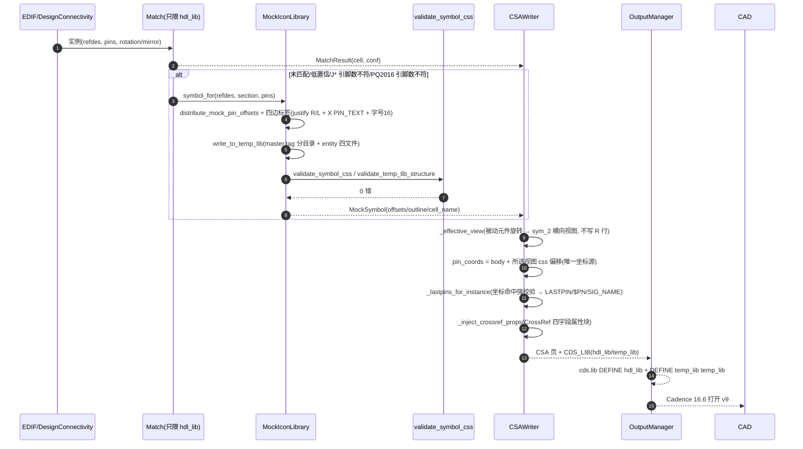
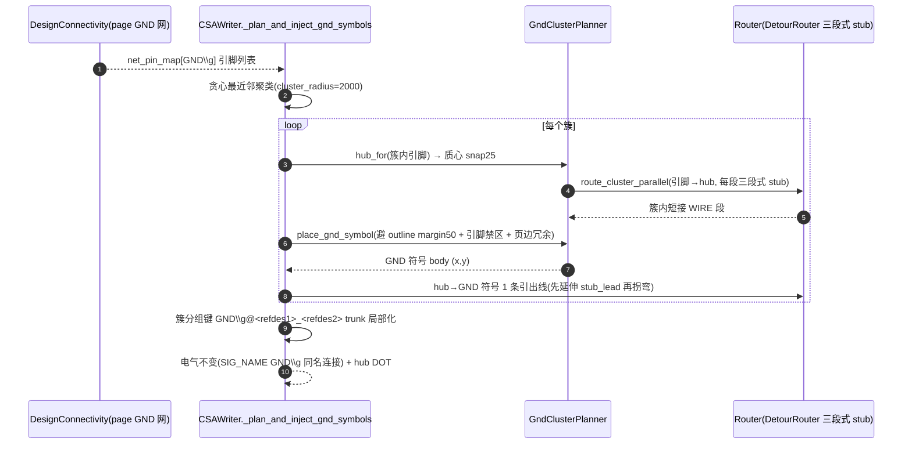
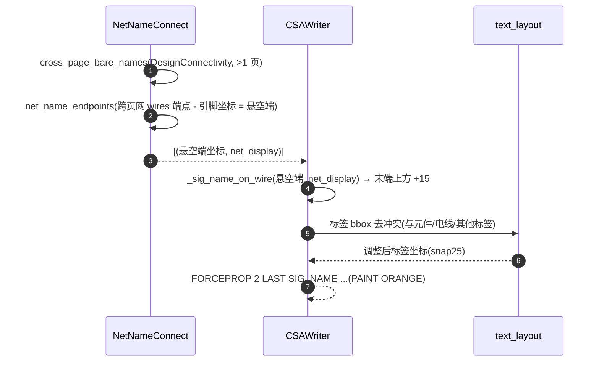
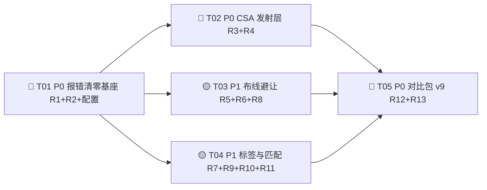

# CIS2HDL Phase XVIII — 增量系统设计与任务分解（架构师交付）

> 架构师：高见远（software-architect）｜主理人：齐活林（汇总）
> 输入：`phase18-prd.md`（R1-R13 + Q1-Q13）+ `phase18-root-cause-evidence.md`（代码级证据）+ `system_design0812-phase17.md` + `ARCHITECTURE.md` / `STANDARDS.md`
> 基线：Phase XVII 交付 684 passed / 5 skipped；对比包 v1-v8（766MB）
> 性质：**增量设计** —— 仅描述 Phase XVIII 变更；已实读关键源码（mock_icon_lib.py / csa_writer.py / symbol_css.py / wire_layout.py / detour_router.py / wire_simplifier.py / net_name_connect.py / overlap_detector.py / overlap_resolver.py / config.py / power_ic_scorer.py / routing.yaml / power_ic.yaml / hdl_lib golden / 04p4 golden CSA）
> 语言：中文 ｜ 优先级：🔴 P0 必须 / 🟡 P1 应该 / 🟢 P2 可后置

---

## 0. TL;DR（决策速览）

| # | 需求 | 一句话方案 | 默认开关 | 主战场 |
|---|------|-----------|:-------:|--------|
| R1 | mock CSS 语法修复（1158） | C 指令 justify 仅 R/L（顶/底改用 orient 90/270）+ 补 `X "PIN_TEXT"` + 新增语法校验器 | 开（修复） | `mock_icon_lib.py` / `validate_symbol_css.py`（新） |
| R2 | temp_lib 库结构（515/master.tag） | master.tag 分目录对齐 golden（symbol.css/chips.prt/verilog.v）+ 补 entity 四文件 + 结构断言器 | 开（修复） | `mock_icon_lib.py` / `validate_lib_structure.py`（新） |
| R3 | SPCOCN-543 全面修复 | 被动元件旋转改 `..2` 横向视图（不写 R 行）；LASTPIN 坐标命中强校验；GND_POWER LASTPIN 偏移/SIG_NAME 对齐 golden；UN$ 网名稳定化 | 开（修复） | `csa_writer.py` / `naming.py` / `routing.yaml` |
| R4 | 库统一 hdl_lib + attributes | 匹配只限 hdl_lib（Q1）+ CSA 属性块注入 CrossRef 四字段（golden 格式） | 开（修复） | `csa_writer.py` / `candidate_pool.py` / `audit_origin_refs.py`（新） |
| R5 | 避让增强 | margin=50 / 冗余区=100 / 引脚半径=50（Q3）+ self-intersection + 三段式 stub + 边缘避让 | 关（新功能） | `overlap_detector.py` / `detour_router.py` / `routing.yaml` |
| R6 | GND 就近共用 | 簇内引脚先并联（hub 短接）再 1 条引出 + GND 避让 + 引出段 | 关（新功能） | `csa_writer.py` / `gnd_cluster_planner.py`（新） |
| R7 | 网络名标签 | SIG_NAME 落到电线末端/悬空端（use_net_name 版本） | 随 use_net_name | `net_name_connect.py` / `csa_writer.py` |
| R8 | 电线长度 + 并联短接 | break_long 断线改网络名 + 同类同信号先短接（复用 R6 算法） | 关（新功能） | `wire_simplifier.py` / `gnd_cluster_planner.py` |
| R9 | mock 标签全面修正 | 四边方向/对齐/字号 16/引脚朝外 50/X 指令 MOCK_TEXT/排布均匀 | 开（修复） | `mock_icon_lib.py` |
| R10 | 匹配质量 | power_ic.yaml 回填 6 脚规则 + J* 引脚数过滤 mock 接管 + chip_config 预置 | 开（power_ic） | `power_ic.yaml` / `power_ic_scorer.py` / `chip_config.yaml` |
| R11 | 对齐/腾挪 | 被动元件 ≤50 微调（Q12）+ 标签方向随元件方向 | 关（新功能） | `overlap_resolver.py` / `text_layout.py` |
| R12 | test_spn 模板 | 补完整页面头 + g4 用 golden LASTPIN 偏移 | 开（修复） | `scripts/make_test_spn_templates.py`（新） |
| R13 | 对比包 v9 | 4 核心版本（Q7）+ README/metrics/test_spn | — | `scripts/make_compare_v9.py`（新） |

**五条铁律（延续 Phase XIV-XVII）**：

1. **连接判定 = 坐标重合**：WIRE 端点必须精确等于 LASTPIN 坐标；任何化简/腾挪不得移动端点引脚坐标。
2. **坐标唯一原则**：一个实例只有一个"体坐标"；LASTPIN/WIRE 全部由"体坐标 + **所选视图** symbol.css C 指令偏移"派生，禁止独立计算（R3 视图切换后 pin_coords/net_pin_map/LASTPIN/WIRE 必须同源切换）。
3. **全坐标 25 网格**：所有新坐标仍 `_snap25`。
4. **新功能独立模块 + 配置开关，默认关可回退**；R1/R2/R3/R4/R9/R12 属修复类，例外可默认开，但仍留开关逃生。
5. **数据源铁律**：审计/网络名/属性注入必须基于 DesignConnectivity 与 CrossRef CSV 模型，禁止 writer 自拼名/自造数据。

**Phase XVIII 新增决策（Q1/Q2/Q3/Q7 用户已定）**：

| 决策 | 落地要点 |
|------|---------|
| Q1 ORIGIN | 匹配函数只能在 hdl_lib 匹配符号（`matching.hdl_lib_only`）；输出无 ORIGIN 引用；依赖链审计 |
| Q2 CAPACITOR 旋转 | 方案 A：有横向 sym_2 视图的被动元件（capacitor/resistor/inductor）用 `..2` 选视图，不写 R 行；dc_dc 等 sym_N 是器件变体 → 保留 R 行或 mock 接管 |
| Q3 避让 | margin=50、芯片外侧冗余区=100、引脚避让半径=50（全部可配） |
| Q7 对比包 | v9 只生成 4 个核心版本：默认修复版 + GND 分布版 + 电线化简版 + 网络名版（use_net_name） |

---

## 1. 增量设计（按 R1-R13）

> 每项列出：涉及文件（精确路径）/ 修改或新增函数（签名级）/ 关键算法描述。

---

### R1 🔴 mock symbol.css 语法修复（SPCOCN-1158）

**根因**：`mock_icon_lib._append_pin_line`（L498/L503）对 top/bottom 引脚输出 `justify=U/D`；全库 65689 条真实 C 指令 justify 只有 R/L（grep 实锤）→ parse error → 整 cell 无法加载 → 芯片消失。

**涉及文件**：

| 文件 | 动作 |
|------|------|
| `cis2hdl/core/writer/mock_icon_lib.py` | 修改 `_append_pin_line`、`_symbol_css` |
| `cis2hdl/core/writer/validate_symbol_css.py` | **新增**：symbol.css 语法校验器 |
| `cis2hdl/core/config.py` + `cis2hdl/config/routing.yaml` | `temp_lib` 节新增字段 |

**修改/新增函数**：

```python
# mock_icon_lib.py —— 修改
def _append_pin_line(
    a, px: int, py: int, side: str, x0: float, x1: float, label: str,
) -> None:
    """四边引脚行（L + C + X PIN_TEXT）。

    R1 修复：justify 仅允许 R/L —— 顶/底引脚不再用 U/D justify，
    改用 orient=90/270（竖直文本）+ justify=R/L 表达方向。
    R9 增强：引脚在 body 外侧（L 段 50 向外）、字号 temp_lib.pin_font_size、
    MOCK_TEXT 用 X 指令、X "PIN_TEXT" 可见引脚名。
    """
```

**关键算法（C 指令四边参数表）**：

| side | L 线（tip→body edge） | C orient | C justify | C label 位置 | X PIN_TEXT 位置 |
|------|------------------------|:-------:|:---------:|--------------|----------------|
| left | `L px py (edge) py` | 0 | R | `px-25, py` | `px+60, py`（body 内） |
| right | `L px py (edge) py` | 0 | L | `px+25, py` | `px-60, py`（body 内） |
| top | `L px py px (edge)` | 90 | R | `px, py+15` | `px, py-60`（body 内） |
| bottom | `L px py px (edge)` | 270 | R | `px, py-15` | `px, py+60`（body 内） |

> 判定依据：ch347 golden `C -300 -250 "RST#" -325 -250 0 1 32 0 R`（left=justify R，label 在 tip 外侧 25）、`X "PIN_TEXT" "RST#" -240 -250 0 0 24 0 0 0 0 0 1 0 0`（可见引脚名 24 号、body 内侧 60）。capacitor golden `C 0 -75 "1" 0 -60 0 0 32 1 R`（第 8 参 vis=0、第 10 参=1 —— mock 保持该位）。

**新增校验器**（独立模块，可被 CLI/测试/生成后自动调用）：

```python
# validate_symbol_css.py —— 新增
def validate_symbol_css(content: str, source: str = "") -> list[str]:
    """逐行校验 symbol.css 语法，返回错误行清单（空=通过）。

    断言：
    1. 每个 C 指令 justify 参数 ∈ {R, L}（正则取行末 token）；
    2. 坐标均为合法数值（int/float）；
    3. 引号配对（每个 " 成对）、括号闭合；
    4. 无非 ASCII 控制字符/非法字符；
    5. 每个 C 指令文本非空。
    """

def validate_temp_lib_structure(temp_lib_root: Path) -> list[str]:
    """断言 temp_lib 库结构 = golden（R2 共用）：
    cell/{sym_1/symbol.css + master.tag=="symbol.css",
          chips/chips.prt + master.tag=="chips.prt",
          entity/master.tag=="verilog.v" + pc.db/verilog.v/vhdl.vhd/vlog004u.sir,
          cell 根无 master.tag}；目录名大写；FORCEADD 引用名与目录名一致。
    """
```

**接线**：`MockIconLibrary.write_to_temp_lib` 写完全部 cell 后，若 `temp_lib.syntax_check=true` 调用 `validate_symbol_css` 全量校验（0 错才返回，否则 `logger.error` + 报告清单；不阻断写盘但进 metrics）。

**验收断言（代码级）**：全量 temp_lib symbol.css `validate_symbol_css` 返回 `[]`；`grep "^C "` 行末 justify 均 ∈ {R,L}；每个 mock css 含 `X "PIN_TEXT"`。

---

### R2 🔴 temp_lib 库结构修复（SPCOCN-515 / master.tag / 大小写）

**根因**：`write_to_temp_lib` L408 三处 master.tag 全写 `"CDS_SYSTEM\n"`；真实库 sym_1→`symbol.css`、chips→`chips.prt`、entity→`verilog.v`（xxd 实锤）；mock entity 缺 verilog.v/vhdl.vhd/vlog004u.sir；缺 metadata/part_table。

**涉及文件**：

| 文件 | 动作 |
|------|------|
| `cis2hdl/core/writer/mock_icon_lib.py` | 修改 `write_to_temp_lib`，新增 `_master_tag` / `_entity_files` |
| `cis2hdl/core/writer/validate_symbol_css.py` | 新增 `validate_temp_lib_structure`（R1 已含） |
| `cis2hdl/core/writer/output_manager.py` | 确认 mock lib 写盘接线 + cds.lib `DEFINE temp_lib temp_lib`（已存在 L945-948，无需改，补断言） |
| `docs/README`（v9 配套） | temp_lib 手动添加说明（Q10） |

**修改函数**：

```python
# mock_icon_lib.py —— 修改
def write_to_temp_lib(self, temp_lib_root: Path) -> list[Path]:
    """写盘布局（对齐 golden）：
    <CELL>/sym_1/symbol.css + master.tag("symbol.css")
    <CELL>/chips/chips.prt   + master.tag("chips.prt")
    <CELL>/entity/master.tag("verilog.v") + pc.db + verilog.v + vhdl.vhd + vlog004u.sir
    <CELL>/metadata/（pinlist.txt 最小声明，可选）
    <CELL>/part_table/（part.ptf 最小声明，可选）
    """

@staticmethod
def _master_tag(role: str) -> str:
    """按目录角色返回 master.tag 内容：
    sym_1..N→"symbol.css\n"；chips→"chips.prt\n"；entity→"verilog.v\n"。"""

@staticmethod
def _entity_files(symbol: "MockSymbol") -> dict[str, str]:
    """entity 目录最小 ASCII 声明：
    {pc.db, verilog.v, vhdl.vhd, vlog004u.sir}（内容参照 golden capacitor entity）。"""
```

**关键算法（结构断言）**：`validate_temp_lib_structure` 逐 cell 断言：`sym_1/master.tag` 内容 == `"symbol.css"`、`chips/master.tag` == `"chips.prt"`、`entity/master.tag` == `"verilog.v"`；`entity` 下四文件齐全；cell 根无 master.tag；目录名全大写且与 FORCEADD 引用名一致（`grep FORCEADD <cell> output` 全量校验）。

**验收断言**：`validate_temp_lib_structure` 返回 `[]`；v9 打开后手动添加 temp_lib 不再 SPCOCN-515。

---

### R3 🔴 SPCOCN-543 全面修复（CAPACITOR $PN / BGA SPN / GND SIG_NAME / PQ2016 / UN$）

**根因分层**（证据 §3）：①旋转 R 行 + LASTPIN 组合无 04p4 先例（golden CAPACITOR 无 R 行，旋转实例用 `CAPACITOR..2` 横向视图）；②GND_POWER LASTPIN offset（golden = body+(50,100)）与 symbol.css 引脚 (0,50) 不符、SIG_NAME 值 `GND\g` vs golden `GND_POWER\g`；③mock BGA SPN 未命中（R1/R2 修复后自愈）；④PQ2016 引脚数不匹配 fallback 未命中；⑤UN$ 自动网名 SIG_NAME 被删。

**涉及文件**：

| 文件 | 动作 |
|------|------|
| `cis2hdl/core/writer/csa_writer.py` | 新增 `_effective_view` / `_select_rotation_view` / `_gnd_power_sig_name`；修改 `_lastpins_for_instance` / `_emit_power_symbol_block` / `_pin_offset_resolves` / FORCEADD 发射段 |
| `cis2hdl/core/parser/symbol_css.py` | 复用 `SymbolCssPinParser`（已支持任意 sym_N 路径，无需改） |
| `cis2hdl/utils/naming.py` | 新增 `stabilize_un_name` |
| `cis2hdl/core/config.py` + `routing.yaml` | `gnd_distribution.gnd_power_lastpin_offset`、`ioport.un_name_policy`、`net_name.un_auto_rename` |

**新增函数（签名级）**：

```python
# csa_writer.py —— 新增
def _effective_view(
    self, irec, body_name: str, section: int,
) -> tuple[int, int, dict]:
    """返回 (视图号, dehdl 旋转角度, css_offsets)。

    Q2 方案 A：被动元件（capacitor/resistor/inductor，2 引脚 C/R/L）
    且 dehdl 旋转 ≠ 0 时，若 hdl_lib/<body>/sym_2 存在且为横向视图
    （引脚 offset 满足 |Δx| 主导 / 全部同 y），则返回
    (2, 0, sym_2_offsets) —— 不写 R 行；否则保持 (section, rot, sym_1_offsets)。
    dc_dc 等非被动体直接保持 R 行（sym_N 是器件变体，禁止切换）。
    """

def _gnd_power_sig_name(self, body_name: str, net: str) -> str:
    """GND_POWER SIG_NAME 值 = symbol.css P "HDL_POWER" 值（如 GND_POWER），
    回退 page 网名；统一加 \\g 后缀 → "GND_POWER\\g"（golden 对齐）。"""

def _lastpin_coord_hit(
    self, coord: tuple[int, int], body: tuple[int, int],
    offset: tuple[int, int], rot: int, mirror: int,
) -> bool:
    """强校验：LASTPIN 绝对坐标 == body + rotate_point(offset, rot, mirror)
    （旋转分支数学一致性；未命中 → 跳过 LASTPIN + logger + 报告）。"""
```

**关键算法 3a —— sym_2 视图选择判定**（Q2，golden page9 L354 先例）：

```
输入：body_name ∈ {capacitor,resistor,inductor}（_is_passive_body）、
      refdes 前缀 ∈ {C,R,L}（2 引脚）、dehdl_rot ≠ 0
1. css_sym2 = _get_css_pin_offsets(body_name, 2)          # hdl_lib/<body>/sym_2/symbol.css
2. 若 css_sym2 为空 → 无 sym_2 → 保留 R 行（现状）
3. 横向判定：取全部 offset (x,y)，若 max(|x|) > 0 且 所有 y 相等
   （或 x 方差 > y 方差 3 倍）→ 横向视图；否则视为变体（不切）
   —— capacitor sym_2 实测：{"1":(-50,0),"2":(75,0)} → 横向 ✓
4. 命中 → 返回 (section=2, rot_dehdl=0, sym_2_offsets)：
   FORCEADD CAPACITOR..2 + 无 R 行；pin_coords/net_pin_map/LASTPIN/WIRE
   全部改用 sym_2 offsets（坐标唯一原则同源切换）
5. 未命中（如 180° 旋转且无对应横向视图）→ 保留 R 行 + 旋转 offsets
   （A/B 实测确认；风险见 §7）
```

**关键算法 3b —— LASTPIN 命中强校验**：在 `_lastpins_for_instance` 现有"名称/编号解析命中"（`_pin_offset_resolves`）之上，追加坐标数学校验 `_lastpin_coord_hit`：`rotate_point(offset, rot, mirror)` 计算值与发射坐标一致才发射；不一致 → skip + `logger.warning` + `aesthetic_report [LASTPIN_MISS]`。BGA mock 的 C 指令偏移与 pin_coords 同源（R1/R2 修复后自愈），此校验兜底。

**关键算法 3c —— GND_POWER 对齐 golden**（golden page9 L10-17）：

```
FORCEADD GND_POWER..1
(-3725 3075);
FORCEPROP 3 LASTPIN (-3675 3175) SIG_NAME GND_POWER\g   # offset=(50,100)
J 0
(-3665 3185);  DISPLAY 0.659574 ...  PAINT MONO ...  DISPLAY INVISIBLE
```

- LASTPIN offset：`gnd_distribution.gnd_power_lastpin_offset: [50, 100]`（golden，可配；`"css"` 值回退 symbol.css 引脚 (0,50)）。mirror≠0 时仍经 `rotate_point(offset, 0, mirror)`（Phase XVI T1 同源）。
- SIG_NAME 值：`_gnd_power_sig_name` → `GND_POWER\g`（golden 值），不再用 page 网名 `GND`。
- `test_spn_g4` 模板（R12）同步用该偏移 → 不再 `GND_POWER\g deleted`。

**关键算法 3d —— PQ2016 引脚数不匹配**：沿用方案 D（`_lastpins_for_instance` L2329：实例引脚数 > symbol 引脚数 → 跳 LASTPIN，由 M1 mock 接管）；补：mock 接管后 FORCEADD `CDS_LIB temp_lib` + mock cell 渲染（已存在，补回归测试）。

**关键算法 3e —— UN$ 网名**（R3 动作⑤ + STANDARDS UN$ 三态约定）：

```python
# naming.py —— 新增
def stabilize_un_name(display: str, page: int = 0, cell: str = "",
                      k: int = 0, pin: str = "") -> str:
    """UN$ 自动网名 → 稳定可读名（默认策略 rename）：
    "UN$5SCAPACITORSI43$2" → "UN_5_CAPACITOR_I43_2"（$→_、大写保留）。
    数据源铁律：仅做字符规范化，不改电气名；csv/con 同步由
    net_utils 统一生成，writer 禁止自拼。
    """
```

- `ioport.un_name_policy: rename|keep|omit`，默认 `rename`（Cadence 不接受 UN$ 自动网名时用稳定名；`keep` 保留现状；`omit` 省略 SIG_NAME）。
- 只改 CSA SIG_NAME/LASTPIN 显示名；csv/con 同步需实测确认（风险 §7）。

**验收断言**：v9 无 543/541；CAPACITOR 旋转实例输出 `FORCEADD CAPACITOR..2` 且无 `R 2` 行（golden 先例复现）；GND_POWER 块 `SIG_NAME GND_POWER\g` + offset(50,100)；`_lastpin_coord_hit` 断言全过；PQ2016 无 $PN 被删。

---

### R4 🔴 元件库统一 hdl_lib（ORIGIN.SYM.1.1 / attributes "?"）

**根因**：①CAPACITOR symbol.css 引用 ORIGIN 系统库依赖（违反"全部用 hdl_lib"）；②CSA 属性块未注入 CrossRef CSV 的 DESCRIPTION/JEDEC_TYPE/PACKAGE_TYPE/SN_NUM（golden CAPACITOR 块含这些属性）。

**涉及文件**：

| 文件 | 动作 |
|------|------|
| `cis2hdl/core/writer/audit_origin_refs.py` | **新增**：ORIGIN 依赖链审计 |
| `cis2hdl/core/matcher/candidate_pool.py` | 修改：候选池过滤标准库符号（Q1） |
| `cis2hdl/core/writer/csa_writer.py` | 新增 `_inject_crossref_props`；FORCEADD 块内接线 |
| `cis2hdl/core/writer/mapping_csv_writer.py` | 复用 CrossRef CSV 解析（字段已存在） |
| `cis2hdl/core/config.py` + `routing.yaml` | `matching.hdl_lib_only`、`attribute.inject_crossref` |

**新增函数**：

```python
# audit_origin_refs.py —— 新增
def audit_origin_refs(hdl_lib_root: Path, csa_pages: Iterable[Path]) -> list[str]:
    """全量扫描 hdl_lib symbol.css 与输出 CSA：
    1. 无任何 CDS_LIB/引用指向 ORIGIN 系统库；
    2. 无 FORCEADD 引用 hdl_lib 之外的库；
    返回违规清单（空=通过）。"""

# csa_writer.py —— 新增
def _inject_crossref_props(
    self, irec, props: dict, x: int, y: int,
) -> list[str]:
    """从 CrossRef CSV 行注入 CSA 属性块（golden CAPACITOR 格式）：
    FORCEPROP 1 LAST JEDEC_TYPE 0201-RF / J 0 / (x y); /
    DISPLAY 1.021277 (x y); / DISPLAY INVISIBLE (x y);
    字段：JEDEC_TYPE / SN_NUM / PACKAGE_TYPE / DESCRIPTION。
    数据源：mapping CSV 行（DESCRIPTION/JEDEC_TYPE/PACKAGE_TYPE/SN_NUM），
    缺失字段跳过不注入（禁止 "?" 默认值注入）。"""
```

**关键算法（Q1 落地）**：

1. `candidate_pool` 候选构造处加 `matching.hdl_lib_only=true` 过滤：候选 symbol 只能来自 `hdl_lib` 扫描结果，标准库/系统库符号不入池（含 ORIGIN）。
2. `audit_origin_refs` 生成后自动跑：违规 → 报告 + 退出码非 0（v9 打包门禁）。
3. ORIGIN 依赖链分析：若 hdl_lib 内某 symbol.css 存在 `P "CDS_LIB" "ORIGIN"` 类引用 → 报告并（配置 `attribute.rewrite_origin=true` 时）改写为 hdl_lib 自引用；cds.lib 是否需 `DEFINE ORIGIN ./hdl_lib` 待 Cadence 验证（风险 §7）。
4. `_inject_crossref_props` 在 `_emit_model_instance_block` 的 VALUE/$LOCATION 之后、PATH 之前插入（golden 顺序）；坐标用 body 原点（golden `(3225 8250);` 同 body）。

**验收断言**：`audit_origin_refs` 返回 `[]`；C423 等任意元件双击无 515；attributes 四字段非 "?"（golden 字段级比对：JEDEC_TYPE 0402R-S 等）。

---

### R5 🟡 避让检测增强（线头/穿元件/边缘冗余区/引脚避让/三段式 stub）

**根因**：margin 25 过小；无 self-intersection（线头=自身重叠）；无三段式 stub（原地掉头）；边缘冗余区未避让；引脚附近无避让。

**涉及文件**：

| 文件 | 动作 |
|------|------|
| `cis2hdl/core/writer/overlap_detector.py` | 修改 `detect_collisions` 默认 margin；新增 `self_intersections` / `segment_near_pin` |
| `cis2hdl/core/writer/detour_router.py` | 新增 `_three_stage_stub`；修改 `_route_horizontal/_route_vertical/_build_detour` |
| `cis2hdl/core/writer/wire_layout.py` | 修改 `_avoid_outlines`（边缘冗余区）；`_pin_on_trunk` 加半径 |
| `cis2hdl/core/writer/wire_simplifier.py` | `simplify_wires` 接入 self-intersection 报告 |
| `cis2hdl/core/config.py` + `routing.yaml` | `overlap.avoid_margin/edge_clearance/pin_avoid_radius`、`routing.edge_clearance/three_stage_stub` |

**修改/新增函数**：

```python
# overlap_detector.py —— 修改/新增
def detect_collisions(geoms_a, geoms_b, margin: int = 50) -> list[Collision]:
    """Q3：默认 margin 25→50；调用方显式传 edge_clearance/pin_avoid_radius。"""

def self_intersections(wires: Iterable[Segment]) -> list[tuple[Segment, Segment, Point]]:
    """同网线段两两相交/重叠（含 T/X/共线重合）→ "线头"清单。
    返回 (seg_a, seg_b, 交点)；空=无自身重叠。"""

def segment_near_pin(seg: Segment, pins: Iterable[Point], radius: int) -> Optional[Point]:
    """线段是否进入引脚半径禁区（防误连接）；命中返回最近引脚点。"""

# detour_router.py —— 新增
def _three_stage_stub(
    self, pin: tuple[int, int], trunk: int, vertical: bool,
    outlines: list, busy_h: list, busy_v: list,
) -> list[WireSegment]:
    """三段式 stub（用户明确要求"先延伸→折线避让→调头"）：
    1. 延伸：pin → E（沿背离 body 方向外引 stub_lead）；
    2. 折线：E → J（垂直线段绕开 outline + edge_clearance + 其他网段，
       取最近空闲 50 倍数车道）；
    3. 调头：J → T（回到 trunk 方向，最终接到 trunk）。
    端点 pin 坐标不动；全部 _snap 25 网格。
    """
```

**关键算法（三段式 stub 几何）**：

```
输入：pin P(x,y)、trunk 值 T、方向 vertical（水平 trunk 时 stubs 垂直）
1. E = P + outward * stub_lead
   outward = 背离 body 中心（_pin_bodies 提示，无则背离 trunk）
2. J = E + perpendicular * (max_detour + edge_clearance)
   沿垂直于 E→trunk 的方向，先跳过所有 outline 与 busy 车道
   （逐 50 递增，参考 _build_detour 的 lane push 循环）
3. T' = 与 trunk 交点：水平 trunk → (J.x, T)；垂直 trunk → (T, J.y)
4. 输出 [P→E, E→J, J→T']（零长段剔除）
```

**关键算法（边缘冗余区）**：`_avoid_outlines` 追加页面边界约束：trunk/stub 不得进入 `C 纸边界 ± edge_clearance` 带（x∈[-10750,-550]±100、y∈[400,7200]±100）；冲突则向内侧推 50。

**关键算法（引脚避让）**：`_pin_on_trunk` 由"精确命中"扩展为"±pin_avoid_radius 命中"（trunk 不得在引脚 50 单位内穿过）；`_find_lane` 候选检查同步加 `segment_near_pin`。

**验收断言**：shapely 等价自研几何断言：所有 WIRE 段与元件 outline（含冗余区）零相交；同网段对零重叠（`self_intersections` 空）；无线段进入引脚半径；三段式 stub 段数 = 3 且端点重合。

---

### R6 🟡 GND 就近共用 + 引脚延伸

**根因**：聚类已实现（v8 19→97）但簇内引脚先并联未实现；GND 符号仍落元件上（margin 25）；GND 连线无引出段。

**涉及文件**：

| 文件 | 动作 |
|------|------|
| `cis2hdl/core/writer/gnd_cluster_planner.py` | **新增**：簇内并联 + GND 符号避让放置 |
| `cis2hdl/core/writer/csa_writer.py` | 修改 `_plan_and_inject_gnd_symbols`（改调 planner）、`_gnd_rect_clear`（margin 参数化） |
| `cis2hdl/core/config.py` + `routing.yaml` | `gnd_distribution.parallel_short/parallel_short_dist` |

**新增函数**：

```python
# gnd_cluster_planner.py —— 新增
def route_cluster_parallel(
    cluster_pins: list[tuple[int, int]],
    hub: tuple[int, int],
    outlines: list[tuple[int, int, int, int]],
    stub_lead: int = 100,
) -> list[tuple[int, int, int, int]]:
    """簇内引脚先并联：每个引脚 → hub（hub=簇质心 snap25）；
    每段先沿引脚外引 stub_lead 再折向 hub（三段式，复用 R5）；
    返回 WIRE 段（端点=引脚坐标不变）。"""

def place_gnd_symbol(
    cluster_pins: list[tuple[int, int]],
    outlines: list[tuple[int, int, int, int]],
    pin_points: set[tuple[int, int]],
    margin: int = 50, edge_clearance: int = 100,
) -> tuple[int, int]:
    """GND 符号放置：沿 4 方向（下→上→左→右）找不落元件 outline、
    不进引脚禁区、不贴页边的空隙；返回 body (x, y)。"""

def hub_for(cluster_pins: list[tuple[int, int]]) -> tuple[int, int]:
    """簇质心，snap 25 网格；避 outline（落在 outline 内则沿最小分离向量外推）。"""
```

**关键算法（簇内并联 → 引出）**：

```
输入：一簇 GND 引脚 {P1..Pn}（聚类已在 _plan_and_inject_gnd_symbols 完成）
1. hub = hub_for(簇内引脚)（质心；避开元件 outline）
2. 对每个 Pi：Pi → stub_lead 外引 → 折线 → hub（三段式，R5 复用）
   （pi 与 hub 同轴时退化为 1-2 段，零长剔除）
3. hub → GND 符号 body 引出 1 条（唯一引出线）：
   簇分组键 GND\g@<refdes1>_<refdes2> 保持 trunk 局部化
4. 电气不变：全部 SIG_NAME GND\g（同名连接）；DOT 加在 hub
```

- `parallel_short_dist`（默认 500，Q4 建议）为簇内并联判定距离阈值：引脚间距 > 阈值不强制并联（保持各自引出）。
- GND 符号放置：`place_gnd_symbol` 替代原 `_gnd_symbol_body`（margin 25→50 + edge_clearance 100 + 引脚禁区 50）。

**验收断言**：一排并联电容（C52/455/53/459/462）簇内 hub 短接、GND 引出线 = 1 条；GND 符号不落任何 outline（margin 50 断言）；GND 连线含引出段（stub_lead 后拐弯）。

---

### R7 🟡 网络名标签显示（v6 悬空问题）

**根因**：`net_name_connect.net_name_labels` 把标签放在 `pins[0]["coord"]`（引脚处），未落到电线末端/悬空端。

**涉及文件**：

| 文件 | 动作 |
|------|------|
| `cis2hdl/core/writer/net_name_connect.py` | 新增 `net_name_endpoints`；修改 `net_name_labels` |
| `cis2hdl/core/writer/csa_writer.py` | `_sig_name_on_wire` 落点接线（用电线末端坐标） |
| `cis2hdl/core/config.py` + `routing.yaml` | `ioport.net_label_on_end` |

**新增函数**：

```python
def net_name_endpoints(
    routed: dict[str, RoutedNet], net_pin_map: dict[str, list],
    cross_page: set[str],
) -> list[tuple[tuple[int, int], str]]:
    """use_net_name=true 时，跨页网的电线末端（悬空端）清单：
    对每个跨页网，取其 RoutedNet.wires 中"不是任何引脚坐标"的端点
    （即原 IOPORT 悬空位置）作为 SIG_NAME 落点。"""

def net_name_labels(  # 修改：标签落点优先电线末端，回退 source pin
    net_pin_map, source_pin_keys, cross_page, use_net_name,
    wire_endpoints: dict[str, list[tuple[int, int]]] | None = None,
) -> list[tuple[tuple[int, int], str]]: ...
```

**关键算法**：跨页网 → wires 端点集合 → 减去本网引脚坐标 → 取剩余端点（=悬空端）→ `_sig_name_on_wire(coord, net_display)`（字号 32、末端上方 +15、可读网名，Q5 建议）。无悬空端时回退现有 source-pin 标签。

**验收断言**：v9 use_net_name 版所有跨页网电线末端有 SIG_NAME；无"悬空无标签"；标签与元件/电线零重叠（text_layout 去冲突后）。

---

### R8 🟡 电线长度限制 + 并联先短接

**根因**：`long_wire_report` 只报告不断线；C270/283/260 并联电容各自引线连错。

**涉及文件**：

| 文件 | 动作 |
|------|------|
| `cis2hdl/core/writer/wire_simplifier.py` | 新增 `split_long_wires`；修改 `simplify_wires` |
| `cis2hdl/core/writer/gnd_cluster_planner.py` | `route_cluster_parallel` 泛化（同信号非 GND 复用） |
| `cis2hdl/core/writer/csa_writer.py` | 接线：超长断线 → 两端 SIG_NAME 标签 |
| `cis2hdl/core/config.py` + `routing.yaml` | `wire_simplify.break_long/parallel_short` |

**新增函数**：

```python
def split_long_wires(
    wires: Iterable[Segment], max_len: int,
) -> tuple[list[Segment], list[tuple[tuple[int, int], str]]]:
    """超长段（Manhattan 长 > max_wire_len）从线网中剔除，
    在原段两端生成 SIG_NAME 标签（远程连接由同名网络名表达）。
    返回 (保留段, [(端点, net_display)])；net_display 由调用方提供。"""

def simplify_wires(  # 修改：break_long=true 时接入 split_long_wires
    wires, pins, dot_merge=50, max_wire_len=5000, obstacles=(),
    break_long: bool = False, ...
) -> SimplifyResult: ...
```

**关键算法（并联组短接，非 GND 泛化）**：同信号相近引脚（间距 ≤ `parallel_short_dist`）先经 hub 短接再统一引出（复用 `route_cluster_parallel`，net 不限于 GND）。C270/283/260 属同网并联电容 → 组内先短接再引出（R11 配合位置修正）。

**验收断言**：脚本统计无 >max_wire_len 的 WIRE 段（或全转网络名标签）；并联组内引脚先短接、统一引出；C270/283/260 引脚连接正确。

---

### R9 🟡 mock 图标标签全面修正（方向/对齐/字号/标识/引脚朝外）

**根因**：BGA 四边标签用 U/D justify（R1 已修语法）+ 方向/对齐未按边区分（B2）；字号 32 过大；MOCK_TEXT 用 P 指令；引脚在 body 内侧；L 指令仅 10 单位。

**涉及文件**：

| 文件 | 动作 |
|------|------|
| `cis2hdl/core/writer/mock_icon_lib.py` | 修改 `_append_pin_line`、`_symbol_css`、`mock_outline`、`distribute_mock_pin_offsets`（排布均匀） |
| `cis2hdl/core/config.py` + `routing.yaml` | `temp_lib.pin_font_size/pin_text_size/pin_line_len/mock_text_cmd` |

**关键算法（四边标签布局）**（用户 B2 明确）：

| side | 文本方向（orient） | 对齐（justify） | label 相对 tip | X PIN_TEXT 相对 tip | 引脚 L |
|------|:---:|:---:|:---:|:---:|:---:|
| left | 0° 水平 | R（右对齐靠边） | (-25, 0) | (+60, 0) | tip→body edge 50 |
| right | 0° 水平 | L（左对齐靠边） | (+25, 0) | (-60, 0) | tip→body edge 50 |
| top | 90° 竖直靠上 | R | (0, +15) | (0, -60) | tip→body edge 50 |
| bottom | 270° 竖直靠下 | R | (0, -15) | (0, +60) | tip→body edge 50 |

- **字号**：C 指令 `temp_lib.pin_font_size=16`（用户"缩小一半"32→16）；X 指令 `pin_text_size=16`。
- **引脚朝外**：`mock_outline` 改为在引脚 tip 内侧收 `pin_line_len`（默认 50）：n≤12 outline `-100,150,100,bottom'`（原 `-150,150,150,-150`，引脚 ±150 现在外侧 50）；BGA 同理内收。L 指令 `tip → body edge`（50 单位，ch347 golden）。
- **MOCK_TEXT**：`P "MOCK_TEXT"` → `X "MOCK_TEXT" "MOCK/模拟图标" 0 0 0 0 24 0 0 0 0 0 1 0 0`（Q11；X 是真实库画文本先例）。
- **排布均匀**：BGA 每边引脚相对边长居中对称（`distribute_mock_pin_offsets` 的 half_w/half_h 按 per_side 计算已有，微调对称）。

**验收断言**：mock css 全部 C 行 justify∈{R,L}；字号 16；`L` 段长 ≥50；outline 在引脚内侧（引脚在框外）；`X "MOCK_TEXT"` 存在且无 `P "MOCK_TEXT"`。

---

### R10 🟡 匹配质量修复（J* / U16-20 / PQ2016）

**根因**：J* 匹配到错误 cell 无 mock 接管；U18/U20→CH347 fuzzy 0.4475 误匹配（power_ic.yaml 规则未实写）；PQ2016 引脚数不匹配。

**涉及文件**：

| 文件 | 动作 |
|------|------|
| `cis2hdl/config/power_ic.yaml` | 回填 6 脚稳压规则（U16/U17/U18/U20） |
| `cis2hdl/core/matcher/power_ic_scorer.py` | `_symbol_pin_names` 静态表补 dc_dc 6 脚；`candidates_for` 增加引脚名过滤 |
| `cis2hdl/config/chip_config.yaml`（或 manual_matches） | 预置 U16/U17/U18/U20 正确映射 |
| `cis2hdl/core/matcher/candidate_pool.py` | J* connector 引脚数校验 + 低置信过滤 |
| `cis2hdl/core/writer/csa_writer.py` | `_needs_placeholder` 对 J* 加强（mock 接管） |
| `cis2hdl/core/config.py` + `routing.yaml` | `matching.connector_pin_check`、`power_ic.enabled` |

**关键算法（U16-20 规则回填）**：`power_ic.yaml` `candidates_by_pin_count[6]` 增补精确规则：引脚名集合 {BST,VIN,GND,EN,SW,FB}（归一化后 {BST,IN,GND,EN,SW,FB}）→ `dc_dc/sym_1`（Jaccard=6/6 → score 1.0 ≥ 0.8 自动采用，替代 CH347 fuzzy 0.4475）。U16/U17（4 引脚 DISCRETE G1/G2/G3/S）不入电源匹配（引脚名 Jaccard 低 + `power_ic.enabled` 下仍 < min_score_auto → 维持原 DISCRETE 匹配）。v9 默认修复版 `power_ic.enabled=true`（匹配修复属 P1，但用户实测明确要求 → v9 各版本均开启；配置仍可关）。

**关键算法（J* connector）**：`candidate_pool` 对 refdes 前缀 `J` 的实例：候选 symbol 引脚数必须 == 实例引脚数（`matching.connector_pin_check`）；候选集为空或置信 < 阈值 → 低置信 fallback → `_needs_placeholder` 判定 mock 接管（temp_lib 图标，显示完整引脚/延伸/MOCK 标识）。PQ2016 同 R3④（引脚数不匹配 → 跳 LASTPIN 或 mock）。

**验收断言**：U18/U20 → `dc_dc`（非 CH347）；J* 全部正常显示（正确符号或 mock）；PQ2016 无 $PN 被删；无匹配错误导致的元件重叠。

---

### R11 🟢 元件对齐/腾挪增强

**根因**：腾挪/对齐未覆盖被动元件；标签方向未随元件方向统一。

**涉及文件**：

| 文件 | 动作 |
|------|------|
| `cis2hdl/core/writer/overlap_resolver.py` | 新增 `resolve_passives`（≤50 微调） |
| `cis2hdl/core/writer/text_layout.py` | 标签方向随元件方向（R 行）统一 |
| `cis2hdl/core/writer/csa_writer.py` | 腾挪结果接线（被动元件 body 位移 ≤50 后 pin_coords 同步） |
| `cis2hdl/core/config.py` + `routing.yaml` | `placement.max_passive_move` |

**新增函数**：

```python
def resolve_passives(
    self,
    passives: dict[str, Geometry],   # C/R/L 元件 rect
    fixed: list[Geometry],           # 芯片/connector 本体（不动，D10）
    max_move: int = 50,
) -> ResolverResult:
    """只对被动元件做小范围微调（Q12）：沿最小分离向量移动，但
    累计位移 |dx|+|dy| ≤ max_move（默认 50）；超限放弃并记录。"""
```

**关键算法（标签方向随元件方向）**：`text_layout.collect_text_items` 已按 `rotate_point` 旋转 VALUE/$LOCATION 基准（Phase XVII P0-4）；扩展：被动元件水平放置（R 1/rot 0）时标签强制水平（R237/239 现状修复）；`R 2` 180° 时标签竖直随 R 行。

**验收断言**：I18/I15、J8/R118/R107 重叠消除；C270/283/260 位置正确；被动元件位移 ≤50；芯片本体位移 = 0；R237/239 标签水平。

---

### R12 🟢 test_spn 模板修正（新页面可显示）

**根因**：模板缺页面头（FILE_TYPE/TITLE/PAGE/SIZE 等）；g4 GND_POWER LASTPIN offset=(0,0) 未命中。

**涉及文件**：

| 文件 | 动作 |
|------|------|
| `scripts/make_test_spn_templates.py` | **新增**：生成修正版 g1-g4 模板 |
| `HG5015_tests/output_phaseXVII_compare/test_spn_*.csa` | 更新（v9 内附带） |

**关键算法（页面头补齐）**：对照真实 csa 页面头（golden page9 L1-9）：

```
FILE_TYPE = MACRO_DRAWING;
SET COLOR_WIRE YELLOW;
SET COLOR_PROP ORANGE;
SET COLOR_DOT WHITE;
SET COLOR_ARC YELLOW;
SET COLOR_BODY GREEN;
SET COLOR_NOTE PURPLE;
SET PROP_DISPLAY VALUE;
SET PAGE_NUMBER P14;
FORCEADD C SIZE PAGE..1  ...   # 页框块
```

g1-g3 实例块补实例必备属性（CDS_LIB/PART_NAME/$LOCATION/VALUE/PATH/outline）；g4 用 R3 的 golden GND_POWER LASTPIN offset(50,100) + `SIG_NAME GND_POWER\g`。

**验收断言**：用户 Cadence 新建页复制模板：g1-g3 正常显示；g4 不再报 `GND_POWER\g deleted`。

---

### R13 🔴 对比包 v9 重新生成（P0 交付物）

**涉及文件**：

| 文件 | 动作 |
|------|------|
| `scripts/make_compare_v9.py` | **新增**：4 版本生成 + metrics/README 更新 |
| `HG5015_tests/output_phaseXVIII_compare/` | v9_* 输出 |
| `README.md`（v9 内） | temp_lib 手动添加说明 + 各版本修复说明 |
| `metrics_summary.md`（v9 内） | 修复前后对比表（SPCOCN 计数/WIRE/GND/IOPORT） |

**关键算法（版本矩阵，Q7）**：

| 版本 | 配置 |
|------|------|
| v9_default | 默认修复版（R1-R4/R9/R10 修复 + temp_lib enabled + power_ic enabled） |
| v9_gnd | default + `gnd_distribution.enabled=true`（R6 聚类+并联） |
| v9_simplify | default + `wire_simplify.enabled=true` + `break_long=true`（R5/R8） |
| v9_netname | default + `ioport.use_net_name=true`（R7，IOPORT 不生成） |

生成后自动跑：全量 `validate_symbol_css` / `validate_temp_lib_structure` / `audit_origin_refs` / `self_intersections` / `long_wire_report` → 写 `metrics_summary.md`。

**验收断言**：4 版本全部生成成功；metrics 含修复前后对比；README 含 temp_lib 手动添加指引；test_spn 修正模板附带。

---

## 2. 数据流图（Mermaid）

### 2.1 主链路：mock 图标生成 → CSA 发射



### 2.2 GND 链路：聚类 → 簇内并联 → 引出



### 2.3 标签链路（R7 网络名标签落末端）



---

## 3. 数据结构与接口（Mermaid classDiagram）

```mermaid
classDiagram
    class MockSymbol {
        +str cell_name
        +list[str] pin_numbers
        +list[str] pin_names
        +dict offsets
        +dict sides
        +dict labels
        +str outline
        +str kind
        +offset_for(pin_number, pin_name) tuple
    }
    class MockIconLibrary {
        +bool enabled
        +str lib_name
        +symbol_for(refdes, section, pins) MockSymbol
        +write_to_temp_lib(root) list[Path]
        +_symbol_css(symbol) str
        +_append_pin_line(a, px, py, side, x0, x1, label) None
        +_master_tag(role) str
        +_entity_files(symbol) dict
    }
    class SymbolCssValidator {
        +validate_symbol_css(content, source) list[str]
        +validate_temp_lib_structure(root) list[str]
    }
    class CSAWriter {
        +_effective_view(irec, body_name, section) tuple
        +_select_rotation_view(body_name, refdes, rot) tuple
        +_gnd_power_sig_name(body_name, net) str
        +_lastpin_coord_hit(coord, body, offset, rot, mirror) bool
        +_inject_crossref_props(irec, props, x, y) list[str]
        +_lastpins_for_instance(conn, page_conn, irec, pin_coords, source_pins) list[str]
        +_emit_power_symbol_block(conn, irec, body_name, x, y) list[str]
        +_plan_and_inject_gnd_symbols(conn, page_conn, body_coords, pin_coords, net_pin_map) list[dict]
    }
    class GndClusterPlanner {
        +route_cluster_parallel(cluster_pins, hub, outlines, stub_lead) list
        +place_gnd_symbol(cluster_pins, outlines, pin_points, margin, edge_clearance) tuple
        +hub_for(cluster_pins) tuple
    }
    class DetourRouter {
        +_three_stage_stub(pin, trunk, vertical, outlines, busy_h, busy_v) list[WireSegment]
        +_route_horizontal(pins, trunk) list[WireSegment]
        +_build_detour(seg, ox0, oy0, ox1, oy1, busy_h, busy_v) list[WireSegment]
    }
    class WireLayoutEngine {
        +_find_lane(trunk, lo, hi, used, outlines, vertical, other_by_x, other_by_y, tracks) int
        +_avoid_outlines(coord, outlines, vertical) int
        +_pin_on_trunk(candidate, lo, hi, vertical, other_by_x, other_by_y) bool
    }
    class WireSimplifier {
        +simplify_wires(wires, pins, dot_merge, max_wire_len, obstacles, break_long) SimplifyResult
        +split_long_wires(wires, max_len) tuple
        +long_wire_report(wires, max_len) list
    }
    class OverlapDetector {
        +detect_collisions(geoms_a, geoms_b, margin) list[Collision]
        +self_intersections(wires) list
        +segment_near_pin(seg, pins, radius) tuple
    }
    class OverlapResolver {
        +resolve(movables, fixed) ResolverResult
        +resolve_passives(passives, fixed, max_move) ResolverResult
    }
    class NetNameConnect {
        +cross_page_bare_names(conn) set[str]
        +ioport_skip_plan(off_pages, use_net_name) list[dict]
        +net_name_labels(net_pin_map, source_pin_keys, cross_page, use_net_name, wire_endpoints) list
        +net_name_endpoints(routed, net_pin_map, cross_page) list
    }
    class PowerCandidateScorer {
        +candidates_for(pin_count, pin_names, connected_nets) list[dict]
        +best_auto(pin_count, pin_names, connected_nets) dict
        +_symbol_pin_names(library_id, section) list[str]
    }
    class AuditOriginRefs {
        +audit_origin_refs(hdl_lib_root, csa_pages) list[str]
    }

    MockIconLibrary "1" --> "*" MockSymbol : builds
    MockIconLibrary ..> SymbolCssValidator : validates
    CSAWriter ..> MockIconLibrary : mock takeover
    CSAWriter ..> GndClusterPlanner : GND parallel short
    CSAWriter ..> NetNameConnect : net-name labels
    CSAWriter ..> OverlapDetector : avoidance assertions
    CSAWriter ..> AuditOriginRefs : ORIGIN gate
    DetourRouter --|> WireLayoutEngine : inherits
    OverlapResolver ..> OverlapDetector : uses detect_collisions
    PowerCandidateScorer ..> CSAWriter : POWER_IC_AUTO override
```



---

## 4. 任务列表（≤5 任务，按实现顺序）

> 分组原则：按功能模块/层次分组（基座 → 发射 → 布线 → 标签/匹配 → 交付），不按单文件拆分；每任务 ≥3 文件；依赖最小化（仅依赖 T01 或前置任务）。

### T01 🔴 P0 — 报错清零基座（R1+R2 + 配置基座）

- **源文件**：`cis2hdl/config/routing.yaml`（扩展）、`cis2hdl/core/config.py`（新 dataclass 字段 + `_top_sections` 增补）、`cis2hdl/core/writer/mock_icon_lib.py`（master.tag/entity/X PIN_TEXT/justify R-L 修复）、`cis2hdl/core/writer/validate_symbol_css.py`（新）、`cis2hdl/core/writer/output_manager.py`（temp_lib 写盘接线确认）、`tests/unit/test_symbol_css_validator.py` + `tests/unit/test_temp_lib_structure.py`（新）
- **依赖**：无
- **验收断言**：①全量 temp_lib symbol.css `validate_symbol_css` 返回 `[]`（justify∈{R,L}）②`validate_temp_lib_structure` 返回 `[]`（master.tag 分目录 golden）③每个 mock css 含 `X "PIN_TEXT"` ④基线 684/5 不回退

### T02 🔴 P0 — CSA 发射层修复（R3+R4）

- **源文件**：`cis2hdl/core/writer/csa_writer.py`（`_effective_view`/`_select_rotation_view`/`_gnd_power_sig_name`/`_lastpin_coord_hit`/`_inject_crossref_props`）、`cis2hdl/utils/naming.py`（`stabilize_un_name`）、`cis2hdl/core/matcher/candidate_pool.py`（hdl_lib_only）、`cis2hdl/core/writer/audit_origin_refs.py`（新）、`cis2hdl/core/writer/mapping_csv_writer.py`（CrossRef 字段复用）、`tests/unit/test_spcn543_fix.py` + `tests/unit/test_crossref_attrs.py`（新）
- **依赖**：T01（视图有效性依赖 hdl_lib sym_2 结构断言）
- **验收断言**：①旋转 CAPACITOR 输出 `FORCEADD CAPACITOR..2` 无 R 行（golden page9 先例）②GND_POWER 块 `SIG_NAME GND_POWER\g` + LASTPIN offset(50,100) ③`audit_origin_refs` 返回 `[]` ④attributes 四字段注入（golden 字段级比对）⑤UN$ 稳定名策略生效

### T03 🟡 P1 — 布线避让增强（R5+R6+R8）

- **源文件**：`cis2hdl/core/writer/overlap_detector.py`（margin/self_intersections/segment_near_pin）、`cis2hdl/core/writer/detour_router.py`（`_three_stage_stub`）、`cis2hdl/core/writer/wire_layout.py`（边缘冗余区/引脚半径）、`cis2hdl/core/writer/gnd_cluster_planner.py`（新：`route_cluster_parallel`/`place_gnd_symbol`/`hub_for`）、`cis2hdl/core/writer/wire_simplifier.py`（`split_long_wires`/`break_long`）、`cis2hdl/core/writer/csa_writer.py`（`_plan_and_inject_gnd_symbols` 改调 planner）、`tests/unit/test_avoidance_enhanced.py` + `tests/unit/test_gnd_parallel_short.py` + `tests/unit/test_wire_len_split.py`（新）
- **依赖**：T01（配置基座）
- **验收断言**：①margin=50/冗余区=100/引脚半径=50 生效 ②`self_intersections` 空 ③三段式 stub（延伸→折线→调头）段数=3 ④GND 簇内 hub 短接、1 条引出 ⑤无 >max_wire_len WIRE（或全转网络名标签）

### T04 🟡 P1 — 标签与匹配修复（R7+R9+R10+R11）

- **源文件**：`cis2hdl/core/writer/mock_icon_lib.py`（四边标签/字号 16/引脚朝外/MOCK_TEXT X 指令/排布均匀）、`cis2hdl/core/writer/net_name_connect.py`（`net_name_endpoints`）、`cis2hdl/core/writer/csa_writer.py`（`_sig_name_on_wire` 落末端）、`cis2hdl/config/power_ic.yaml` + `cis2hdl/core/matcher/power_ic_scorer.py`（6 脚规则）、`cis2hdl/config/chip_config.yaml`（U16-20 预置）、`cis2hdl/core/writer/overlap_resolver.py`（`resolve_passives`）、`cis2hdl/core/writer/text_layout.py`（标签方向随元件）、`tests/unit/test_mock_label_layout.py` + `tests/unit/test_net_name_endpoint.py` + `tests/unit/test_power_ic_fix.py` + `tests/unit/test_passive_alignment.py`（新）
- **依赖**：T01（mock cell 格式已修复，本任务在其上做视觉层）
- **验收断言**：①四边标签方向/对齐/字号 16/引脚在框外 ②跨页网电线末端有 SIG_NAME ③U18/U20→dc_dc（非 CH347）④J* 引脚数过滤 mock 接管 ⑤被动元件位移 ≤50、芯片本体位移 0

### T05 🔴 P0 交付 — 对比包 v9 + 模板 + 回归（R12+R13）

- **源文件**：`scripts/make_compare_v9.py`（新：4 版本矩阵 + metrics/README 更新）、`scripts/make_test_spn_templates.py`（新：g1-g4 模板）、`HG5015_tests/output_phaseXVIII_compare/`（v9_* 输出 + README.md + metrics_summary.md + test_spn_*.csa）、`tests/e2e/test_v9_compare_package.py`（新）
- **依赖**：T02、T03、T04
- **验收断言**：①4 版本生成成功 ②metrics 含修复前后对比表（SPCOCN/WIRE/GND/IOPORT）③README 含 temp_lib 手动添加指引 ④test_spn 模板修正版附带 ⑤全量 pytest（基线 684/5 + 新增用例）全绿

**任务依赖图**：



---

## 5. 配置变更清单（routing.yaml + config.py）

```yaml
# ── Phase XVIII 新增/修改字段 ─────────────────────────────────────────
temp_lib:
  enabled: true
  lib_name: temp_lib
  annotate: true
  pin_font_size: 16            # 新 R9：C 指令字号（32→16）
  pin_text_size: 16            # 新 R9：X PIN_TEXT 字号
  pin_line_len: 50             # 新 R9：引脚 L 段向外长度（真实库 50）
  mock_text_cmd: "X"           # 新 R9/Q11：MOCK_TEXT 指令（P→X）
  syntax_check: true           # 新 R1：生成后语法校验（默认开，修复类）
  structure_check: true        # 新 R2：master.tag/目录结构断言（默认开）

overlap:
  check: false
  min_area: 625
  auto_placement: false
  avoid_margin: 50             # 新 R5/Q3：统一碰撞 margin（25→50）
  edge_clearance: 100          # 新 R5/Q3：芯片外侧冗余区
  pin_avoid_radius: 50         # 新 R5/Q3：引脚附近避让半径

routing:
  mode: p0
  lane_pitch: 50
  grid: 25
  stub_lead: 100
  edge_clearance: 100          # 新 R5：页面边缘冗余区（电线不贴页边）
  three_stage_stub: true       # 新 R5：三段式 stub（延伸→折线→调头）

gnd_distribution:
  enabled: false
  cluster_radius: 2000
  parallel_short: true         # 新 R6：簇内引脚先并联再引出
  parallel_short_dist: 500     # 新 R6/R8：并联判定距离阈值（Q4 建议 ≤500）
  gnd_power_lastpin_offset: [50, 100]   # 新 R3：GND_POWER LASTPIN 偏移（golden；
                                      #   值 "css" 回退 symbol.css 引脚 (0,50)）

wire_simplify:
  enabled: false
  dot_merge: 50
  max_wire_len: 5000
  break_long: false            # 新 R8：超长断线改网络名（v9_simplify 开启）
  self_intersect_check: true   # 新 R5：自身重叠（线头）检测报告
  parallel_short: true         # 新 R8：同类同信号相近引脚先短接再引出

ioport:
  edge_layout: false
  edge_x: -600
  edge_step: 100
  edge_margin: 300
  audit: false
  skip_orphan: false
  manual_names: {}
  use_net_name: false
  net_label_on_end: true       # 新 R7：网络名标签落到电线末端/悬空端
  un_name_policy: rename       # 新 R3⑤：UN$ 自动网名 keep|rename|omit

net_name:
  un_auto_rename: true         # 新 R3⑤：UN$ → 稳定可读名（stabilize_un_name）

attribute:
  inject_crossref: true        # 新 R4：CSA 属性块注入 CrossRef 四字段（默认开，修复类）
  rewrite_origin: true         # 新 R4：ORIGIN 引用改写为 hdl_lib（Q1）

matching:
  hdl_lib_only: true           # 新 R4/Q1：匹配只限 hdl_lib（默认开，修复类）
  connector_pin_check: true    # 新 R10：J* connector 引脚数校验（默认开）

placement:
  max_passive_move: 50         # 新 R11/Q12：被动元件微调上限（芯片本体不动 D10）

power_ic:
  enabled: true                # 改 R10：v9 默认开启（U16-20 规则回填；仍可关）
  config_file: "cis2hdl/config/power_ic.yaml"
```

**config.py 变更**：`TempLibCfg`（+pin_font_size/pin_text_size/pin_line_len/mock_text_cmd/syntax_check/structure_check）、`OverlapCfg`（+avoid_margin/edge_clearance/pin_avoid_radius）、`RoutingConfig`（+edge_clearance/three_stage_stub）、`GndDistributionCfg`（+parallel_short/parallel_short_dist/gnd_power_lastpin_offset）、`WireSimplifyCfg`（+break_long/self_intersect_check/parallel_short）、`IoportCfg`（+net_label_on_end/un_name_policy）、新 `AttributeCfg`、新 `MatchingCfg`、新 `PlacementCfg`、新 `NetNameCfg`；`Config.load_from_file` 的 `_top_sections` 增补 `attribute/matching/placement/net_name`。

---

## 6. 测试计划（每 R 至少一个测试文件）

| # | 新测试文件 | 关键断言 |
|---|-----------|---------|
| R1 | `tests/unit/test_symbol_css_validator.py` | U/D justify 被拒、R/L 通过；坐标数值合法；引号/括号闭合；mock css 含 X PIN_TEXT |
| R2 | `tests/unit/test_temp_lib_structure.py` | master.tag 分目录内容；entity 四文件存在；cell 根无 master.tag；目录大写 |
| R3 | `tests/unit/test_spcn543_fix.py` | 旋转 CAPACITOR→`..2` 无 R 行；GND_POWER SIG_NAME=`GND_POWER\g` + offset(50,100)；`_lastpin_coord_hit` 旋转数学；PQ2016 引脚数不匹配跳 LASTPIN；UN$ rename |
| R4 | `tests/unit/test_crossref_attrs.py` | 属性块注入四字段；`audit_origin_refs` 空；`hdl_lib_only` 过滤生效 |
| R5 | `tests/unit/test_avoidance_enhanced.py` | margin=50 生效；`self_intersections` 检出/空；`segment_near_pin` 半径；三段式 stub 3 段 |
| R6 | `tests/unit/test_gnd_parallel_short.py` | 簇内 hub 短接段数=引脚数；引出=1 条；GND 符号避 outline（margin50） |
| R7 | `tests/unit/test_net_name_endpoint.py` | 跨页网标签落悬空端（非引脚坐标）；无悬空无标签 |
| R8 | `tests/unit/test_wire_len_split.py` | `split_long_wires` 剔除超长段 + 两端标签；并联组短接 |
| R9 | `tests/unit/test_mock_label_layout.py` | 四边 orient/justify 表；字号 16；L 段≥50；outline 在引脚内侧；X MOCK_TEXT |
| R10 | `tests/unit/test_power_ic_fix.py` | U18/U20 6 脚→dc_dc score≥0.8；J* 引脚数过滤 mock 接管；chip_config 覆盖 |
| R11 | `tests/unit/test_passive_alignment.py` | 被动位移≤50；芯片位移 0；R237/239 标签水平 |
| R12 | `tests/unit/test_test_spn_template.py` | 模板含页面头；g4 LASTPIN offset(50,100)+SIG_NAME GND_POWER\g |
| R13 | `tests/e2e/test_v9_compare_package.py` | 4 版本生成；metrics 对比表存在；README 含 temp_lib 指引 |

**回归约束**：基线 684 passed / 5 skipped 不得回退；mock/LASTPIN/GND 相关既有测试若断言旧行为（如 master.tag="CDS_SYSTEM"、GND offset(0,50)），按"修复类默认开"原则同步更新断言并在 PR 说明。

---

## 7. 风险与待明确事项

| # | 风险/待明确 | 影响 | 缓解/默认 |
|---|------------|------|----------|
| 1 | **sym_2 视图判定依赖 hdl_lib 实际 sym_2 存在性 + 横向启发式**（引脚 offset 判定）；180° 旋转被动元件无对应横向视图 | R3 | 判定失败/无 sym_2 → 保留 R 行 + 旋转 offsets（A/B 实测定案）；风险最大项，T02 首日验证 capacitor/resistor/inductor 三库实测 |
| 2 | **GND_POWER LASTPIN offset 冲突**：golden (50,100) vs symbol.css 引脚 (0,50) | R3 | 默认跟随 golden (50,100)（Cadence 实测可渲染）；配置可切 `"css"`；A/B 实测定案 |
| 3 | **UN$ rename 影响 csv/con 一致性**：改名后跨文件网名需同步 | R3⑤/R7 | 默认只改 CSA 显示名（con 内部名不变）；`net_name.un_auto_rename` 可关回退 keep；实测确认 Cadence 接受性 |
| 4 | **ORIGIN 依赖链**：hdl_lib 内是否真实存在 ORIGIN 引用需 audit 先行；cds.lib 是否需 `DEFINE ORIGIN` 待验证 | R4 | `audit_origin_refs` 全量扫描门禁；`rewrite_origin` 改写；Cadence 双击复测 |
| 5 | **X/T 指令渲染**（MOCK_TEXT）：P→X 需 Cadence 16.6 复测确认（Q11） | R9 | X 是真实库画文本先例；v9 内保留两种指令开关 `mock_text_cmd` |
| 6 | **temp_lib 自动添加**：工具无法控制 Cadence Project Setup UI（Q10） | R2/R13 | README 手动指引 + v9 复测步骤 |
| 7 | **R5 避让参数化后默认 p0 版本 WIRE 数量/布局变化**：margin 50 影响既有 golden 断言 | R5 | 所有新参数默认关/可配；断言按开启版本更新；默认版保持 p0 行为最小变更 |
| 8 | **属性注入格式**：DISPLAY 1.021277 等 golden 字段需字段级比对 | R4 | 逐字段对齐 golden CAPACITOR 块；缺失字段不注入 "?" |
| 9 | **R9 引脚朝外改变 mock offsets → LASTPIN/WIRE 端点变化** | R9 | offsets 与 csa_writer 同源（MockSymbol.offsets 消费）；只影响 mock 实例，电气网名不变 |
| 10 | **BGA 超高 body**：200+ 引脚 body 极高（D3 已定大矩形四边） | R9 | 保持四边分布；pitch≥50 防重叠；标签排布均匀断言 |

---

## 8. 共享知识（跨任务约束）

- **数据源铁律**：审计/网络名/属性注入必须基于 DesignConnectivity 与 CrossRef CSV；`net_utils`/`naming.py` 是网名唯一生成者，writer 禁止自拼名。
- **坐标唯一原则**：一个实例一个体坐标；pin_coords/net_pin_map/LASTPIN/WIRE 全部由"体坐标 + 所选视图 css 偏移"派生；R3 视图切换（sym_2）后四方必须同源切换，禁止部分沿用 sym_1 offsets。
- **连接判定 = 坐标重合**：WIRE 端点必须精确等于 LASTPIN 坐标；R5/R6/R8 的三段式 stub / 并联短接 / 断线均不得移动引脚端点。
- **全坐标 25 网格**：所有新坐标 `_snap25`。
- **新功能默认关可回退**；R1/R2/R3/R4/R9/R12 属修复类默认开，仍留开关。
- **芯片本体不动（D10）**；R11 只微调被动元件 ≤50（Q12）。
- **mock cell 生成物不提交 git（D9）**；temp_lib 是生成物。
- **网络命名三态**：CSV 显示名 / con 内部名 / SIG_NAME 由 `net_utils` 统一生成（STANDARDS Phase XI 补充）。
- **修复类验收分离**：静态断言（语法/坐标/结构）≠ Cadence 实测通过；metrics 必须分开声明"代码级"与"待 Cadence 实测"。
- **v9 交付**：4 核心版本（Q7）；README 含 temp_lib 手动添加指引；metrics_summary 含修复前后对比。

---

*Phase XVIII 增量系统设计 v1.0（2026-08-12，架构师高见远）。已实读全部关键源码与 golden；任务 T01-T05 按实现顺序排列，依赖最小化。*
