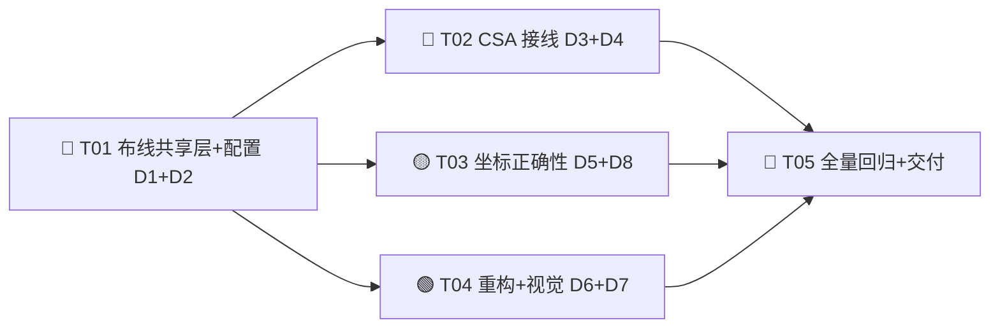

# CIS2HDL Phase XXII — 增量系统设计与任务分解（架构师交付）

> 架构师：高见远（software-architect）｜主理人：齐活林（汇总）
> 输入：`phase22-prd.md`（D1-D8 + Q1-Q8）+ `phase21-root-cause-evidence.md`（Phase XXI 修复模式）+ `handoff-20260813-190605.md` §7c（symbol.css/CSA 指令字段规范 + 25/50 栅格 + LASTPIN 同源铁律）+ 源码只读复核（wire_layout / detour_router / net_name_connect / wire_simplifier / csa_writer / xcon_writer / output_manager / text_layout / aesthetic_report / overlap_resolver / config.py / routing.yaml）
> 基线：Phase XXI 末 840 passed / 6 skipped（pytest --collect-only 846 collected）
> 性质：**增量设计** —— 仅描述 Phase XXII 变更（Phase XX 排期剩余 D1-D8）；不重写历史
> 语言：中文 ｜ 优先级：🔴 P0 必须 / 🟡 P1 应该 / 🟢 P2 可后置

---

## 0. TL;DR（决策速览）

| 任务 | 需求 | 一句话方案 | 默认开关 | 主战场 |
|------|------|-----------|:-------:|--------|
| D1 | P0-1 p0 三段式 stub | **DetourRouter 三段式能力下沉到 WireLayoutEngine**（基类共享），p0 带 cfg 时启用延伸→折线→调头 | 开（`three_stage_stub=true`，Q1 授权更新 WIRE 基线） | `wire_layout.py` / `detour_router.py` |
| D2 | P0-2 p0 stub 避障 | 三段式本身做 outline 避让（`_stub_direct_blocked`→`_try_jog_candidates`）；WIRE_THROUGH_BODY 报告加"自身引脚引出段豁免" | 开（随 D1） | `wire_layout.py` / `csa_writer.py` / `aesthetic_report.py` |
| D3 | P0-3 net_name_endpoints 接线 | use_net_name 分支**单一调用点**：`net_name_endpoints` 为主（跨页悬空端），非跨页补全由既有泛化 has_label 循环承担 + 去重 | 随 `ioport.use_net_name` | `csa_writer.py` / `net_name_connect.py` |
| D4 | P1-5 并联扩展到所有信号 | 路由前对非 GND 同信号引脚簇做 hub 短接计划（`plan_parallel_short`），route_map 注入 hub、路由后短接段并入网；`wire_simplify.enabled` 保持 false | 开（`wire_simplify.parallel_short=true` 既有） | `csa_writer.py` / `wire_simplifier.py` / `gnd_cluster_planner.py` |
| D5 | P1-2 IO port 按网络聚类 | edge_layout 开启时按"同网页内引脚 y 均值"重排 IOPORT 槽位（确定性、无重叠） | 关（`ioport.edge_layout=false` 既有） | `csa_writer.py` |
| D6 | P2-3 xcon 合并 | 保留 `XconWriter._build_xcon_content` 为唯一内容源；`OutputManager.write_xcon` 强制 `content_override`（None → ValueError）；删除 output_manager 自建内容 | 开（重构，字节级不变） | `output_manager.py` / `xcon_writer.py` |
| D7 | P2-4 标签方向随元件 | `TextLayoutResult` 增加 `label_orient`（VALUE/$LOCATION 随 dehdl 旋转 R 行） | 关（`text_layout.enabled=false`，--text-layout 开） | `text_layout.py` / `csa_writer.py` |
| D8 | P1-7 aes LASTPIN miss | 根因①`_compute_pin_geometry` 微移 key 记录顺序 bug；②expected 用简化 css 查找而非 `_resolve_pin_offset` 同源链。修复：key 前置 + `_pin_offset_map` 单源 + 位移后 snap50 + 豁免证据化 | 开（修复） | `csa_writer.py` / `aesthetic_report.py` |

**五条铁律（延续 Phase XIV-XVIII-XXI）**：

1. **连接判定 = 坐标重合**：WIRE 端点必须精确等于 LASTPIN 坐标；D1/D2/D4 的 stub/绕障/短接一律不得移动引脚端点。
2. **引脚坐标单源**：`_compute_pin_geometry` 的 `pin_coords` 同时喂 LASTPIN 与 WIRE 端点；**OverlapResolver 位移必须在 pin_coords 之前**（body 位移后 pin/LASTPIN/WIRE 全部用新 body 重算，否则 LASTPIN miss → 543 回归）。
3. **50/25 栅格**：mock 引脚/body 位移 50 倍数；WIRE 端点 25 网格；所有新坐标 `_snap` 到 25/50。
4. **新功能独立模块 + 配置开关，默认关可回退**；D1/D2 属 P0 默认开（Q1/Q2 裁决），D6/D8 属重构/修复默认开，仍留开关逃生。
5. **数据源铁律**：网络名/聚类/属性全部基于 DesignConnectivity 与既有模型，writer 禁止自造数据。

**Q1-Q8 主理人裁决落地**（设计必须遵守）：

| 裁决 | 落地 |
|------|------|
| Q1 | P0-1 默认开 → 允许更新 WIRE 基线断言（功能性等价）；验收口径 = 线头/self-overlap 0（`overlap_detector.self_intersections` 空） |
| Q2 | 两模式共用同一避让实现 → **能力下沉**：三段式 stub 全部辅助函数从 DetourRouter 移入 WireLayoutEngine（纯搬迁，无行为变化），p0/detour 共用 |
| Q3 | `net_name_endpoints` 为主 + 非跨页补全（单一调用点）→ csa_writer use_net_name 分支只调 `net_name_endpoints`；非跨页补全由泛化 has_label 循环承担（去重） |
| Q4 | 仅接线 `parallel_short_wires`，`wire_simplify.enabled` 保持 false → 路由前调用，不走 simplify_wires |
| Q5 | 位移后 snap 25 网格 → OverlapResolver 位移应用后 `_snap_body_coords(body_coords, 50)`（50 也是 25 网格） |
| Q6 | 保留 `xcon_writer._build_xcon_content` 为唯一内容源 → output_manager 仅写文件，删除自建内容逻辑 |
| Q7 | text_layout 默认关 + --text-layout 可开 → 标签方向逻辑挂在 text_layout.enabled 门控下 |
| Q8 | 全量 ≥840 passed，新增防回归 ≥16 条（每任务 1-4 条） |

---

## 1. 增量设计（按 D1-D8）

> 每项列出：涉及文件（精确路径）/ 修改或新增函数（签名级）/ 关键算法。

---

### D1 🔴 P0-1 — p0 模式三段式 stub 启用（Q1）

**现状**：`routing.three_stage_stub: true` 已配置；`_three_stage_stub`（detour_router.py L316）仅在 mode=detour 生效；`wire_layout.py` 的 `_route_horizontal/_route_vertical`（L589/L621）是直 stub（零引出），DetourRouter 覆写才走引出段。

**方案**：**能力下沉**（Q2 统一实现的前半）——把 DetourRouter 中与 stub 引出相关的**纯几何 + cfg 辅助函数**原样搬入 WireLayoutEngine（基类），DetourRouter 继承即可，删除自身重复定义；随后修改基类 `_route_horizontal/_route_vertical`：当 `self.cfg` 存在且 `three_stage_stub=true` 时走"延伸→折线→调头"三段式（与 detour 完全同一实现），否则保持旧直 stub（无 cfg 的单测零回归）。

**涉及文件**：

| 文件 | 动作 |
|------|------|
| `cis2hdl/core/writer/wire_layout.py` | **修改**：搬入并复用以下函数；改 `_route_horizontal/_route_vertical`；`route_nets` stash `_pin_bodies`/`_three_outlines` |
| `cis2hdl/core/writer/detour_router.py` | **修改**：删除已下沉的重复定义，保留 `route_nets` 覆写 + `_detour_segment/_build_detour` 绕障后处理 |
| `cis2hdl/core/config.py` / `cis2hdl/config/routing.yaml` | `WireSimplifyCfg.parallel_short_dist: int = 500`（D4 用，本轮一并加） |
| `tests/unit/test_wire_layout_p0_stub.py` | **新增**：p0 带 cfg 三段式 + self-overlap 0 + 端点不变 |
| `tests/unit/test_router_registry.py` / `tests/unit/test_avoidance_enhanced.py` | 核对（下沉后 DetourRouter 继承同名方法，行为不变） |

**下沉函数清单**（从 DetourRouter 原样移动，签名不变）：
`_stub_lead_cfg` / `_lead_map` / `_lead_point` / `_three_stage_enabled` / `_three_stage_outlines` / `_edge_clearance_cfg` / `_three_stage_stub` / `_try_jog_candidates` / `_stub_direct_blocked` / `_jog_clear` / `_segment_in_page_band` / `_clean_pieces` / `_detour_margin` / `_trunk_end_coords` / `_lane_conflict`（static）/ `_segment_intersects`（static）。

**基类改动**：

```python
# wire_layout.py —— 修改
def route_nets(self, net_pin_map, body_outlines, **ctx):
    """（追加两行 stash，与 DetourRouter 原 route_nets 一致）"""
    self._pin_bodies: dict[tuple[int, int], tuple[int, int]] = dict(
        ctx.get("pin_bodies") or {})
    self._three_outlines: list = list(body_outlines or ())

def _route_horizontal(self, pins, trunk) -> list[WireSegment]:
    """修改：self.cfg 且 _three_stage_enabled() 时走三段式（= 原
    DetourRouter._route_horizontal 逻辑）；否则旧直 stub（无 cfg 零回归）。"""

def _route_vertical(self, pins, trunk) -> list[WireSegment]:
    """同上（对称）。"""
```

**关键算法（三段式几何，已是 detour 验证过的实现）**：
```
输入：pin P(x,y)、trunk 值 T、方向 vertical
1. E = P + outward * stub_lead（outward 背离 body 中心，_pin_bodies 提示）
2. direct = [P→E, E→T]
3. 若 _stub_direct_blocked(direct, outlines, [], [], vertical)（穿 outline/页边带）：
   J = E + perpendicular * (max_detour + edge_clearance)，逐 50 递增找最近空闲
   车道（_try_jog_candidates，jog_lanes 防同网共线）→ 输出 [P→E, E→J, J→T]
4. 否则退化 2 段；零长段剔除；端点 pin 坐标不动；全 25 网格
```

**接线顺序**：csa_writer `_route_nets`（L2196）已 `create_router(mode, self._routing_cfg)` 传 cfg → p0 默认即启用三段式。**注意**：无 cfg 的单测构造（`WireLayoutEngine()`）保持旧行为，天然零回归。

**验收断言**：p0（带 cfg）单引脚 stub 段数 ≤ 3 且含引出段；`overlap_detector.self_intersections(routed.wires)` 空；每个 stub 端点 = 引脚坐标（`_snap` 25）；WIRE off-grid(25) = 0。

---

### D2 🔴 P0-2 — p0 模式 stub 避障 + 报告豁免（Q2）

**现状**：p0 trunk 已避让 outline（`_avoid_outlines`）；stub 直线段对**框内引脚**（真实库元件）可能穿元件体；`aesthetic_report [WIRE_THROUGH_BODY]` 只记录不绕障（Phase XXI I）。

**方案**：D1 三段式下沉后，p0 stub 自动获得 outline 避让（`_stub_direct_blocked` + `_try_jog_candidates` 就是避障实现）→ 穿**其他元件**的 stub 归零。剩余一类"穿体"是**引脚自身所属元件**（真实库引脚在 outline 内，P→E 引出段必然穿过自己的 outline）——这是正常电气引出，不应计为违规。因此：

1. `wires_through_bodies` 报告接入**自身引脚引出豁免**：csa_writer 报告循环中，若穿体段的一个端点 == 该 body 所属实例的引脚坐标（pin→body 映射已有 `pin_bodies`/outline_map 可反查），则豁免（不计入 `[WIRE_THROUGH_BODY]`）。
2. `aesthetic_report.write` 的 `[WIRE_THROUGH_BODY]` note 更新：豁免规则说明（不再只指向 detour）。

**涉及文件**：

| 文件 | 动作 |
|------|------|
| `cis2hdl/core/writer/csa_writer.py` | **修改**：L1918-1935 报告循环加 `_pin_owned_by_body` 豁免判断 |
| `cis2hdl/core/writer/aesthetic_report.py` | **修改**：`add_wire_through_body` 增 `exempt: bool=False` 参数 + note 文案 |
| `tests/unit/test_wire_through_body_exempt.py` | **新增**：自身引脚引出豁免 / 穿其他元件仍计数 |

**关键算法（豁免判定）**：
```
输入：穿体对 (seg, outline)，页级 pin→body 映射（pin_bodies 已收集：
      coord → body 中心；outline_map: refdes → rect）
1. 找到 outline 所属 refdes（outline_map 反查）
2. 若 seg 任一端点 ∈ 该 refdes 的 pin_coords 集合 → 自身引出 → exempt=True
3. 否则 → 真违规（穿其他元件）→ 计数
```

**验收断言**：p0 默认转换 `aesthetic_report [WIRE_THROUGH_BODY] total=0`（豁免后）；穿其他元件段的检测单测仍能检出（防误豁免）。

---

### D3 🔴 P0-3 — net_name_endpoints 接线（Q3）

**现状**：`net_name_connect.py:122 net_name_endpoints()` 已实现（输入 net_pin_map + wire_segments + cross_page + use_net_name → 悬空端坐标+网名）；csa_writer L2103-2114 use_net_name 分支只调 `net_name_labels`，未调 `net_name_endpoints`。

**方案**：use_net_name 分支改为**单一调用点**：

1. 路由完成后（D4 短接合并后）从 `routed_nets` 生成 `wire_segment_map`：`{net: [(w.x1,w.y1,w.x2,w.y2) for w in routed.wires]}`。
2. `_extra_sig_names = net_name_endpoints(net_pin_map, wire_segment_map, _cross, True)` —— 跨页网悬空端补 SIG_NAME（主）。
3. **非跨页补全**：既有泛化 has_label 循环（L2115-2130）已覆盖"无 source-pin 标签的网在 pins[0] 补线上名"——保留；但需**去重**：若某网已出现在 `_extra_sig_names`，跳过泛化循环（避免同网双标签）。
4. `net_name_labels` 函数**保留**（向后兼容 + 单测引用），但 csa_writer 分支不再调用（职责被 net_name_endpoints + 泛化循环取代）。

**涉及文件**：

| 文件 | 动作 |
|------|------|
| `cis2hdl/core/writer/csa_writer.py` | **修改**：L2103-2137 分支改调 `net_name_endpoints` + 去重 |
| `cis2hdl/core/writer/net_name_connect.py` | **不改**（函数已就绪）；docstring 标注职责边界 |
| `tests/unit/test_net_name_endpoint.py` | **扩展**：跨页悬空端全补标签 + 非跨页泛化补全 + 去重（同网不双标签） |

**关键算法（去重）**：
```
_extra_nets = {net for _, net in _extra_sig_names}
for net_display, pins in net_pin_map.items():
    if net_display in _extra_nets: continue        # 已有悬空端标签
    if has_label(source_pins): continue            # 已有 source-pin 标签
    ... 原 pins[0] 补线逻辑 ...
```

**验收断言**：use_net_name 转换：跨页网悬空端 SIG_NAME 数 = 悬空端总数（≥1/网）；无同网双标签；既有 `cross_page_bare_names` 行为不回归。

---

### D4 🟡 P1-5 — 并联扩展到所有信号（Q4）

**现状**：`wire_simplifier.parallel_short_wires`（L368）已实现无调用方；仅 GND 簇经 gnd_cluster_planner 使用；`wire_simplify.enabled=false`。

**方案**（Q4：仅接线 parallel_short_wires，wire_simplify 整体保持默认关）：

1. `wire_simplifier.py` 新增 `plan_parallel_short`（复用 `route_cluster_parallel`/`hub_for`/`hub_short_wires`）：
```python
def plan_parallel_short(
    pins: Iterable[Point], max_dist: int = 500,
    stub_lead: int = 100,
    outlines: Iterable[Rect] = (),
) -> tuple[list[Point], list[Segment]]:
    """同信号相近引脚簇规划：返回 (hub_coords, 簇内短接 WIRE 段)。
    hub_coords 供 csa_writer 注入 route_map；短接段端点 = 引脚坐标不变。"""
```
2. csa_writer `_build_csa_content_conn`，在 `_compute_pin_geometry` 之后、`_route_nets` 之前（L1912 附近）：
   - 遍历 `net_pin_map`，跳过 GND 网（`_gnd_net_display` 判定）与 `IOPORT_` 引脚；
   - 对每网：贪心最近邻聚类（间距 ≤ `wire_simplify.parallel_short_dist`，默认 500）；
   - 簇 ≥2 引脚 → `plan_parallel_short` → 收集 `hub_coords` 与短接段；
   - 构造**路由专用** `route_map`（不修改 net_pin_map）：簇内引脚替换为合成 hub 引脚 `{"refdes": f"PARALLEL_HUB_{net}_{k}", "pin": "H", "coord": hub, "is_power_symbol": False}`；
   - `_route_nets(route_map, ...)` 路由（hub→trunk 一段引出）；
3. 路由后（与 `_gnd_cluster_wires` 合并同区，L1975-1991）把短接段并入对应 net 的 `routed.wires` + 重算 dots（`compute_dots`），去重（`_dedupe` 思想）。
4. 门控：`wire_simplify.parallel_short`（既有 true）。**注意**：Q4 明确不开 `wire_simplify.enabled`——不得在 `simplify_wires` 中接线。

**涉及文件**：

| 文件 | 动作 |
|------|------|
| `cis2hdl/core/writer/wire_simplifier.py` | **新增** `plan_parallel_short`（内部复用 gnd_cluster_planner） |
| `cis2hdl/core/writer/csa_writer.py` | **修改**：路由前规划 + route_map + 路由后短接段合并 |
| `cis2hdl/core/config.py` + `routing.yaml` | `WireSimplifyCfg.parallel_short_dist: int = 500`（D1 已加） |
| `tests/unit/test_parallel_short_all.py` | **新增**：非 GND 并联簇 hub 短接段并入网；每簇段数 = 簇内引脚数 + 1 引出；端点=引脚坐标；`wire_simplify.enabled` 仍 false |

**验收断言**：非 GND 同信号引脚间距 ≤500 的簇被 hub 短接；每簇 WIRE 段数 = 簇内引脚数（hub 短接）+ 1（引出）；坐标唯一原则保持（端点 = 引脚坐标）；LASTPIN 仍命中（hub 是合成点不参与 LASTPIN）。

---

### D5 🟡 P1-2 — IO port 按网络聚类就近（P1-2）

**现状**：`_ioport_position_cfg`（L3477）edge_layout 时沿右缘**等间距**（y=7200-300-index*100），不关心网络就近。

**方案**：edge_layout 开启时，IOPORT 槽位**按同网页内引脚位置聚类重排**（确定性）：

1. 在 `_compute_pin_geometry` 的 IOPORT 追加循环（L2399）**之前**调用新函数：
```python
def _build_ioport_cluster_order(self, page_conn, net_pin_map) -> None:
    """edge_layout 开启时：对每个 effective IOPORT 求其网的页内引脚 y 均值
    （排除 IOPORT_ 自身引脚），按 y 降序（顶→下）分配槽位 ordinal；
    同锚点按 off_page 原始顺序决胜（确定性）。结果存
    self._ioport_cluster_order: dict[int, int]（effective_idx → ordinal）。"""
```
2. `_ioport_position_cfg(index)` 修改：若 `self._ioport_cluster_order` 含 index → `y = (7200 - edge_margin) - ordinal * edge_step`；否则回退现有等间距公式。
3. 映射在 Pass 1 内建立 → `_ioport_pin_coord`（同函数）、Pass 2 `_emit_ioport_block`、text_layout `ioport_positions` 全部经 `_ioport_position_cfg` 同源读取，天然一致。
4. 门控：`ioport.edge_layout`（既有 false；--aesthetic / --ioport-edge 开启）。

**涉及文件**：

| 文件 | 动作 |
|------|------|
| `cis2hdl/core/writer/csa_writer.py` | **新增** `_build_ioport_cluster_order`；**修改** `_ioport_position_cfg` / `_compute_pin_geometry` |
| `tests/unit/test_ioport_clustering.py` | **新增**：同网 IOPORT 与页内引脚距离均值下降；无重叠；确定性（两次转换一致） |

**关键算法（聚类排序）**：
```
输入：页内 off_page（effective idx）、net_pin_map（含实例引脚）
1. 对每个 (idx, op)：net_display = _power_net_display(net_name)
   pins = [p for p in net_pin_map.get(net_display, []) if not p.refdes.startswith("IOPORT_")]
   anchor_y = mean(p.y)（无实例引脚 → 默认 7200-300-index*100 保持原序）
2. 按 anchor_y 降序排序（同 anchor → 原 index 升序）
3. ordinal = 排序后位置；写回 _ioport_cluster_order
```

**验收断言**：edge_layout 开启时：同网 IOPORT 与页内该网引脚平均距离较等距基线下降（可统计均值）；无 IOPORT 坐标重叠；电气不变（IOPORT pin 仍是 WIRE 端点）。

---

### D6 🟢 P2-3 — xcon 合并重构（Q6）

**现状**：`output_manager._build_xcon_content`（L592，自建兜底）+ `xcon_writer._build_xcon_content`（L109，conn 全量数据）两套；conversion_engine L622 走 `XconWriter.write_with_manager`（正确路径），output_manager 的 `generate_all_cell_files`（L1043，仅测试用）走自建兜底。

**方案**（Q6：保留 xcon_writer 为唯一内容源）：

1. `OutputManager.write_xcon`：`content_override=None` 时 `raise ValueError("xcon content must come from XconWriter (single content source)")`；删除 `OutputManager._build_xcon_content`。
2. `OutputManager.generate_all_cell_files`：**废弃** .xcon 写盘（标注 deprecation，warning）；真实管线 .xcon 由 `XconWriter.write_with_manager` 产出（conversion_engine L622 不变）。
3. `tests/unit/test_output_compatibility.py`：更新——`generate_all_cell_files` 不再产出 .xcon（文件数 7→6 或断言 xcon 改由 XconWriter 路径覆盖，`test_phase_xi_p0.py` L425/L562 已直接测 `XconWriter._build_xcon_content`）。
4. 回归把关：全量 pytest + 转换产物 .xcon 字节级不变（内容源未动，纯重构）。

**涉及文件**：

| 文件 | 动作 |
|------|------|
| `cis2hdl/core/writer/output_manager.py` | **修改**：`write_xcon` 强制 override；删 `_build_xcon_content`；`generate_all_cell_files` 去 xcon + deprecation |
| `cis2hdl/core/writer/xcon_writer.py` | **不改**（保持唯一内容源） |
| `cis2hdl/core/engine/conversion_engine.py` | **不改**（L622 已正确） |
| `tests/unit/test_output_compatibility.py` | **修改**：适配新行为 |
| `tests/unit/test_xcon_single_source.py` | **新增**：grep 断言 `_build_xcon_content` 全仓仅 1 处定义；`write_xcon` 无 override 抛 ValueError |

**验收断言**：全仓 `grep -rn "def _build_xcon_content"` 仅 `xcon_writer.py:109` 1 处；转换产物 .xcon 字节级不变（既有回归测试通过）。

---

### D7 🟢 P2-4 — 标签文字方向随元件（Q7）

**现状**：text_layout `collect_text_items` 的 VALUE/$LOCATION 锚点已随旋转 rotate_point（Phase XVII P0-4），但**标签方向**（CSA 属性块 `R n` 行）未随元件；text_layout.enabled=false 默认关。

**方案**（Q7：默认关 + --text-layout 可开）：

1. `text_layout.py`：
   - `TextItem` 增加 `orient: int = 0`（dehdl 旋转角：90/180/270；0 = 不输出 R 行）；
   - `collect_text_items` 对 VALUE/$LOCATION 设 `orient=rot_dehdl`（与锚点旋转同源，`rot_dehdl` 已在该函数内计算）；
   - `TextLayoutResult` 增加 `label_orient: dict[str, int]`（key → orient；`optimize` 末尾从 items 收集）。
2. `csa_writer._emit_conn_instance_block`：`text_layout.enabled` 时，VALUE/$LOCATION FORCEPROP 块按 `label_orient.get(key)` 输出 `R n`（n = {90:1,180:2,270:3}，0 不输出）；disabled 时完全保持现状。
3. 门控：`text_layout.enabled`（CLI --text-layout 置 true；--aesthetic 也会置 true）。

**涉及文件**：

| 文件 | 动作 |
|------|------|
| `cis2hdl/core/writer/text_layout.py` | **修改**：TextItem.orient / TextLayoutResult.label_orient / collect / optimize |
| `cis2hdl/core/writer/csa_writer.py` | **修改**：`_emit_conn_instance_block` 按 orient 输出 R 行 |
| `tests/unit/test_text_layout.py` | **扩展**：旋转元件标签 orient == 元件 R 行；disabled 无 R 行；0 碰撞不劣化 |

**验收断言**：--text-layout 开启后：旋转元件（R 行非 0）的 VALUE/$LOCATION 属性块携带匹配 R 行；disabled 输出与现状字节一致（回归零影响）；text_layout 既有 0 碰撞断言不劣化。

---

### D8 🟡 P1-7 — aes 模式 LASTPIN miss 修复/豁免（Q5）

**现状**：`aesthetic_report [LASTPIN_MISS]` aes 模式 7 处（C228.2/C263.2/C355.1/C356.1/C358.2/T30.1 等）；default 模式 0。根因两类（源码复核）：
- **①微移 key 记录顺序 bug**：`_compute_pin_geometry` 常规引脚循环中 `key = f"{irec.refdes}.{pre.pin_number}"` 在 `_unique_pin_coord` 微移判断**之后**赋值（L2359-2364）→ 微移引脚自身的 key 没进 `_nudged_pin_keys`（记录的是上一个引脚/电源键）→ `_lastpins_for_instance` 的坐标命中校验（L2969 `key not in self._nudged_pin_keys`）对微移引脚**不豁免** → coord（微移后）≠ expected（未微移）→ 报告 miss（±25 边缘，与 PRD 描述吻合）。
- **②expected 偏移计算不同源**：`_lastpins_for_instance` L2971-2973 用简化 `css_offsets.get(pin_name) or css_offsets.get(pin_number)` 重算 expected，而 Pass 1 用完整 `_resolve_pin_offset` 链（含 chips.prt 名桥/fallback）→ 两处偏移解析不一致 → 假 miss。

**方案**（Q5：位移后 snap + 命中修复；豁免证据化兜底）：

1. **修复①**：`_compute_pin_geometry` 常规引脚循环把 `key` 赋值移到循环顶部（`_unique_pin_coord` 之前）——微移引脚正确记录。
2. **修复②（单源）**：`_compute_pin_geometry` 增加 `self._pin_offset_map: dict[str, tuple[int,int]]`，常规引脚与电源符号循环内记录**实际使用的 resolved offset**；`_lastpins_for_instance` 的 expected 计算改用 `self._pin_offset_map.get(key)`（无则回退现逻辑）→ expected 与 coord 同源，天然一致。
3. **Q5 网格对齐**：`_build_csa_content_conn` OverlapResolver 位移应用后（L1889-1891）追加 `body_coords[ref] = _snap50(body_coords[ref])`（50 也是 25 网格；`_snap_mv` 已保证位移 50 倍数，此处兜底 body 原始坐标非 50 倍数场景）。
4. **豁免证据化**：`aesthetic_report.add_lastpin_miss` 增 `exempt: bool=False, reason: str=""`；`write` 输出 `[LASTPIN_MISS] total=N exempt=M` + 豁免原因清单。若修复后仍有个别合法 miss（如真实库符号引脚 offset 非 25 网格、无法命中），QA 在报告中证据化豁免（Q5 方案 b 兜底）。

**涉及文件**：

| 文件 | 动作 |
|------|------|
| `cis2hdl/core/writer/csa_writer.py` | **修改**：key 顺序 / `_pin_offset_map` / `_snap_body_coords` / `_lastpins_for_instance` expected 同源 |
| `cis2hdl/core/writer/aesthetic_report.py` | **修改**：`add_lastpin_miss` exempt/reason + 报告格式 |
| `tests/unit/test_lastpin_miss_fix.py` | **新增**：微移引脚豁免（不 miss）；expected 同源（name-bridge 场景不假 miss）；snap 后命中 |
| `tests/e2e/test_phase_xvi.py` | **扩展**：aes 转换断言 `[LASTPIN_MISS] total=0`（或 exempt 全部证据化） |

**验收断言**：aes 模式 `aesthetic_report [LASTPIN_MISS] total=0`（或 `total=N exempt=N` 全部证据化）；default 模式保持 0；`_lastpin_coord_hit` 数学一致性不破坏（未微移引脚仍严格校验）。

---

## 2. 数据流图（Mermaid sequence）

> 关键顺序（任务要求：D1-D5 相对 `_compute_pin_geometry` 的位置）：
> **body_coords → [D8 snap] → OverlapResolver → [D8 snap] → `_compute_pin_geometry`（内部：实例引脚 → [D5 聚类] → IOPORT 引脚入网）→ [D4 并联规划 route_map] → `_route_nets`（p0 三段式 [D1]+避障 [D2]）→ [D4 短接段并入] → [D2 WIRE_THROUGH_BODY 报告豁免] → text_layout [D7] → 发射（LASTPIN [D8 同源]/IOPORT [D5]）→ SIG_NAME [D3]**

```mermaid
sequenceDiagram
    autonumber
    participant CE as ConversionEngine._stage_generate
    participant CSA as CSAWriter._build_csa_content_conn
    participant OR as OverlapResolver
    participant PG as _compute_pin_geometry
    participant PS as wire_simplifier.plan_parallel_short
    participant RW as Router(WireLayoutEngine p0)
    participant TL as TextLayoutOptimizer
    participant NNC as net_name_connect.net_name_endpoints
    participant REP as AestheticReport

    CE->>CSA: conn/page_conn
    CSA->>CSA: body_coords(CoordTransform)
    CSA->>OR: resolve_passives(movables, fixed, max_move=200)  # 必须在 pin 几何前
    OR-->>CSA: displacements
    CSA->>CSA: body_coords += disp; _snap_body_coords(50)      # D8 网格对齐
    CSA->>PG: _compute_pin_geometry(conn, page_conn, body_coords)
    PG->>PG: pin_coords = body + rotate(resolved_offset)       # D8 _pin_offset_map 同源
    PG->>PG: [D5] _build_ioport_cluster_order(net_pin_map)     # edge_layout 聚类槽位
    PG->>PG: IOPORT 引脚入 net_pin_map(_ioport_pin_coord 同源)
    PG-->>CSA: pin_coords / pin_name_map / net_pin_map
    CSA->>CSA: source_pins = _choose_sig_name_sources(net_pin_map)
    CSA->>PS: [D4] 非 GND 网簇规划 → hub_coords + 短接段
    PS-->>CSA: route_map(簇→hub) + short_wires
    CSA->>RW: _route_nets(route_map, body_outlines, pin_bodies)
    RW->>RW: [D1] 三段式 stub（延伸→折线→调头）+ [D2] outline 避障
    RW-->>CSA: routed_nets
    CSA->>CSA: [D4] 短接段并入 routed.wires + compute_dots（GND 簇合并同区）
    CSA->>REP: [D2] wires_through_bodies(自身引脚引出豁免)
    CSA->>TL: [D7] optimize(标签 orient 随 R 行)  # 仅 text_layout.enabled
    CSA->>CSA: FORCEADD/LASTPIN 发射（[D8] expected=_pin_offset_map 同源）
    CSA->>CSA: IOPORT 发射（[D5] _ioport_position_cfg 聚类槽位）
    CSA->>NNC: [D3] net_name_endpoints(net_pin_map, wire_segment_map, cross_page, use_net_name)
    NNC-->>CSA: 悬空端标签（去重后并入 SIG_NAME 发射）
    CSA-->>CE: CSA 页内容
```

---

## 3. 数据结构与接口（Mermaid classDiagram）

```mermaid
classDiagram
    class WireLayoutEngine {
        +cfg
        +_pin_bodies: dict
        +_three_outlines: list
        +route_nets(net_pin_map, body_outlines, **ctx) dict
        +route_net(net_name, pins, body_outlines) RoutedNet
        +_route_horizontal(pins, trunk) list
        +_route_vertical(pins, trunk) list
        +_stub_lead_cfg() tuple
        +_lead_map(pins, base_lead, differentiate, min_gap) dict
        +_lead_point(x, y, lead) tuple
        +_three_stage_enabled() bool
        +_three_stage_stub(pin, trunk, vertical, outlines, busy_h, busy_v, lead, jog_lanes) list
        +_try_jog_candidates(pin, ex, ey, trunk, vertical, outlines, busy_h, busy_v, jog_lanes, base) list
        +_stub_direct_blocked(direct, outlines, busy_h, busy_v, vertical) bool
        +wires_through_bodies(wires, outlines) list
    }
    class DetourRouter {
        +name() str
        +route_nets(net_pin_map, body_outlines, **ctx) dict
        +_detour_segment(seg, outlines, busy_h, busy_v) list
        +_build_detour(seg, ox0, oy0, ox1, oy1, busy_h, busy_v) list
    }
    class CSAWriter {
        +_build_csa_content_conn(conn, page_conn) str
        +_compute_pin_geometry(conn, page_conn, body_coords) tuple
        +_pin_offset_map: dict
        +_ioport_cluster_order: dict
        +_build_ioport_cluster_order(page_conn, net_pin_map) None
        +_ioport_position_cfg(index) tuple
        +_lastpins_for_instance(conn, page_conn, irec, pin_coords, source_pins, body_coord) list
        +_route_nets(net_pin_map, body_outlines, conn, page_conn, pin_bodies) dict
        +_emit_conn_instance_block(conn, irec, body_name, x, y, lastpin_lines, label_offsets, label_orient, placeholder) list
        +_sig_name_on_wire(coord, net_display, label_offsets) list
    }
    class WireSimplifier {
        +parallel_short_wires(pins, max_dist, stub_lead, outlines) list
        +plan_parallel_short(pins, max_dist, stub_lead, outlines) tuple
        +simplify_wires(wires, pins, dot_merge, max_wire_len, obstacles, break_long, net_display) SimplifyResult
    }
    class GndClusterPlanner {
        +route_cluster_parallel(cluster_pins, hub, outlines, stub_lead, max_dist, gnd_coord) list
        +hub_for(cluster_pins) Point
        +hub_short_wires(hub, outlines, stub_lead) list
    }
    class NetNameConnect {
        +cross_page_bare_names(conn) set
        +net_name_endpoints(net_pin_map, wire_segments, cross_page, use_net_name) list
        +net_name_labels(net_pin_map, source_pin_keys, cross_page, use_net_name) list
    }
    class TextLayoutOptimizer {
        +optimize(page_conn, body_coords, pin_coords, routed_nets, net_pin_map, ioport_positions) TextLayoutResult
        +collect_text_items(page_conn, body_coords, pin_coords, routed_nets, net_pin_map, ioport_positions) list
    }
    class TextLayoutResult {
        +offsets: dict
        +label_orient: dict
        +collisions_before: int
        +collisions_after: int
    }
    class XconWriter {
        +_build_xcon_content(conn) str
        +write_with_manager(conn, mgr) list
    }
    class OutputManager {
        +write_xcon(cell_name, library_alias, num_pages, content_override) Path
        +generate_all_cell_files(...) list
    }
    class AestheticReport {
        +add_wire_through_body(page, net, seg, outline, exempt) None
        +add_lastpin_miss(page, refdes, pin, coord, expected, exempt, reason) None
        +write(output_dir) Path
    }
    class RoutingConfig {
        +three_stage_stub: bool
        +stub_lead: int
        +wire_simplify: WireSimplifyCfg
        +ioport: IoportCfg
        +text_layout: TextLayoutCfg
        +overlap: OverlapCfg
    }

    DetourRouter --|> WireLayoutEngine : inherits (三段式共享)
    CSAWriter ..> WireLayoutEngine : create_router(p0/detour)
    CSAWriter ..> WireSimplifier : D4 plan_parallel_short
    WireSimplifier ..> GndClusterPlanner : 复用 hub/短接算法
    CSAWriter ..> NetNameConnect : D3 net_name_endpoints
    CSAWriter ..> TextLayoutOptimizer : D7 label_orient
    CSAWriter ..> AestheticReport : D2/D8 报告
    OutputManager ..> XconWriter : D6 唯一内容源(content_override)
    WireLayoutEngine ..> RoutingConfig : cfg 门控
```



---

## 4. 配置变更清单（routing.yaml + config.py）

```yaml
# ── Phase XXII 新增/修改字段（其余复用既有字段）─────────────────────────
wire_simplify:
  enabled: false                # 保持默认关（Q4：不开整体化简）
  parallel_short: true          # 既有：D4 门控（接线后生效）
  parallel_short_dist: 500      # 新增：非 GND 并联判定距离阈值（与 GND 同值）

# 复用字段（本轮不新增，仅列门控关系）：
routing:
  mode: p0                      # 默认；D1 三段式在 p0 也生效
  three_stage_stub: true        # D1 门控（p0/detour 共用）
  stub_lead: 100                # 三段式引出距离
  edge_clearance: 100           # 三段式折线页边避让
ioport:
  edge_layout: false            # D5 门控（--aesthetic / --ioport-edge 开启）
  use_net_name: false           # D3 门控（--use-net-name 开启）
text_layout:
  enabled: false                # D7 门控（--text-layout 开启）
overlap:
  resolve: true                 # D8 前置（OverlapResolver 已接线）
placement:
  max_passive_move: 200         # D8 相关（Phase XXI 已调）
```

**config.py 变更**：`WireSimplifyCfg` 增加 `parallel_short_dist: int = 500`；其余 dataclass 无新增字段（TextLayoutResult 非配置）。

---

## 5. 任务列表（≤5 任务，按实现顺序）

> 分组原则：基座/布线 → CSA 接线 → 坐标正确性 → 重构/视觉 → 交付；每任务 ≥3 文件；依赖最小化。
> **注意**：T02/T03/T04 都改 `csa_writer.py`（不同函数区），实现顺序建议 T02→T03→T04 避免同文件合并冲突；依赖图上仍只挂 T01。

### T01 🔴 P0 — 布线共享层 + 配置基座（D1 + D2 + 配置）

- **源文件**：`cis2hdl/core/writer/wire_layout.py`（三段式下沉 + `_route_*` 改造 + route_nets stash）、`cis2hdl/core/writer/detour_router.py`（删重复、留绕障后处理）、`cis2hdl/core/writer/csa_writer.py`（WIRE_THROUGH_BODY 自身引脚引出豁免）、`cis2hdl/core/writer/aesthetic_report.py`（exempt 参数 + note）、`cis2hdl/core/config.py` + `cis2hdl/config/routing.yaml`（`wire_simplify.parallel_short_dist`）、`tests/unit/test_wire_layout_p0_stub.py`（新）、`tests/unit/test_wire_through_body_exempt.py`（新）
- **依赖**：无
- **优先级**：P0
- **验收断言**：①p0（带 cfg）单引脚 stub 三段式（延伸→折线→调头）且端点=引脚坐标 ②`overlap_detector.self_intersections` 空（无原地掉头线头）③p0 默认转换 `[WIRE_THROUGH_BODY] total=0`（豁免后）④无 cfg 单测零回归 ⑤`WireSimplifyCfg.parallel_short_dist` 生效 ⑥基线 840/6 不回退

### T02 🔴 P0 — CSA 接线层（D3 net_name_endpoints + D4 并联全信号）

- **源文件**：`cis2hdl/core/writer/csa_writer.py`（use_net_name 分支改调 `net_name_endpoints` + 去重；路由前 `plan_parallel_short` 规划 + route_map + 路由后短接段并入）、`cis2hdl/core/writer/wire_simplifier.py`（新增 `plan_parallel_short`）、`cis2hdl/core/writer/gnd_cluster_planner.py`（复用确认，必要时小改签名）、`cis2hdl/core/writer/net_name_connect.py`（docstring 职责标注）、`tests/unit/test_net_name_endpoint.py`（扩展）、`tests/unit/test_parallel_short_all.py`（新）
- **依赖**：T01（parallel_short_dist 配置）
- **优先级**：P0（D3）/ P1（D4）
- **验收断言**：①use_net_name 跨页悬空端全补 SIG_NAME、无同网双标签 ②非 GND 并联簇 hub 短接段并入网，每簇段数=簇内引脚数+1 引出 ③`wire_simplify.enabled` 仍 false ④端点=引脚坐标（坐标唯一原则）⑤既有 cross_page_bare_names 行为不回归

### T03 🟡 P1 — 坐标正确性（D5 IO port 聚类 + D8 LASTPIN miss 修复）

- **源文件**：`cis2hdl/core/writer/csa_writer.py`（`_build_ioport_cluster_order` / `_ioport_position_cfg`；`_compute_pin_geometry` key 顺序 + `_pin_offset_map` + `_snap_body_coords`；`_lastpins_for_instance` expected 同源）、`cis2hdl/core/writer/aesthetic_report.py`（`add_lastpin_miss` exempt/reason）、`tests/unit/test_ioport_clustering.py`（新）、`tests/unit/test_lastpin_miss_fix.py`（新）、`tests/e2e/test_phase_xvi.py`（扩展：aes `[LASTPIN_MISS] total=0`）
- **依赖**：T01（三段式/避让稳定后再动坐标，避免混淆回归源）
- **优先级**：P1
- **验收断言**：①edge_layout 开启时同网 IOPORT 就近（距离均值下降）、无重叠、确定性 ②aes `[LASTPIN_MISS] total=0`（或全部证据化豁免）③default 模式 miss 保持 0 ④未微移引脚仍严格命中校验（不破坏 R3d）

### T04 🟢 P2 — 重构 + 视觉（D6 xcon 合并 + D7 标签方向）

- **源文件**：`cis2hdl/core/writer/output_manager.py`（write_xcon 强制 override + 删 `_build_xcon_content` + `generate_all_cell_files` 去 xcon）、`cis2hdl/core/writer/xcon_writer.py`（不改，确认唯一源）、`cis2hdl/core/writer/text_layout.py`（TextItem.orient / TextLayoutResult.label_orient）、`cis2hdl/core/writer/csa_writer.py`（`_emit_conn_instance_block` 按 orient 输出 R 行）、`tests/unit/test_output_compatibility.py`（修改）、`tests/unit/test_xcon_single_source.py`（新）、`tests/unit/test_text_layout.py`（扩展）
- **依赖**：T01
- **优先级**：P2
- **验收断言**：①全仓 `_build_xcon_content` 仅 1 处定义 ②转换产物 .xcon 字节级不变 ③--text-layout 旋转元件标签 R 行随元件；disabled 输出字节一致 ④text_layout 0 碰撞不劣化

### T05 🔴 P0 交付 — 全量回归 + 对比包重建（Q8）

- **源文件**：`tests/`（全量回归 + 新防回归用例整合）、`scripts/make_compare_v9.py`（OUT 目录递增 `output_phaseXXIII_compare` 或按主理人指定新名）、`tests/e2e/test_v9_compare_package.py`（指向新目录）、`HG5015_tests/output_phaseXXIII_compare/`（重建 + README + metrics_summary）
- **依赖**：T02、T03、T04
- **优先级**：P0
- **验收断言**：①全量 pytest ≥840 passed / 6 skipped（新增 ≥16 条防回归）②默认（p0）转换 `[WIRE_THROUGH_BODY] total=0`、self-overlap 0 ③aes 转换 `[LASTPIN_MISS] total=0`（或证据化）④xcon 字节级不变 ⑤新对比包目录 + README/metrics 更新 ⑥交付目录名递增（用户防 Windows 重名约定）

**任务依赖图**：



---

## 6. 依赖包

无新增外部依赖；全部标准库（dataclasses/pathlib/re 等）。D4 复用 gnd_cluster_planner（仓库内），D6 复用 xcon_writer（仓库内）。

---

## 7. 共享知识（跨任务约束）

- **50/25 栅格**：mock 引脚/body 位移 50 倍数；WIRE 端点 25 网格；LASTPIN 必须落在 symbol.css 实际引脚位置（543 根因）；`_snap` 全 25。
- **LASTPIN 与 WIRE 坐标同源**：都来自 `_compute_pin_geometry.pin_coords`；**OverlapResolver 必须在 pin_coords 前**（D8 再次强调：位移后 snap50 再重算）。
- **pin_coords 单源 + 偏移解析同源**：Pass 1 `_resolve_pin_offset` 是唯一偏移解析链；D8 用 `_pin_offset_map` 让 LASTPIN expected 与 Pass 1 严格同源，禁止两处各自简化查找。
- **不破坏 542/1158 语义**：mock symbol.css 9 个 P 属性声明（Phase XXI A）；C/X 指令 justify/字号合法域（≥29，X 类型仅 PIN_TEXT/VHDL_PORT/HDL_PORT）；L 起点在 outline 上 —— D1-D8 一律不触碰 mock_icon_lib。
- **坐标唯一原则**：一实例一体坐标；D4 hub 是合成路由点（`PARALLEL_HUB_*`），只进 route_map，不进 net_pin_map/LASTPIN。
- **wire_simplify.enabled 保持 false**（Q4）；只接 `parallel_short`。
- **xcon 单一内容源**（Q6）：`XconWriter._build_xcon_content`；output_manager 只写文件。
- **text_layout 默认关**（Q7）：--text-layout 开启；标签方向随 R 行只在其 enabled 下输出。
- **D1/D2 高风险提示**：改动默认路由路径（p0），Q1 授权更新 WIRE 基线断言；所有新开关默认值与 routing.yaml 一致，逃生舱 = `three_stage_stub: false` + `wire_simplify.parallel_short: false` + `ioport.edge_layout: false` + `text_layout.enabled: false`。
- **交付目录递增**（用户约定）：新对比包用新目录名（如 output_phaseXXIII_compare），README 说明 temp_lib/origin 手动添加步骤。
- **CLI 关系**：`--aesthetic` 会置 mode=detour + edge_layout=true + gnd_distribution=true + text_layout=true —— D5/D7 验收在 aes 模式与 --text-layout 单开两种口径下都要看。

---

## 8. 测试计划与既有测试影响评估（D1/D2 最高回归风险）

### 8.1 新增防回归用例（≥16 条，Q8）

| 任务 | 新测试文件/用例 | 关键断言 |
|------|----------------|---------|
| T01 | `test_wire_layout_p0_stub.py`（+3） | p0+cfg 三段式段数/端点；self-overlap 0；off-grid 0 |
| T01 | `test_wire_through_body_exempt.py`（+2） | 自身引脚引出豁免；穿其他元件仍计数 |
| T02 | `test_net_name_endpoint.py` 扩展（+2） | 悬空端全补标签；同网不双标签 |
| T02 | `test_parallel_short_all.py`（+2） | 非 GND 簇 hub 短接并入网；enabled 仍 false |
| T03 | `test_ioport_clustering.py`（+2） | 距离均值下降；无重叠+确定性 |
| T03 | `test_lastpin_miss_fix.py`（+2） | 微移引脚豁免；expected 同源（name-bridge 不假 miss） |
| T04 | `test_xcon_single_source.py`（+1） | `_build_xcon_content` 全仓 1 处；write_xcon 无 override 抛错 |
| T04 | `test_text_layout.py` 扩展（+1） | 旋转元件标签 R 行随元件；disabled 无 R 行 |
| T05 | `test_phase_xvi.py` 扩展（+1） | aes `[LASTPIN_MISS] total=0` |

合计 ≥16 条。

### 8.2 D1/D2 既有测试影响评估（必读）

**设计上的天然隔离**：三段式仅在 `self.cfg` 存在且 `three_stage_stub=true` 时启用。直接 `WireLayoutEngine()`/`DetourRouter()`（无 cfg）的单测**行为不变**——这是最大的回归缓冲。

| 既有测试文件 | 受影响点 | 风险 | 处置 |
|-------------|---------|:---:|------|
| `tests/unit/test_router_registry.py` | TestDetourRouter 对比 baseline p0（L84-93）——两者均无 cfg → 行为不变 | 低 | 全量跑，确认仍通过 |
| `tests/unit/test_avoidance_enhanced.py` | TestThreeStageStub 用 `DetourRouter(cfg)` → 方法搬入基类后继承可用 | 低 | 全量跑；断言方法存在 |
| `tests/unit/test_nonuniform_tracks.py` / `test_net_order.py` | `WireLayoutEngine()` 无 cfg → 旧直 stub | 低 | 全量跑 |
| `tests/unit/test_wire_simplifier.py` / `test_gnd_parallel_short.py` / `test_gnd_cluster.py` | D1/D2 不触碰；D4 新增 `plan_parallel_short` 复用 hub 算法 | 低 | 全量跑 |
| `tests/unit/test_phase_xv.py` / `test_phase_xxi_fixes.py` / `test_mock_icon_lib.py` / `test_symbol_css_validator.py` / `test_spcn543_fix.py` | mock/LASTPIN 相关，D1-D8 不碰 mock_icon_lib；TestG_OverlapResolver 不受影响 | 低 | 全量跑 |
| `tests/e2e/test_phase_xvi.py` | default_out 走真实 p0 转换（带 cfg）→ WIRE 段数/形态变化；断言 off-grid=0、SIG_NAME ∈ WIRE 端点、default vs nomirror 逐字节一致（两侧同变） | **中** | 验证三点断言在真实产物上仍成立；若某页 WIRE 段数断言存在 → 按 Q1 更新基线 |
| `tests/unit/test_p0_spn_fix.py` / `test_phase_xi_p0.py` / `test_phase_xi_p1.py` | 可能含 p0 WIRE 段数/坐标 golden 断言（走真实转换） | **中** | 审计 golden 断言；Q1 授权更新（功能性等价） |
| `tests/e2e/test_v9_compare_package.py` | 指向旧 `output_phaseXXII_compare` | 中 | T05 重建新目录并更新指向 |
| `tests/unit/test_output_compatibility.py` | D6 删除 output_manager 自建 xcon → `generate_all_cell_files` 不再产 xcon（文件数/内容断言） | 中（T04） | 按 D6 设计更新 |

**双保险**：①每个 T01 提交前跑 wire 相关单测 + e2e test_phase_xvi；②T05 全量 pytest + 默认/aes 两版转换产物跑 §7 交付验证清单（310/1158/543/off-grid/文本碰撞/LASTPIN）。

---

## 9. 风险与待明确事项

| # | 风险/待明确 | 影响 | 缓解/默认 |
|---|------------|------|----------|
| 1 | **真实库框内引脚的"自身引出穿体"语义**：P→E 引出段必然穿过自己 outline；若豁免过宽会掩盖真违规 | D2 验收口径 | 豁免仅限"段端点=该 body 自身引脚坐标"；穿其他元件仍计数；QA 对真实产物抽查 |
| 2 | **P1-5 默认开改变大量网拓扑**（板上并联电容/电阻多）→ WIRE 段数/坐标大范围变化 | D4 | Q1 基线更新授权（PRD 成功标准已含 P1-5 默认 p0 生效）；e2e 端点断言复核；`wire_simplify.parallel_short: false` 逃生 |
| 3 | **p0 三段式 stub 的折线不避其他网段**（`busy_h/busy_v` 传空）——仅避 outline + 同网 jog_lanes；detour 后处理才全避 | D1 视觉 | 首版接受（trunk 车道已避）；如 Cadence 目视发现跨网共线 → T01 增强：route_nets 把 busy_h/busy_v 传入三段式 |
| 4 | **aes 模式 522 IOPORT × edge_step 100 超出页高**：聚类重排不改变总槽位，页底外 IOPORT 依旧 | D5 | 既有限制（edge_layout 已在 aes 使用）；D5 只重排顺序；如 Cadence 报页外 → 需增大 edge_step/双列（另立需求） |
| 5 | **D8 修复后仍有个别 miss**（真实库符号 offset 非 25 网格、无法命中等） | D8 验收 | 豁免证据化（Q5 方案 b 兜底）：报告 `exempt=N` + reason；QA 判定可接受 |
| 6 | **xcon 字节级不变依赖既有回归**：conversion 路径 L622 已正确，改动集中在 output_manager 死代码；若用户环境仍用 `generate_all_cell_files`（第三方脚本）会破坏 | D6 | deprecation warning + 文档说明；QA 字节级比对 |
| 7 | **`--aesthetic` 连锁**：置 mode=detour + text_layout + edge_layout + gnd_distribution——D7 的 R 行输出在 aes 模式也会出现，需与 detour 三段式组合验证 | D7 | aes 全量转换跑交付清单 |
| 8 | **`test_v9_compare_package.py` 指向旧目录**：用户要求新目录名，测试与脚本需同步 | T05 | 更新 OUT 常量 + 测试指向；README 复测指引 |
| 9 | **Q8 口径**：≥840 passed 为下限；新增 ≥16 条防回归后总量应 ≥856 collected | T05 | 全量 pytest 断言 |
| 10 | **代码级验证 ≠ Cadence 目视确认**：stub/避让/标签方向最终仍需用户 Cadence 16.6 复测 | 全 | 交付包 README 复测清单（同历史约定） |

---

## 10. 共享知识补充（Phase XXII 专属）

- **D1/D2 逃生舱组合**：`three_stage_stub: false` 回退旧直 stub（p0 恢复旧 WIRE 基线）；`wire_simplify.parallel_short: false` 回退无并联；`ioport.edge_layout: false` 回退等距；`text_layout.enabled: false` 回退无标签方向。
- **D4 hub 合成点规则**：`refdes=PARALLEL_HUB_<net>_<k>` 只进 route_map；不进 net_pin_map、不发射 LASTPIN、不进 source_pins；短接段端点必须是真实引脚坐标。
- **D5 聚类确定性**：排序键 = (-anchor_y, original_idx)；同网多 IOPORT 按网内 y 均值同槽位？——不，每个 IOPORT 独立槽位，同锚点按原序决胜，保证两次转换字节一致。
- **D8 `_pin_offset_map` 生命周期**：每页 `_build_csa_content_conn` 开始时清空（或按页覆盖），避免跨页串扰。
- **报告口径**：`[WIRE_THROUGH_BODY] total=N exempt=M`（T01）；`[LASTPIN_MISS] total=N exempt=M`（T03）——QA 验收用 exempt 区分"真违规"与"证据化豁免"。

---

*Phase XXII 增量系统设计 v1.0（2026-08-14，架构师高见远）。已实读全部关键源码与历史 handoff；任务 T01-T05 按实现顺序排列，依赖最小化（T02/T03/T04 仅依赖 T01，共享 csa_writer.py 建议顺序实施）。*
