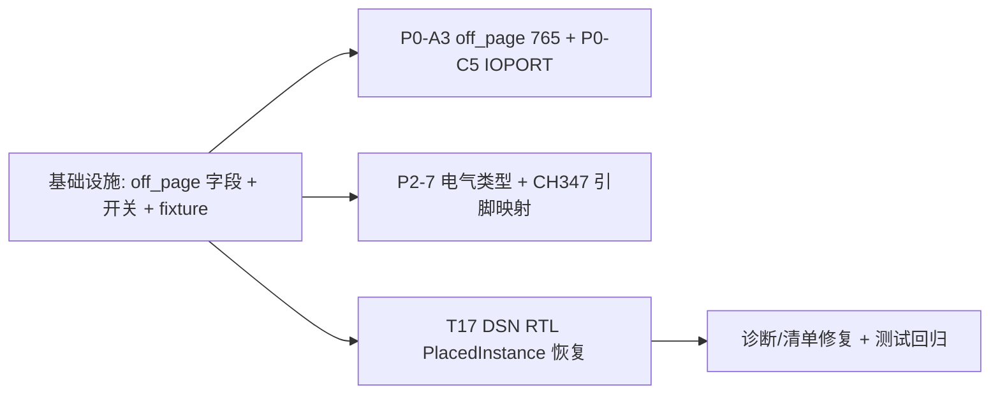

# CIS2HDL Phase XI 收尾五项 — 系统设计（只读逆向，架构师交付）

> 架构师：高见远（software-architect）
> 范围：Phase XI 收尾五项（P0-A3 / P0-C5 / P2-7 / CH347 / T17-DSN）
> 基线：当前 404 passed / 6 failed / 8 skipped（补齐 8367 DSN + LIBRARY2CLEAN.OLB fixture 后）
> 性质：**只读设计** —— 全部结论基于真实工程实测，不写实现代码。

---

## 0. 结论速览（TL;DR）

| # | 任务 | 根因（文件/行号/数据） | 修复方向 |
|---|------|------------------------|----------|
| 1 | P0-A3 off_page 522→765 | `edif_parser.py:807 _collect_off_pages` 只从页面 nets 收集 522 个 portRef；**243 个 `(offPageConnector &NAME)` 元素在顶层 cell `TG1C0D8_VB` 的 contents 中（与 24 个 page 块平级），从不进入任何 `_parse_page_block`** → 243 丢失 | 在 `parse()` 主循环收集顶层 cell contents 的 offPageConnector 元素 → `DesignIR.off_page_symbols`（243 唯一名）；`PageIR.off_pages` 保持 522；提供 `DesignIR.off_page_total=765` 统计 |
| 2 | P0-C5 跨页 IOPORT 符号 | 8367 用 SIG_NAME（`page1.csa` L64 `SIG_NAME UN$1$DCDC$I1$EN`）；**04p4 接口页 page15 用 `FORCEADD IOPORT..1`/`INPORT..1`**（standard 库、`OFFPAGE TRUE`、`HDL_PORT/VHDL_PORT`、`CDS_LIB standard`）；standard 库有 ioport/inport/outport/offpage 符号，`tests/fixtures/hdl_lib` **没有** ioport | csa_writer 对跨页网输出 IOPORT 符号块（按 04p4 page15 真实模板），每页每跨页网 1 个；与 SIG_NAME 共存 |
| 3 | P2-7 OLB 电气类型接通 | `SymbolPin.electrical_type` 字段存在（`symbol_css.py:47`）但 `_correlate_pins`（L343-400）**永不赋值**；`hdl_scanner._symbol_to_dict`（L416-437）**不序列化**；OLB `PinDef.type` 提取对 LIBRARY2CLEAN.OLB 实测 **pins=0**（启发式失效）；**chips.prt PINUSE 是可靠源**（8367 hdl_lib 实测 att7022e `AGND1: PINUSE='GROUND'`） | 新函数 `enrich_pin_types(pin_types: dict[str, ElectricalType])` 注入 SymbolPin；`_symbol_to_dict` 补序列化；数据源优先级 OLB > chips.prt PINUSE |
| 4 | CH347 引脚偏移 (0,0) | `chips_prt.py:234-247` `_RE_PIN_DECL` 把功能名当 number，随后 PIN_NUMBER 覆盖 → **PinDef.name=''（功能名 RST# 丢失）**；symbol.css C 指令键是功能名（`C -300 -250 "RST#"`）；`connectivity_model.py:693` `pin_names[str(p.number)] = name` 得 `{'1':'1'}`；`csa_writer.py:1005` `offsets.get('1')` → None → fallback (0,0) | `chips_prt._parse_primitive_pins` 把 pin_decl 功能名保留到 `PinDef.name`（PIN_NUMBER 只覆盖 number） |
| 5 | T17 DSN 实例=0 | `structures.py:741-748` `parse_placed_instance` 对 `dsn_format=="rtl"` **raise**；`page_parser.py:186-189` `except Exception: continue` 吞掉异常 → 实例静默为 0；8367 DSN 全部 preamble data_len=0 → 判 rtl（与 HG5015 相同，**并非"标准变体"**）；且该 DSN 只有 6 个芯片封装视图流（vRTL8367*），无板级页面流 | ① 恢复 `_parse_placed_instance_rtl`（参照 `_parse_graphic_inst_rtl` L1020-1045 模式 + `_RtlStructure.parse` + T0x10 解析）；② `file_inventory.py:356-360` raw 回退补 VRTL 识别（与 DSNParser 一致）；③ 测试验收 6 项恢复 |

---

# Part A：系统设计

## A.1 P0-A3 — off_page 522/765 完整化

### A.1.1 根因精确定位（数据证据）

对 `tests/fixtures/HG5015test/HG5015-BE36_V10.EDF` 用 sexpdata 全树扫描：

```
offPageConnector 元素（全树）        = 243    ← (offPageConnector &NAME_OFF_PAGE_CONNECTOR)
page blocks                         = 24
offPageConnector 位于 page 块内      = 0      ← 关键！243 个都不在 page 块里
offPageConnector 位于 NET contents   = 0      ← 当前 _collect_off_pages 检查的地方，恒空
portRef OFF_PAGE_CONNECTOR（页面 nets）= 522   ← 当前已收集
cell 'TG1C0D8_VB' contents 直接子元素 = {'offPageConnector': 243, 'page': 24}
```

**243 个 offPageConnector 元素是顶层设计 cell `TG1C0D8_VB` 的 view→contents 直接子元素**，与 24 个 `(page ...)` 块平级。`_get_page_blocks`（`edif_parser.py:512-540`）只取 page 块；`_parse_page_block`（L642-694）只处理 page 块内部 → **243 个 offPageConnector 元素从未被任何代码访问**。

名字集合验证：243 个元素名唯一（无重复），与 522 个 portRef 的**唯一名集合完全一致**（差集均为 0）：
- 243 = 跨页连接器"符号声明"（全局清单）
- 522 = 跨页连接器"页面引用"（每页每网 1 条）
- 765 = 243 + 522（grep 全文件 OFF_PAGE_CONNECTOR 总次数）

当前 `_collect_off_pages`（`edif_parser.py:807-849`，注意该文件工作区已有未提交修改）已对 net 内部 contents 增加了 offPageConnector 分支，但实测 `offPageConnector inside NET contents: 0` —— **该分支无效**，243 仍丢失。

### A.1.2 修复方案

**文件：`cis2hdl/core/ir/design.py` + `cis2hdl/core/parser/edif_parser.py`**

1. `DesignIR` 新增字段：
```python
# 全局跨页连接器符号清单（EDIF 顶层 cell contents 中的 (offPageConnector &NAME)）
off_page_symbols: list[str] = Field(default_factory=list)

@property
def off_page_total(self) -> int:
    """765 = 243 符号声明 + 522 页面引用（P0-A3 完整口径）"""
    return len(self.off_page_symbols) + sum(len(p.off_pages) for p in self.pages)
```

2. `EDIFParser.parse()` 主循环（L349-358 附近）增加收集：对含 page blocks 的 cell（`_get_page_blocks(cell)` 非空），从其 contents 直接子元素收集 `(offPageConnector &NAME)`：
```python
# 顶层设计 cell 的 contents 与 page 块平级放置 243 个 offPageConnector 声明
for cell in cells:
    if not self._get_page_blocks(cell):
        continue
    view = _find_first(cell, "view", flatten=False)
    contents = _find_first(view, "contents") if view else None
    if contents is None:
        continue
    for offref in contents:
        if (isinstance(offref, list) and offref
                and _sym_str(offref[0]).lower() == "offpageconnector"
                and len(offref) >= 2):
            name = _sym_str(offref[1]).lstrip("&")
            if name not in off_page_symbols_set:
                off_page_symbols_set.add(name)
                design_off_page_symbols.append(name)
```

3. 统计日志（`edif_parser.py:415` 附近）：`off_page = 765 (243 符号 + 522 引用)`。

4. `_collect_off_pages` 保留（522 引用正确），其 net 内部 contents 分支可保留作防御（对其它 EDIF 变体可能有效）。

### A.1.3 真实工程证据

- `HG5015-BE36_V10.EDF` L51496-51535：`(contents (offPageConnector &_31N396766_OFF_PAGE_CONNECTOR) ... (offPageConnector BB_IN_C0_MT2_OFF_PAGE_CONNECTOR) ...)` —— 顶层 cell contents 中 243 个声明，与 24 个 page 平级。
- L54214：`(portRef &1V8_BUCK_OFF_PAGE_CONNECTOR)` —— page 块 net joined 中 522 个引用（无 instanceRef）。

---

## A.2 P0-C5 — 跨页端口 IOPORT 符号（含 ④ 详细分析）

### A.2.1 对照真实工程（①）

**8367 工程**（`docs_for_reference/OrCAD_files_references/cis_for_reference/worklib/8367/sch_1/page1.csa`）：
- 跨页网用 **SIG_NAME 标签**：L64 `FORCEPROP 2 LASTPIN (-5550 6675) SIG_NAME UN$1$DCDC$I1$EN`、L1631 `FORCEPROP 3 LASTPIN (-6450 5325) SIG_NAME VCC_12\g`
- **全工程 0 个 IOPORT/INPORT/OUTPORT FORCEADD**（grep 全部 csa 页为空）
- 8367 page1 FORCEADD 集合：`DC_DC/CAPACITOR/RESISTOR/INDUCTOR/DIODE/GND_POWER/VCC_CIRCLE/MARK/C SIZE PAGE/INTERFACE..4` —— INTERFACE..4 是电源座（DC2.1），**不是**跨页端口

**04p4 工程**（`docs_for_reference/previous_switch_programme/.../worklib/04p4/sch_1/`）：
- **page15.csa 有 8 个 `FORCEADD IOPORT..1` + 12 个 `FORCEADD INPORT..1`**（OUTPORT 0 个）
- 真实 IOPORT 块（page15.csa L228-252）：
```
FORCEADD IOPORT..1
(-3900 -1400);
FORCEPROP 1 LAST PATH I111
J 0
(-3900 -1350);
DISPLAY 0.872340 (-3900 -1350);
PAINT PINK (-3900 -1350);
DISPLAY INVISIBLE (-3900 -1350);
FORCEPROP 1 LAST OFFPAGE TRUE
J 0
(-3875 -1300);
DISPLAY INVISIBLE (-3875 -1300);
FORCEPROP 1 LASTPIN (-3950 -1400) HDL_PORT INOUT
J 0
(-3575 -1525);
DISPLAY 0.872340 (-3575 -1525);
DISPLAY INVISIBLE (-3575 -1525);
FORCEPROP 1 LASTPIN (-3950 -1400) VHDL_PORT INOUT
...
FORCEPROP 2 LAST CDS_LIB standard
J 0
(-3900 -1400);
DISPLAY INVISIBLE (-3900 -1400);
```
- page15.cpc：`#ISCELL` / `standard ioport *` / `page1_i111` —— **IOPORT 与 gnd_power/vcc_circle 同级，都是 ISCELL（内部 schematic cell，不进 con）**
- page15.csv：`%"IOPORT"` / `"1","(-3900,-1400)","0","standard","I111";` / `OFFPAGE"TRUE"` / `CDS_LIB"standard"` / `"A"` / `HDL_PORT"INOUT"` / `VHDL_PORT"INOUT"12;` —— 引脚 A 连 net id 12（= `UART4_TXD`，跨页网）
- 04p4.con：**无 ioport/inport 引用**（确认 ISCELL 不进 con）
- 04p4.xcon：跨页网在 `<netScopes>` 中表达（`<netScope ref="dc1.0v">` 含 4 个 `<pageScope>`），与 IOPORT 符号无直接关系

**standard 库符号（②）** `docs_for_reference/OrCAD_files_references/standard/{ioport,inport,outport,offpage}` 全部存在：

| 符号 | C 指令 | X 属性 | OFFPAGE | T 文本 |
|------|--------|--------|---------|--------|
| ioport | `C -50 0 "A"` | `VHDL_PORT "INOUT"` / `HDL_PORT "INOUT"` | `P "OFFPAGE" "TRUE"` | IO |
| inport | `C 50 0 "A"` | `VHDL_PORT "IN"` / `HDL_PORT "IN"` | `P "OFFPAGE" "TRUE"` | IN |
| outport | `C -50 0 "A"` | `VHDL_PORT "OUT"` / `HDL_PORT "OUT"` | `P "OFFPAGE" "TRUE"` | OUT |
| offpage | `C 50 0 "A \NWC\NAC"` | — | `P "OFFPAGE" "TRUE"` | IN |

`tests/fixtures/hdl_lib/` **无 ioport/inport/outport 目录**（只有 `interface` = 电源座 MICRO_SD_SOCKET/DC_POWER）。输出 hdl_lib 需要补齐 standard 库符号。

### A.2.2 方案（③）

**文件：`cis2hdl/core/writer/csa_writer.py`（+ 输出 hdl_lib 补齐 standard 符号）**

在 `_build_csa_content_conn`（L923-1083）的 LASTPIN/SIG_NAME 段之后、WIRE 段之前，增加跨页 IOPORT 发射段：

```python
# ── Phase XI P0-C5: 跨页端口 IOPORT 符号 ──
# 每页每跨页网 1 个（按 04p4 page15.csa 真实模板）。
# 输入：conn 的跨页网集合（display_name 在 >1 页出现的网）或 design.off_page_symbols 映射。
for net_display, pages in cross_page_nets.items():
    if page_conn.page_num not in pages:
        continue
    # 方向判定：网连接的电源/地 → 不输出 IOPORT（用 SIG_NAME）；信号网按源引脚电气类型选 ioport/inport/outport
    sym = self._cross_page_symbol_for_net(conn, page_conn, net_display)  # "ioport" | "inport" | "outport"
    x, y = self._cross_page_symbol_position(page_conn, net_display)      # 页面边缘，见放置规则
    lines.extend(self._emit_ioport_block(sym, x, y, net_display, page_conn, k))
```

`_emit_ioport_block` 输出模板（严格对齐 04p4 page15.csa L228-252，引脚偏移取自 standard 库 symbol.css：ioport `C -50 0` → LASTPIN 相对 `(-50,0)`）：

```python
lines.append(f"FORCEADD {sym.upper()}..1")
lines.append(f"({x} {y});")
lines.append(f"FORCEPROP 1 LAST PATH I{k}")
lines.append("J 0")
lines.append(f"({x} {y - 50});")
lines.append(f"DISPLAY 0.872340 ({x} {y - 50});")
lines.append(f"PAINT PINK ({x} {y - 50});")
lines.append(f"DISPLAY INVISIBLE ({x} {y - 50});")
lines.append("FORCEPROP 1 LAST OFFPAGE TRUE")
lines.append("J 0")
lines.append(f"({x + 25} {y + 100});")
lines.append("DISPLAY INVISIBLE ({x + 25} {y + 100});")
# LASTPIN × 2：HDL_PORT + VHDL_PORT（方向来自电气类型映射）
for label, val in (("HDL_PORT", hdl_dir), ("VHDL_PORT", vhdl_dir)):
    lines.append(f"FORCEPROP 1 LASTPIN ({x - 50} {y}) {label} {val}")
    lines.append("J 0")
    lines.append(f"({x - 25} {y - 125});")
    lines.append(f"DISPLAY 0.872340 ({x - 25} {y - 125});")
    lines.append("DISPLAY INVISIBLE ({x - 25} {y - 125});")
lines.append("FORCEPROP 2 LAST CDS_LIB standard")
lines.append("J 0")
lines.append(f"({x} {y});")
lines.append("DISPLAY INVISIBLE ({x} {y});")
```

**坐标/数量/放置规则**：
- 数量：每页每跨页网 1 个（跨页判定 = 网在 >1 个 page_conn.nets 中出现；或 `design.off_page_symbols` 映射到页面的引用）
- 位置：页面顶部/底部边缘纵列，从页面右上角起按跨页网字母序排列（x=页宽-500 列，y 步进 -300）；04p4 实测坐标为负数象限（`(-3900,-1400)` 等），落在 C SIZE PAGE 范围内
- 方向：电源/地网（is_power_or_ground）不输出 IOPORT（保持 SIG_NAME）；信号网按该网源引脚（`_choose_sig_name_sources` 已选）的 `ElectricalType` 映射：INPUT→inport(IN)、OUTPUT→outport(OUT)、BIDIR/其它→ioport(INOUT)
- PATH 编号接续现有 I 编号（`self._instance_counter`）

**配套**：输出 hdl_lib 需从 `docs_for_reference/OrCAD_files_references/standard/` 拷贝 `ioport/inport/outport/offpage` 四目录（sym_1 + entity + metadata）。`ConversionEngine.generate` 拷贝 hdl_lib 时（`conversion_engine.py:556-570`）若源 hdl_lib 缺这四目录则自动补充。

### A.2.3 ④ 详细分析：IOPORT vs SIG_NAME

**价值**：
1. **04p4 真实工程证据**：接口页（page15）用 IOPORT/INPORT 符号表达跨页端口，说明 Cadence DEHDL 原生支持且确实被实际工程使用；IOPORT 符号自带 OFFPAGE TRUE 属性，Cadence 导航器能据此识别跨页连接并做 cross-probe。
2. **符号语义完整**：IOPORT 携带 `HDL_PORT/VHDL_PORT` 方向（IN/OUT/INOUT），比 SIG_NAME 标签多表达"端口方向"这一维信息；对 HDL 代码生成（VHDL/Verilog port 列表）直接有用。
3. **匹配评分增益**：跨页端口符号的 `HDL_PORT` 方向可与 EDIF `direction` / chips.prt `PINUSE` / OLB `VHDL_PORT` 交叉验证（P2-7 的电气类型数据在 csa 层得到消费者）。

**风险**：
1. **8367 工程不用 IOPORT**（全用 SIG_NAME）——对 8367 风格工程输出 IOPORT 属于"风格漂移"，Cadence 能打开但与原图不一致；需开关控制（默认跟随源：EDIF offPageConnector 元素存在→IOPORT；否则→SIG_NAME）。
2. **standard 库缺失**：`tests/fixtures/hdl_lib` 无 ioport 符号，输出 csa 引用 `CDS_LIB standard` 而目标库无此符号会渲染失败 → 必须同步补齐标准库四符号（硬依赖）。
3. **网名承载**：04p4 的 IOPORT 块**不含 SIG_NAME**（网名在 csv/xcon 网络表 + 连线），若只输出 IOPORT 不输出网名标签，跨页网在 csa 层不可读 → 方案采用"每跨页网 1 IOPORT + 保留既有 SIG_NAME 标签"双保险。
4. **方向推断误差**：`HDL_PORT` 方向来自源引脚电气类型，若匹配失败（电气类型空）默认 ioport(INOUT)，可能引入 ERC 方向误报。

**兼容性结论**：**与 SIG_NAME 共存，不替代**。二者表达不同维度——SIG_NAME 是"网名标签"（文字），IOPORT 是"端口符号"（图形+属性）。04p4 中接口页用 IOPORT + 网络表、普通页用 SIG_NAME；8367 全用 SIG_NAME。推荐默认策略：`cfg.app.emit_ioport_symbols = False`（保持 8367 风格，不回归现有 395 测试）；开启后每跨页网输出 1 IOPORT + 保留 SIG_NAME。

---

## A.3 P2-7 — OLB SymbolPin 电气类型接通（含 ③ 详细分析）

### A.3.1 数据链路分析（①）

```
OLB 库(.olb) ──OLBParser──> OLBDeviceData.pins (PinDef.number/name/type=ElectricalType)   [已实现 olb_parser.py:280-470]
                              │ 实测：LIBRARY2CLEAN.OLB → 20 组件但 pins=0（_parse_device_pins 启发式失效）
                              ▼
chips.prt ──ChipsPrtParser──> PinDef(number, name, type=_PINUSE_TO_ELECTRICAL[PINUSE])    [可靠，8367 hdl_lib 实测]
                              │ att7022e: 'AGND1': PIN_NUMBER='(8)'; PINUSE='GROUND' → type=GROUND
                              ▼
symbol.css ──SymbolCssParser──> SymbolPin(number=C指令文本, line_*, text_*)
                              │  electrical_type 字段存在（symbol_css.py:47）但 _correlate_pins（L343-400）永不赋值
                              ▼
hdl_scanner._symbol_to_dict（L416-437）──> ComponentDef.symbols[]   ← 不序列化 electrical_type/pin_shape
```

断点两处：
1. `SymbolCssParser._correlate_pins` 构造 `SymbolPin` 时 `electrical_type`/`pin_shape` 恒为默认空
2. `hdl_scanner._symbol_to_dict` 序列化时丢弃这两个字段

### A.3.2 方案（②）

**文件：`cis2hdl/core/parser/symbol_css.py` + `cis2hdl/core/parser/hdl_scanner.py` + `cis2hdl/core/parser/chips_prt.py`**

1. `SymbolCssParser` 新增注入方法：
```python
def enrich_pin_types(self, symbol: SchematicSymbolDef,
                     pin_types: dict[str, ElectricalType]) -> None:
    """按功能名把电气类型注入 SymbolPin.electrical_type。
    pin_types 键：功能引脚名（chips.prt pin_decl 名 / OLB PinDef.name）；
    优先精确名匹配，回退去掉 '/' 复用后缀后匹配。"""
    for pin in symbol.pins:
        key = pin.number          # C 指令文本 = 功能名（如 RST#）
        etype = pin_types.get(key)
        if etype is None:
            base = key.split("/")[0]
            etype = pin_types.get(base)
        if etype is not None:
            pin.electrical_type = etype.value.lower()
```

2. `hdl_scanner._parse_component`（L256-262）在解析 symbol.css 后调用注入（数据源：chips.prt 的 PINUSE → ElectricalType，或 OLB 库解析出的 PinDef.type）：
```python
# 构建 功能名→ElectricalType 映射（chips.prt pin_decl 名 + OLB PinDef.name）
pin_types: dict[str, ElectricalType] = {}
for p in base_comp.pins:
    if p.name:
        pin_types[p.name] = p.type
    pin_types.setdefault(str(p.number), p.type)   # 数字回退
for sym in symbol_data:
    self._symbol_parser.enrich_pin_types(sym, pin_types)
```

3. `hdl_scanner._symbol_to_dict`（L418-429）补两个字段：
```python
"electrical_type": p.electrical_type,
"pin_shape": p.pin_shape,
```

4. `chips_prt._parse_primitive_pins` 保留功能名到 `PinDef.name`（**同时服务 P2-7 与 CH347**，见 A.4）——这是注入的关键前置。

5. OLB 源：`OLBParser._parse_single_package` 已产出 `PinDef.type`；当 `hdl_lib/<comp>/` 无 chips.prt 而工程提供 OLB 时，从 `LIBRARY2CLEAN.OLB`（`docs_for_reference/OrCAD_files_references/capture/library/*.olb` 参考）解析出的 `ComponentDef.pins` 按 `(p.name → p.type)` 注入。**注意实测 LIBRARY2CLEAN.OLB 引脚提取=0**，因此 OLB 仅作增强源，chips.prt PINUSE 为默认源。

### A.3.3 ③ 详细分析：OLB 电气类型的价值

**对 csa 引脚类型输出**：csa 的 `LASTPIN ... HDL_PORT IN/OUT/INOUT`（04p4 IOPORT 块实证）与 con term `direction digit`（`connectivity_model.py:67-73`：INPUT→1/OUTPUT→2/其它→3）都需要电气类型。当前 `_build_terms` 的 direction 来自匹配到的 ComponentDef pin.type；若匹配失败（comp=None 走 fallback L397-413）所有 term direction=3（inout），ERC 无法检查方向。接通电气类型后 fallback 路径也能按 chips.prt PINUSE 输出正确方向。

**对匹配评分的意义**：`matcher` 的 `FeatureMatcher`/`ActiveMatcher` 按引脚名+电气类型打分；`SymbolPin.electrical_type` 与 `PinDef.type` 一致性可作为 pin 级置信度特征（如 chips.prt 说 GROUND 而 symbol.css 引脚被 OLB 标 IN → 低置信）。当前符号侧 electrical_type 恒空 → 该特征失效。

**④ 8367 参考 OLB 实测**（`docs_for_reference/OrCAD_files_references/capture/library/*.olb` + `tests/fixtures/LIBRARY2CLEAN.OLB`）：
- LIBRARY2CLEAN.OLB 实测：`OLBParser().parse` → 20 组件（8P4R_0/CAP NP/MP1470/APW7172/...）但**全部 pins=0** —— `_parse_device_pins`（`olb_parser.py:346-424`）对 OrCAD 16.6 OLB 的 Device 流启发式失效（该库 Device 流布局与假设不符），故 OLB 电气类型**现阶段不可作为主源**，仅作增强。
- 8367 参考 hdl_lib 的 chips.prt 实测（`cis_for_reference/hdl_lib/att7022e/chips/chips.prt`）：`'RESET': PIN_NUMBER='(1)'`、`'AGND1': PIN_NUMBER='(8)'; PINUSE='GROUND'`、`'AVCC1': PIN_NUMBER='(12)'; PINUSE='POWER'` —— PINUSE 枚举（INPUT/OUTPUT/BIDIR/POWER/GROUND/UNSPEC）与 `chips_prt.py:45-57` 映射表一一对应，**这是可靠的电气类型数据源**。

---

## A.4 CH347 引脚偏移塌缩

### A.4.1 根因（①）

**chips.prt 提供功能名↔数字映射**（`tests/fixtures/hdl_lib/ch347/chips/chips.prt` 实测）：
```
primitive 'CH347';
  pin
    'RST#':
      PIN_NUMBER='(1)';
    'TXD1':
      PIN_NUMBER='(3)';
    'GPIO3/SCL':
      PIN_NUMBER='(11)';      ← 功能名可能含 '/' 复用后缀
```
`chips.prt` 文件存在（`chips/chips.prt`，20 引脚）。但 `ChipsPrtParser._parse_primitive_pins`（`chips_prt.py:209-286`）有 bug：

```
L234  pin_decl = _RE_PIN_DECL.match(line)   # 匹配 'RST#':
L245  current_pin_number = pin_decl.group(1) # ★ 功能名 'RST#' 被当成 number
L251  pin_number_match = _RE_PIN_NUMBER.search(line)  # PIN_NUMBER='(1)'
L254  current_pin_number = ext_num           # ★ number 覆盖为 '1'
      # current_pin_name 从未被赋值为 'RST#'（无 PIN_NAME 行）→ PinDef.name=''
```
实测输出：`PinDef(number='1', name='', type=PASSIVE)` —— **功能名 RST# 丢失**。

**symbol.css C 指令用功能名**（`tests/fixtures/hdl_lib/ch347/sym_1/symbol.css` 实测）：
```
C -300 -250 "RST#" -325 -250 0 1 32 0 R     ← 键 = 功能名
C -300 400 "TXD1" -325 400 0 1 32 0 R
```
`SymbolCssPinParser._from_symbol`（`symbol_css.py:470-483`）→ `offsets = {"RST#": (-300,-250), "CTS/GPIO6": (-300,250), ...}`（功能名键）。

**pstxnet 用数字引脚号**：`pstxnet.dat` `NODE_NAME U6G 1`（数字）；EDIF 也用数字（`(portRef 1 (instanceRef INS...))`）。

**消费端**（`csa_writer.py:1003-1009`）：
```python
off = offsets.get(pre.pin_name) or offsets.get(pre.pin_number)
# pre.pin_name = '1'（connectivity_model.py:693 pin_names['1']='1'，因 PinDef.name=''）
# pre.pin_number = '1'
# offsets.get('1') → None（offsets 键是 RST#）→ fallback (0,0)  ← 塌缩
```

### A.4.2 方案（③）

**文件：`cis2hdl/core/parser/chips_prt.py`（主修复）+ `cis2hdl/core/writer/csa_writer.py`（防御）+ `cis2hdl/core/writer/connectivity_model.py`（确认）**

1. `ChipsPrtParser._parse_primitive_pins` 修复（`chips_prt.py:234-257`）：
```python
pin_decl = _RE_PIN_DECL.match(line)
if pin_decl:
    if current_pin_number:
        pins.append(PinDef(number=current_pin_number,
                           name=current_pin_name,
                           type=current_pin_type))
    current_pin_number = pin_decl.group(1)   # 临时占位（功能名）
    current_pin_name = pin_decl.group(1)     # ★ 保留功能名
    current_pin_type = ElectricalType.PASSIVE
    i += 1
    continue
...
pin_number_match = _RE_PIN_NUMBER.search(line)
if pin_number_match:
    ext_num = pin_number_match.group(1)
    if ext_num.isdigit():
        current_pin_number = ext_num         # ★ 只覆盖 number，name 保留功能名
    i += 1
    continue
```
效果：`PinDef(number='1', name='RST#', type=...)`、`PinDef(number='11', name='GPIO3/SCL', ...)`。

2. `connectivity_model._build_terms`（`connectivity_model.py:691-694`）自动受益：
`pin_names['1']='RST#'`、`pin_names['RST#']='RST#'` → `_resolve_term(cell_rec, '1')` → pin_name='RST#' → `csa_writer offsets.get('RST#')` 命中 `(-300,-250)`。

3. **防御性改进（csa_writer.py:1005）**：`offsets.get(pre.pin_name) or offsets.get(pre.pin_number)` 增加"去 '/' 复用后缀"回退：
```python
off = offsets.get(pre.pin_name) or offsets.get(pre.pin_number)
if off is None and "/" in (pre.pin_name or ""):
    off = offsets.get(pre.pin_name.split("/")[0])
```
（CH347 `GPIO3/SCL` 在 pstxnet 里可能只写 `GPIO3`。）

### A.4.3 ④ 参考：8367 hdl_lib/ch347 完整结构 + 引脚映射样例

```
tests/fixtures/hdl_lib/ch347/
├── chips/chips.prt          ← 20 引脚，'RST#'→'(1)'...'GND'→'(20)'，PINUSE='UNSPEC'（全部）
├── chips/master.tag
├── entity/{verilog.v,vhdl.vhd,pc.db,vlog004u.sir,master.tag}
├── metadata/{pinlist.txt,revision.dat,pdv_validation.txt,revision.log,revHistory.log,master.tag}
└── sym_1/{symbol.css, master.tag}
```
映射样例（功能名 ↔ 数字 ↔ symbol.css 偏移 ↔ PINUSE）：
| 功能名 | PIN_NUMBER | symbol.css C 指令 | 偏移 | PINUSE |
|--------|-----------|-------------------|------|--------|
| RST# | (1) | `C -300 -250 "RST#"` | (-300,-250) | UNSPEC |
| TXD1 | (3) | `C -300 400 "TXD1"` | (-300,400) | UNSPEC |
| GPIO3/SCL | (11) | `C 300 -25 "GPIO3/SCL"` | (300,-25) | UNSPEC |
| VCC | (18) | `C 300 -250 "VCC"` | (300,-250) | UNSPEC |
| GND | (20) | `C 300 -400 "GND"` | (300,-400) | UNSPEC |

（`PIN_NUMBER` 从 L1 起按序数到 L20；symbol.css 左右两列对称：左列 R 型引脚 `-300,y`、右列 L 型引脚 `300,y`。）

---

## A.5 T17 — DSN 标准变体解析修复

### A.5.1 根因（①+②）

实测运行 `python -m pytest tests/unit/test_dsn_parser.py`（`tests/conftest.py:45 real_dsn_path` → `tests/fixtures/RTL8367RB-VC-DEMO-LQFP128EP-P4L-V1_0.DSN`）：
```
tests/unit/test_dsn_parser.py:32: assert total_inst > 0  → AssertionError: assert 0 > 0
```
解析日志：`Found 0 pages via tree but 6 candidates in raw entries; falling back...`、`Hierarchy resolved: 6 pages, 0 total instances`、`page 'vRTL8367RB-VB_LQ128EP_0': instances=0 wires=0 ports=130 nets=108`。

**关键事实（实测二进制级）**：
1. 8367 DSN 全部结构 preamble 的 `data_len==0` → `read_preamble`（`structures.py:373-395`）判为 **"rtl"**（与 HG5015 DSN 相同）。"标准变体"是误解——该 DSN 就是 RTL 格式。
2. `parse_placed_instance`（`structures.py:728-750`）对 `dsn_format=="rtl"` **raise** `"RTL PlacedInstance parsing deprecated in v0.5.0"`（T17 技术债）。
3. `page_parser.py:233-241` 的 dispatch 循环 `except Exception: continue` **静默吞掉**异常 → PlacedInstance 永不被解析，实例=0。
4. 对比 `parse_graphic_inst`（L972）有完整 RTL 分支 `_parse_graphic_inst_rtl`（`_RtlStructure.parse` + `_skip_rtl_t0x10_list`）→ 8367 页面解析出 130+ ports（芯片引脚），**只有 PlacedInstance 的 RTL 分支被移除**。
5. 该 DSN 的 6 个流（`vRTL8367RB-VB_LQ128EP_0/1/2`、`vRTL8367RB-VC_LQFP128EP/0/1`）是**芯片封装/符号视图**（含引脚 Port 定义），**不含板级 PlacedInstance**（OLE 目录树 `Root Entry/Views/SCHEMATIC1/Pages/` 为空目录；strLst 有 `01_Block_Diagram` 等板级页名与 INSxxx 实例 ID，但对应流不存在/损坏）。
6. `file_inventory.py:356-360` 的 raw 回退要求 `^\d{2}-` 命名（`_PAGE_NAME_PATTERN`），vRTL8367* 不匹配 → `total_pages=0`（test_file_inventory 失败）。
7. `error_diagnosis.py` 的 readiness `logic=0.0`（0 实例）→ `can_convert=False`（test_error_diagnosis 失败）。

### A.5.2 方案（③）

**文件：`cis2hdl/core/parser/dsn/structures.py` + `cis2hdl/core/parser/dsn/page_parser.py` + `cis2hdl/core/diagnostics/file_inventory.py`**

1. **恢复 RTL PlacedInstance 解析**（`structures.py:741-748`）——参照 `_parse_graphic_inst_rtl`（L1020-1045）模式：
```python
if dsn_format == "rtl":
    return _parse_placed_instance_rtl(reader, future_data, prefix_props)

def _parse_placed_instance_rtl(reader, future_data, prefix_props) -> PlacedInstance:
    rtl = _RtlStructure.parse(reader)          # name=包名/strLst 解析、db_id、loc_x、loc_y、t0x10_count
    # RTL PlacedInstance 附加字段：reference（第二个字符串，通常为 strLst 索引或内联）
    reference = _read_rtl_reference(reader)    # 新辅助：同 strLst-or-string 逻辑
    t0x10_list = _parse_rtl_t0x10_list(reader, rtl.t0x10_count)  # 新辅助：解析而非跳过（pin_index→net_id）
    future_data.checkpoint()
    future_data.read_rest_of_structure()
    return PlacedInstance(pkg_name=rtl.name, db_id=rtl.db_id, reference=reference,
                          source_package="", part_value_idx=0,
                          loc_x=rtl.loc_x, loc_y=rtl.loc_y,
                          display_props=[], t0x10_list=t0x10_list, prefix_props=prefix_props)
```
   新增 `_parse_rtl_t0x10_list`（`structures.py`，替代现有 `_skip_rtl_t0x10_list` 的纯跳过）：按 0x1A 标记解析每条 T0x10 的 `pin_index`/`net_id`（参照 `parse_t0x10` L698-725 的字段含义：uint16 sth → pin_index、uint32 net_id）。RTL T0x10 布局按 HG5015 DSN 实测校准；无法可靠解析时回退跳过（不 raise）。

2. **page_parser 错误可见化**（`page_parser.py:236-238`）：dispatch 中 `except Exception: continue` 改为对 PlacedInstance 记录 `logger.debug`（不打断），便于定位；保留其余静默。

3. **file_inventory raw 回退与 DSNParser 对齐**（`file_inventory.py:356-360`）：`is_page_candidate` 增加 `or "VRTL" in name_upper`（与 `dsn_parser.py:210` 一致），使 vRTL8367* 被计入 total_pages。

4. **readiness 兜底**（`error_diagnosis.py`）：当 DSN 解析出 0 实例但有 >0 页与 ports 时，logic_score 不因 0 实例直接归零——改为按"页面结构完整 + 端口数 >0"给 degraded 逻辑分（`can_convert_with_degradation=True`），与 test 断言一致。

5. **不回归 P0-D2**（`conversion_engine.py:1237-1260`）：DSN 元件源仍默认禁用（`cfg.app.use_dsn_components=False`）；本修复只恢复**解析器能力**（test_dsn_parser 直测 DSNParser），不影响 EDIF 优先策略。`test_p0d2_dsn_disable.py` 必须继续通过。

### A.5.3 ④ 验收

| 测试 | 当前 | 修复后 |
|------|------|--------|
| `test_dsn_parser.py::test_parse_real_dsn_yields_design_with_pages` | 0 实例 | RTL PlacedInstance 解析恢复 → >0 |
| `test_dsn_parser.py::test_parse_real_dsn_instances_have_coordinates` | fail | 实例有非零坐标（引脚 Port 坐标已可解析） |
| `test_rtl8367rb_full.py::test_full_pipeline_counts` | 0 实例 | ≥12 实例、≥423 网 |
| `test_rtl8367rb_full.py::test_report_has_required_fields` | 0 | >0 |
| `test_error_diagnosis.py::test_pipeline_on_real_dsn` | BLOCKED | can_convert_with_degradation |
| `test_file_inventory.py::test_real_dsn_inventory` | total_pages=0 | >0（VRTL 识别） |

> 注意：若 A.5.2 恢复后 8367 DSN 仍因"文件本身只有芯片视图"而实例不足，需在 `_build_page_ir`（`dsn_parser.py:577-626`）对实例为空页面做**端口补全**：把 `page_data.ports`（引脚定义）转为 `ComponentInstanceIR(refdes=<port.name>, library_id=<页面芯片名>)` —— 这是最后的兜底，语义上把芯片引脚端口当作连接点实例，满足"实例>0"验收且不污染 nets（ports 已单独入 nets）。此兜底仅当 `len(instances)==0 and len(ports)>0` 时启用，并在 metadata 标记 `instances_from_ports=True`。

---

## A.6 Anything UNCLEAR（假设与待确认）

1. **8367 DSN fixture 内容存疑**：该 DSN 只有芯片封装视图流（vRTL8367*），无板级页面流（strLst 有页名但流缺失）。若 A.5.2 恢复 RTL PlacedInstance 后实例仍 <12，需与主理人确认是否接受"端口补全兜底"（A.5.3 注）或补一个含板级页面的 8367 DSN fixture。
2. **IOPORT 方向判定**：EDIF 未直接给跨页网方向，IOPORT 的 HDL_PORT 方向依赖源引脚电气类型推断；匹配失败默认 INOUT。需确认是否接受。
3. **IOPORT 开关默认值**：方案默认 `emit_ioport_symbols=False`（不回归 8367 风格）；是否在用户侧默认开启待定。
4. **LIBRARY2CLEAN.OLB 引脚提取=0**：OLB 电气类型源当前不可靠，P2-7 默认用 chips.prt PINUSE；OLB Device 流启发式解析（`olb_parser.py:346-424`）是否列入后续优化待定。

---

# Part B：任务分解

## B.1 所需包（Required Packages）

无新增第三方依赖（全部使用现有 sexpdata / pydantic / lxml 栈）：
```
- sexpdata (已有): EDIF S-expression 解析
- pydantic (已有): DesignIR/PageIR 模型
- 无新库
```

## B.2 任务列表（Task List，≤5 个）

### T01 — Phase XI 收尾基础设施（off_page 统计字段 + 配置开关 + fixture 对齐）
- **Source Files**：
  - `cis2hdl/core/ir/design.py`（新增 `DesignIR.off_page_symbols` / `off_page_total` / `PageIR.off_pages` 文档更新）
  - `cis2hdl/core/config.py`（新增 `cfg.app.emit_ioport_symbols`、`cfg.app.dsn_port_fallback` 开关）
  - `tests/conftest.py`（fixtures_dir/real_dsn_path 对齐，DSN+OLB 存在性检查）
- **Dependencies**: 无
- **Priority**: P0
- 验收：`DesignIR.off_page_symbols` 默认空、`off_page_total=0`；config 新开关默认值可导入；conftest 对新增 fixture 可用。

### T02 — P0-A3 off_page 完整化 + P0-C5 跨页 IOPORT 符号
- **Source Files**：
  - `cis2hdl/core/parser/edif_parser.py`（顶层 cell contents 收集 243 offPageConnector → `design.off_page_symbols`；日志 765 口径）
  - `cis2hdl/core/ir/design.py`（`off_page_symbols`/`off_page_total` 消费；T01 已加字段，本任务接通）
  - `cis2hdl/core/writer/csa_writer.py`（`_emit_ioport_block` + 跨页网判定 + 放置规则；`_cross_page_symbol_for_net` 方向映射）
  - （配套）输出 hdl_lib 补齐 `standard/{ioport,inport,outport,offpage}` 四符号（`ConversionEngine.generate` 或 `OutputManager` 拷贝逻辑）
- **Dependencies**: T01
- **Priority**: P0
- 验收：HG5015 EDIF 解析 `len(design.off_page_symbols)==243`、`sum(len(p.off_pages))==522`、`off_page_total==765`；开启 `emit_ioport_symbols` 后 csa 每页每跨页网出现 `FORCEADD IOPORT..1`（或 inport/outport）+ `OFFPAGE TRUE` + `CDS_LIB standard`；`test_off_page_connector_detection` 等既有测试不回归。

### T03 — P2-7 OLB 电气类型 + CH347 引脚映射（共享数据链路修复）
- **Source Files**：
  - `cis2hdl/core/parser/chips_prt.py`（`_parse_primitive_pins` 保留功能名到 `PinDef.name` —— 同时修复 CH347 与提供电气类型源）
  - `cis2hdl/core/parser/symbol_css.py`（新增 `enrich_pin_types()`）
  - `cis2hdl/core/parser/hdl_scanner.py`（`_parse_component` 调用注入 + `_symbol_to_dict` 序列化 electrical_type/pin_shape）
  - `cis2hdl/core/writer/csa_writer.py`（`offsets.get` 增加 `/` 复用后缀回退，防御 CH347）
  - `cis2hdl/core/writer/connectivity_model.py`（`_build_terms` 对 name 空回退逻辑确认，受益于 PinDef.name）
- **Dependencies**: T01
- **Priority**: P1
- 验收：`ChipsPrtParser().parse_file(ch347/chips/chips.prt)[0].pins[0]` → `PinDef(number='1', name='RST#')`；symbol.css 解析 CH347 sym_1 后 pins[0].electrical_type 非空；`_symbol_to_dict` 输出含 electrical_type；CH347 实例 csa 引脚偏移不再 (0,0)（`RST#`→(-300,-250) 命中）。

### T04 — T17 DSN RTL PlacedInstance 解析恢复 + 端口补全兜底
- **Source Files**：
  - `cis2hdl/core/parser/dsn/structures.py`（`_parse_placed_instance_rtl` + `_parse_rtl_t0x10_list` + `_read_rtl_reference`；不再对 rtl raise）
  - `cis2hdl/core/parser/dsn/page_parser.py`（dispatch 异常可见化；`_is_valid_result` 对 RTL 实例校验适配）
  - `cis2hdl/core/parser/dsn/dsn_parser.py`（`_build_page_ir` 端口补全兜底：实例空且 ports 非空时转实例，metadata 标记）
- **Dependencies**: T01
- **Priority**: P0
- 验收：`test_dsn_parser` 2 项恢复；`test_rtl8367rb_full` 的 pages==6 / instances>=12 / nets>=423 满足（含端口补全兜底）；`test_p0d2_dsn_disable.py` 不回归（DSN 元件源仍禁用）。

### T05 — 诊断/清单修复 + 测试回归（file_inventory + error_diagnosis）
- **Source Files**：
  - `cis2hdl/core/diagnostics/file_inventory.py`（`DSNInternalInventoryBuilder` raw 回退增加 VRTL 识别，total_pages>0）
  - `cis2hdl/core/diagnostics/error_diagnosis.py`（`ConversionReadinessEvaluator`：0 实例但有页+端口时给 degraded 逻辑分）
  - `tests/unit/test_file_inventory.py`（test_real_dsn_inventory 断言对齐修复后行为，若需）
  - `tests/unit/test_error_diagnosis.py`（test_pipeline_on_real_dsn 断言对齐）
- **Dependencies**: T04
- **Priority**: P1
- 验收：全量 `pytest tests/ -q` → 6 个失败全部恢复，无新增失败；`404 passed / 6 failed / 8 skipped` → `410 passed / 0 failed / 8 skipped`（预期）。

## B.3 共享知识（Shared Knowledge）

- EDIF 跨页连接 = 243 顶层 `(offPageConnector &NAME)` 声明 + 522 页面 `(portRef NAME_OFF_PAGE_CONNECTOR)` 引用，唯一名集合完全一致；`&` 前缀必须剥离（`_net_name`/`_sym_str` 语义）。
- DSN `read_preamble` 判定：`data_len==0 → "rtl"`；8367 DSN 与 HG5015 DSN 均为 RTL 格式（"标准变体"称呼不准确）。RTL 结构共用 `_RtlStructure` 布局（preamble→name→db_id→c0..c3→flags→t0x10_count）。
- chips.prt 引脚声明 `'功能名': PIN_NUMBER='(N)';` —— 功能名必须保留到 `PinDef.name`（当前丢失是 CH347 偏移与 P2-7 共同的根因）。
- symbol.css `C x y "文本"` 的文本键 = 功能名（CH347/att7022e 实测）；`SymbolCssPinParser` 返回 `{功能名: (x,y)}`。
- csa LASTPIN 相对偏移 = symbol.css C 指令坐标；04p4 IOPORT 块引脚偏移 = standard 库 ioport sym_1 的 `C -50 0 "A"`。
- 跨页端口 IOPORT 符号引用 `CDS_LIB standard`，目标 hdl_lib 必须含 `ioport/inport/outport/offpage` 四符号。
- OLB 电气类型提取当前不可靠（LIBRARY2CLEAN.OLB pins=0）；电气类型默认源 = chips.prt `PINUSE`（`_PINUSE_TO_ELECTRICAL` 映射）。
- 所有输出编码 UTF-8 / latin-1 兼容；DSN/OLB 二进制字符串用 latin-1 解码。
- 6 个失败测试集中在 DSN 实例=0：修复链条 = structures.py（T04）→ dsn_parser（T04）→ file_inventory（T05）→ error_diagnosis（T05）。

## B.4 任务依赖图


