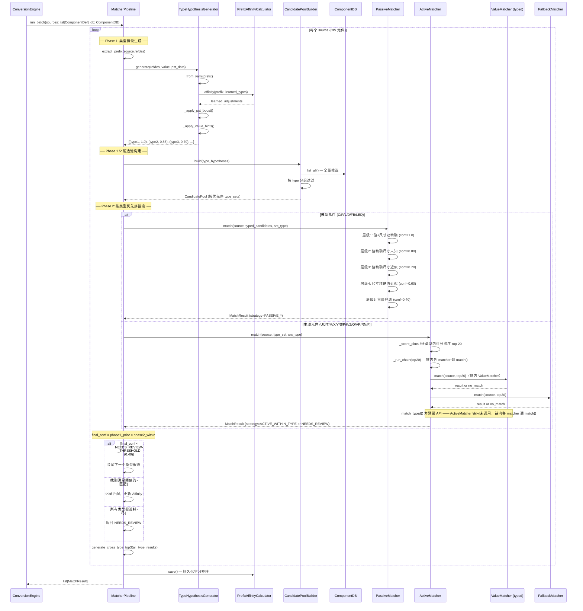
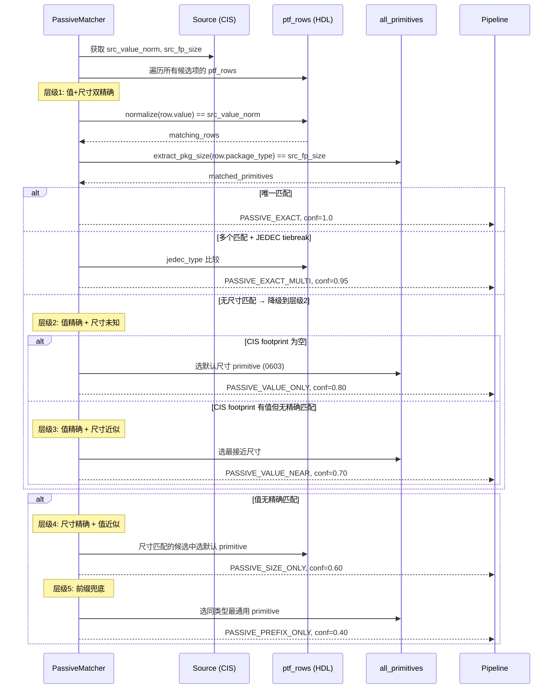
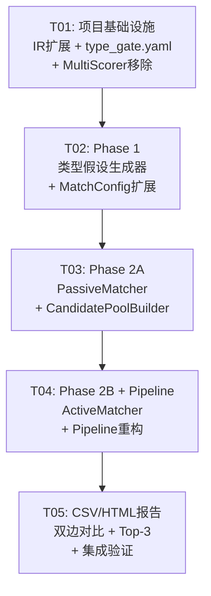

# CIS2HDL 匹配系统重构 v2.0 — 系统架构设计 + 任务分解

**作者**: Bob (Architect)
**日期**: 2026-08-06
**基于**: MATCHING_ANALYSIS_2026-08-06.md + PRD v2.0

---

## 目录

- [Part A: 系统设计](#part-a-系统设计)
  - [1. 实现方案与框架选型](#1-实现方案与框架选型)
  - [2. 文件列表](#2-文件列表)
  - [3. 数据结构和接口设计（类图）](#3-数据结构和接口设计)
  - [4. 程序调用流程（时序图）](#4-程序调用流程)
  - [5. 待明确事项](#5-待明确事项)
- [Part B: 任务分解](#part-b-任务分解)
  - [6. 依赖包列表](#6-依赖包列表)
  - [7. 任务列表](#7-任务列表)
  - [8. 共享知识](#8-共享知识)
  - [9. 任务依赖图](#9-任务依赖图)

---

# Part A: 系统设计

## 1. 实现方案与框架选型

### 1.1 核心技术挑战

| # | 挑战 | 严重度 | 根因 |
|---|------|:---:|------|
| 1 | 前缀是硬约束而非软权重 — C 前缀的电容不能匹配为电阻 | 🔴 | MultiScorer 6 维权重的结构性缺陷 |
| 2 | pin_count 权重对无源器件完全无区分力（都是 2 脚） | 🔴 | 0.45 权重浪费 |
| 3 | value 维度可跨类型匹配 — normalize 后值碰撞 | 🔴 | ValueMatcher 无类型一致性检查 |
| 4 | conf = max(Fallback, MultiScorer) 造成虚高置信度 | 🟡 | 取两套独立评分系统的最大值 |
| 5 | 歧义前缀（U/J/T/M）不应锁死单一类型 | 🟡 | 旧系统 HARD GATE 丢弃可能正确匹配 |

### 1.2 架构方案：两阶段匹配

**核心原则**: **类型先行，值/封装在后** — 先确定元件类型假设列表（软约束），再在类型内精确匹配（硬评分）。

```
Phase 1: TYPE HYPOTHESES — 输出有序类型假设列表（不锁死单一类型）
    ↓
Phase 1.5: CANDIDATE POOL CONSTRUCTION — 按类型假设构建搜索池
    ↓
Phase 2A: PASSIVE MATCHER — C/R/L/D 被动元件确定性规则匹配
Phase 2B: ACTIVE MATCHER  — IC/Connector/Crystal 等主动元件类型内评分
    ↓
final_conf = phase1_prior_conf × phase2_within_conf
```

### 1.3 框架和库选型

| 组件 | 选型 | 理由 |
|------|------|------|
| 匹配基类 | 现有 `MatcherBase` ABC | 保持与现有 matcher 链的接口兼容 |
| 注册模式 | 现有 `MatcherRegistry` | 类级别注册，扩展性好 |
| YAML 配置 | PyYAML（现有依赖） | 类型映射表的自然表示 |
| 模糊匹配 | rapidfuzz（现有依赖） | Phase 2B 主动元件名称匹配 |
| 数据模型 | Pydantic v2（现有依赖） | MatchResult 扩展字段 |
| 类型假设配置 | 新 `type_gate.yaml` | 集中管理 prefix→type 映射 |

### 1.4 架构模式

保持现有的 **Chain-of-Responsibility**（Pipeline 内顺序调用 matcher），但在 Pipeline 层面增加：
- **Strategy Pattern**: Phase 2A 被动 vs Phase 2B 主动，根据 Phase 1 的类型假设选择不同的匹配策略
- **Template Method**: `MatcherBase.match()` 保持不变，新增 `TypeConstrainedMatcher` 子类强制类型约束

---

## 2. 文件列表

### 2.1 新建文件

| 相对路径 | 说明 | 状态 |
|----------|------|:---:|
| `cis2hdl/core/matcher/type_hypothesis.py` | Phase 1 类型假设生成器 | **NEW** |
| `cis2hdl/core/matcher/passive_matcher.py` | Phase 2A 被动元件确定性规则匹配器 | **NEW** |
| `cis2hdl/core/matcher/active_matcher.py` | Phase 2B 主动元件类型内评分匹配器 | **NEW** |
| `cis2hdl/core/matcher/candidate_pool.py` | Phase 1.5 候选池构建器 | **NEW** |
| `cis2hdl/config/type_gate.yaml` | 类型假设 YAML 配置 | **NEW** |

### 2.2 修改文件

| 相对路径 | 变更说明 | 状态 |
|----------|----------|:---:|
| `cis2hdl/core/matcher/pipeline.py` | 重构为两阶段架构，移除 MultiScorer 全库评分 | **MODIFY** |
| `cis2hdl/core/matcher/scoring.py` | 移除 MultiScorer 类，保留 PrefixAffinityCalculator 并增强 | **MODIFY** |
| `cis2hdl/core/matcher/fallback.py` | 简化职责：仅做 Phase 2B 内 FAILED 后的最低层兜底 | **MODIFY** |
| `cis2hdl/core/matcher/prefix_filter.py` | 恢复 extract_prefix，新增 Phase 1 类型映射辅助函数 | **MODIFY** |
| `cis2hdl/core/matcher/value_matcher.py` | 新增 `match_typed()` 方法，强制类型内搜索 | **MODIFY** |
| `cis2hdl/core/matcher/match_config.py` | 扩展为加载 type_gate.yaml | **MODIFY** |
| `cis2hdl/core/matcher/__init__.py` | 更新导出列表 | **MODIFY** |
| `cis2hdl/core/ir/match.py` | MatchResult 扩展 phase1/phase2/top3 字段，新增 MatchStrategy 值 | **MODIFY** |
| `cis2hdl/core/writer/mapping_csv_writer.py` | 双边对比列 + Top-3 候选列 | **MODIFY** |
| `cis2hdl/core/diagnostics/report_gen.py` | HTML 匹配维度标注（✅/⚠️/❌） | **MODIFY** |

### 2.3 不修改文件

| 相对路径 | 说明 |
|----------|------|
| `cis2hdl/core/matcher/exact.py` | ExactMatcher：Phase 2B 链内继续使用，无需修改 |
| `cis2hdl/core/matcher/fuzzy.py` | FuzzyNameMatcher：Phase 2B 链内继续使用 |
| `cis2hdl/core/matcher/feature.py` | FeatureExtractMatcher：Phase 2B 链内继续使用 |
| `cis2hdl/core/matcher/base.py` | MatcherBase ABC：接口不变 |
| `cis2hdl/core/matcher/registry.py` | MatcherRegistry：不变 |
| `cis2hdl/core/ir/component.py` | ComponentDef：无需新增字段 |
| `cis2hdl/core/db/component_db.py` | ComponentDB：索引已完备 |
| `cis2hdl/core/engine/conversion_engine.py` | 转换引擎：Pipeline 接口不变 |

### 2.4 删除内容（非文件删除，而是类/函数级移除）

| 位置 | 删除内容 | 理由 |
|------|----------|------|
| `scoring.py` | `MultiScorer` 类 | 禁用全库无类型约束评分 |
| `pipeline.py` | `run_batch()` 中 MultiScorer 调用链 | 替换为 Phase 1→Phase 2 |
| `pipeline.py` | `expand_candidates_with_phys_des_prefix` 调用 | 由 CandidatePoolBuilder 统一管理 |

---

## 3. 数据结构和接口设计

### 3.1 MatchResult 扩展

```python
class MatchStrategy(str, Enum):
    # 新增策略值
    PASSIVE_EXACT = "PASSIVE_EXACT"           # Phase 2A 层级1: 值+尺寸双精确
    PASSIVE_EXACT_MULTI = "PASSIVE_EXACT_MULTI" # Phase 2A 层级1: 多候选JEDEC tiebreak
    PASSIVE_VALUE_ONLY = "PASSIVE_VALUE_ONLY"   # Phase 2A 层级2: 值精确尺寸未知
    PASSIVE_VALUE_NEAR = "PASSIVE_VALUE_NEAR"   # Phase 2A 层级3: 值精确尺寸近似
    PASSIVE_SIZE_ONLY = "PASSIVE_SIZE_ONLY"     # Phase 2A 层级4: 尺寸精确值近似
    PASSIVE_PREFIX_ONLY = "PASSIVE_PREFIX_ONLY" # Phase 2A 层级5: 前缀兜底
    ACTIVE_WITHIN_TYPE = "ACTIVE_WITHIN_TYPE"   # Phase 2B: 类型内评分匹配
    NEEDS_REVIEW = "NEEDS_REVIEW"               # 低于阈值，需人工确认

class MatchResult(BaseModel):
    # 现有字段保持不变
    confidence: float          # final_conf = phase1_prior × phase2_within
    strategy: MatchStrategy
    source_library_id: str
    target_library_id: str
    pin_mapping: dict[str, str]
    warnings: list[str]
    candidates: list[str]
    cis_value: str
    pst_value: str
    jedec_type: str
    error_note: str
    extra_data: dict[str, Any]

    # ── v2.0 新增字段 ──
    phase1_type: str = ""           # Phase 1 选定的类型（如 "capacitor"）
    phase1_prior_conf: float = 0.0  # Phase 1 先验置信度
    phase2_strategy_detail: str = "" # 匹配维度说明（如 "value✅ footprint✅"）
    phase2_within_conf: float = 0.0 # Phase 2 类型内置信度
    top3_candidates: list[dict] = Field(default_factory=list)
    # top3_candidates 每项: {type, library_id, part_name, primitive, final_conf, match_dims}
```

### 3.2 类图

```mermaid
classDiagram
    direction TB

    %% ── IR Layer ──
    class ComponentDef {
        +str library_id
        +str part_name
        +str category
        +str phys_des_prefix
        +str footprint
        +list~str~ footprint_alt
        +list~PinDef~ pins
        +int pin_count
        +str value
        +str tolerance
        +dict extra_data
        +str fingerprint()$
    }

    class MatchResult {
        +float confidence
        +MatchStrategy strategy
        +str source_library_id
        +str target_library_id
        +dict pin_mapping
        +str phase1_type
        +float phase1_prior_conf
        +str phase2_strategy_detail
        +float phase2_within_conf
        +list~dict~ top3_candidates
    }

    class MatchStrategy {
        <<enumeration>>
        EXACT
        JEDEC
        FUZZY
        FEATURE
        VALUE
        FALLBACK
        MANUAL
        PASSIVE_EXACT
        PASSIVE_EXACT_MULTI
        PASSIVE_VALUE_ONLY
        PASSIVE_VALUE_NEAR
        PASSIVE_SIZE_ONLY
        PASSIVE_PREFIX_ONLY
        ACTIVE_WITHIN_TYPE
        NEEDS_REVIEW
    }

    %% ── Phase 1 ──
    class TypeHypothesisGenerator {
        -MatchConfig _config
        -PrefixAffinityCalculator _affinity
        -dict _type_hypotheses
        -dict _value_boost
        -dict _pst_boost
        +generate(refdes, value, pst_data) list~TypeHypothesis~
        -_from_yaml(prefix) list~TypeHypothesis~
        -_apply_pst_boost(hypotheses, pst_data)
        -_apply_value_hints(hypotheses, value)
        -_apply_learned_affinity(hypotheses, prefix)
        -_normalise(hypotheses) list~TypeHypothesis~
    }

    class TypeHypothesis {
        +str type_name
        +float prior_conf
        +str source
    }

    class PrefixAffinityCalculator {
        -dict _matrix
        -Path _path
        +affinity(refdes_prefix, type_name) float
        +record_match(refdes_prefix, type_name)
        +save()
        -_load()
        -_save()
    }

    %% ── Phase 1.5 ──
    class CandidatePoolBuilder {
        -ComponentDB _db
        +build(type_hypotheses) CandidatePool
        -_filter_by_type(candidates, type_name) list~ComponentDef~
    }

    class CandidatePool {
        +list~TypeCandidateSet~ type_sets
        +iter_in_priority_order() Iterator
    }

    class TypeCandidateSet {
        +str type_name
        +float prior_conf
        +list~ComponentDef~ candidates
    }

    %% ── Phase 2A ──
    class PassiveMatcher {
        +match(source, candidates, src_type) MatchResult
        -_match_value_size_exact(source, candidates) MatchResult
        -_match_value_only(source, candidates) MatchResult
        -_match_value_near_size(source, candidates) MatchResult
        -_match_size_only(source, candidates) MatchResult
        -_match_prefix_fallback(source, candidates, src_type) MatchResult
        -_matches_type(candidate, type_name) bool$
    }

    %% ── Phase 2B ──
    class ActiveMatcher {
        -ExactMatcher _exact
        -FuzzyNameMatcher _fuzzy
        -FeatureExtractMatcher _feature
        -ValueMatcher _value
        -FallbackMatcher _fallback
        +match(source, candidates, src_type) MatchResult
        -_run_chain(source, candidates) MatchResult
        -_score_dims(source, candidate) dict~str, float~
        -_score_footprint(source, candidate) float$
        -_score_value(source, candidate) float$
        -_score_jedec(source, candidate) float$
        -_score_pin_count(source, candidate) float$
        -_score_part_name(source, candidate) float$
        -_generate_top3(source, candidates) list~dict~
    }

    %% ── Pipeline ──
    class MatcherPipeline {
        -PassiveMatcher _passive_matcher
        -ActiveMatcher _active_matcher
        -ManualMatchResolver _manual
        +run_batch(sources, db) list~MatchResult~
        -_match_single(source, type_gen, pool_builder, affinity_calc) MatchResult
        -_generate_cross_type_top3(all_results) list~dict~$
    }

    class ManualMatchResolver {
        -dict _match_map
        +match(source, candidates) MatchResult
        +resolve(source, candidates) MatchResult
        +accept(source_library_id, target_library_id) MatchResult
        +export_rules(output_path) int
        +import_rules(input_path) int
        +save_rules(config_path) int
    }

    class MatcherBase {
        <<abstract>>
        +str MATCHER_NAME
        +int MATCHER_PRIORITY
        +match(source, candidates) MatchResult
        +confidence_threshold() float
    }

    %% ── Relationships ──
    MatcherPipeline *-- PassiveMatcher
    MatcherPipeline *-- ActiveMatcher
    MatcherPipeline *-- ManualMatchResolver
    MatcherPipeline ..> TypeHypothesisGenerator : run_batch() 局部创建
    MatcherPipeline ..> CandidatePoolBuilder : run_batch() 局部创建

    TypeHypothesisGenerator --> PrefixAffinityCalculator
    TypeHypothesisGenerator ..> TypeHypothesis : creates
    TypeHypothesisGenerator ..> MatchResult : populates

    CandidatePoolBuilder --> ComponentDB : queries
    CandidatePoolBuilder ..> CandidatePool : builds
    CandidatePool *-- TypeCandidateSet

    PassiveMatcher ..|> MatcherBase
    ActiveMatcher ..|> MatcherBase
    ActiveMatcher o-- MatcherBase : chain (Exact→Fuzzy→Feature→Value→Fallback)
    ManualMatchResolver ..|> MatcherBase

    PassiveMatcher ..> MatchResult : returns
    ActiveMatcher ..> MatchResult : returns
    MatcherPipeline ..> MatchResult : returns
```



<!-- 已修改：§3.2 类图按代码事实修正 —— TypeHypothesisGenerator 属性 _type_gate_config→_config/_type_hypotheses/_value_boost/_pst_boost、方法 _from_prefix→_from_yaml（补 _normalise）；PrefixAffinityCalculator load()→私有 _load()（affinity/record_match 第二参数 phys_des_prefix→type_name）；PassiveMatcher _match_level1..5→_match_value_size_exact/_match_value_only/_match_value_near_size/_match_size_only/_match_prefix_fallback；ActiveMatcher 移除 _chain，改 _exact/_fuzzy/_feature/_value/_fallback 实例，_score_within_type→_score_dims+5 个 _score_*，_select_top3→_generate_top3；MatcherPipeline 移除 _type_gen/_pool_builder 属性与 _is_passive_type/_compute_final_conf（run_batch 内局部创建 type_gen/pool_builder，类型判断用 PASSIVE_TYPES 内联），_match_single 签名补齐；新增 ManualMatchResolver 类并修正关系。 -->

---

## 4. 程序调用流程

### 4.1 主流程时序图



<!-- 已修改：§4.1 时序图按代码事实修正 —— Phase1._from_prefix→_from_yaml；Phase2B 调用改为链内各 matcher 的 match()（_run_chain），match_typed() 标注为预留 API 未被链调用；Pipeline 层 top-3 生成改为 _generate_cross_type_top3()。 -->

### 4.2 PassiveMatcher 5 级确定性匹配详解



---

## 5. 待明确事项

| # | 问题 | 假设/方案 | 影响范围 |
|---|------|----------|----------|
| 1 | `type_gate.yaml` 中的 type 名称是否与 HDL 库的 `part_name` 精确对应？ | 需要做一次 HDL 库扫描，确认 capacitor/resistor/inductor/diode/IC 等名称的实际拼写。当前假设与 v0.8.2 `match_rules.yaml` 中的值一致 | Phase 1.5 候选池构建 |
| 2 | PST 数据的 `jedec_type` 字段在 ComponentDef 中的存储路径？ | 假设存储在 `source.extra_data["pst_jedec_type"]`（与 ExactMatcher 现有逻辑一致） | Phase 1 PST boost |
| 3 | `extract_pkg_size()` 是否需要增强？当前只支持 0402/0603 等 4 位数字 + BGA + SOT | 对被动元件足够。主动元件的 footprint 大小通过 `ActiveMatcher._score_footprint()` 处理 | Phase 2A 层级1 |
| 4 | 学习矩阵的 `FLOOR` 值（当前 0.1）在新架构中的含义？ | 改为 Phase 1 类型假设的最小保留概率，建议 0.05。即：即使学习矩阵显示该类型从未匹配过，仍保留 0.05 的先验概率 | PrefixAffinityCalculator |
| 5 | `NEEDS_REVIEW` 阈值？ | 建议 0.40。final_conf < 0.40 时标记 NEEDS_REVIEW，但仍在 top-3 中展示 | Pipeline |
| 6 | Top-3 CSV 是嵌入主 CSV 还是独立文件？ | 嵌入主 CSV（扩展现有列），每候选 5 列（type + cell + primitive + final_conf + match_dims），共 15 额外列 | mapping_csv_writer |
| 7 | HTML 报告是否需要重构整个模板？ | 增量修改：在器件映射表中新增匹配维度列（✅/⚠️/❌），新增 Top-3 候选展示区域 | report_gen |
| 8 | `match_rules.yaml` 中的 `prefix_to_category` 如何处理？ | 迁移到新 `type_gate.yaml`，旧 `match_rules.yaml` 的 `prefix_to_category` 标记 deprecated，保留 `value_category_hints` 和 `hdl_scan` | match_config |

---

# Part B: 任务分解

## 6. 依赖包列表

无新增第三方依赖。所有功能基于现有依赖实现：
```
- PyYAML (现有):       type_gate.yaml 配置解析
- Pydantic v2 (现有):   IR 数据模型
- rapidfuzz (现有):     Phase 2B 模糊名称匹配
```

---

## 7. 任务列表

### T01: 项目基础设施 + IR 数据模型扩展

| 属性 | 内容 |
|------|------|
| **Task ID** | T01 |
| **优先级** | P0 |
| **对应 PRD** | P0-1（type 假设基础）, P0-3（conf 字段定义）, P2-2（统计摘要基础） |
| **预估复杂度** | 中（3 文件修改 + 1 新建 + 1 配置） |

**源文件**:

| 文件 | 操作 | 说明 |
|------|:---:|------|
| `cis2hdl/core/ir/match.py` | MODIFY | 扩展 `MatchStrategy` enum（新增 9 个值），`MatchResult` 新增 5 个字段 |
| `cis2hdl/core/matcher/prefix_filter.py` | MODIFY | 恢复 `extract_prefix()`（已存在，验证即可），新增 `PASSIVE_TYPES` 常量集合，新增辅助函数 `is_passive_prefix()` |
| `cis2hdl/core/matcher/scoring.py` | MODIFY | 移除 `MultiScorer` 类（类定义 + `score()` + `score_all()` + 6 个 `_score_*()` 方法），保留 `PrefixAffinityCalculator`，新增 `FLOOR` 从 0.1→0.05 |
| `cis2hdl/config/type_gate.yaml` | NEW | 完整的 type_hypotheses 配置（24 个前缀映射 + value_type_boost + pst_type_boost + passive_types 列表） |
| `cis2hdl/core/matcher/__init__.py` | MODIFY | 更新导出符号列表，移除 MultiScorer 导出 |

**依赖**: 无

**验证标准**:
- `MatchStrategy` enum 包含所有新增值
- `MatchResult` 可实例化并携带新字段（默认值）
- `extract_prefix("C89")` → `"C"`, `extract_prefix("TP12")` → `"TP"`
- `type_gate.yaml` 可被 PyYAML 正常加载
- `PrefixAffinityCalculator` 可正常初始化和调用 `affinity()`


### T02: Phase 1 类型假设生成器

| 属性 | 内容 |
|------|------|
| **Task ID** | T02 |
| **优先级** | P0 |
| **对应 PRD** | P0-1（refdes 前缀→有序类型列表，PST+值特征+学习矩阵调整先验），P2-1（动态学习矩阵） |
| **预估复杂度** | 高（1 新建 + 1 修改） |

**源文件**:

| 文件 | 操作 | 说明 |
|------|:---:|------|
| `cis2hdl/core/matcher/type_hypothesis.py` | NEW | `TypeHypothesis` 数据类 + `TypeHypothesisGenerator` 类，含 5 个方法 |
| `cis2hdl/core/matcher/match_config.py` | MODIFY | 扩展 `MatchConfig` 加载 `type_gate.yaml`，新增 `type_hypotheses` / `value_type_boost` / `pst_type_boost` / `passive_types` 属性 |

**关键类与方法**:

```python
@dataclass
class TypeHypothesis:
    type_name: str        # "capacitor", "IC", "diode" ...
    prior_conf: float     # 0.05 ~ 1.0
    source: str           # "exact_prefix" | "yaml_rule" | "learned"

class TypeHypothesisGenerator:
    def __init__(self, config: MatchConfig, affinity: PrefixAffinityCalculator)
    def generate(self, refdes: str, value: str, pst_data: dict | None) -> list[TypeHypothesis]
    def _from_yaml(self, prefix: str) -> list[TypeHypothesis]
    def _apply_pst_boost(self, hypotheses, pst_data) -> None
    def _apply_value_hints(self, hypotheses, value) -> None
    def _apply_learned_affinity(self, hypotheses, prefix) -> None
```

**依赖**: T01

**验证标准**:
- `C89` → `[(capacitor, 1.0)]`
- `U7` + `JEDEC_TYPE=FPGA` → `[(IC, ~0.95), (interface, 0.70), (connector, 0.40)]`
- `D21` + `value="0"` → `[(diode, 0.95), (zener, 0.80), (tvs, 0.60)]`（值特征不改变二极管优先）
- `LB4` → `[(ferrite_bead, 0.75), (inductor, 0.50)]`
- prior_conf 全部在 [0.05, 1.0] 范围内


### T03: Phase 2A 被动元件确定性规则匹配器 + 候选池构建

| 属性 | 内容 |
|------|------|
| **Task ID** | T03 |
| **优先级** | P0 |
| **对应 PRD** | P0-2（C/R/L/D 四类 5 级递进），P0-4（禁用全库 MultiScorer） |
| **预估复杂度** | 高（2 新建 + 1 修改） |

**源文件**:

| 文件 | 操作 | 说明 |
|------|:---:|------|
| `cis2hdl/core/matcher/passive_matcher.py` | NEW | `PassiveMatcher(MatcherBase)` — 5 级确定性规则匹配 |
| `cis2hdl/core/matcher/candidate_pool.py` | NEW | `CandidatePoolBuilder` + `CandidatePool` + `TypeCandidateSet` |
| `cis2hdl/core/matcher/value_matcher.py` | MODIFY | 新增 `match_typed(source, candidates, type_name)` 方法，强制候选必须属于指定类型（通过 category/phys_des_prefix/part_name 三重检查） |

**关键类与方法**:

```python
class PassiveMatcher(MatcherBase):
    MATCHER_NAME = "passive"
    MATCHER_PRIORITY = 1

    # 5 级匹配方法
    def match(self, source, candidates, src_type) -> MatchResult
    def _match_value_size_exact(self, source, candidates) -> MatchResult | None
    def _match_value_only(self, source, candidates) -> MatchResult | None
    def _match_value_near_size(self, source, candidates) -> MatchResult | None
    def _match_size_only(self, source, candidates) -> MatchResult | None
    def _match_prefix_fallback(self, source, candidates, src_type) -> MatchResult | None

    # 静态辅助
    @staticmethod
    def _matches_type(candidate: ComponentDef, type_name: str) -> bool

class CandidatePoolBuilder:
    def __init__(self, db: ComponentDB)
    def build(self, type_hypotheses: list[TypeHypothesis]) -> CandidatePool
    def _filter_by_type(self, all_candidates, type_name) -> list[ComponentDef]
```

**依赖**: T02

**验证标准**:
- `C1 (10UF, footprint="")` → `PASSIVE_VALUE_ONLY, conf=0.80`
- `C11 (1mF, footprint="HSC0402")` → `PASSIVE_EXACT, conf=1.0`（不再错误匹配为 resistor）
- `R2 (100K)` → `PASSIVE_EXACT` 或 `PASSIVE_VALUE_ONLY`，**不是** capacitor
- `D21 (value="0")` → 在 diode 池内搜索，找不到值匹配 → `PASSIVE_SIZE_ONLY` 或 `PASSIVE_PREFIX_ONLY`，**不是** resistor
- `CandidatePoolBuilder.build()` 将 144 个候选正确分组到各类型


### T04: Phase 2B 主动元件类型内评分 + Pipeline 重构

| 属性 | 内容 |
|------|------|
| **Task ID** | T04 |
| **优先级** | P0（Pipeline 重构）+ P1（Phase 2B 类型内评分） |
| **对应 PRD** | P0-3（conf 乘法重构），P0-4（禁用 MultiScorer），P1-1（Phase 2B），P1-5（宁可漏匹配） |
| **预估复杂度** | 最高（2 新建 + 2 重大修改） |

**源文件**:

| 文件 | 操作 | 说明 |
|------|:---:|------|
| `cis2hdl/core/matcher/active_matcher.py` | NEW | `ActiveMatcher(MatcherBase)` — 5 维类型内加权评分 + 匹配器链调用 |
| `cis2hdl/core/matcher/pipeline.py` | MODIFY | 完全重写 `run_batch()`：Phase 1→1.5→2 流程，移除 MultiScorer 调用，final_conf = phase1 × phase2 |
| `cis2hdl/core/matcher/fallback.py` | MODIFY | 删除 v1.0 跨类型评分逻辑，恢复 v0.8.2 前缀过滤逻辑，作为 Phase 2B 最后兜底 |
| `cis2hdl/core/matcher/__init__.py` | MODIFY | 更新导出 |

**关键类与方法**:

```python
class ActiveMatcher(MatcherBase):
    MATCHER_NAME = "active"
    MATCHER_PRIORITY = 2

    # 类型内 5 维权重
    WITHIN_TYPE_WEIGHTS = {
        "footprint": 0.30, "value": 0.15, "jedec": 0.20,
        "pin_count": 0.20, "part_name": 0.15,
    }

    def __init__(self):
        self._exact = ExactMatcher()
        self._fuzzy = FuzzyNameMatcher()
        self._feature = FeatureExtractMatcher()
        self._value = ValueMatcher()
        self._fallback = FallbackMatcher()

    def match(self, source, candidates, src_type) -> MatchResult
    def _run_chain(self, source, candidates) -> MatchResult
    def _score_dims(self, source, candidate) -> dict[str, float]
    # 5 维评分辅助（各维度独立方法）:
    #   _score_footprint / _score_value / _score_jedec / _score_pin_count / _score_part_name
    def _generate_top3(self, source, candidates) -> list[dict]
```

<!-- 已修改：T04 关键类与方法按代码事实修正 —— ActiveMatcher 方法 _score_within_type→_score_dims（+5 个 _score_* 辅助），_generate_top3 签名 (all_results)→(source, candidates)。 -->

**`MatcherPipeline.run_batch()` 重构后逻辑**:

```python
def run_batch(self, sources, db) -> list[MatchResult]:
    # 初始化 Phase 1/1.5 组件
    type_gen = TypeHypothesisGenerator(match_config, affinity_calc)
    pool_builder = CandidatePoolBuilder(db)

    for source in sources:
        # Phase 1
        hypotheses = type_gen.generate(refdes, value, pst_data)

        # Phase 1.5
        pool = pool_builder.build(hypotheses)

        # Phase 2 — 按类型优先序搜索
        for type_set in pool.iter_in_priority_order():
            if type_set.type_name in PASSIVE_TYPES:
                result = self._passive.matcher.match(source, type_set.candidates, type_set.type_name)
            else:
                result = self._active_matcher.match(source, type_set.candidates, type_set.type_name)

            final_conf = type_set.prior_conf * result.confidence

            if final_conf >= 0.75 or (result.strategy == MatchStrategy.PASSIVE_EXACT):
                result.confidence = final_conf
                result.phase1_type = type_set.type_name
                result.phase1_prior_conf = type_set.prior_conf
                result.phase2_within_conf = result.confidence  # 暂存（在乘法前）
                # 记录学习
                affinity_calc.record_match(prefix, type_set.type_name)
                return result

        # 所有类型假设耗尽 → NEEDS_REVIEW
        return MatchResult(confidence=0.0, strategy=MatchStrategy.NEEDS_REVIEW, ...)
```

**依赖**: T03

**验证标准**:
- `U7 (FPGA)` → Phase1: `[(IC, 0.85), ...]` → Phase2 在 IC 池找到 `lcmxo2` → `final_conf ≈ 0.78`，不再错误匹配到 interface
- `M1 (MARK)` → Phase1: `[(mark, 0.80), (test_point, 0.60)]` → Phase2 在 mark 池找到 mark → `final_conf ≈ 0.72`，**不是** rtxm169
- `LB4 (磁珠)` → Phase1: `[(ferrite_bead, 0.75), (inductor, 0.50)]` → Phase2 在 ferrite_bead 池搜索 → 正确匹配 fb
- `T* (变压器)` → 旧系统 20 个失败 → 新系统至少减少到 5 个以内
- `R42 (100Ω)` → `final_conf = 1.0 × 1.0 = 1.0`，**不是** capacitor


### T05: CSV/HTML 报告增强 + 集成验证

| 属性 | 内容 |
|------|------|
| **Task ID** | T05 |
| **优先级** | P1 |
| **对应 PRD** | P1-2（Top-3 候选），P1-3（CSV 双边对比），P1-4（HTML 匹配维度标注），P2-2（匹配统计摘要），P2-3（T*/LB*/D* 空值专项） |
| **预估复杂度** | 中（2 修改） |

**源文件**:

| 文件 | 操作 | 说明 |
|------|:---:|------|
| `cis2hdl/core/writer/mapping_csv_writer.py` | MODIFY | 扩展 `_write_device_mapping()` 新增列：`cis_footprint`, `cis_jedec`, `hdl_value`, `hdl_footprint`, `hdl_category`, `phase1_type`, `phase1_prior`, `phase2_strategy`, `phase2_detail`, `top3_rank1~3`（15 列）。新增 `_write_match_stats()` 统计摘要函数 |
| `cis2hdl/core/diagnostics/report_gen.py` | MODIFY | HTML 表格新增匹配维度列（✅=精确匹配, ⚠️=近似匹配, ❌=不匹配），Top-3 候选折叠区域，`NEEDS_REVIEW` 红色高亮行 |

**CSV 新增列布局**:

```
现有列（保留）:
  cis_refdes | cis_value | pst_value | hdl_cell | hdl_jedec | strategy | conf | error_note

新增双边对比列:
  cis_footprint | cis_jedec | hdl_value | hdl_footprint | hdl_category | hdl_pin_count

新增 Phase 列:
  phase1_type | phase1_prior_conf | phase2_strategy_detail | match_dims

新增 Top-3 候选列 (3×5=15列):
  rank1_type | rank1_cell | rank1_primitive | rank1_final_conf | rank1_match_dims
  rank2_type | rank2_cell | rank2_primitive | rank2_final_conf | rank2_match_dims
  rank3_type | rank3_cell | rank3_primitive | rank3_final_conf | rank3_match_dims
```

**match_dims 格式**: `"value✅ footprint⚠️(default_0603) jedec❌ pin_count✅"`

**依赖**: T04

**验证标准**:
- CSV 包含所有新增列
- `C11 (1mF)` → match_dims 显示 `"value✅ footprint✅"`, rank1_type=`capacitor`
- `D21 (值=0)` → match_dims 显示 `"value❌ footprint⚠️"` 或 `"type_only⚠️"`, strategy ≠ VALUE
- `M1 (MARK)` → rank1_type=`mark`, 不是 IC 类
- HTML 报告中 NEEDS_REVIEW 行有醒目红色标记
- 统计摘要正确计数各 strategy 分布

---

## 8. 共享知识

### 8.1 类型枚举常量

```python
# 被动元件类型集合（触发 Phase 2A 确定性规则匹配）
# 实际定义: cis2hdl/core/matcher/prefix_filter.py（PASSIVE_TYPES），
#          cis2hdl/core/matcher/pipeline.py 引用同名集合（来源一致）
PASSIVE_TYPES: frozenset[str] = frozenset({
    "capacitor", "resistor", "inductor", "diode",
    "zener", "ferrite_bead", "led",
})

# 被动前缀判断 —— 无独立 EXACT_PREFIXES 常量，前缀集合内置在 is_passive_prefix() 中:
#   is_passive_prefix(prefix)      → prefix.upper() in {"C", "R", "L", "D", "LED", "FB", "LB"}
#   is_passive_prefix(type_name=…) → type_name.lower() in PASSIVE_TYPES
```

> 注（代码核对）：原设计稿中的 `PASSIVE_COMPONENT_TYPES` / `EXACT_PREFIXES` 两个常量名未在代码中实现。实际常量为 `PASSIVE_TYPES`；"精确前缀 conf=1.0" 语义由 `is_passive_prefix()` 内置前缀集合 + `type_gate.yaml` 中 `prior_conf=1.0` 条目共同表达。

<!-- 已修改：§8.1 按代码事实修正 —— PASSIVE_COMPONENT_TYPES→PASSIVE_TYPES；EXACT_PREFIXES 常量未实现，改为说明 is_passive_prefix() 内置前缀集合 {C,R,L,D,LED,FB,LB}。 -->

### 8.2 conf 值域定义

| 来源 | 范围 | 说明 |
|------|:---:|------|
| Phase 1 prior_conf | 0.05 – 1.0 | 类型先验置信度，下限 0.05（永不归零） |
| Phase 2A within_conf | 0.40 – 1.0 | 被动元件 5 级确定性置信度 |
| Phase 2B within_conf | 0.0 – 1.0 | 主动元件类型内评分 |
| final_conf | 0.0 – 1.0 | phase1_prior × phase2_within |
| NEEDS_REVIEW threshold | 0.40 | 低于此值标记 NEEDS_REVIEW |
| STOP_SEARCH threshold | 0.75 | 达到此值不再搜索下一个类型假设 |
| PASSIVE_EXACT early-stop | — | 策略为 PASSIVE_EXACT 立即停止搜索 |

### 8.3 命名规范

- **类型名称**: 统一使用小写 snake_case（`capacitor`, `ferrite_bead`, `voltage_regulator`），与 HDL 库目录名和 `part_name` 关键字对应
- **YAML key**: 前缀大写（`C`, `R`, `U`, `TP`, `LB`），与 refdes 提取结果一致
- **MatchStrategy 枚举值**: 大写 SNAKE_CASE（`PASSIVE_EXACT`, `ACTIVE_WITHIN_TYPE`, `NEEDS_REVIEW`）
- **文件内部函数**: `_` 前缀表示模块私有

### 8.4 跨文件关键约定

```
1. 所有 API 响应使用 MatchResult(BaseModel) 统一数据模型
2. normalize_value() 来自 cis2hdl.utils.naming，全局唯一
3. extract_pkg_size() 来自 cis2hdl.core.matcher.value_matcher，全局唯一
4. extract_prefix() 来自 cis2hdl.core.matcher.prefix_filter，全局唯一
5. PrefixAffinityCalculator 矩阵持久化到 ~/.cis2hdl/type_affinities.yaml（v2.0 改名）
6. type_gate.yaml 位于 cis2hdl/config/type_gate.yaml
7. 所有日期存储为 ISO 8601 UTC
8. 配置加载统一通过 MatchConfig.instance() 单例
```

### 8.5 type_gate.yaml 结构约定

```yaml
# 版本标识
version: "2.0"

# 类型假设（前缀→有序类型列表）
type_hypotheses:
  C: [[capacitor, 1.0]]
  R: [[resistor, 1.0]]
  RD: [[resistor, 0.90]]   # RD 前缀 → 电阻（如 RD25 = 4.7K），实现版新增
  # ...

# 值特征辅助
value_type_boost:
  NH: [inductor, 0.15]
  # ...

# PST 数据辅助
pst_type_boost:
  FPGA: [IC, 0.20]
  # ...

# 被动元件类型标识（实现版含 led）
passive_types: [capacitor, resistor, inductor, diode, zener, ferrite_bead, led]

# 固定前缀强绑定（实现版新增）——命中首类型假设的匹配即使未达 STOP_SEARCH
# 也强制采纳，不再降级到第二优先级类型
fixed_prefixes:
  LB: ferrite_bead    # 磁珠固定→ferrite_bead，不降级为 inductor
  LED: led            # LED 固定→led
  FB: ferrite_bead    # FB 固定→ferrite_bead
  TP: test_point      # 测试点固定→test_point，不降级为 mark
```

<!-- 已修改：§8.5 type_gate.yaml 结构按实现版补充 —— type_hypotheses 增 RD:[[resistor,0.90]]；passive_types 标注含 led；新增 fixed_prefixes 段（LB/LED/FB/TP 强绑定）。 -->

### 8.6 config/weights.yaml 现状说明（潜在缺陷登记）

`cis2hdl/config/weights.yaml` 头部注释仍为 **"MultiScorer dimension weights"**（v1.0 遗留），内容为 footprint 0.25 / prefix 0.20 / pin_count 0.20 / value 0.15 / jedec 0.10 / part_name 0.10。

- **现状**：GUI 权重编辑会写入该文件，但 **ActiveMatcher 实际使用硬编码 `WITHIN_TYPE_WEIGHTS`**（footprint 0.30 / value 0.15 / jedec 0.20 / pin_count 0.20 / part_name 0.15），因此编辑 `weights.yaml` **不会影响匹配结果**。
- **状态**：已登记潜在缺陷（本文档脚注）。
- **影响**：GUI 权重编辑界面存在误导性——修改界面显示可保存，但运行时匹配不生效。
- **建议**：[待填写] —— 二选一：① 更新 `weights.yaml` 头部注释并标注"仅供 GUI 展示，不参与匹配"；② 重构 ActiveMatcher 改为从配置加载 `WITHIN_TYPE_WEIGHTS`（或移除 GUI 写入路径）。

---

## 9. 任务依赖图



---

*本文档由 Bob (Architect) 生成，基于 MATCHING_ANALYSIS_2026-08-06.md 深度分析报告和 PRD v2.0 需求规格。*
